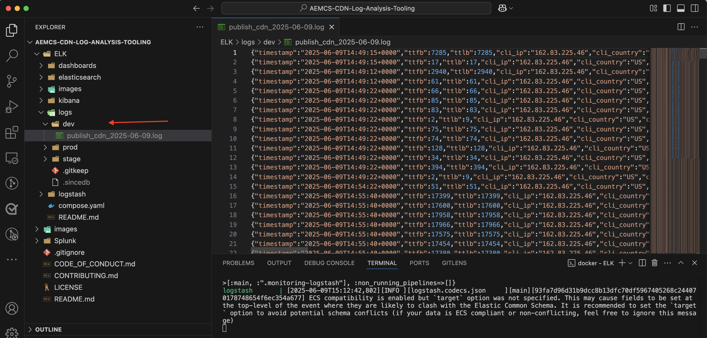

# 標準のトラフィックフィルタールールを使用したAEM web サイトの保護

AEM as a Cloud Serviceで _AEMが推奨する_ 標準のトラフィックフィルタールール **を使用して、Adobe Web サイトを DoS （Denial of Service）、分散型 Denial of Service （DDoS）** ボットの不正使用から保護する方法について説明します。


>[!VIDEO](https://video.tv.adobe.com/v/3469396/?quality=12&learn=on)

## 学習目標

- Adobeが推奨する標準のトラフィックフィルタールールを確認します。
- ルールの結果を定義、デプロイ、テストおよび分析します。
- トラフィックパターンに基づいてルールを絞り込むタイミングと方法を理解します。
- AEM アクションセンターを使用して、ルールによって生成されたアラートを確認する方法について説明します。

### 実装の概要

実装手順は次のとおりです。

- 標準トラフィックフィルタールールをAEM WKND プロジェクトの `/config/cdn.yaml` ファイルに追加する。
- 変更内容をコミットしてCloud Manager Git リポジトリにプッシュします。
- Cloud Manager設定パイプラインを使用して、変更内容をAEM環境にデプロイする。
- [Vegeta](https://github.com/tsenart/vegeta) を使用して DoS 攻撃をシミュレートし、ルールをテストする
- AEMCS CDN ログと ELK ダッシュボードツールを使用した結果の分析。

## 前提条件

先に進む前に、「トラフィックフィルターとWAF ルールの設定方法 [ チュートリアルで説明されている必要な基盤を完了していることを確認し ](../setup.md) ください。 また、[AEM WKND サイトプロジェクト ](https://github.com/adobe/aem-guides-wknd) のクローンを作成して、AEM環境にデプロイしました。

## ルールの主なアクション

標準のトラフィックフィルタールールの詳細に入る前に、これらのルールが実行する主なアクションを理解しましょう。 各ルールの `action` 属性は、条件が満たされた場合にトラフィックフィルターがどのように応答するかを定義します。 アクションには次が含まれます。

- **ログ**：ルールでは、監視および分析用のイベントをログに記録します。これにより、トラフィックパターンを確認し、必要に応じてしきい値を調整できます。 `type: log` 属性で指定されます。

- **アラート**：条件が満たされるとルールトリガーがアラートを表示し、潜在的な問題を特定するのに役立ちます。 `alert: true` 属性で指定されます。

- **ブロック**：ルールは、条件が満たされるとトラフィックをブロックし、AEM サイトへのアクセスを防ぎます。 `action: block` 属性で指定されます。

## ルールの確認と定義

Adobeが推奨する標準トラフィックフィルタールールは、IP ベースのレート制限の超過などのイベントをログに記録し、悪意のある可能性のあるトラフィックパターンを識別し、特定の国からのトラフィックをブロックするための基盤レイヤーとして機能します。 これらのログは、チームがしきい値を検証し、正当なトラフィックを中断することなく、最終的に **ブロックモードへの移行** ルールについて十分な情報に基づいた決定を行うのに役立ちます。

AEM WKND プロジェクトの `/config/cdn.yaml` ファイルに追加する必要がある 3 つの標準トラフィックフィルタールールを確認しましょう。

- **Edgeでの DoS 防止**：このルールは、クライアント IP からの 1 秒あたりのリクエスト（RPS）を監視することで、CDN エッジでの潜在的なサービス拒否（DoS）攻撃を検出します。
- **オリジンでの DoS を防ぐ**：このルールは、クライアント IP からの取得リクエストを監視することで、オリジンでの潜在的なサービス拒否（DoS）攻撃を検出します。
- **OFAC 諸国の禁止**：このルールは、OFAC （外国Assets統制局）規制に該当する特定の国からのアクセスをブロックします。

### &#x200B;1. Edgeでの DoS の防止

このルールは **CDN で潜在的なサービス拒否（DoS）攻撃を検出すると** アラートを送信します。 このルールをトリガーする条件は、クライアントがエッジの CDN POP （プレゼンスポイント）あたり 1 秒あたり **500 件のリクエスト** （平均は 10 秒以上）を超えた場合です。

**すべて** のリクエストをカウントし、クライアント IP でグループ化します。

```yaml
kind: "CDN"
version: "1"
metadata:
  envTypes: ["dev", "stage", "prod"]
data:
  trafficFilters:
    rules:
    - name: prevent-dos-attacks-edge
      when:
        reqProperty: tier
        equals: 'publish'
      rateLimit:
        limit: 500
        window: 10
        penalty: 300
        count: all
        groupBy:
          - reqProperty: clientIp
      action:
        type: log
        alert: true
```

`action` 属性は、条件が満たされたときにイベントをログに記録し、アラートをトリガーするようにルールを指定します。 したがって、正規のトラフィックをブロックすることなく、潜在的な DoS 攻撃を監視するのに役立ちます。 ただし、トラフィックパターンを検証してしきい値を調整したら、最終的にこのルールをブロックモードに移行することが目標となります。

### &#x200B;2. オリジンでの DoS の防止

このルールは、接触チャネルでの潜在的な DoS （Denial of Service）攻撃を検出すると **アラートを送信** します。 このルールをトリガーする条件は、クライアントがオリジンのクライアント IP あたり 1 秒あたり **100 件のリクエスト** （平均は 10 秒以上）を超えた場合です。

**フェッチ** （キャッシュバイパスリクエスト）をカウントし、クライアント IP でグループ化します。

```yaml
...
    - name: prevent-dos-attacks-origin
      when:
        reqProperty: tier
        equals: 'publish'
      rateLimit:
        limit: 100
        window: 10
        penalty: 300
        count: fetches
        groupBy:
          - reqProperty: clientIp
      action:
        type: log
        alert: true
```

`action` 属性は、条件が満たされたときにイベントをログに記録し、アラートをトリガーするようにルールを指定します。 したがって、正規のトラフィックをブロックすることなく、潜在的な DoS 攻撃を監視するのに役立ちます。 ただし、トラフィックパターンを検証してしきい値を調整したら、最終的にこのルールをブロックモードに移行することが目標となります。

### 3.OFAC 諸国阻止

このルールは、[OFAC](https://ofac.treasury.gov/sanctions-programs-and-country-information) 規制に該当する特定の国からのアクセスをブロックします。
必要に応じて、国リストを確認および変更できます。

```yaml
...
    - name: block-ofac-countries
      when:
        allOf:
          - { reqProperty: tier, in: ["author", "publish"] }
          - reqProperty: clientCountry
            in:
              - SY
              - BY
              - MM
              - KP
              - IQ
              - CD
              - SD
              - IR
              - LR
              - ZW
              - CU
              - CI
      action: block
```

`action` 属性は、ルールが指定された国からのアクセスをブロックするように指定します。 これにより、セキュリティリスクの原因となる可能性のある地域からAEM サイトへのアクセスを防ぐことができます。

上記のルールを含む完全な `cdn.yaml` ファイルは、次のようになります。


## ルールのデプロイ

上記のルールをデプロイするには、次の手順に従います。

- 変更をコミットして Cloud Manager Git リポジトリにプッシュします。

- Cloud Manager設定パイプラインを使用して [ 以前に作成した ](../setup.md#deploy-rules-using-adobe-cloud-manager) 変更内容をAEM環境にデプロイします。

  

## ルールのテスト

標準のトラフィックフィルタールールの効果を確認するには、**CDN Edge** と **オリジン** の両方で、汎用性の高い HTTP 負荷テストツールである [Vegeta](https://github.com/tsenart/vegeta) を使用して、高いリクエストトラフィックのシミュレーションを行います。

- Edge（500 rps の制限）で DoS ルールをテストします。 次のコマンドは、Edgeのしきい値（500 rps）を超える 1 秒あたり 200 件のリクエストを 15 秒間シミュレートします。

  ```shell
  $echo "GET https://publish-p63947-e1249010.adobeaemcloud.com/us/en.html" | vegeta attack -rate=200 -duration=15s | vegeta report
  ```

  

  >[!IMPORTANT]
  >
  >  上記のレポートの *100%* 成功コードと _200_ ステータスコードに注意してください。 ルールが `log` および `alert` に設定されると、リクエストは _ブロックされませんが_ 監視および分析とアラートの目的でログに記録されます。

- オリジン（100 rps の制限）で DoS ルールをテストします。 次のコマンドは、オリジンしきい値（100 rps）を超える 1 秒間、1 秒あたり 110 件のフェッチ要求をシミュレートします。 キャッシュバイパス処理のリクエストをシミュレートするには、各リクエストがフェッチ リクエストとして扱われるように、一意のクエリパラメーターを使用して `targets.txt` ファイルを作成します。

  ```shell
  # Create targets.txt with unique query parameters
  $for i in {1..110}; do
    echo "GET https://publish-p63947-e1249010.adobeaemcloud.com/us/en.html?ts=$(date +%s)$i"
  done > targets.txt
  
  # Use the targets.txt file to simulate fetch requests
  $vegeta attack -rate=110 -duration=1s -targets=targets.txt | vegeta report
  ```

  

  >[!IMPORTANT]
  >
  >  上記のレポートの *100%* 成功コードと _200_ ステータスコードに注意してください。 ルールが `log` および `alert` に設定されると、リクエストは _ブロックされませんが_ 監視および分析とアラートの目的でログに記録されます。

- 簡単にするため、ここでは OFAC ルールのテストは行いません。

## アラートを確認

トラフィックフィルタールールがトリガーされると、アラートが生成されます。 これらのアラートは、[AEM アクションセンター ](https://experience.adobe.com/aem/actions-center) で確認できます。


## 分析結果

トラフィックフィルタールールの結果を分析するには、AEMCS CDN ログと ELK ダッシュボードツールを使用します。 [CDN ログの取り込み ](../setup.md#ingest-cdn-logs) 設定セクションの手順に従って、CDN ログを ELK スタックに取り込みます。

次のスクリーンショットでは、AEM開発環境の CDN ログが ELK スタックに取り込まれていることがわかります。



ELK アプリケーション内の **CDN トラフィックダッシュボード** は、シミュレートされた DoS 攻撃中に **Edge** と **接触チャネル** でスパイクを表示する必要があります。

2 つのパネル（_クライアント IP および POP ごとのEdge RPS_ および _クライアント IP および POP ごとのオリジン RPS_）には、それぞれクライアント IP および POP でグループ化された、エッジとオリジンでの 1 秒あたりのリクエスト数（RPS）が表示されます。


また、CDN トラフィックダッシュボードの他のパネルを使用して、_上位クライアント IP_、_上位の国_、_上位ユーザーエージェント_ などのトラフィックパターンを分析することもできます。 これらのパネルを使用すると、潜在的な脅威を特定し、それに応じてトラフィックフィルタールールを調整できます。

### Splunk 統合

[Splunk ログの転送が有効になっている場合は](https://experienceleague.adobe.com/ja/docs/experience-manager-cloud-service/content/implementing/developing/logging#splunk-logs)、新しいダッシュボードを作成してトラフィックパターンを分析できます。

Splunk でダッシュボードを作成するには、[AEMCS CDN ログ分析用の Splunk ダッシュボード](https://github.com/adobe/AEMCS-CDN-Log-Analysis-Tooling/blob/main/Splunk/README.md#splunk-dashboards-for-aemcs-cdn-log-analysis)の手順に従います。

次のスクリーンショットは、IP ごとの最大オリジンとエッジリクエストを表示する Splunk ダッシュボードの例を示しています。これにより、潜在的な DoS 攻撃を特定できます。


## ルールを調整するタイミングと方法

目的は、AEM サイトを潜在的な脅威から保護しながら、正当なトラフィックをブロックしないようにすることです。 標準のトラフィックフィルタールールは、正規のトラフィックをブロックすることなく、脅威を警告してログに記録する（そして最終的にモードが切り替えられるとブロックする）ように設計されています。

ルールを絞り込むには、次の手順を考慮します。

- **トラフィックパターンの監視**:CDN ログと ELK ダッシュボードを使用して、トラフィックパターンを監視し、トラフィックの異常やスパイクを特定します。
- **しきい値の調整**：トラフィックパターンに基づいて、特定の要件に適切に合うようにルールのしきい値（レート制限の増減）を調整します。 例えば、正当なトラフィックがアラートをトリガーしたことに気付いた場合は、レート制限を増やしたり、グループ化を調整したりできます。
次の表に、しきい値の値の選択方法に関するガイダンスを示します。

  | バリエーション | 値 |
  | :--------- | :------- |
  | 接触チャネル | **通常**&#x200B;のトラフィック条件（つまり、DDoS 時のレートではない）における IP/POP あたりの最大接触チャネルリクエストの最大値を取得し、倍数で増やします。 |
  | Edge | **通常**&#x200B;のトラフィック条件（つまり、DDoS 時のレートではない）における IP/POP あたりの最大 Edge リクエストの最大値を取得し、倍数で増やします。 |

  詳しくは、[ しきい値の選択 ](../../blocking-dos-attack-using-traffic-filter-rules.md#choosing-threshold-values) の節も参照してください。

- **ブロッキングルールに移行**：トラフィックパターンを検証し、しきい値を調整したら、ルールをブロックモードに移行する必要があります。

## 概要

このチュートリアルでは、AEM as a Cloud ServiceでAdobeが推奨する標準トラフィックフィルタールールを使用して、DoS （Denial of Service）、分散型 DoS （Denial of Service）、ボットの不正使用からAEM Web サイトを保護する方法について説明します。

## 推奨されるWAF ルール

従来のセキュリティ対策を回避する高度な手法を使用した高度な脅威からAEM web サイトを保護するために、Adobeが推奨するWAF ルールを実装する方法について説明します。

<!-- CARDS
{target = _self}

* ./using-waf-rules.md
  {title = Protecting AEM websites using WAF traffic filter rules}
  {description = Learn how to protect AEM websites from sophisticated threats including DoS, DDoS, and bot abuse using Adobe-recommended Web Application Firewall (WAF) traffic filter rules in AEM as a Cloud Service.}
  {image = ../assets/use-cases/using-waf-rules.png}
  {cta = Activate WAF}
-->
<!-- START CARDS HTML - DO NOT MODIFY BY HAND -->
<div class="columns">
    <div class="column is-half-tablet is-half-desktop is-one-third-widescreen" aria-label="Protecting AEM websites using WAF traffic filter rules">
        <div class="card" style="height: 100%; display: flex; flex-direction: column; height: 100%;">
            <div class="card-image">
                <figure class="image x-is-16by9">
                    <a href="./using-waf-rules.md" title="AEM トラフィックフィルタールールを使用したWAF web サイトの保護" target="_self" rel="referrer">
                        
                    </a>
                </figure>
            </div>
            <div class="card-content is-padded-small" style="display: flex; flex-direction: column; flex-grow: 1; justify-content: space-between;">
                <div class="top-card-content">
                    <p class="headline is-size-6 has-text-weight-bold">
                        <a href="./using-waf-rules.md" target="_self" rel="referrer" title="AEM トラフィックフィルタールールを使用したWAF web サイトの保護">AEM トラフィックフィルタールールを使用したWAF web サイトの保護 </a>
                    </p>
                    <p class="is-size-6">AEM as a Cloud ServiceでAdobeが推奨する Web Application Firewall （AEM）トラフィックフィルタールールを使用して、DoS、DDoS、ボットの不正使用などの高度な脅威からWAF web サイトを保護する方法について説明します。</p>
                </div>
                <a href="./using-waf-rules.md" target="_self" rel="referrer" class="spectrum-Button spectrum-Button--outline spectrum-Button--primary spectrum-Button--sizeM" style="align-self: flex-start; margin-top: 1rem;">
                    <span class="spectrum-Button-label has-no-wrap has-text-weight-bold">WAFのアクティブ化 </span>
                </a>
            </div>
        </div>
    </div>
</div>
<!-- END CARDS HTML - DO NOT MODIFY BY HAND -->


## ユースケース – 標準のルールを超えるもの

より高度なシナリオについては、特定のビジネス要件に基づいてカスタムトラフィックフィルタールールを実装する方法を示す、次のユースケースを参照できます。

<!-- CARDS
{target = _self}

* ../how-to/request-logging.md

* ../how-to/request-blocking.md

* ../how-to/request-transformation.md
-->
<!-- START CARDS HTML - DO NOT MODIFY BY HAND -->
<div class="columns">
    <div class="column is-half-tablet is-half-desktop is-one-third-widescreen" aria-label="Monitoring sensitive requests">
        <div class="card" style="height: 100%; display: flex; flex-direction: column; height: 100%;">
            <div class="card-image">
                <figure class="image x-is-16by9">
                    <a href="../how-to/request-logging.md" title="機密性の高いリクエストの監視" target="_self" rel="referrer">
                        
                    </a>
                </figure>
            </div>
            <div class="card-content is-padded-small" style="display: flex; flex-direction: column; flex-grow: 1; justify-content: space-between;">
                <div class="top-card-content">
                    <p class="headline is-size-6 has-text-weight-bold">
                        <a href="../how-to/request-logging.md" target="_self" rel="referrer" title="機密性の高いリクエストの監視"> 機密リクエストの監視 </a>
                    </p>
                    <p class="is-size-6">AEM as a Cloud Serviceのトラフィックフィルタールールを使用して機密リクエストをログに記録して監視する方法を説明します。</p>
                </div>
                <a href="../how-to/request-logging.md" target="_self" rel="referrer" class="spectrum-Button spectrum-Button--outline spectrum-Button--primary spectrum-Button--sizeM" style="align-self: flex-start; margin-top: 1rem;">
                    <span class="spectrum-Button-label has-no-wrap has-text-weight-bold">詳細情報</span>
                </a>
            </div>
        </div>
    </div>
    <div class="column is-half-tablet is-half-desktop is-one-third-widescreen" aria-label="Restricting access">
        <div class="card" style="height: 100%; display: flex; flex-direction: column; height: 100%;">
            <div class="card-image">
                <figure class="image x-is-16by9">
                    <a href="../how-to/request-blocking.md" title="アクセスの制限" target="_self" rel="referrer">
                        
                    </a>
                </figure>
            </div>
            <div class="card-content is-padded-small" style="display: flex; flex-direction: column; flex-grow: 1; justify-content: space-between;">
                <div class="top-card-content">
                    <p class="headline is-size-6 has-text-weight-bold">
                        <a href="../how-to/request-blocking.md" target="_self" rel="referrer" title="アクセスの制限"> アクセスの制限 </a>
                    </p>
                    <p class="is-size-6">AEM as a Cloud Serviceでトラフィックフィルタールールを使用して特定のリクエストをブロックし、アクセスを制限する方法を説明します。</p>
                </div>
                <a href="../how-to/request-blocking.md" target="_self" rel="referrer" class="spectrum-Button spectrum-Button--outline spectrum-Button--primary spectrum-Button--sizeM" style="align-self: flex-start; margin-top: 1rem;">
                    <span class="spectrum-Button-label has-no-wrap has-text-weight-bold">詳細情報</span>
                </a>
            </div>
        </div>
    </div>
    <div class="column is-half-tablet is-half-desktop is-one-third-widescreen" aria-label="Normalizing requests">
        <div class="card" style="height: 100%; display: flex; flex-direction: column; height: 100%;">
            <div class="card-image">
                <figure class="image x-is-16by9">
                    <a href="../how-to/request-transformation.md" title="リクエストの標準化" target="_self" rel="referrer">
                        
                    </a>
                </figure>
            </div>
            <div class="card-content is-padded-small" style="display: flex; flex-direction: column; flex-grow: 1; justify-content: space-between;">
                <div class="top-card-content">
                    <p class="headline is-size-6 has-text-weight-bold">
                        <a href="../how-to/request-transformation.md" target="_self" rel="referrer" title="リクエストの標準化"> リクエストの標準化 </a>
                    </p>
                    <p class="is-size-6">AEM as a Cloud Serviceのトラフィックフィルタールールを使用してリクエストを変換し、標準化する方法を説明します。</p>
                </div>
                <a href="../how-to/request-transformation.md" target="_self" rel="referrer" class="spectrum-Button spectrum-Button--outline spectrum-Button--primary spectrum-Button--sizeM" style="align-self: flex-start; margin-top: 1rem;">
                    <span class="spectrum-Button-label has-no-wrap has-text-weight-bold">詳細情報</span>
                </a>
            </div>
        </div>
    </div>
</div>
<!-- END CARDS HTML - DO NOT MODIFY BY HAND -->


## その他のリソース

- [ 推奨されるスタータールール ](https://experienceleague.adobe.com/ja/docs/experience-manager-cloud-service/content/security/traffic-filter-rules-including-waf#recommended-starter-rules)
