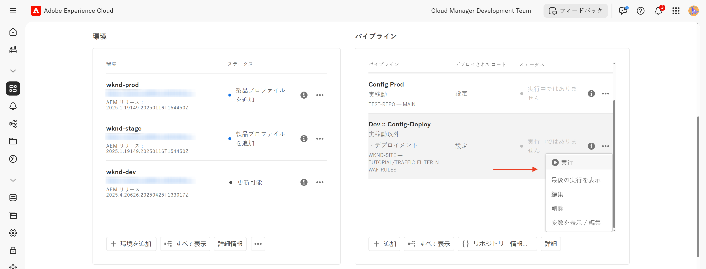
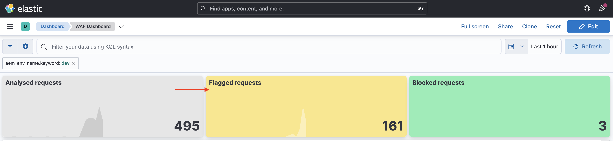

# WAF ルールを使用した AEM web サイトの保護

AEM as a Cloud Service で&#x200B;_アドビの推奨される_  **web アプリケーションファイアウォール（WAF）ルール**&#x200B;を使用して、DoS 攻撃、DDoS 攻撃、ボットの不正使用などの高度な脅威から AEM web サイトを保護する方法について説明します。

高度な攻撃は、高いリクエスト率、複雑なパターン、従来のセキュリティ対策を回避する高度な手法の使用を特徴としています。

>[!IMPORTANT]
>
> WAFトラフィックフィルタールールには、追加の **WAF-DDoS 保護**&#x200B;または&#x200B;**拡張セキュリティ**&#x200B;のライセンスが必要です。Sites および Forms のお客様は、標準トラフィックフィルタールールをデフォルトで利用できます。


>[!VIDEO](https://video.tv.adobe.com/v/3469431/?quality=12&learn=on&captions=jpn)

## 学習目標

- アドビの推奨される WAF ルールを確認します。
- ルールの結果を定義、デプロイ、テストおよび分析します。
- 結果に基づいてルールを絞り込むタイミングと方法を理解します。
- AEM アクションセンターを使用して、ルールによって生成されたアラートを確認する方法を学びます。

### 実装の概要

実装手順には、次が含まれます。

- AEM WKND プロジェクトの `/config/cdn.yaml` ファイルに WAF ルールを追加します。
- 変更をコミットして Cloud Manager Git リポジトリにプッシュします。
- Cloud Manager 設定パイプラインを使用して、変更を AEM 環境にデプロイします。
- [Nikto](https://github.com/sullo/nikto/wiki) を使用して DDoS 攻撃をシミュレートして、ルールをテストします。
- AEMCS CDN ログと ELK ダッシュボードツールを使用して、結果を分析します。

## 前提条件

続行する前に、[トラフィックフィルタールールと WAF ルールの設定方法](../setup.md)チュートリアルの説明に従って必要な設定が完了していることを確認します。また、[AEM WKND Sites プロジェクト](https://github.com/adobe/aem-guides-wknd)のクローンを作成し、AEM 環境にデプロイしておきます。

## ルールの確認と定義

アドビの推奨される web アプリケーションファイアウォール（WAF）ルールは、DoS 攻撃、DDoS 攻撃、ボットの不正使用などの高度な脅威から AEM web サイトを保護するために不可欠です。多くの場合、高度な攻撃は、高いリクエスト率、複雑なパターン、従来のセキュリティ対策を回避する高度な手法（プロトコルベースまたはペイロードベースの攻撃）の使用を特徴としています。

AEM WKND プロジェクトの `cdn.yaml` ファイルに追加する必要がある 3 つの推奨される WAF ルールを確認しましょう。

### &#x200B;1. 既知の悪意のある IP からの攻撃のブロック

このルールでは、疑わしいリクエスト&#x200B;*および*&#x200B;悪意のあるものとしてフラグが付けられた IP アドレスから生成されたリクエストを&#x200B;**ブロック**&#x200B;します。これらの条件が両方とも満たされているので、誤検知（正当なトラフィックをブロックすること）のリスクは非常に低いと確信できます。既知の不正 IP は、脅威インテリジェンスフィードなどのソースに基づいて特定されます。

`ATTACK-FROM-BAD-IP` フラグは、これらのリクエストを特定するために使用されます。このフラグでは、[こちらにリスト](https://experienceleague.adobe.com/ja/docs/experience-manager-cloud-service/content/security/traffic-filter-rules-including-waf#waf-flags-list)されている複数の WAF フラグを集計します。

```yaml
kind: "CDN"
version: "1"
metadata:
  envTypes: ["dev", "stage", "prod"]
data:
  trafficFilters:
    rules:
    - name: attacks-from-bad-ips-globally
      when:
        reqProperty: tier
        in: ["author", "publish"]
      action:
        type: block
        wafFlags:
          - ATTACK-FROM-BAD-IP
```

### &#x200B;2. グローバルに任意の IP からの攻撃をログに記録（その後ブロック）する

このルールでは、IP アドレスが脅威インテリジェンスフィードに見つからない場合でも、潜在的な攻撃として特定されたリクエストを&#x200B;**ログに記録**&#x200B;します。

`ATTACK` フラグは、これらのリクエストを特定するために使用されます。このフラグでは、`ATTACK-FROM-BAD-IP` と同様に、複数の WAF フラグを集計します。

これらのリクエストは悪意のあるものである可能性が高いですが、IPアドレスは脅威インテリジェンスフィードで特定されていないので、ブロックモードではなく `log` モードで開始することをお勧めします。ログを分析して誤検知の有無を確認し、検証が完了したら、**ルールを `block` モードに切り替えます**。

```yaml
...
    - name: attacks-from-any-ips-globally
      when:
        reqProperty: tier
        in: ["author", "publish"]
      action:
        type: log
        alert: true
        wafFlags:
          - ATTACK
```

または、ビジネス要件により、悪意のあるトラフィックを許可する可能性を排除する必要がある場合は、すぐに `block` モードを使用することもできます。

これらの推奨される WAF ルールは、既知の脅威や新しい脅威に対するセキュリティレイヤーを強化します。


## 最新のアドビの推奨される WAF ルールへの移行

`ATTACK-FROM-BAD-IP` および `ATTACK` WAF フラグが導入される前（2025年7月）は、推奨される WAF ルールは次のとおりでした。これらのルールには、`SANS`、`TORNODE`、`NOUA` など、特定の条件に一致するリクエストをブロックするための特定の WAF フラグのリストが含まれていました。

```yaml
...
data:
  trafficFilters:
    rules:
    ...
    # Enable WAF protections (only works if WAF is enabled for your environment)
      - name: block-waf-flags
        when:
          reqProperty: tier
          matches: "author|publish"
        action:
          type: block
          wafFlags:
            - SANS
            - TORNODE
            - NOUA
            - SCANNER
            - USERAGENT
            - PRIVATEFILE
            - ABNORMALPATH
            - TRAVERSAL
            - NULLBYTE
            - BACKDOOR
            - LOG4J-JNDI
            - SQLI
            - XSS
            - CODEINJECTION
            - CMDEXE
            - NO-CONTENT-TYPE
            - UTF8
...
```

上記のルールは引き続き有効ですが、_ビジネス要件に合わせて `wafFlags` をまだカスタマイズしていない場合は_、`ATTACK-FROM-BAD-IP` および `ATTACK` WAF フラグを使用する新しいルールに移行することをお勧めします。

ベストプラクティスとの一貫性を保つために、新しいルールに移行するには、次の手順に従います。

- `cdn.yaml` ファイル内の既存の WAF ルールを確認します（上記の例と類似している場合があります）。ビジネス要件に固有の `wafFlags` のカスタマイズがないことを確認します。

- 既存の WAF ルールを、`ATTACK-FROM-BAD-IP` および `ATTACK` フラグを使用する新しいアドビの推奨される WAF ルールに置き換えます。すべてのルールがブロックモードになっていることを確認します。

以前に `wafFlags` をカスタマイズしていた場合は、これらの新しいルールへの移行は引き続き可能ですが、カスタマイズ内容が改訂後のルールに取り込まれるように、慎重に行います。

この移行により、WAF ルールを簡素化しながら、高度な脅威に対する堅牢な保護を引き続き実現できます。 新しいルールは、より効果的で管理しやすいように設計されています。


## ルールのデプロイ

上記のルールをデプロイするには、次の手順に従います。

- 変更をコミットして Cloud Manager Git リポジトリにプッシュします。

- [以前に作成した](../setup.md#deploy-rules-using-adobe-cloud-manager) Cloud Manager 設定パイプラインを使用して、変更を AEM 環境にデプロイします。

  

## ルールのテスト

WAF ルールの効果を検証するために、脆弱性と誤った設定を検出する web サーバースキャナーである [Nikto](https://github.com/sullo/nikto) を使用して攻撃をシミュレートします。次のコマンドは、WAF ルールで保護されている AEM WKND web サイトに対して SQL インジェクション攻撃をトリガーします。

```shell
$./nikto.pl -useragent "AttackSimulationAgent (Demo/1.0)" -D V -Tuning 9 -ssl -h https://publish-pXXXX-eYYYY.adobeaemcloud.com/us/en.html
```


攻撃シミュレーションについて詳しくは、[Nikto - スキャンの調整](https://github.com/sullo/nikto/wiki/Scan-Tuning)のドキュメントを参照してください。このドキュメントには、含めるまたは除外するテスト攻撃のタイプを指定する方法が記載されています。

## アラートの確認

トラフィックフィルタールールをトリガーすると、アラートが生成されます。これらのアラートは、[AEM アクションセンター](https://experience.adobe.com/aem/actions-center)で確認できます。


## 結果の分析

トラフィックフィルタールールの結果を分析するには、AEMCS CDN ログと ELK ダッシュボードツールを使用します。[CDN ログの取り込み](../setup.md#ingest-cdn-logs)設定の節の指示に従って、CDN ログを ELK スタックに取り込みます。

次のスクリーンショットでは、AEM 開発環境の CDN ログが ELK スタックに取り込まれていることがわかります。


ELK アプリケーション内の **WAF ダッシュボード**には、フラグが付けられた
リクエストと、クライアント IP（cli_ip）、ホスト、URL、アクション（waf_action）、ルール名（waf_match）の各列に対応する値が表示されます。



また、**WAF フラグ配布**&#x200B;パネルと&#x200B;**トップ攻撃**&#x200B;パネルには追加の詳細が表示されます。


### Splunk 統合

[Splunk ログの転送が有効になっている場合は](https://experienceleague.adobe.com/ja/docs/experience-manager-cloud-service/content/implementing/developing/logging#splunk-logs)、新しいダッシュボードを作成してトラフィックパターンを分析できます。

Splunk でダッシュボードを作成するには、[AEMCS CDN ログ分析用の Splunk ダッシュボード](https://github.com/adobe/AEMCS-CDN-Log-Analysis-Tooling/blob/main/Splunk/README.md#splunk-dashboards-for-aemcs-cdn-log-analysis)の手順に従います。

## ルールを絞り込むタイミングと方法

目標は、正当なトラフィックのブロックを回避し、AEM web サイトを高度な脅威から保護することです。推奨される WAF ルールは、セキュリティ戦略の出発点となるように設計されています。

ルールを絞り込むには、次の手順を考慮します。

- **トラフィックパターンを監視**：CDN ログと ELK ダッシュボードを使用して、トラフィックパターンを監視し、トラフィックの異常やスパイクを特定します。検出されている攻撃のタイプを理解するには、ELK ダッシュボードの _WAF フラグの配布_&#x200B;パネルと&#x200B;_上位の攻撃_&#x200B;パネルに注意してください。
- **wafFlags を調整**：`ATTACK` フラグが頻繁にトリガーされる場合や、
攻撃ベクターを微調整する必要がある場合は、特定の WAF フラグを使用してカスタムルールを作成できます。[WAF フラグ](https://experienceleague.adobe.com/ja/docs/experience-manager-cloud-service/content/security/traffic-filter-rules-including-waf#waf-flags-list)の完全なリストについて詳しくは、ドキュメントを参照してください。まず、`log` モードで新しいカスタムルールを試してみることを考慮します。
- **ブロックルールに移行**：トラフィックパターンを検証し、WAF フラグを調整したら、ブロックルールに移行することを考慮できます。

## 概要

このチュートリアルでは、アドビの推奨される web アプリケーションファイアウォール（WAF）ルールを使用して、DoS 攻撃、DDoS 攻撃、ボットの不正使用などの高度な脅威から AEM web サイトを保護する方法について説明します。

## ユースケース - 標準ルール以外

より高度なシナリオについて詳しくは、特定のビジネス要件に基づいてカスタムトラフィックフィルタールールを実装する方法を示す次のユースケースを参照してください。

<!-- CARDS
{target = _self}

* ../how-to/request-logging.md

* ../how-to/request-blocking.md

* ../how-to/request-transformation.md
-->
<!-- START CARDS HTML - DO NOT MODIFY BY HAND -->
<div class="columns">
    <div class="column is-half-tablet is-half-desktop is-one-third-widescreen" aria-label="Monitoring sensitive requests">
        <div class="card" style="height: 100%; display: flex; flex-direction: column; height: 100%;">
            <div class="card-image">
                <figure class="image x-is-16by9">
                    <a href="../how-to/request-logging.md" title="機密性の高いリクエストの監視" target="_self" rel="referrer">
                        
                    </a>
                </figure>
            </div>
            <div class="card-content is-padded-small" style="display: flex; flex-direction: column; flex-grow: 1; justify-content: space-between;">
                <div class="top-card-content">
                    <p class="headline is-size-6 has-text-weight-bold">
                        <a href="../how-to/request-logging.md" target="_self" rel="referrer" title="機密性の高いリクエストの監視">機密性の高いリクエストの監視</a>
                    </p>
                    <p class="is-size-6">AEM as a Cloud Service のトラフィックフィルタールールを使用して機密性の高いリクエストをログに記録し、監視する方法について説明します。</p>
                </div>
                <a href="../how-to/request-logging.md" target="_self" rel="referrer" class="spectrum-Button spectrum-Button--outline spectrum-Button--primary spectrum-Button--sizeM" style="align-self: flex-start; margin-top: 1rem;">
                    <span class="spectrum-Button-label has-no-wrap has-text-weight-bold">詳細情報</span>
                </a>
            </div>
        </div>
    </div>
    <div class="column is-half-tablet is-half-desktop is-one-third-widescreen" aria-label="Restricting access">
        <div class="card" style="height: 100%; display: flex; flex-direction: column; height: 100%;">
            <div class="card-image">
                <figure class="image x-is-16by9">
                    <a href="../how-to/request-blocking.md" title="アクセスの制限" target="_self" rel="referrer">
                        
                    </a>
                </figure>
            </div>
            <div class="card-content is-padded-small" style="display: flex; flex-direction: column; flex-grow: 1; justify-content: space-between;">
                <div class="top-card-content">
                    <p class="headline is-size-6 has-text-weight-bold">
                        <a href="../how-to/request-blocking.md" target="_self" rel="referrer" title="アクセスの制限">アクセスの制限</a>
                    </p>
                    <p class="is-size-6">AEM as a Cloud Service のトラフィックフィルタールールを使用して特定のリクエストをブロックし、アクセスを制限する方法について説明します。</p>
                </div>
                <a href="../how-to/request-blocking.md" target="_self" rel="referrer" class="spectrum-Button spectrum-Button--outline spectrum-Button--primary spectrum-Button--sizeM" style="align-self: flex-start; margin-top: 1rem;">
                    <span class="spectrum-Button-label has-no-wrap has-text-weight-bold">詳細情報</span>
                </a>
            </div>
        </div>
    </div>
    <div class="column is-half-tablet is-half-desktop is-one-third-widescreen" aria-label="Normalizing requests">
        <div class="card" style="height: 100%; display: flex; flex-direction: column; height: 100%;">
            <div class="card-image">
                <figure class="image x-is-16by9">
                    <a href="../how-to/request-transformation.md" title="リクエストの標準化" target="_self" rel="referrer">
                        
                    </a>
                </figure>
            </div>
            <div class="card-content is-padded-small" style="display: flex; flex-direction: column; flex-grow: 1; justify-content: space-between;">
                <div class="top-card-content">
                    <p class="headline is-size-6 has-text-weight-bold">
                        <a href="../how-to/request-transformation.md" target="_self" rel="referrer" title="リクエストの標準化">リクエストの標準化</a>
                    </p>
                    <p class="is-size-6">AEM as a Cloud Service のトラフィックフィルタールールを使用してリクエストを変換し、標準化する方法について説明します。</p>
                </div>
                <a href="../how-to/request-transformation.md" target="_self" rel="referrer" class="spectrum-Button spectrum-Button--outline spectrum-Button--primary spectrum-Button--sizeM" style="align-self: flex-start; margin-top: 1rem;">
                    <span class="spectrum-Button-label has-no-wrap has-text-weight-bold">詳細情報</span>
                </a>
            </div>
        </div>
    </div>
</div>
<!-- END CARDS HTML - DO NOT MODIFY BY HAND -->

## その他のリソース

- [推奨されるスタータールール](https://experienceleague.adobe.com/ja/docs/experience-manager-cloud-service/content/security/traffic-filter-rules-including-waf#recommended-nonwaf-starter-rules)
- [WAF フラグリスト](https://experienceleague.adobe.com/ja/docs/experience-manager-cloud-service/content/security/traffic-filter-rules-including-waf#waf-flags-list)
