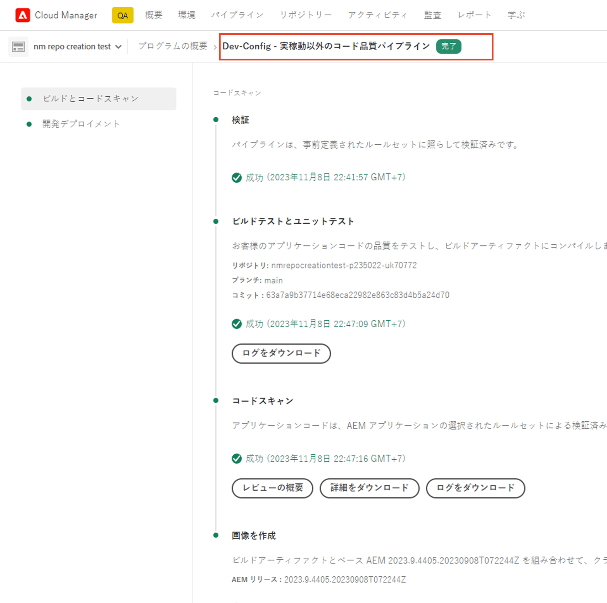
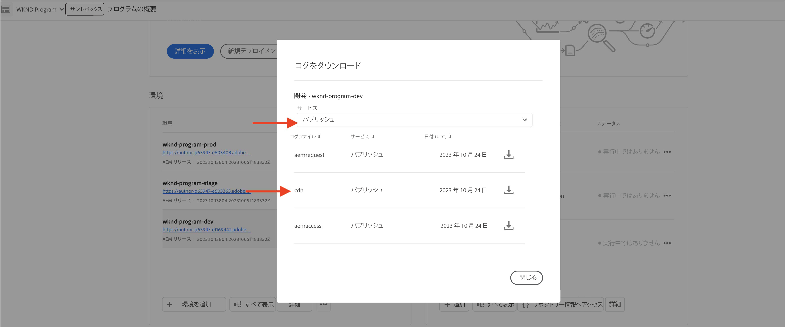

# WAF ルールを含むトラフィックフィルタールールの例と結果の分析

様々なタイプのトラフィックフィルタールールを宣言し、Adobe Experience Manager as a Cloud Service（AEMCS）CDN ログとダッシュボードツールを使用して結果を分析する方法について説明します。

この節では、WAF ルールを含むトラフィックフィルタールールの実用的な例を示します。[AEM WKND Sites プロジェクト](https://github.com/adobe/aem-guides-wknd#aem-wknd-sites-project)を使用して、URI（またはパス）、IP アドレス、リクエスト数、様々な攻撃タイプに基づいてリクエストを記録、許可、ブロックする方法について説明します。

さらに、AEMCS CDN ログを取り込むダッシュボードツールを使用して、アドビが提供するサンプルダッシュボードを通じて重要な指標を視覚化する方法について説明します。

特定の要件に合わせてカスタムダッシュボードを強化および作成すると、より深いインサイトを取得し、AEM Sites のルール設定が最適化されます。

>[!VIDEO](https://video.tv.adobe.com/v/3425404?quality=12&learn=on)

## 例

WAF ルールを含むトラフィックフィルタールールの様々な例を見てみましょう。前述の[設定方法](./how-to-setup.md)の章で説明した必要な設定プロセスを完了し、[AEM WKND Sites プロジェクト](https://github.com/adobe/aem-guides-wknd#aem-wknd-sites-project)のクローンを作成する必要があります。

### リクエストのログ

まず、AEM パブリッシュサービスに対する **WKND ログインおよびログアウトパスのリクエストを記録します**。

- 次のルールを WKND プロジェクトの `/config/cdn.yaml` ファイルに追加します。

```yaml
kind: CDN
version: '1'
metadata:
  envTypes:
    - dev
    - stage
    - prod
data:
  trafficFilters:
    rules:
    # On AEM Publish service log WKND Login and Logout requests
      - name: publish-auth-requests
        when:
          allOf:
            - reqProperty: tier
              matches: publish
            - reqProperty: path
              in:
                - /system/sling/login/j_security_check
                - /system/sling/logout
        action: log
```

- 変更をコミットして Cloud Manager Git リポジトリにプッシュします。

- [以前に作成した](how-to-setup.md#deploy-rules-through-cloud-manager) Cloud Manager `Dev-Config` 設定パイプラインを使用して、変更を AEM 開発環境にデプロイします。

  

-  パブリッシュサービス（例：`https://publish-pXXXX-eYYYY.adobeaemcloud.com/us/en.html`）のプログラムの WKND サイトにログインしてからログアウトし、ルールをテストします。ユーザー名とパスワードとして `asmith/asmith` を使用できます。

  

#### 分析{#analyzing}

Cloud Manager から AEMCS CDN ログをダウンロードし、前の章で設定した[ダッシュボードツール](how-to-setup.md#analyze-results-using-elk-dashboard-tool)を使用して、`publish-auth-requests` ルールの結果を分析しましょう。

- [Cloud Manager](https://my.cloudmanager.adobe.com/) の&#x200B;**環境**&#x200B;カードから、AEMCS **パブリッシュ**&#x200B;サービスの CDN ログをダウンロードします。

  

  >[!TIP]
  >
  >    新しいリクエストが CDN ログに表示されるまでに最大 5 分かかる場合があります。

- ダウンロードしたログファイル（例：以下のスクリーンショットの `publish_cdn_2023-10-24.log`）を Elastic ダッシュボードツールプロジェクトの `logs/dev` フォルダーにコピーします。

  {width="800" zoomable="yes"}

- Elastic ダッシュボードツールページを更新します。
   - 上部の「**グローバルフィルター**」セクションで、`aem_env_name.keyword` フィルターを編集し、`dev` 環境値を選択します。

     

   - 時間間隔を変更するには、右上隅にあるカレンダーアイコンをクリックし、目的の時間間隔を選択します。

     

- 更新されたダッシュボードの&#x200B;**分析済みリクエスト**、**フラグ付きリクエスト**、**フラグ付きリクエストの詳細**&#x200B;パネルを確認します。一致する CDN ログエントリの場合、各エントリのクライアント IP（cli_ip）、ホスト、URL、アクション（waf_action）、ルール名（waf_match）の値が表示されます。

  


### リクエストのブロック

この例では、デプロイした WKND プロジェクトのパス `/content/wknd/internal` にある&#x200B;_内部_&#x200B;フォルダーにページを追加しましょう。次に、次のようなトラフィックフィルタールールを宣言します。これにより、組織に一致する指定された IP アドレス以外の場所（企業 VPN など）からのサブページへの&#x200B;**トラフィックをブロック**&#x200B;できます。

独自の内部ページ（`demo-page.html` など）を作成することも、[添付されているパッケージ](./assets/demo-internal-pages-package.zip)を使用することもできます。

- WKND プロジェクトの `/config/cdn.yaml` ファイルに次のルールを追加します。

```yaml
kind: CDN
version: '1'
metadata:
  envTypes:
    - dev
    - stage
    - prod
data:
  trafficFilters:
    rules:
    ...

    # Block requests to (demo) internal only page/s from public IP address but allow from internal IP address.
    # Make sure to replace the IP address with your own IP address.
      - name: block-internal-paths
        when:
          allOf:
            - reqProperty: path
              matches: /content/wknd/internal
            - reqProperty: clientIp
              notIn: [192.150.10.0/24]
        action: block
```

- 変更をコミットして、Cloud Manager Git リポジトリにプッシュします。

- Cloud Manager で[以前作成済み](how-to-setup.md#deploy-rules-through-cloud-manager) `Dev-Config`の設定パイプラインを使用して、変更を AEM 開発環境にデプロイします。

- WKND サイトの内部ページ（`https://publish-pXXXX-eYYYY.adobeaemcloud.com/content/wknd/internal/demo-page.html` など）にアクセスするか、または以下の CURL コマンドを使用して、ルールをテストします。

  ```bash
  $ curl -I https://publish-pXXXX-eYYYY.adobeaemcloud.com/content/wknd/internal/demo-page.html
  ```

- ルールで使用した IP アドレスと、別の IP アドレス（例えば、携帯電話を使用する場合）の両方から上記の手順を繰り返します。

#### 分析中

`block-internal-paths` ルールの結果を分析するには、[前の例](#analyzing)で説明したのと同じ手順に従います。

ただし、今回は、**ブロックされたリクエスト**&#x200B;と、クライアント IP（cli_ip）、ホスト、URL、アクション（waf_action）、ルール名（waf_match）の各列に対応する値が表示されます。


### DoS 攻撃の防止

1 秒あたり 100 件のリクエストを行う IP アドレスからのリクエストを、5 分間ブロックして、**DoS 攻撃を防止**&#x200B;しましょう。

- 次の[レート制限トラフィックフィルタールール](https://experienceleague.adobe.com/docs/experience-manager-cloud-service/content/security/traffic-filter-rules-including-waf.html?lang=ja#ratelimit-structure)を、WKND プロジェクトの `/config/cdn.yaml` ファイルに追加します。

```yaml
kind: CDN
version: '1'
metadata:
  envTypes:
    - dev
    - stage
    - prod
data:
  trafficFilters:
    rules:
    ...
    #  Prevent DoS attacks by blocking client for 5 minutes if they make more than 100 requests in 1 second.
      - name: prevent-dos-attacks
        when:
          reqProperty: path
          like: '*'
        rateLimit:
          limit: 100
          window: 1
          penalty: 300
          groupBy:
            - reqProperty: clientIp
        action: block
```

>[!WARNING]
>
>実稼動環境に合わせて、web セキュリティチームと連携し、`rateLimit` の適切な値を決定します。

- [前の例](#logging-requests)で説明したように、変更をコミット、プッシュ、デプロイします。

- DoS 攻撃をシミュレートするには、次の [Vegeta](https://github.com/tsenart/vegeta) コマンドを使用します。

  ```shell
  $ echo "GET https://publish-pXXXX-eYYYY.adobeaemcloud.com/us/en.html" | vegeta attack -rate=120 -duration=5s | vegeta report
  ```

  このコマンドは、5 秒間で 120 件のリクエストを実行し、レポートを出力します。ご覧のように、成功率は 32.5％です。残りの部分に対しては 406 HTTP 応答コードを受信し、トラフィックがブロックされたことがわかります。

  

#### 分析中

`prevent-dos-attacks` ルールの結果を分析するには、[前の例](#analyzing)で説明したのと同じ手順に従います。

今回は、多数の&#x200B;**ブロックされたリクエスト**&#x200B;と、クライアント IP（cli_ip）、ホスト、URL、アクション（waf_action）、ルール名（waf_match）の各列に対応する値が表示されます。


また、**クライアント IP、国、およびユーザーエージェント別のトップ 100 攻撃**&#x200B;パネルには追加の詳細が表示され、ルール設定をさらに最適化するために使用できます。


DoS 攻撃と DDoS 攻撃を防止する方法の詳細については、[トラフィックフィルタールールを使用した DoS 攻撃と DDoS 攻撃のブロック](../blocking-dos-attack-using-traffic-filter-rules.md)のチュートリアルをご覧ください。

### WAF ルール

これまでのトラフィックフィルタールールの例は、Sites および Forms のすべてのお客様が設定できます。

次に、強化されたセキュリティまたは WAF-DDoS 保護ライセンスを購入したお客様のエクスペリエンスを見てみましょう。このライセンスにより、より高度な攻撃から web サイトを保護するための高度なルールを設定できます。

続行する前に、トラフィックフィルタールールドキュメントの[設定手順](https://experienceleague.adobe.com/docs/experience-manager-cloud-service/content/security/traffic-filter-rules-including-waf.html?lang=ja#setup)の説明に従って、プログラムの WAF-DDoS 保護を有効にします。

#### WAFFlags を使用しない場合

まず、WAF ルールが宣言される前のエクスペリエンスを見てみましょう。プログラムで WAF-DDoS が有効になっている場合、デフォルトで CDN ログに悪意のあるトラフィックの一致が記録されるので、適切なルールを作成するための適切な情報を取得できます。

まず、WAF ルールを追加せずに（または `wafFlags` プロパティを使用して）WKND サイトを攻撃し、結果を分析してみましょう。

- 攻撃をシミュレートするには、以下の [Nikto](https://github.com/sullo/nikto) コマンドを使用します。このコマンドは、6 分間に約 700 件の悪意のあるリクエストを送信します。

  ```shell
  $ ./nikto.pl -useragent "AttackSimulationAgent (Demo/1.0)" -D V -Tuning 9 -ssl -h https://publish-pXXXX-eYYYY.adobeaemcloud.com/us/en.html
  ```

  

  攻撃シミュレーションについて詳しくは、[Nikto - スキャンの調整](https://github.com/sullo/nikto/wiki/Scan-Tuning)のドキュメントを参照してください。このドキュメントには、含めるまたは除外するテスト攻撃のタイプを指定する方法が記載されています。

##### 分析中

攻撃シミュレーションの結果を分析するには、[前の例](#analyzing)で説明したのと同じ手順に従います。

ただし、今回は&#x200B;**フラグ付きリクエスト**&#x200B;と、クライアント IP（cli_ip）、ホスト、URL、アクション（waf_action）、ルール名（waf_match）列に対応する値が表示されます。この情報により、結果を分析し、ルール設定を最適化できます。


**WAF フラグ配布**&#x200B;パネルと&#x200B;**トップ攻撃**&#x200B;パネルに追加の詳細が表示されます。これは、ルール設定をさらに最適化するために使用できます。


#### WAFFlags を使用する場合

次に、`action` プロパティの一部として `wafFlags` プロパティを含む WAF ルールを追加し、**シミュレートされた攻撃リクエストをブロック**&#x200B;してみましょう。

構文の観点から見ると、WAF ルールは前に示したものと似ていますが、`action` プロパティは 1 つ以上の `wafFlags` 値を参照します。`wafFlags` について詳しくは、[WAF フラグリスト](https://experienceleague.adobe.com/docs/experience-manager-cloud-service/content/security/traffic-filter-rules-including-waf.html?lang=ja#waf-flags-list)の節を参照してください。

- WKND プロジェクトの `/config/cdn.yaml` ファイルに次のルールを追加します。`block-waf-flags` ルールには、シミュレートされた悪意のあるトラフィックで攻撃された際にダッシュボードツールに表示された wafFlags の一部が含まれます。実際、脅威の状況が進化するにつれて、時間の経過と共にログを分析し、新しいルールを宣言する方法を決定することが推奨されます。

```yaml
kind: CDN
version: '1'
metadata:
  envTypes:
    - dev
    - stage
    - prod
data:
  trafficFilters:
    rules:
    ...
    # Enable WAF protections (only works if WAF is enabled for your environment)
      - name: block-waf-flags
        when:
          reqProperty: tier
          matches: "author|publish"
        action:
          type: block
          wafFlags:
            - SANS
            - TORNODE
            - NOUA
            - SCANNER
            - USERAGENT
            - PRIVATEFILE
            - ABNORMALPATH
            - TRAVERSAL
            - NULLBYTE
            - BACKDOOR
            - LOG4J-JNDI
            - SQLI
            - XSS
            - CODEINJECTION
            - CMDEXE
            - NO-CONTENT-TYPE
            - UTF8
```

- [前の例](#logging-requests)で説明したように、変更をコミット、プッシュ、デプロイします。

- 攻撃をシミュレートするには、以前と同じ [Nikto](https://github.com/sullo/nikto) コマンドを使用します。

  ```shell
  $ ./nikto.pl -useragent "AttackSimulationAgent (Demo/1.0)" -D V -Tuning 9 -ssl -h https://publish-pXXXX-eYYYY.adobeaemcloud.com/us/en.html
  ```

##### 分析中

[前の例](#analyzing)で説明したのと同じ手順を繰り返します。

今回は、**ブロックされたリクエスト**&#x200B;にエントリが表示され、クライアント IP（cli_ip）、ホスト、URL、アクション（waf_action）、ルール名（waf_match）列に対応する値が表示されます。


また、**WAF フラグ配布**&#x200B;パネルと&#x200B;**トップ攻撃**&#x200B;パネルには追加の詳細が表示されます。


### 包括的な分析

上記の&#x200B;_分析_&#x200B;の節では、ダッシュボードツールを使用して特定のルールの結果を分析する方法について説明しました。次を含む他のダッシュボードパネルを使用して、結果の分析をさらに行うことができます。


- 分析済み、フラグ付き、ブロックされたリクエスト
- 時間の経過と共に行われる WAF フラグ配布
- 時間の経過と共にトリガーされるトラフィックフィルタールール
- WAF フラグ ID によるトップ攻撃
- 上位のトリガーされるトラフィックフィルター
- クライアント IP、国、ユーザーエージェントによる上位 100 人の攻撃者


## 次の手順

セキュリティ侵害のリスクを軽減するために推奨される[ベストプラクティス](./best-practices.md)を理解します。

## その他のリソース

[トラフィックフィルタールールの構文](https://experienceleague.adobe.com/docs/experience-manager-cloud-service/content/security/traffic-filter-rules-including-waf.html?lang=ja#rules-syntax)

[CDN ログ形式](https://experienceleague.adobe.com/docs/experience-manager-cloud-service/content/security/traffic-filter-rules-including-waf.html?lang=ja#cdn-log-format)

