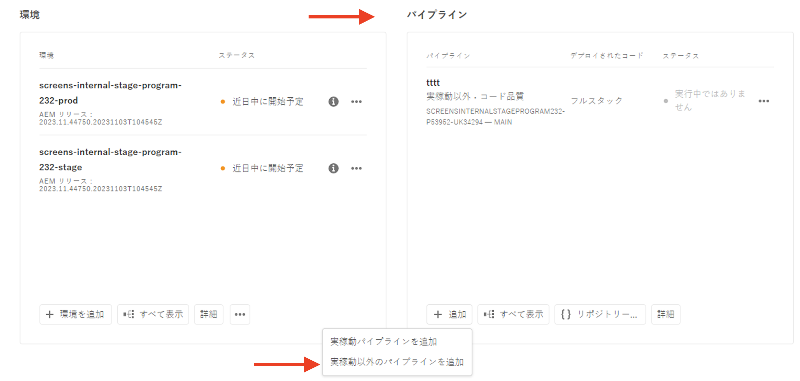
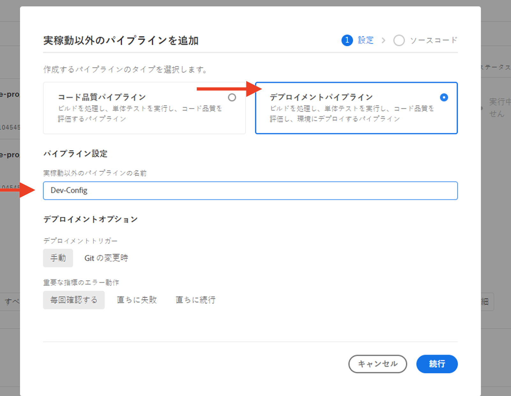

# WAF ルールを含むトラフィックフィルタールールの設定方法

WAF ルールを含むトラフィックフィルタールールの&#x200B;**設定方法**&#x200B;について説明します。結果の作成、デプロイ、テスト、分析について参照してください。

>[!VIDEO](https://video.tv.adobe.com/v/3425407?quality=12&learn=on)

## セットアップ

設定プロセスには、次の項目が含まれます。

- _ルールの作成_：適切な AEM プロジェクト構造と設定ファイルを使用します。
- _ルールのデプロイ_：Adobe Cloud Manager の設定パイプラインを使用します。
- _ルールのテスト_：様々なツールを使用してトラフィックを生成します。
- _結果の分析_：AEMCS CDN ログとダッシュボード ツールを使用します。

### AEM プロジェクトでのルールの作成

ルールを作成するには、次の手順に従います。

1. AEM プロジェクトの最上位に `config` フォルダーを作成します。

1. `config` フォルダー内に、`cdn.yaml` という新しいファイルを作成します。

1. 次のメタデータを `cdn.yaml` ファイルに追加します。

```yaml
kind: CDN
version: '1'
metadata:
  envTypes:
    - dev
    - stage
    - prod
data:
  trafficFilters:
    rules:
```

AEM Guides WKND Sites プロジェクト内の `cdn.yaml` ファイルの例を参照してください。

{width="800" zoomable="yes"}

### Cloud Manager を使用したルールのデプロイ {#deploy-rules-through-cloud-manager}

ルールをデプロイするには、次の手順に従います。

1. [my.cloudmanager.adobe.com](https://my.cloudmanager.adobe.com/) で Cloud Manager にログインし、適切な組織とプログラムを選択します。

1. _プログラムの概要_&#x200B;ページから&#x200B;_パイプライン_&#x200B;カードに移動し、「**+ 追加**」ボタンをクリックして目的のパイプラインタイプを選択します。

   

   上の例では、開発環境を使用しているので、デモの目的で「_実稼動以外のパイプラインを追加_」が選択されています。

1. _実稼動以外のパイプラインを追加_&#x200B;ダイアログで、次の詳細を選択して入力します。

   1. 設定手順：

      - **タイプ**：デプロイメントパイプライン
      - **パイプライン名**：Dev-Config

      

   2. ソースコード手順：

      - **デプロイするコード**：ターゲットデプロイメント
      - **次を含む**：設定
      - **デプロイメント環境**：環境の名前（例：wknd-program-dev）。
      - **リポジトリ**：パイプラインがコードを取得する元の Git リポジトリ。例：`wknd-site`
      - **Git ブランチ**：Git リポジトリブランチの名前。
      - **コードの場所**：`/config`（前の手順で作成した最上位の設定フォルダーに対応）

      

### トラフィックの生成によるルールのテスト

ルールをテストするために、様々なサードパーティツールが使用可能で、組織には推奨ツールがある場合があります。デモの目的で、次のツールを使用します。

- [cURL](https://curl.se/)：URL の呼び出しや応答コードの確認などの基本的なテストに使用します。

- [Vegeta](https://github.com/tsenart/vegeta)：サービス拒否（DOS）を実行するために使用します。のインストール手順に従います [Vegeta GitHub](https://github.com/tsenart/vegeta#install).

- [Nikto](https://github.com/sullo/nikto/wiki)：XSS、SQL インジェクションなどの潜在的な問題やセキュリティの脆弱性を見つけます。[Nikto GitHub](https://github.com/sullo/nikto) のインストール手順に従います。

- 次のコマンドを実行して、ツールがインストールされ、ターミナルで使用できることを確認します。

  ```shell
  # Curl version check
  $ curl --version
  
  # Vegeta version check
  $ vegeta -version
  
  # Nikto version check
  $ cd <PATH-OF-CLONED-REPO>/program
  ./nikto.pl -Version
  ```

### ダッシュボードツールを使用した結果の分析

ルールを作成、デプロイおよびテストした後は、を使用して結果を分析できます **CDN** ログと **AEMCS-CDN-Log-Analysis-Tooling**. ツールは、Splunk および ELK （Elasticsearch、Logstash、Kibana）スタックの結果を視覚化する一連のダッシュボードを提供します。

ツールのクローンは、 [AEMCS-CDN-Log-Analysis-Tooling](https://github.com/adobe/AEMCS-CDN-Log-Analysis-Tooling) GitHub リポジトリ。 手順に従って、をインストールして読み込みます。 **CDN トラフィックダッシュボード** および **WAF ダッシュボード** 好みの観察ツールのダッシュボード。

このチュートリアルでは、ELK スタックを使用します。 に従う [AEMCS CDN ログ分析用の ELK Docker コンテナ](https://github.com/adobe/AEMCS-CDN-Log-Analysis-Tooling/blob/main/ELK/README.md) elk スタックの設定手順。

- サンプルダッシュボードを読み込むと、Elastic ダッシュボードのツールページは次のようになります。

  

>[!NOTE]
>
>    AEMCS CDN ログはまだ取り込まれていないので、ダッシュボードは空です。


## 次の手順

[例と結果分析](./examples-and-analysis.md)の章で、AEM WKND Sites プロジェクトを使用して、WAF ルールを含むトラフィックフィルタールールを宣言する方法について説明します。
