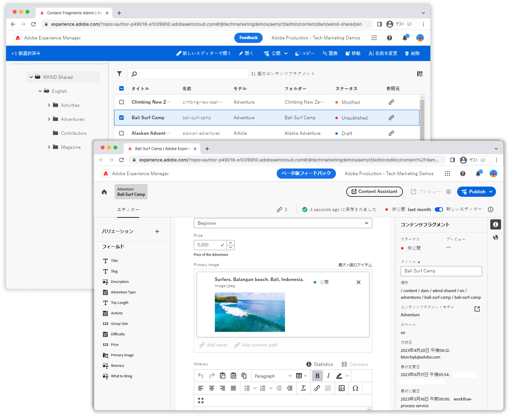

# コンテンツフラグメントコンソールのビデオ

Adobe Experience Manager のコンテンツフラグメントコンソールを使用すると、コンテンツフラグメントの管理とオーサリングが簡単になります。これらのビデオでコンテンツフラグメントコンソールを最大限に活用する方法を説明します。

コンテンツフラグメントコンソールとその機能について詳しくは、[ドキュメント](https://experienceleague.adobe.com/docs/experience-manager-cloud-service/content/sites/administering/content-fragments/content-fragments-console.html?lang=ja)を参照してください。

## ビデオ

    <!-- Console overview -->
    

      

        

          <figure class="image is-16by9">
            
          </figure>
        

        

          

            
5 分

            

              <a href="./basics/content-fragments-console.md" title="概要">コンソールの概要</a>
            

            
コンテンツフラグメントコンソールの
簡単な概要です。

            <a href="./basics/content-fragments-console.md" class="spectrum-Button
              spectrum-Button--outline spectrum-Button--primary
              spectrum-Button--sizeM">
 ビデオを視聴
 </a>
          

        

      

    

    <!-- Editor overview -->
    

      

        

          <figure class="image is-16by9">
            
          </figure>
        

        

          

            
4 分

            

              <a href="./basics/content-fragment-editor.md" title="概要">エディターの概要</a>
            

            
コンテンツフラグメントエディターの
簡単な概要です。

            <a href="./basics/content-fragment-editor.md" class="spectrum-Button
              spectrum-Button--outline spectrum-Button--primary
              spectrum-Button--sizeM">
 ビデオを視聴
 </a>
          

        

      

    
    
    <!-- Fast filtering -->
    

      

        

          <figure class="image is-16by9">
            
          </figure>
        

        

          

            
1 分

            

              <a href="./search/fast-filtering.md" title="高速フィルタリング">高速
フィルタリング</a>
            

            
インラインフィルタリングを使用して、コンテンツフラグメントを
素早く見つけます。

            <a href="./search/fast-filtering.md" class="spectrum-Button
              spectrum-Button--outline spectrum-Button--primary
              spectrum-Button--sizeM">
 ビデオを視聴
 </a>
          

        

      

    

    <!-- New Editor toggle -->
    

      

        

          <figure class="image is-16by9">
            
          </figure>
        

        

          

            
1 分

            

              <a href="./editor/new-editor-toggle.md" title="新しいエディター切替スイッチ">新しい
エディター切替スイッチ</a>
            

            
従来のエディターから新しいエディターに
シームレスに移行します。

            <a href="./editor/new-editor-toggle.md" class="spectrum-Button
              spectrum-Button--outline spectrum-Button--primary
              spectrum-Button--sizeM">
 ビデオを視聴
 </a>
          

        

      

    

    <!-- Non-asset content references --->
    

      

        

          <figure class="image is-16by9">
            
          </figure>
        

        

          

            
1 分

            

              <a href="./editor/non-asset-content-references.md" title="アセット以外の
コンテンツ参照">アセット以外のコンテンツ参照</a>
            

            
エクスペリエンスフラグメントとページを
コンテンツフラグメントに組み込みます。

            <a href="./editor/non-asset-content-references.md"
              class="spectrum-Button spectrum-Button--outline
              spectrum-Button--primary spectrum-Button--sizeM">
 ビデオを視聴
 </a>
          

        

      

    

    <!-- RTE variant compare -->
    

      

        

          <figure class="image is-16by9">
            
          </figure>
        

        

          

            
1 分

            

              <a href="./editor/rte-variant-compare.md" title="RTE バリアントの
比較">RTE バリアントの比較</a>
            

            
リッチテキストコンテンツをチャネル間で
簡単に調整します。

            <a href="./editor/rte-variant-compare.md" class="spectrum-Button
              spectrum-Button--outline spectrum-Button--primary
              spectrum-Button--sizeM">
 ビデオを視聴
 </a>
          

        

      

    

    <!-- Language copies -->
    

      

        

          <figure class="image is-16by9">
            
          </figure>
        

        

          

            
1 分

            

              <a href="./editor/language-copies.md" title="言語コピー">言語
コピー</a>
            

            
コンテンツフラグメントの言語コピーを
簡単に管理します。

            <a href="./editor/language-copies.md" class="spectrum-Button
              spectrum-Button--outline spectrum-Button--primary
              spectrum-Button--sizeM">
 ビデオを視聴
 </a>
          

        

      

    

     <!-- References -->
    

      

        

          <figure class="image is-16by9">
            
          </figure>
        

        

          

            
2 分

            

              <a href="./search/references.md" title="参照">参照</a>
            

            
コンテンツフラグメントの参照と関係について説明します。

            <a href="./search/references.md" class="spectrum-Button
              spectrum-Button--outline spectrum-Button--primary
              spectrum-Button--sizeM">
 ビデオを視聴
 </a>
          

        

      

    

  

