# 第1章 — ディスパッチャーの概念、パターン、アンチパターン

## 概要

本章では、ディスパッチャーの履歴と仕組みを簡単に紹介し、AEM開発者がコンポーネントを設計する方法に影響を与える方法を説明します。

## 開発者がインフラストラクチャに関心を持つ理由

ディスパッチャーは、ほとんどの場合重要な部分です。すべてのAEMインストールとは限りません。 ディスパッチャーの設定方法やヒントやテクニックを説明するオンライン記事が多数あります。

これらの情報の一部と部分は、必ず非常に技術的なレベルで開始します。つまり、何をしたいかが既にわかっていると仮定し、どのようにして目的の達成を実現するかについての詳細を提供します。 ディスパッチャーの使い方ができ、使えないことに関しては、_何となぜ&#39;s_&#39;を説明する概念論文は見つかりません。

### アンチパターン：後考としてのディスパッチャー

この基本的な情報の欠如は、多くのAEMプロジェクトで見た様々な反パターンを引き起こす。

1. ディスパッチャーはApache Webサーバーにインストールされるので、プロジェクト内の「Unix神」の役割を果たして設定します。 「死ぬべきジャバ開発者」は、それに関心を持つ必要はありません。

2. Java開発者は、コードが動作することを確認する必要があります。後でディスパッチャーが魔法のように速くします。 ディスパッチャーは常に後考えです。 ただし、これは機能しません。 開発者は、ディスパッチャーを考慮してコードを設計する必要があります。 そのためには基本的な概念を知る必要があります

### 「最初に動作させ、次に速くする」が常に正しいとは限らない

_&quot;まず動かして、早くしろ。&quot;_」を選択します。全く間違っているわけではない。 ただし、適切なコンテキストがないと、誤って解釈され、正しく適用されない傾向があります。

アドバイスによって、開発者がコードを途中で最適化しないようにし、実行できない、またはあまり実行されないようにし、最適化が行われる作業を正当化する十分な影響を与えないようにする必要があります。 さらに、最適化はより複雑なコードを生み出し、バグを導入する可能性があります。 したがって、開発者は、1行のコードをマイクロ最適化するのに多大な時間を費やさないでください。 適切なデータ構造、アルゴリズム、ライブラリを選択し、プロファイラのホットスポット分析がどこに完全に最適化されて全体的なパフォーマンスが向上するかを待つだけです。

### 建築上の決定とアーティファクト

しかし、「建築」上の意思決定に関しては、「最初に動かして、次に速くする」というアドバイスは全く間違っています。 建築上の意思決定とは何ですか？ 簡単に言えば、それらは高価で難しく、あるいはその後変更することが不可能な決定である。 「高価」は「不可能」と同じ場合があることに注意してください。  例えば、プロジェクトの予算が足りない場合、高価な変更は実装できません。 インフラ構造の変化はカテゴリの中で最初に多くの人々の心に浮かぶ変化です しかし別の「建築」的な人工物もあります。

1. アプリケーションの「中央」にあるコードの部分。他の多くの部分が依存しています。 これらを変更するには、すべての依存関係を一度に変更し、再テストする必要があります。

2. アーティファクト。非同期的でタイミングに依存するシナリオに含まれます。したがって、システムの動作は非常にランダムに変化します。 変更は予期しない影響を与え、テストが困難な場合があります。

3. システムのあらゆる部分で使用され、何度も何度も使用されるソフトウェアパターン。 ソフトウェアパターンが最適でないと分かった場合は、そのパターンを使用するすべてのアーチファクトを再コードする必要があります。

一時保存? このページの上で、ディスパッチャーはAEMアプリケーションの重要な部分であると述べました。 Webアプリケーションへのアクセスは非常にランダムです。ユーザーが予測できない時期にアクセスし続けます。 最終的には、すべてのコンテンツがディスパッチャーにキャッシュされます（またはキャッシュされる必要があります）。 ですから、注意を深く払えば、キャッシングは「アーキテクチャル」的な人工物と見なされ得るので、チームのメンバーや開発者、管理者は皆理解する必要があることに気づいたかもしれません。

開発者が実際にディスパッチャーを設定すべきであるとは言いません。 また、コードをディスパッチャーでも活用できるように、コンセプト（特に境界）を知る必要があります。

ディスパッチャーは、コードの速度を魔法のように向上させるわけではありません。 開発者は、ディスパッチャーを考慮してコンポーネントを作成する必要があります。 だから、彼はその仕組みを知る必要がある。

## ディスパッチャーのキャッシュ — 基本原則

### キャッシュHttpとしてのディスパッチャー — ロードバランサー

ディスパッチャーとは何ですか。まず、「ディスパッチャー」と呼ばれるのはなぜですか。

ディスパッチャーは

* 最初にキャッシュ

* リバースプロキシ

* Apache httpd Webサーバー用のモジュールで、AEM関連の機能をApacheの汎用性に追加し、他のすべてのApacheモジュール（SSLやSSIなど、後で見るようにSSIに含まれる）と共にスムーズに動作します。

ウェブの初期の頃は、あるサイトに数百人の訪問者が来ると予想していたでしょう。 1つのディスパッチャーを「ディスパッチ」する、または複数のAEMパブリッシュサーバーにリクエストの読み込みを「ディスパッチ」する、あるいは分散させる、通常は十分でした。したがって、「ディスパッチャー」という名前になります。 しかし、現在ではこの設定はあまり多く使われていない。

この記事では、ディスパッチャーと発行システムを設定する様々な方法を後ほど確認します。 まず、HTTPキャッシュの基本を開始します。


*ディスパッチャーキャッシュの基本機能*

<br> 

ディスパッチャーの基本については、ここで説明します。 ディスパッチャーは、HTTPリクエストの受信と作成を可能にする、単純なキャッシュリバースプロキシです。 通常のリクエスト/応答サイクルは次のようになります。

1. ユーザーがページを要求した
2. ディスパッチャーは、そのページのレンダリングされたバージョンが既にある場合にチェックします。 これは、このページへの最初のリクエストであり、ディスパッチャーがローカルのキャッシュ済みコピーを見つけられないとします。
3. ディスパッチャーは、発行システムからページを要求します
4. 公開システムでは、ページはJSPまたはHTMLテンプレートによってレンダリングされます
5. ページがディスパッチャーに返されます。
6. ディスパッチャーはページをキャッシュします
7. ディスパッチャーがページをブラウザーに返します
8. 同じページが2回目にリクエストされた場合、同じページを発行インスタンスで再レンダリングすることなく、ディスパッチャーキャッシュから直接提供できます。 これにより、発行インスタンスでのユーザーの待ち時間とCPUサイクルを節約できます。

前の節では「ページ」について話していました。 ただし、同じスキームが、画像、CSSファイル、PDFのダウンロードなど、他のリソースにも適用されます。

#### データのキャッシュ方法

ディスパッチャーモジュールは、ホストするApacheサーバーが提供する機能を利用します。 HTMLページ、ダウンロード、画像などのリソースは、単純なファイルとしてApacheファイルシステムに保存されます。 簡単な話です

ファイル名は、要求されたリソースのURLから生成されます。 ファイル`/foo/bar.html`をリクエストすると、たとえば/`var/cache/docroot/foo/bar.html`の下に保存されます。

原則として、すべてのファイルがキャッシュされ、ディスパッチャーに静的に保存される場合は、発行システムのプラグを取り出すと、ディスパッチャーは単純なWebサーバーとして機能します。 でもこれは、原理を説明するためだけです。 実生活はより複雑です すべてをキャッシュすることはできません。また、レンダリングプロセスの動的な特性により、リソースの数が無限になる可能性があるので、キャッシュが完全に「いっぱい」になることはありません。 静的ファイルシステムのモデルは、ディスパッチャーの機能の概要を生み出すのに役立ちます。 そして、ディスパッチャーの制限事項を説明するのに役立ちます。

#### AEMのURL構造とファイルシステムマッピング

ディスパッチャーをより詳しく理解するために、単純なサンプルURLの構造を再度訪問してみましょう。  次の例を見てみましょう。

`http://domain.com/path/to/resource/pagename.selectors.html/path/suffix.ext?parameter=value&amp;otherparameter=value#fragment`

* `http` プロトコルを表します

* `domain.com` はドメイン名です。

* `path/to/resource` は、リソースがCRXに格納され、その後Apacheサーバーのファイルシステムに格納されるパスです

ここから、AEMファイルシステムとApacheファイルシステムの間では少し違いがあります。

AEM で,

* `pagename` はリソースのラベルです

* `selectors` は、リソースのレンダリング方法を決定するためにSlingで使用される多数のセレクターを表します。URLは、任意の数のセレクターを持つことができます。 ピリオドで区切られます。 セレクターセクションは、例えば、「french.mobile.fancy」のようなものです。 セレクターには、文字、数字、ダッシュのみを含める必要があります。

* `html` は、「セレクター」の最後の要素であるため、拡張子と呼ばれます。AEM/Slingでも、レンダリングスクリプトの一部が決定されます。

* `path/suffix.ext` は、URLのサフィックスになるパスに似た式です。AEMスクリプトで使用して、リソースのレンダリング方法をさらに制御できます。 この部分については、後で全部を紹介します。 現時点では、追加のパラメーターとして使用できることを知っておくだけで十分です。 サフィックスには拡張子が必要です。

* `?parameter=value&otherparameter=value` は、URLのクエリセクションです。AEMに任意のパラメーターを渡すために使用します。 パラメーターを持つURLはキャッシュできないので、パラメーターは、絶対に必要な場合に限定する必要があります。

* `#fragment`に含まれていない場合、URLのフラグメント部分はAEMに渡されません。はブラウザーでのみ使用されます。をJavaScriptフレームワークで「ルーティングパラメーター」として使用するか、ページの特定の部分に移動します。

Apache（*下の図*&#x200B;を参照）で、

* `pagename.selectors.html` は、キャッシュのファイルシステム内のファイル名として使用されます。

URLにサフィックス`path/suffix.ext`がある場合、

* `pagename.selectors.html` がフォルダーとして作成される

* `path` フォル `pagename.selectors.html` ダー内のフォルダー

* `suffix.ext` は、フ `path` ォルダー内のファイルです。注意：サフィックスに拡張子が付いていない場合、ファイルはキャッシュされません。


*ディスパッチャーからURLを取得した後のファイルシステムレイアウト*

<br> 

#### 基本的な制限

URL、リソース、ファイル名のマッピングは、非常に簡単です。

しかし、君は幾つかの罠に気づいたかもしれない

1. URLは非常に長くなる可能性があります。 `/docroot`の「パス」部分をローカルファイルシステムに追加すると、簡単に一部のファイルシステムの制限を超える可能性があります。 Windows上でNTFSでディスパッチャーを実行するのは難しい作業です。 しかし、Linuxを使っても安全です。

2. URLには、特殊文字とウムラウトを含めることができます。 これは、通常、ディスパッチャーにとって問題ではありません。 ただし、URLはアプリの多くの場所で解釈されることに注意してください。 多くの場合、アプリケーションの奇妙な動作を見てきました。ただ、めったに使われない（カスタム）コードの一部が特殊文字に対して完全にテストされていないことを知るためです。 できるなら避けるべきだ。 できない場合は、徹底的なテストを行う。

3. CRXでは、リソースにサブリソースがあります。 例えば、あるページには複数のサブページが含まれるとします。 ファイル・システムはファイルまたはフォルダを持つので、ファイル・システム内では一致しません。

#### 拡張子のないURLはキャッシュされません

URLには常に拡張子が必要です。 AEMでは拡張子なしでURLを提供できますが、 これらのURLは、ディスパッチャーにキャッシュされません。

**例**

`http://domain.com/home.html` は **キャッシュ可能**

`http://domain.com/home` キャッシュ **不可**

URLにサフィックスが含まれる場合も、同じルールが適用されます。 サフィックスには、キャッシュ可能な拡張子が必要です。

**例**

`http://domain.com/home.html/path/suffix.html` は **キャッシュ可能**

`http://domain.com/home.html/path/suffix` キャッシュ **不可**

リソースパーツに拡張子がないがサフィックスが1つある場合はどうなるかと思うかもしれません 例えば、この場合、URLにはサフィックスがまったくありません。 次の例を見てみましょう。

**例**

`http://domain.com/home/path/suffix.ext`

`/home/path/suffix`はリソースへのパスです。したがって、URLにサフィックスは含まれません。

**まとめ**

拡張子は必ずパスとサフィックスの両方に追加してください。 SEO対応の人々は、検索結果でのランク付けについて、あなたを議論することがあります。 しかし、キャッシュされていないページは非常に遅くなり、さらにランクダウンします。

#### 競合するサフィックスURL

2つの有効なURLがあるとします。

`http://domain.com/home.html`

および

`http://domain.com/home.html/suffix.html`

AEMでは絶対に有効です。 ローカルの開発マシン（ディスパッチャーなし）では、問題は発生しません。 UATまたは読み込みテストで問題が発生しない可能性が高いです。 我々が直面している問題は非常に微妙で、ほとんどのテストを抜けてしまう。  ピーク時には大きな打撃を受けます。この影響を受けるのは、対応に時間がかかる場合であり、サーバーへのアクセス権がない場合や、修正に必要なリソースがない場合です。 私たちはそこに行った…

それで…何が問題なの？

`home.html` ファイルシステム内には、ファイルまたはフォルダを指定できます。AEMの場合と同時に、両方とも同時に実行するわけではありません。

最初に`home.html`を要求すると、ファイルとして作成されます。

`home.html/suffix.html`に対する以降の要求は有効な結果を返しますが、ファイル`home.html`はファイルシステム内の位置を「ブロック」するので、`home.html`を2回目にフォルダーとして作成することはできないので、`home.html/suffix.html`はキャッシュされません。


*ファイル・システム内のファイル・ブロック位置。サブ・リソースをキャッシュできない*

<br> 

逆の方法で行う場合は、まず`home.html/suffix.html`を要求し、次に`suffix.html`を最初にフォルダー`/home.html`の下にキャッシュします。 ただし、このフォルダーは削除され、後で`home.html`をリソースとしてリクエストする際に`home.html`ファイルに置き換えられます。

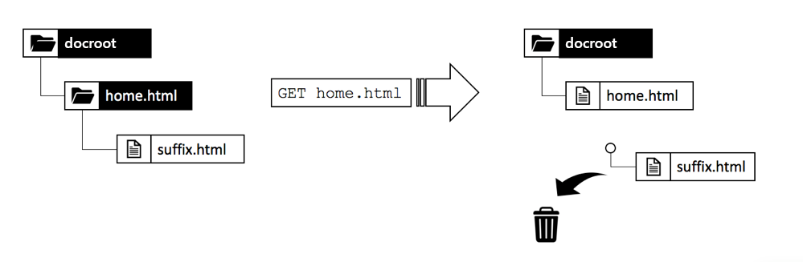

*親がリソースとしてフェッチされた場合のパス構造の削除*

<br> 

したがって、キャッシュされる結果はランダムで、受信する要求の順序に応じて異なります。 さらに難しいのは、通常は複数のディスパッチャーを持つという事実です。 また、パフォーマンス、キャッシュのヒット率および動作は、ディスパッチャーによって異なる場合があります。 Webサイトが応答しない理由を調べたい場合は、キャッシュの順序が不適切で、正しいディスパッチャーを調べていることを確認する必要があります。 運よくリクエストパターンが好まれたディスパッチャーを探していると、問題を見つけようとして迷うことになります。

#### 競合するURLの回避

サフィックスがある場合にリソースに別の拡張子を使用すると、「競合するURL」を避けることができます。つまり、ファイルシステム内の同じパスにフォルダ名とファイル名が「競合」します。

**例**

* `http://domain.com/home.html`

* `http://domain.com/home.dir/suffix.html`

どちらも完全にキャッシュ可能だ


サフィックスを要求する場合、またはサフィックスを完全に使用しない場合は、リソースの専用の拡張子「dir」を選択する。 有用なケースは稀です。 このようなケースを正しく導入するのは簡単です  次の章で説明するように、キャッシュの無効化とフラッシュについて説明します。

#### キャッシュできないリクエスト

最後の章の概要とその他の例外を簡単に確認します。 ディスパッチャーは、URLがキャッシュ可能として設定されている場合、およびGETリクエストである場合、URLをキャッシュできます。 次の例外のいずれかでキャッシュすることはできません。

**キャッシュ可能なリクエスト**

* リクエストは、ディスパッチャー設定でキャッシュ可能に設定されています
* リクエストはプレーンGETリクエストです

**キャッシュ不可のリクエストまたは応答**

* 構成によってキャッシュが拒否された要求（パス、パターン、MIMEタイプ）
* 「ディスパッチャー：no-cache」ヘッダ
* 「Cache-Control:no-cache|private&quot;ヘッダー
* 「Pragma:no-cache」ヘッダ
* クエリパラメーターを持つリクエスト
* 拡張子のないURL
* 拡張子のないサフィックスを持つURL
* 200以外のステータスコードを返す応答
* POST 要求

## キャッシュの無効化とフラッシュ

### 概要

最後のチャプターでは、ディスパッチャーがリクエストをキャッシュできない場合に、多数の例外がリストに記載されていました。 しかし、考慮すべき事項が他にもあります。ディスパッチャー&#x200B;_がリクエストを_&#x200B;キャッシュできるので、_が_&#x200B;を必要とするわけではありません。

ポイント：通常、キャッシュは容易です。 ディスパッチャーは、応答の結果を格納し、非常に同じ要求が受信された次回にそれを返すだけで済みます。 Right? 違う！

難しい部分は、キャッシュの&#x200B;_無効化_&#x200B;または&#x200B;_フラッシュ_&#x200B;です。 ディスパッチャーは、リソースが変更された場合に調べ、再度レンダリングする必要があります。

これは一見して些細なタスクのようだが…。でも違う。 さらに詳しく読むと、単一のリソースと単純なリソース、および複数のリソースの高度にメッシュされた構造に依存するページの間に、いくつかの難しい違いが見つかります。

### シンプルなリソースとフラッシュ

AEMシステムで、要求されたときに各画像のサムネールレンディションを動的に作成するための特別な「サムネール」セレクターが設定されています。

`/content/dam/path/to/image.thumb.png`

そして、もちろん、元の画像を提供するURLにセレクターを使用しないURLを提供します。

`/content/dam/path/to/image.png`

サムネールと元の画像の両方をダウンロードすると、次のような結果になります。

```
/var/cache/dispatcher/docroot/content/dam/path/to/image.thumb.png

/var/cache/dispatcher/docroot/content/dam/path/to/image.png
```

を使用します。

これで、そのファイルの新しいバージョンがアップロードされ、アクティブになります。 最終的に、無効化要求がAEMからディスパッチャーに送信され、

```
GET /invalidate
invalidate-path:  /content/dam/path/to/image

<no body>
```

無効化は簡単です。ディスパッチャー上の特別な「/invalidate」URLへの単純なGETリクエスト。 HTTP本文は不要で、「ペイロード」は単に「invalidate-path」ヘッダーに過ぎません。 また、ヘッダー内のinvalidate-pathは、AEMが認識するリソースであり、ディスパッチャーがキャッシュしたファイルではありません。 AEMはリソースのみを知っています。 リソースが要求されると、拡張子、セレクターおよびサフィックスが実行時に使用されます。 AEMは、リソースで使用されたセレクターに関するブックキーピングを実行しないので、リソースをアクティブ化する際に確実に認識できるのはリソースパスだけです。

これで十分です。 リソースが変更された場合、そのリソースのすべてのレンディションも変更されたと考えても問題ありません。 この例では、画像が変更された場合、新しいサムネールもレンダリングされます。

ディスパッチャーは、キャッシュされたすべてのレンディションを含むリソースを安全に削除できます。 それは次のようなことをします。

`$ rm /content/dam/path/to/image.*`

`image.png`と`image.thumb.png`を削除し、そのパターンに一致する他のすべてのレンディションを削除します。

非常に単純な事実…リクエストに応答するだけに1つのリソースを使う限り。

### 参照とメッシュした内容

#### メッシュコンテンツの問題

AEMにアップロードされた画像やバイナリファイルとは異なり、HTMLページは単独の動物ではありません。 フロックに住み、ハイパーリンクや参照によって相互に深く結びついています。 単純なリンクは無害ですが、コンテンツ参照について話すときには難しくなります。 ページ上のユビキタスなトップナビゲーションやテスターは、コンテンツ参照です。

#### コンテンツ参照とその問題の理由

簡単な例を見てみましょう 旅行会社にはカナダ旅行を宣伝するウェブページがある。 このプロモーションは、「ホーム」ページと「冬物スペシャル」ページの他の2ページの「ティーザー」セクションで取り上げられています。

両方のページが同じティーザーを表示するので、各ページに対して何度もティーザーを作成するように作成者に依頼する必要はありません。 代わりに、ターゲットページ「Canada」は、ページプロパティのセクションを予約してティーザーの情報を提供します。または、そのティーザー全体をレンダリングするURLを提供します。

`<sling:include resource="/content/home/destinations/canada" addSelectors="teaser" />`

または

`<sling:include resource="/content/home/destinations/canada/jcr:content/teaser" />`

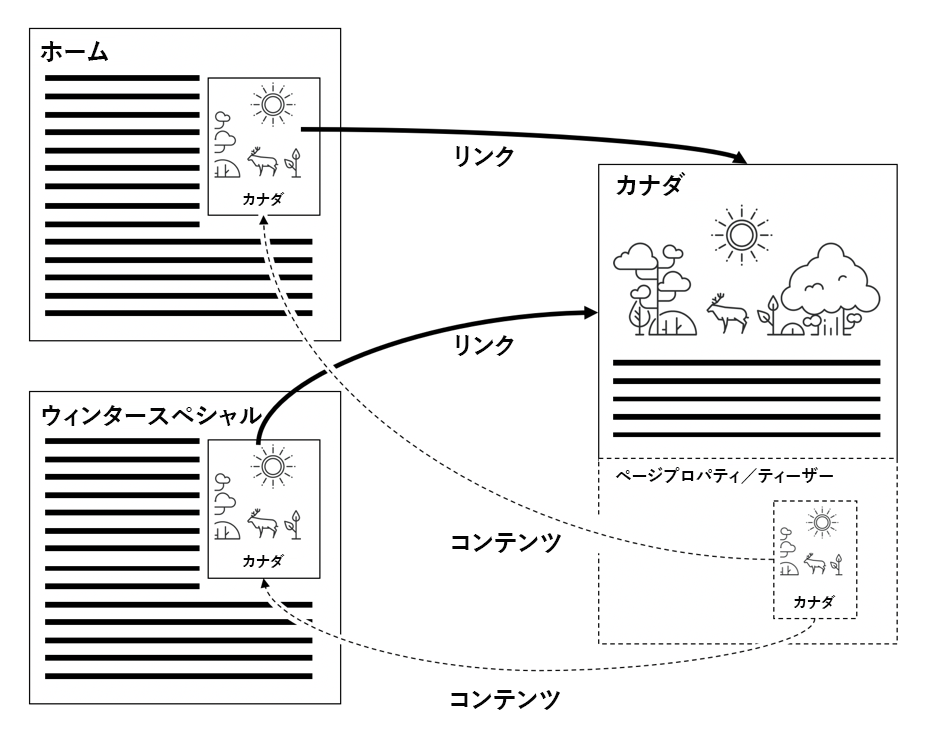

AEMでは、チャームと同じように機能するだけですが、発行インスタンスでディスパッチャーを使用すると、何か変なことが起きます。

ウェブサイトを公開したとします お客様のカナダのページのタイトルは「Canada」です。 訪問者がホームページを要求すると（ティーザー参照がそのページを含む）、「カナダ」ページのコンポーネントは

```
<div class="teaser">
  <h3>Canada</h3>
  
</div>
```

*ホームページ* に移動します。ホームページは、ディスパッチャーによって静的な.htmlファイルとして保存されます。このファイルには、ティーザーやヘッドラインが含まれます。

マーケティング担当者は、ティーザーの見出しに対して対策を講じるべきだと学びました。 そこで、タイトルを「カナダ」から「カナダを訪問」に変更し、画像も更新します。

彼は編集した「カナダ」のページを公開し、以前に公開したホームページを再度公開し、彼の変更を確認します。 でも、何も変わりません。 古いティーザーが表示されます。 彼の重複は「冬の特別」をチェックする。 そのページは以前にリクエストされたことがなく、そのためディスパッチャーに静的にキャッシュされません。 このページはPublishで新たにレンダリングされ、このページには新しい「Visit Canada」ティーザーが含まれています。

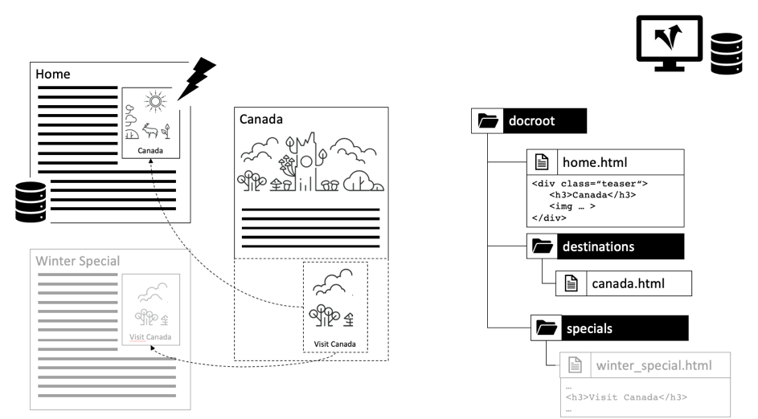

*ホームページに古い含まれるコンテンツを保存するディスパッチャー*

<br> 

何が起きた？ ディスパッチャーは、レンダリング中に他のリソースから描画されたすべてのコンテンツとマークアップを含むページの静的バージョンを保存します。

ディスパッチャーは、単なるファイルシステムベースのWebサーバーですが、高速でありながら比較的単純です。 含まれるリソースが変更された場合、それは認識されません。 インクルードするページがレンダリングされたときに、そのページに含まれていたコンテンツが引き続き表示されます。

「冬の特別」ページはまだレンダリングされていないので、ディスパッチャーに静的なバージョンがないので、新しいティーザーはリクエストに応じて新しくレンダリングされるので、表示されます。

ディスパッチャーは、このリソースが変更された場合、このリソースを使用したすべてのページをレンダリングしてフラッシュする際に、タッチしたすべてのリソースを追跡し続けると考えられます。 ただし、ディスパッチャーはページをレンダリングしません。 レンダリングは発行システムによって実行されます。 ディスパッチャーは、レンダリングされた.htmlファイルに含まれるリソースを知りません。

まだ納得してない？ *&quot;何らかの依存関係追跡を導入する方法が必要だ&quot;*&quot;と考えるかもしれません。 *は*&#x200B;でした。 コミュニケ3 AEMの曾曾曾曾祖父には、ページのレンダリングに使用された&#x200B;_session_&#x200B;に依存関係トラッカーが実装されていました。

要求中、このセッションを介して取得された各リソースは、現在レンダリング中のURLの依存関係として追跡されました。

しかし実は依存関係の追跡は非常に高価でした 依存関係の追跡機能を完全にオフにし、1つのhtmlページが変更された後にすべてのhtmlページを再レンダリングすることに依存していると、Webサイトの処理速度が速くなることがすぐにわかりました。 また、その計画も完璧ではなかった。途中で落とし穴や例外が多かった。 場合によっては、リクエストのデフォルトセッションを使用してリソースを取得するのではなく、管理セッションを使用してリクエストをレンダリングするヘルパーリソースを取得するのでした。 これらの依存関係は通常追跡されず、運用チームに対して手動でキャッシュをフラッシュするよう求める頭痛や電話の問い合わせが発生していました。 彼らがそれを行う標準的な手続きを持っていたら、あなたは幸運だった。 途中でもまだ気が引いてたけど…思い出すのやめよう。 2005年に遡ります 最終的には、この機能はコミュニケ4でデフォルトで非アクティブ化され、後続のCQ5に戻らず、AEMになりました。

### 自動無効化

#### フルフラッシュが依存関係追跡よりも低コストの場合

CQ5以降は、ページの1つしか変更されない場合、サイト全体を無効にすることに完全に依存しています。 この機能は「自動無効化」と呼ばれます。

でも、何百ものページを捨てて再レンダリングするのは、適切な依存関係の追跡や部分的な再レンダリングを行うよりも、安上がりです。

主な理由は次の2つです。

1. 平均的なWebサイトでは、ページのごく一部のみが頻繁にリクエストされます。 したがって、レンダリングされたコンテンツをすべて捨てた場合でも、実際にはその直後に要求されるのはわずか数十件です。 ページの長い末尾のレンダリングは、実際に要求された場合に、時間の経過と共に配布できます。 したがって、実際には、レンダリングページの負荷は予想ほど高くありません。 もちろん、例外は常に存在します。後で、空のディスパッチャーキャッシュを持つ大規模なWebサイトで均等に分散された読み込みを処理する方法に関するテクニックを説明します。

2. すべてのページは、メインナビゲーションによって接続されます。 最終的には、ほとんどのページが互いに依存し合っています。 つまり、最も賢い依存関係のトラッカーでさえ、既に知っていることを見つけ出すことができます。ページの1つが変更された場合は、他のすべてのページを無効にする必要があります。

信じないの？ 最後の点を説明しよう。

最後の例と同じ引数を使用して、テーザーがリモートページのコンテンツを参照しています。 今のところ、もっと極端な例を使っています。自動的にレンダリングされたメインナビゲーション。 Teaserと同様に、ナビゲーションタイトルはリンクされたページまたは「リモート」ページからコンテンツ参照として描画されます。 リモートナビゲーションのタイトルは、現在レンダリングされているページには保存されません。 ナビゲーションは、Webサイトの各ページおよびすべてのページでレンダリングされることに注意してください。 したがって、メインナビゲーションを持つすべてのページで、1つのページのタイトルが何度も繰り返し使用されます。 また、ナビゲーションタイトルを変更する場合は、ページを参照する各ページやすべてのページではなく、リモートページで1回だけ変更する必要があります。

この例では、ナビゲーションはターゲットページの「NavTitle」を使用してすべてのページをメッシュし、ナビゲーションに名前をレンダリングします。 「Iceland」のナビゲーションタイトルは「Iceland」ページから引かれ、メインナビゲーションを持つ各ページと各ページにレンダリングされます。

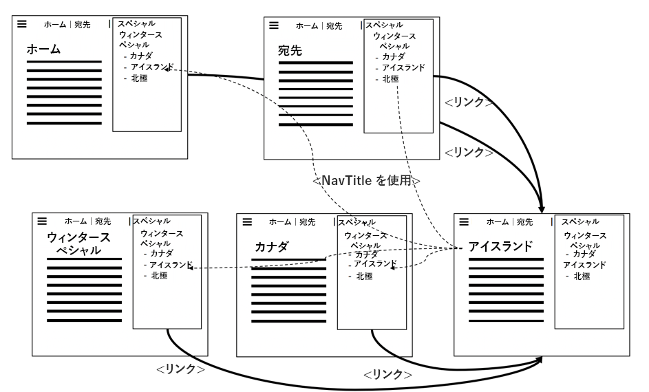

*必然的に、「NavTitles」を引っ張ることで、すべてのページの内容をメッシュ化するメインナビゲーション*

<br> 

IcelandページのNavTitleを「Iceland」から「Beautiful Iceland」に変更すると、他のすべてのページのメインメニューでそのタイトルがすぐに変更されます。 したがって、変更前にレンダリングおよびキャッシュされたページはすべて古くなり、無効にする必要があります。

#### 自動無効化の実装方法：.statファイル

何千ものページを持つ大規模なサイトがある場合は、すべてのページをループして物理的に削除するのにかなり時間がかかります。 その間、ディスパッチャーは意図せず古いコンテンツを提供する可能性がありました。 さらに悪いことに、キャッシュファイルへのアクセス中に競合が発生する場合があります。削除中のページがリクエストされたり、直後のアクティベーション後に2回目の無効化が発生したためにページが再び削除されたりします。 何が混乱するか考えてみなさい。 幸いにもこれは起こりません ディスパッチャーは、次のような巧妙な手法を使用してこれを回避します。何百ものファイルを削除する代わりに、ファイルが公開されると、ファイルシステムのルートにシンプルで空のファイルが置かれるので、依存ファイルはすべて無効と見なされます。 このファイルは「statfile」と呼ばれます。 statfileは空のファイルです。statfileに関する重要なのは作成日だけです。

ディスパッチャー内の、statfileより古い作成日を持つすべてのファイルは、最後のアクティベーション（および無効化）の前にレンダリングされたので、「無効」と見なされます。 これらはファイルシステムに物理的に存在しますが、ディスパッチャは無視します。 それらは「古い」ものです。 古いリソースに対するリクエストが行われるたびに、ディスパッチャーはAEMシステムにページの再レンダリングを要求します。 新しくレンダリングされたページは、新しい作成日が設定された新しいファイルシステムに保存され、再び新しくなります。

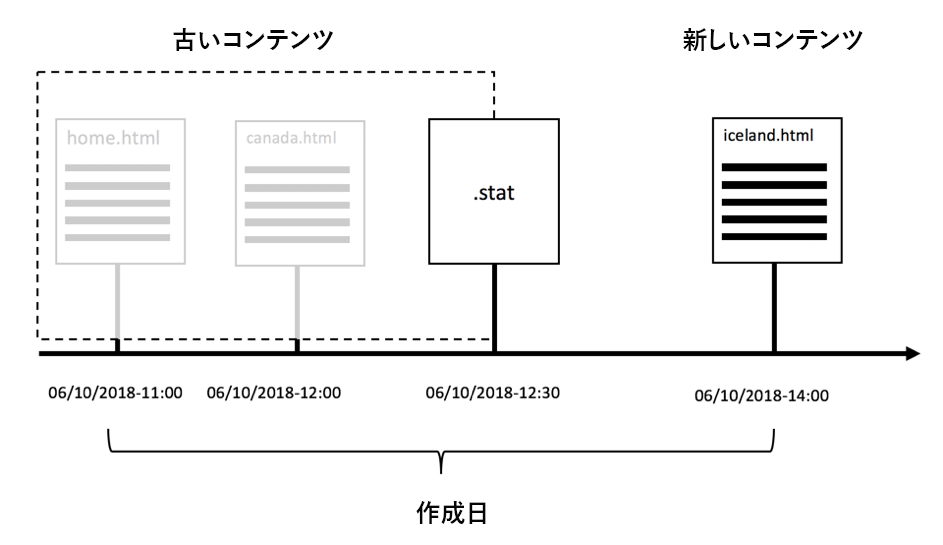

*.statファイルの作成日により、古いコンテンツと新しいコンテンツが定義されます*

<br> 

なぜ「.stat」と呼ばれるのか尋ねてもいいでしょうか？ 「.invalidated」とは限りません。 想像してみて下さい。このファイルをファイルシステムに置くと、Dispatcherは、静的なWebサーバと同じように、*静的に*&#x200B;提供できるリソースを判断できます。 これらのファイルをダイナミックにレンダリングする必要はありません。

しかし、名前の本性は比喩的ではありません。 これはUnixシステムコール`stat()`から派生し、ファイルの変更時刻（他のプロパティの中でも）を返します。

#### 単純な検証と自動検証の混合

でも待て…先ほど言ったように、たった一つの資源が物理的に削除される。 さて、より新しいstatfileを使うと、実際にはディスパッチャーの目では無効になります。 なぜ最初に物理的な削除を？

答えは単純だ。 通常、両方の方法を並行して使用しますが、リソースの種類は異なります。 画像などのバイナリアセットは独立しています。 他のリソースとは、情報をレンダリングする必要があるという意味では関係がありません。

一方、HTMLページは非常に相互依存的です。 そのため、それらに対して自動無効化を適用します。 これは、ディスパッチャーのデフォルト設定です。 無効化されたリソースに属するすべてのファイルは、物理的に削除されます。 また、「.html」で終わるファイルは自動的に無効になります。

ディスパッチャーは、ファイル拡張子（自動無効化スキームを適用するかどうか）を決定します。

自動無効化のファイルエンディングは設定可能です。 理論的には、自動無効化のためのすべての拡張を含めることができます。 しかし、これは非常に高い価格になることを忘れないでください。 古いリソースが意図せずに配信されることはありませんが、配信のパフォーマンスは過剰な無効化によって大きく低下します。

例えば、PNGやJPGが動的にレンダリングされ、その他のリソースに依存するスキームを実装するとします。 高解像度の画像をWeb互換の小さい解像度に再び拡大・縮小する必要がある場合があります。 圧縮率も変更します。 この例の解像度と圧縮率は固定定数ではありませんが、画像を使用するコンポーネント内の設定可能なパラメーターです。 このパラメーターを変更した場合は、画像を無効にする必要があります。

問題なし — 今学んだのは、自動無効化に画像を追加でき、何か変更があったときには常に新しいレンダリング画像を持つことです。

#### お湯で赤ちゃんを投げ出す

その通りです。これは大きな問題です。 最後の段落をもう一度読み上げます。 「。..何かが変更されるたびにレンダリングしたばかりのイメージ」 ご存じの通り、良いウェブサイトは絶えず変わっています。新しいコンテンツを追加して、そこでタイプミスを修正し、ティーザーを別の場所で微調整します。 つまり、すべての画像は常に無効化され、再レンダリングする必要があります。 それを甘く見るな。 ローカル開発マシン上での画像データの動的なレンダリングと転送はミリ秒で行われます。 本番環境は、1秒あたり100倍の頻度でそれを行う必要があります。

HTMLページが変更された場合、またはHTMLページが変更された場合はJPGを再レンダリングする必要があります。 自動無効化するファイルの「グループ」は1つだけです。 全体としてフラッシュされる。 細かい構造に分ける手段もない

自動無効化がデフォルトで「.html」に保持されるのは、十分な理由があります。 目標は、そのバケツをできるだけ小さく保つことです。 赤ん坊を湯水と一緒に捨てるな。何もかも無効にして、安全な側にいるだけ。

自己完結型のリソースは、そのリソースのパスで提供する必要があります。 それは大いに無効にするのに役立つ。 &quot;resource /a/b/c&quot;は&quot;/x/y/z&quot;から供給されるので、簡単にして、&quot;resource /a/b/c&quot;のようなマッピング方式は作らないでください。 コンポーネントをデフォルトのディスパッチャーの自動無効化設定で使用できるようにします。 ディスパッチャーでのオーバー無効化を使用して、設計が不適切なコンポーネントの修復を試みないでください。

##### 自動無効化の例外：ResourceOnlyの無効化

ディスパッチャーの無効化要求は、通常、複製エージェントによって発行システムから実行されます。

依存関係に対する自信が強い場合は、無効にするレプリケーションエージェントを独自に構築できます。

このガイドで詳しく説明するのは少し難しいでしょうが、少なくともいくつかのヒントをお伝えします。

1. 自分が何をしているか本当に分かっている。 無効権を取るのは大変だ。 これが自動無効化が非常に厳密な理由の一つだ。古いコンテンツを配信しないようにする。

2. エージェントがHTTPヘッダー`CQ-Action-Scope: ResourceOnly`を送信した場合、つまり、この1つの無効化リクエストは自動無効化をトリガーしません。 このコード([https://github.com/cqsupport/webinar-dispatchercache/tree/master/src/refetching-flush-agent/refetch-bundle](https://github.com/cqsupport/webinar-dispatchercache/tree/master/src/refetching-flush-agent/refetch-bundle))の部分は、独自のレプリケーションエージェントを使用する場合に適した開始点となる場合があります。

3. `ResourceOnly`に設定すると、自動無効化を防ぐだけです。必要な依存関係の解決と無効化を実際に行うには、無効化要求を自分でトリガーする必要があります。 パッケージのディスパッチャーフラッシュルール([https://adobe-consulting-services.github.io/acs-aem-commons/features/dispatcher-flush-rules/index.html](https://adobe-consulting-services.github.io/acs-aem-commons/features/dispatcher-flush-rules/index.html))を調べて、実際にどのように実行されるかを調べることができます。

依存関係解決スキームを構築することはお勧めしません。 労力が多すぎて利益が少なすぎて、前にも言ったように、誤りが多すぎる。

その代わりに、他のリソースとの依存関係がなく、自動無効化を行わずに無効にできるリソースを調べることが必要です。 ただし、その場合は、カスタム・レプリケーション・エージェントを使用する必要はありません。 これらのリソースを自動無効化から除外するカスタムルールをディスパッチャー設定内に作成します。

主なナビゲーションやテザーは依存関係の源だと言いました そう — ナビゲーションとテーザーを非同期で読み込んだり、SSIスクリプトと共にApacheに含めたりした場合、追跡する依存関係はありません。 「Sling Dynamic Includes」について説明する際に、このドキュメントで後述する、コンポーネントの非同期読み込みについて詳しく説明します。

ポップアップウィンドウや、ライトボックスに読み込まれるコンテンツにも同様です。 これらの要素にはナビゲーション（「依存関係」）が存在することはほとんどなく、単一のリソースとして無効にすることができます。

## ディスパッチャーを考慮したコンポーネントの構築

### 実世界の例でのディスパッチャーの仕組みの適用

前の章では、ディスパッチャーの基本的な仕組み、一般的な仕組み、および制限事項について説明しました。

次に、これらのメカニズムをプロジェクトの要件にある種類のコンポーネントに適用します。 コンポーネントを意図的に選択し、遅かれ早かれ直面する問題を示します。 懸念はありません。すべてのコンポーネントが、我々が提示する十分な考慮を必要としているわけではありません。 しかし、そのようなコンポーネントを構築する必要がある場合は、結果についてよく知っており、その対処方法を知っています。

### スプールコンポーネント（アンチ）パターン

#### レスポンシブ画像コンポーネント

相互に接続されたバイナリを持つコンポーネントの共通のパターン（またはアンチパターン）を示します。 「レスポンシブ画像」用のコンポーネント「respi」を作成します。 このコンポーネントは、表示された画像を表示されているデバイスに合わせることができます。 デスクトップやタブレットでは、画像の最大解像度、スマートフォンでは狭い切り抜きを含む小さいバージョン、または完全に異なるモチーフ（レスポンシブな世界では「アートの方向」と呼ばれます）を表示します。

アセットはAEMのDAM領域にアップロードされ、レスポンシブ画像コンポーネント内で&#x200B;_参照_&#x200B;のみが行われます。

各コンポーネントは、マークアップのレンダリングとバイナリ画像データの配信の両方を担当します。

ここでの実装方法は、多くのプロジェクトで見た共通のパターンで、AEMのコアコンポーネントの1つでさえ、そのパターンに基づいています。 したがって、開発者としてそのパターンを適応させる可能性が非常に高いと思います。 カプセル化に関しては優れた点がありますが、ディスパッチャー対応にするには多くの労力が必要です。 後で、問題を軽減する方法についていくつかのオプションを説明します。

ここで使うパターンを「スプーラパターン」と呼びますCommunique 3の初期の頃にはリソース上で呼び出してバイナリの生データを応答に送り込む方法「スプール」があったからです

元々の「スプール」という用語は、実際には、プリンタなどの低速なオフライン周辺機器の共有を指すので、ここでは正しく適用されません。 でも私たちはこの言葉が好きですなぜならオンラインの世界ではこの言葉が目に見えるほどには見えないからです それぞれのパターンは区別できる名前を持つべきです これがパターンか反パターンかを決めるのは君次第だ。

#### 実装

レスポンシブ画像コンポーネントの実装方法を次に示します。

部品は二つの部分を持つ。最初の部分は画像のHTMLマークアップをレンダリングし、2番目の部分は参照画像のバイナリデータを「スプール」します。 これはレスポンシブデザインを備えた最新のWebサイトなので、単純な``タグではなく、`<picture/>`タグ内の一連の画像をレンダリングしています。 デバイスごとに、2つの異なる画像をDAMにアップロードし、画像コンポーネントから参照します。

コンポーネントには3つのレンダリングスクリプト（JSP、HTL、またはサーブレットに実装）があり、それぞれ専用のセレクターで指定されます。

1. `/respi.jsp` - HTMLマークアップをレンダリングするセレクターなし
2. `/respi.img.java` デスクトップバージョンをレンダリングするには
3. `/respi.img.mobile.java` を使用して、モバイルバージョンをレンダリングします。


コンポーネントは、ホームページのパーシスに配置されます。 CRXの構造を次に示します。

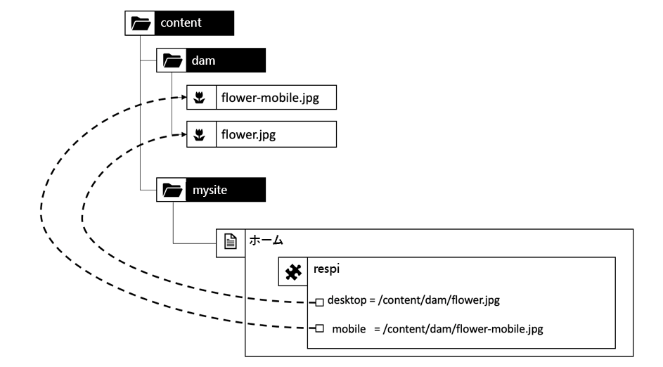

*CRX内のレスポンシブ画像のリソース構造*

<br> 

コンポーネントマークアップは次のようにレンダリングされます。

```plain
  #GET /content/home.html

  <html>

  …

  <div class="responsive-image>

  <picture>
    <source src="/content/home/jcr:content/par/respi.img.mobile.jpg" …/>
    <source src="/content/home/jcr:content/par/respi.img.jpg …/>

    …

  </picture>
  </div>
  …
```

そして…うまくカプセル化された部品で終わった

#### レスポンシブ画像コンポーネントの動作中

これで、ユーザーは、ページと、ディスパッチャーを介してアセットをリクエストします。 これにより、次に示すように、Dispatcherファイルシステムにファイルが格納されます。

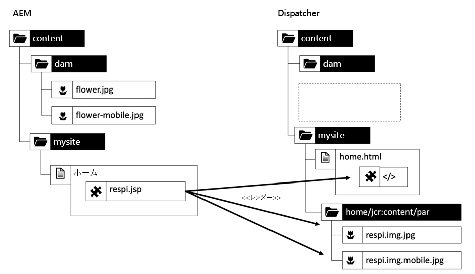

*カプセル化されたレスポンシブ画像コンポーネントのキャッシュ構造*

<br> 

ユーザーがDAMに2つの花の画像の新しいバージョンをアップロードしてアクティブにするとします。 AEMは無効要求に従って送信する

`/content/dam/flower.jpg`

および

`/content/dam/flower-mobile.jpg`

をディスパッチャーに送信します。 しかし、こうした要求は無駄だ。 コンテンツは、コンポーネントのサブ構造の下のファイルとしてキャッシュされています。 これらのファイルは古くなりましたが、要求時に提供されます。

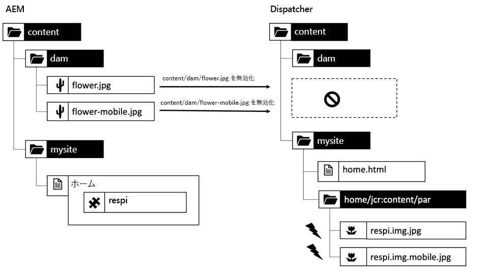

*構造の不一致により古いコンテンツが生じる*

<br> 

このアプローチには別の注意点があります。 複数のページで同じflower.jpgを使用するとします。 その後、同じアセットを複数のURLまたはファイルの下にキャッシュします。

```
/content/home/products/jcr:content/par/respi.img.jpg

/content/home/offers/jcr:content/par/respi.img.jpg

/content/home/specials/jcr:content/par/respi.img.jpg

…
```

新しいキャッシュされていないページが要求されるたびに、AEMから異なるURLでアセットが取得されます。 ディスパッチャーのキャッシュがなく、ブラウザーのキャッシュがない場合、配信を高速化できます。

#### スプーラのパターンが輝く場所

一つの自然な例外があり、その単純な形でもこのパターンが役に立つ。バイナリがコンポーネント自体に格納され、DAMには格納されない場合。 ただし、これはWebサイトで1回だけ使用される画像で役立ち、DAMにアセットを保存しないと、アセットの管理に苦労することになります。 特定のアセットの使用ライセンスが切れたとします。 アセットを使用したコンポーネントはどれか。

見た？ DAMの「M」は、Digital Asset Managementと同様、「Management」の略です。 その機能は捨てたくない。

#### まとめ

AEMの開発者の視点から見ると、この模様はとてもエレガントに見えた。 しかし、ディスパッチャーが式に取り入れられれば、単純なアプローチでは不十分だということに、お気づきかもしれません。

今のところ、これがパターンか反パターンかを決めるのは君に任せる。 上で説明した問題を緩和する方法について、既に良いアイデアを心に留めておいているかもしれません。 良かった。 そうすれば、他のプロジェクトがこの問題をどのように解決したかを知りたがるだろう。

### 一般的なディスパッチャーの問題の解決

#### 概要

これがキャッシュに優しく実装された方法についてお話しします。 いくつかのオプションがあります。 最適な解決策を選べない場合もあります。 既に実行中のプロジェクトに入り込んで、「キャッシュの問題」を直すだけの予算が限られていて、本格的なリファクタリングを行うには十分ではない。 または、例の画像コンポーネントよりも複雑な問題が発生します。

以下の節で、原則と注意事項について説明します。

繰り返しますが、これは実際の経験に基づいています。 野生では既に様々なパターンを見ているので学術的な運動ではありません だから反パターンを見せるので他の人が犯した間違いから学ぶ機会があります

#### キャッシュキラー

>[!WARNING]
>
>これは反パターンです。 使用しないでください。 今まで。

`?ck=398547283745`のようなクエリパラメータを見たことがありますか？ これらは「キャッシュキラー(&quot;ck&quot;)」と呼ばれます。 クエリパラメーターを追加した場合、リソースはキャッシュされません。 また、乱数をパラメータの値として追加すると（「398547283745」など）、URLは一意になり、AEMシステムと画面の間の他のキャッシュでもキャッシュできなくなります。 通常、間にある容疑者は、ディスパッチャーの前にある「ワニス」のキャッシュ、CDN、ブラウザーのキャッシュです。 再度：そんな事するな。 リソースをできるだけ長くキャッシュする必要があります。 キャッシュはお客様の友人です。 友達を殺すな。

#### 自動無効化

>[!WARNING]
>
>これは反パターンです。 デジタルアセットには使用しないでください。 ディスパッチャーのデフォルト設定を維持するようにしてください。「.html」ファイルの場合は自動無効化が行われ、デフォルト設定は維持されます。

短期的に、「.jpg」と「.png」をディスパッチャーの自動無効化設定に追加できます。 つまり、無効化が発生した場合は常に、すべての「.jpg」、「.png」および「.html」を再レンダリングする必要があります。

このパターンは、実際のサイトで変化が十分速く実現しないとビジネスオーナーが不満を言った場合に、非常に簡単に実装できます。 しかし、これは、より洗練されたソリューションを考え出すために、少し時間を稼ぐだけです。

大きなパフォーマンスの影響を把握してください。 これにより、Webサイトの速度が大幅に低下し、ニュースポータルなど頻繁に変更を行う負荷の高いWebサイトの場合は、安定性に影響する可能性があります。

#### URLフィンガープリント

URLの指紋はキャッシュキラーのようです。 でも違う。 乱数ではなく、リソースの内容を特徴付ける値です。 これは、リソースのコンテンツのハッシュ、またはより単純な方法で、リソースがアップロード、編集または更新されたときのタイムスタンプにすることができます。

Unixタイムスタンプは、実際の実装には十分に適しています。 読みやすさを高めるために、このチュートリアルでは、より読みやすい形式を使用しています。`2018 31.12 23:59 or fp-2018-31-12-23-59`.

指紋をクエリパラメータと共にURLとしてクエリパラメータとして使用してはなりません   をキャッシュできません。 指紋にはセレクターまたはサフィックスを使用できます。

ファイル`/content/dam/flower.jpg`の`jcr:lastModified`日付が2018年12月31日23:59だとします。 指紋付きのURLは`/content/home/jcr:content/par/respi.fp-2018-31-12-23-59.jpg`です。

このURLは、参照されるリソース(`flower.jpg`)ファイルが変更されない限り、安定した状態に保たれます。 したがって、キャッシュは無限にキャッシュされ、キャッシュキラーではありません。

注意：このURLは、レスポンシブ画像コンポーネントで作成および提供する必要があります。 標準搭載のAEM機能ではありません。

これが基本的な考え方です しかし、見落としがちな細かい点がいくつかある。

この例では、コンポーネントが23:59にレンダリングされ、キャッシュされています。 画像が変更されたので、例えば0時になります。  コンポーネント&#x200B;_は、マークアップ内に新しいフィンガープリントURLを生成します。_

_は_...と思うかもしれませんが、そうではありません。画像のバイナリだけが変更され、ページを含めるページに手を加えなかったので、HTMLマークアップの再レンダリングは必要ありません。 したがって、ディスパッチャーはページに古い指紋を提供し、その結果イメージの古いバージョンを提供します。


*画像コンポーネントが参照画像より新しく、新しい指紋がレンダリングされません。*

<br> 

現在は、ホームページ（またはそのサイトの他のページ）を再アクティブ化すると、statfileが更新される場合、ディスパッチャーはhome.htmlの古いものと見なし、画像コンポーネント内の新しい指紋で再レンダリングします。

でもホームページは発動しなかったのね？ なぜ触れなかったページを発動する必要があるのでしょう？ その上、ページをアクティブにする権限がないか、承認ワークフローに時間がかかるので、急な通知では実行できません。 では、どうすればいいのでしょうか。

#### 遅延管理ツール — Statfileレベルの低下

>[!WARNING]
>
>これは反パターンです。 短期間でのみ使用して、時間を購入し、より洗練されたソリューションを考え出します。

遅延管理者は通常、「_自動無効化をjpgsに設定し、statfileレベルを0に設定します。これは、常にすべての種類の_&#x200B;のキャッシュの問題に役立ちます。」 そのアドバイスはテクニカルフォーラムで見つかり、無効化問題の解決に役立ちます。

今までのところ、statfileレベルについては話し合っていない。 基本的に、自動無効化は同じサブツリー内のファイルに対してのみ機能します。 ただし、ページとアセットは通常、同じサブツリーに存在しないという問題があります。 ページは`/content/mysite`の下の位置にあり、アセットは`/content/dam`の下の位置にあります。

「statfile level」は、サブツリーの深さルートノードの位置を定義します。 上の例では、レベルは「2」です(1=/content、2=/mysite,dam)

静的なファイルレベルを0に「減少」させる考え方は、基本的に/contentツリー全体を1つのサブツリーとして定義し、ページとアセットを同じ自動無効化ドメイン内に存在させることです。 したがって、レベルの大きいツリー(docroot &quot;/&quot;)にしか存在しない。 ただし、これにより、完全に無関係なサイトでも、何かが公開されるたびに、サーバー上のすべてのサイトが自動的に無効になります。 お客様：これは長期的には良い考え方ではありません。キャッシュの全体的なヒット率が大幅に低下するからです。 キャッシュなしで実行できるだけの十分な火力をAEMサーバに持っていることを望むだけです。

詳細なスタットファイルレベルの利点は、後で理解できます。

#### カスタム無効化エージェントの実装

とにかく — 「.jpg」または「.png」が変更され、新しいURLで再レンダリングできるようになった場合に、HTMLページを無効にするには、ディスパッチャーに何らかの方法で指示する必要があります。

プロジェクトで見たのは、例えば、パブリッシュシステム上の特殊な複製エージェントで、そのサイトの画像が公開されるたびにサイトの無効化要求を送信します。

命名規則を使用してアセットのパスからサイトのパスを引き出せる場合、これは非常に役立ちます。

一般的に、サイトとアセットのパスは次のように一致させることをお勧めします。

**例**

```
/content/dam/site-a
/content/dam/site-b

/content/site-a
/content/site-b
```

これにより、カスタムディスパッチャーフラッシュエージェントは、`/content/dam/site-a`で変更が発生した場合に、/content/site-aに対して簡単にリクエストおよび無効化を送信できます。

実際には、同じサイト内の同じ「サブツリー」内にある限り、無効にするようディスパッチャーに指示するパスは関係ありません。 実際のリソースパスを使う必要さえありません。 「仮想」にすることもできます。

`GET /dispatcher-invalidate
Invalidate-path /content/mysite/dummy`

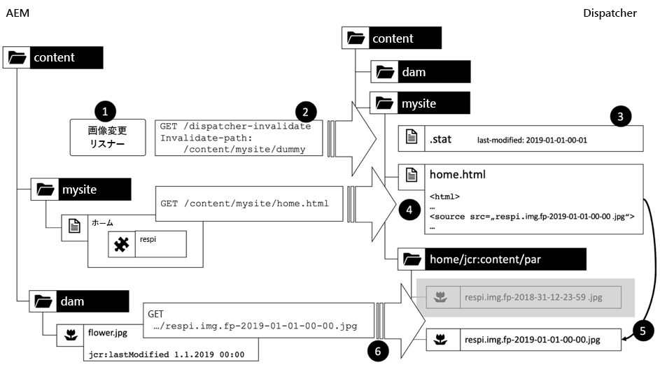

1. DAM内のファイルが変更された場合に、発行システム上のリスナーがトリガーされます

2. リスナーは、無効化要求をディスパッチャーに送信します。 自動無効化のため、サイトのホームページの下にない限り、自動無効化でどのパスを送ってもかまいません。サイトのステータファイルレベルのより正確なパスです。

3. statfileが更新されます。

4. 次回は、ホームページが要求された場合は、再レンダリングされます。 新しい指紋/日付は、画像のlastModifiedプロパティから追加のセレクターとして取得されます

5. これは暗黙的に新しいイメージへの参照を作成します

6. イメージが実際に要求された場合、新しいレンディションが作成され、ディスパッチャーに保存されます


#### 掃除の必要性

ふーん。 完了. ハーレイ！

まあ…まだ。

道は

`/content/mysite/home/jcr:content/par/respi.img.fp-2018-31-12-23-59.jpg`

は、無効化されたリソースのどれにも関連しません。 一時保存? 「ダミー」リソースを無効にしただけで、「ホーム」が無効であると考えるための自動無効化に依存していました。 画像自体が&#x200B;_物理的に_&#x200B;削除されることはありません。 このため、キャッシュは増大し、拡大します。 イメージを変更してアクティブ化すると、ディスパッチャーのファイルシステムに新しいファイル名が付けられます。

キャッシュされたファイルを物理的に削除せず、無期限に残すには、次の3つの問題があります。

1. ストレージ容量を無駄にしています。 当たり前 — 過去数年でストレージが安くなり安くなりました。 しかし、画像の解像度やファイルサイズも過去に増えてきました。Retinaのようなディスプレイが登場し、クリスタルシャープな画像を求めています。

2. ハードドライブが安くなっても、「ストレージ」は安くならないかもしれない。 （安価な）ベアメタルHDDストレージを持たず、データセンタープロバイダがNASに仮想ストレージをレンタルする傾向が見られました。 この種のストレージは、より信頼性が高く、拡張性も高いが、もう少しコストが高い。 古くなったゴミを貯めて無駄にしたくないかもしれない。 これは、プライマリ・ストレージに関するだけでなく、バックアップについても考えてください。 そのまま使用できるバックアップソリューションがある場合は、cache-directoriesを除外できない可能性があります。 最終的には、ごみ箱データもバックアップします。

3. さらに悪いことに：必要な限り、特定の画像の使用ライセンスを一定の期間のみ購入した可能性があります。 ライセンスの有効期限が切れた後もまだ画像を保存している場合は、著作権侵害と見なされる可能性があります。 Webページで画像を使用しなくても、Googleによって見つかります。

最後に、古いファイルをすべて消去するための家事のcronjobを考え出します。このような散らかり散らかりを管理するための週を例にとってみましょう。

#### サービス拒否攻撃のためのURL指紋の濫用

でも待って、この解決策にもう一つ欠点がある。

セレクターをパラメーターとして悪用しています。fp-2018-31-12-23-59は、何らかの「キャッシュキラー」として動的に生成される。 しかし、ページをリクエストする退屈なkid（または、狂った検索エンジンクローラー）開始がいくつかいたかもしれません。

```
/content/mysite/home/jcr:content/par/img.fp-0000-00-00-00-00.jpg
/content/mysite/home/jcr:content/par/img.fp-0000-00-00-00-01.jpg
/content/mysite/home/jcr:content/par/img.fp-0000-00-00-00-02.jpg

…
```

各リクエストはディスパッチャーをバイパスし、発行インスタンスに対して読み込みを引き起こします。 さらに悪いことに、ディスパッチャーに従ったファイルを作成できます。

つまり、指紋を単純なキャッシュキラーとして使う代わりに、画像のjcr:lastModified日付を調べ、期待日以外の場合は404を返す必要があります。 パブリッシュシステムでは、この処理に時間がかかり、CPUサイクルが発生するのを防ぐ必要があります。

#### 高頻度リリースでのURL指紋の注意事項

フィンガープリントスキーマは、DAMからのアセットだけでなく、JSファイルとCSSファイル、および関連リソースにも使用できます。

[バージョン管理された](https://adobe-consulting-services.github.io/acs-aem-commons/features/versioned-clientlibs/index.html) クライアントライブラリは、この方法を使用するモジュールです。

しかしここでは、URLの指紋を持つ別の注意事項に直面することができます。URLをコンテンツに結び付けます。 URLを変更しないと（変更日を更新するなど）、コンテンツを変更できません。 それが第一に指紋のデザインです。 ただし、新しいCSSとJSファイルを使用し、新しい指紋を持つ新しいURLをリリースするとします。 すべてのHTMLページには、従来の指紋付きURLへの参照が引き続き含まれます。 したがって、新しいリリースを一貫して動作させるには、すべてのHTMLページを一度に無効にして、新しく指紋したファイルを参照して再レンダリングを強制する必要があります。 同じライブラリに依存する複数のサイトがある場合は、相当量の再レンダリングが行われる可能性があります。`statfiles`を利用することはできません。 ロールアウト後にパブリッシュシステムのロードピークを確認する準備をしてください。 青緑色のデプロイメントでは、キャッシュウォーミングを使用します。または、ディスパッチャーの前にあるTTLベースのキャッシュを使用します。可能性は無限です。

#### 短い休憩

わあ…とても細かいところが多いですね。 そして、容易に理解され、試験され、デバッグされるのを拒む。 一見エレガントな解決策のために もちろん、エレガントな点はAEMのみの点です。 ディスパッチャーと一緒にすると、不快になります。

それでも、1つの基本的な注意事項は解決されません。1つの画像を異なるページで複数回使用する場合、それらのページの下にキャッシュされます。 キャッシュのシナジーはあまりありません。

一般的に、URLフィンガープリントはツールキットに適したツールですが、既存のツールをいくつか解決するだけで新しい問題を引き起こす可能性があるので、注意深く適用する必要があります。

だから…それは長い章だった。 しかしこのパターンを何度も目にしたので全ての長所と短所を全体的に示す必要があると感じました URL指紋はスプーラーパターンに固有の問題のいくつかを解決しますが、実装の努力は非常に高く、他のより簡単なソリューションも考慮する必要があります。 アドビのアドバイスは、提供されたリソースパスに基づいてURLを設定でき、中間コンポーネントがないかどうかを常に確認することです。 次の章でこの点に触れる。

##### 実行時の依存関係の解決

ランタイム依存関係の解決は、1つのプロジェクトで検討してきた概念です。 しかし、その中で考えることは非常に複雑になり、私たちはそれを実行しないことにしました。

基本的な考え方を次に示します。

ディスパッチャーは、リソースの依存関係を認識しません。 意味がほとんどない単一ファイルの束です

AEMは依存関係もほとんど知りません。 適切なセマンティックまたは「依存関係の追跡」が欠けています。

AEMでは、いくつかの参照が認識されています。 この知識を使用して、参照先のページやアセットを削除または移動しようとするときに警告を受け取ります。 これは、アセットの削除時に内部検索をクエリすることで行います。 コンテンツ参照は非常に特殊な形式を持っています。 これらは、「/content」で始まるパス式ーです。 したがって、必要に応じて、フルテキストのインデックスを作成し、クエリを行うことが簡単にできます。

この場合、パブリッシュシステムにカスタマイズされた複製エージェントが必要です。このエージェントは、パスが変更されたときに特定のパスを検索するトリガーを持ちます。

例えば

`/content/dam/flower.jpg`

は、「公開」で変更されました。 エージェントは「/content/dam/flower.jpg」を検索し、それらの画像を参照するすべてのページを探します。

その後、多数の無効化要求をディスパッチャーに発行できます。 アセットを含む各ページに1つ。

理論的には、それはうまくいくはずです。 ただし、第1レベルの依存関係に対してのみ使用できます。 例えば、ページで使用されるエクスペリエンスフラグメントに画像を使用する場合など、複数レベルの依存関係にそのスキームを適用したくないとします。 実際、このアプローチは複雑すぎると考えています。また、実行時の問題も発生する可能性があります。 そして一般的に最善のアドバイスは、イベントハンドラで高価なコンピューティングを行わないことです。 特に検索は高くなる。

##### まとめ

スプーラーパターンについて十分に検討を重ね、導入時に使用するのではなく、使用するタイミングを決めるのに役立ててください。

## ディスパッチャーの問題の回避

### リソースベースのURL

依存関係の問題を解決するもっとエレガントな方法は、依存関係を全く持たないことです。 あるリソースを使用して別のリソースをプロキシする場合に発生する人工的な依存関係を避けます。前の例のように行います。 できるだけ頻繁に「孤立した」エンティティを見るようにしてください。

この例は簡単に解決できます。


*コンポーネントではなく、イメージにバインドされたサーブレットでイメージをスプールする。*

<br> 

アセットの元のリソースパスを使用して、データをレンダリングします。 元の画像をそのままレンダリングする必要がある場合は、アセットに対してAEMの初期設定のレンダラを使用するだけです。

特定のコンポーネントに対して特別な処理を行う必要がある場合は、そのパスとセレクターに専用のサーブレットを登録し、コンポーネントの代わりに変換を行います。 我々はここで「.respi」を例に挙げ selector. グローバルURLスペースで使用されるセレクター名（`/content/dam`など）を追跡し、名前の競合を回避するための適切な命名規則を持つことをお勧めします。

ところで、コードの一貫性に関する問題は何も見られません。 サーブレットは、コンポーネントスリングモデルと同じJavaパッケージで定義できます。

グローバル空間では、次のような追加のセレクターを使用することもできます。

`/content/dam/flower.respi.thumbnail.jpg`

簡単だろ？ ではなぜスプーラーのような複雑なパターンを思いつくのでしょう？

内部コンテンツ参照を避けることで問題を解決できます外側の要素は内部リソースのレンダリングにほとんど値や情報を加えずに単独のリソースの表現を制御する静的セレクターのセットに簡単にエンコードできるからです

しかし、リソースベースのURLでは簡単に解決できないケースも1つあります。 このタイプのケースを「パラメータ注入コンポーネント」と呼び、次の章で説明します。

### パラメータ挿入コンポーネント

#### 概要

前の章のスプーラは、リソースの薄いラッパーに過ぎませんでした。 それは問題を解決する助けになる以上に大きな問題を引き起こした。

単純なセレクターを使用して、そのラッピングを簡単に置き換え、そのようなリクエストを提供する従来のサーブレットを追加することができます。

しかし、「応答」要素が単なるプロキシ以上のものであれば。 コンポーネントがコンポーネントのレンダリングに真に貢献する場合はどうなりますか？

「応答」の要素を少し拡張してみましょう。これは少しゲームを変える要素です。 まず、新しい課題に取り組み、どこで問題が起きたかを示すための純粋な解決策を紹介する。

#### Respi2コンポーネント

respi2コンポーネントは、レスポンシブ画像を表示するコンポーネントです（レスポンシブコンポーネントと同様）。 しかしそれは少し付け加えがある

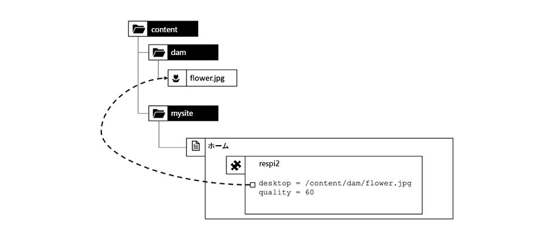

*CRX構造：respi2コンポーネント配信に品質プロパティを追加*

<br> 

画像はjpegで、jpegは圧縮できます。 jpeg画像を圧縮する場合は、ファイルサイズに対する画質を考慮します。 圧縮は、「1」～「100」の範囲の数値の「品質」パラメーターとして定義されます。 「1」は「small but poor quality」を意味し、「100」は「best quality but large files」を意味します。 それで、どれが完璧な価値なのか？

ITに関するすべてと同様、答えは次の通りです。「違う」

ここではモチーフによる。 文字や建物の写真、イラスト、スケッチ、商品箱の写真（シャープな輪郭と文字が書かれたもの）など、モチフのようなコントラストの強いエッジを持つモチフは、通常そのカテゴリに入ります。 風景や肖像画など、より柔らかい色とコントラストのトランジションを持つモティフは、目に見える画質を損なうことなく、もう少し圧縮できます。 自然写真はたいていそのカテゴリに入る。

また、画像が使用される場所に応じて、別のパラメーターを使用することもできます。 ティーザー内の小さなサムネールは、画面全体のヒーローバナーで使用されているのと同じ画像よりも圧縮に耐えることができます。 つまり、画質パラメータは画像ではなく、画像とコンテキストに固有です。 著者の好みに合う。

簡単に言うと、すべての画像に対して完全な設定はありません。 万能薬は無い。 作者が決めるのが一番だ。 「quality」パラメーターをコンポーネント内のプロパティとして調整し、品質に満足でき、帯域幅を犠牲にしないようにします。

これで、DAMにバイナリファイルが作成され、クォリティプロパティを提供するコンポーネントが追加されました。 URLはどのように表示しますか。 スプールの原因はどのコンポーネントか。

#### ナイブアプローチ1:プロパティをクエリパラメーターとして渡す

>[!WARNING]
>
>これは反パターンです。 使用しないでください。

最後のチャプターでは、コンポーネントによってレンダリングされるイメージURLは次のようになります。

`/content/dam/flower.respi.jpg`

欠けているのは品質の価値です。 コンポーネントは、作成者がどのプロパティを入力したかを把握しています。`flower.respi2.jpg?quality=60`のようにマークアップをレンダリングする際に、クエリパラメータとしてイメージレンダリングサーブレットに簡単に渡すことができます。

```plain
  <div class="respi2">
  <picture>
    <source src="/content/dam/flower.respi2.jpg?quality=60" …/>
    …
  </picture>
  </div>
  …
```

これはまずい考えだ。 一時保存? クエリパラメーターを持つリクエストはキャッシュできません。

#### ナイブアプローチ2:追加情報をセレクターとして渡す

>[!WARNING]
>
>これは反パターンになるかもしれません。 慎重に使って。

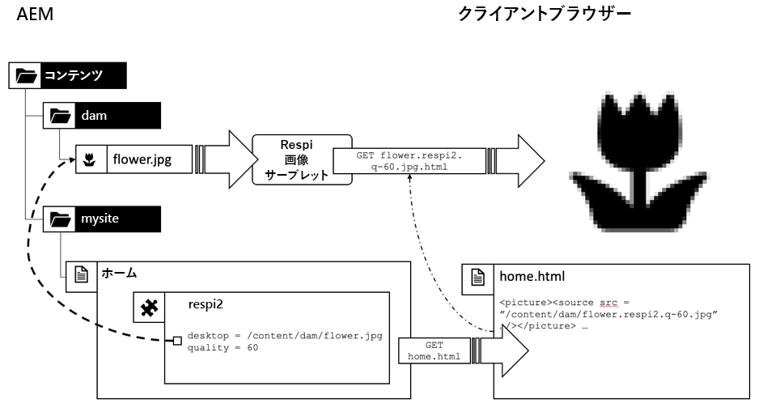

*コンポーネントプロパティをセレクターとして渡す*

<br> 

これは、最後のURLの若干のバリエーションです。 この場合に限り、セレクターを使用してプロパティをサーブレットに渡し、結果をキャッシュ可能にします。

`/content/dam/flower.respi.q-60.jpg`

これはずっといいけど、でも最後の章の悪い脚本家で、こんな柄を探してるやつを覚えてる？ 彼は値打ちのループをしてどれくらいの距離を得られるかを見るだろう

```plain
  /content/dam/flower.respi.q-60.jpg
  /content/dam/flower.respi.q-61.jpg
  /content/dam/flower.respi.q-62.jpg
  /content/dam/flower.respi.q-63.jpg
  …
```

これは再びキャッシュをバイパスし、パブリッシュシステムで読み込みを作成します。 悪い考えかもしれません この問題を軽減するには、小さなパラメーターのサブセットのみをフィルタリングします。 `q-20, q-40, q-60, q-80, q-100`のみを許可する場合。

#### セレクターを使用した場合の無効なリクエストのフィルタリング

セレクターの数を減らすのが適切な開始でした。 一般的に、有効なパラメーターの数は必ず絶対最小値に制限する必要があります。 そうすれば、基本的なAEMシステムに関する深い知識を持たないまま、AEMの外部のWeb アプリケーションファイアウォールを使って静的なフィルターのセットを利用し、システムを保護することもできます。

`Allow: /content/dam/(-\_/a-z0-9)+/(-\_a-z0-9)+
\.respi\.q-(20|40|60|80|100)\.jpg`

Web アプリケーションファイアウォールがない場合は、ディスパッチャーまたはAEM自体でフィルタリングする必要があります。 AEMで実行する場合は、

1. CRXにアクセスしすぎたり、メモリや時間を無駄にしたりすることなく、超効率的にフィルタを実装できます。

2. フィルターは、「404 — 見つかりません」というエラーメッセージを返します。

私たちはまた最後の点を強調しましょう。 HTTP会話は次のようになります。

```plain
  GET /content/dam/flower.respi.q-41.jpg

  Response: 404 – Not found
  << empty response body >>
```

また、無効なパラメータをフィルタリングしたが、無効なパラメータが使用された場合に有効なフォールバックレンダリングが返された実装も確認しています。 ここでは、20 ～ 100のパラメーターのみを許可するとします。 の間の値は、有効な値にマップされます。 では

`q-41, q-42, q-43, …`

は常にq-40と同じイメージを返します。

```plain
  GET /content/dam/flower.respi.q-41.jpg

  Response: 200 – OK
  << flower.jpg with quality = 40 >>
```

そのアプローチは全く役に立たない。 これらのリクエストは、実際には有効なリクエストです。  処理能力を消費し、ディスパッチャーのキャッシュディレクトリの領域を占有します。

`301 – Moved permanently`を返す方が良い。

```plain
  GET /content/dam/flower.respi.q-41.jpg

  Response: 301 – Moved permanently
  Location: /content/dam/flower.respi.q-40.jpg
```

AEMがブラウザーに伝えている。 「`q-41`を持っていません。 でもね —`q-40`について聞いてみて。

これにより、会話にリクエスト応答ループが追加されます。これは少しオーバーヘッドですが、`q-41`でフル処理を行うよりも安価です。 また、`q-40`の下に既にキャッシュされているファイルを利用できます。 ただし、302個の応答はディスパッチャーにキャッシュされません。AEMで実行されるロジックについて説明します。 何度も繰り返す。 だから、スリムで速くした方がいい。

404番の反応が最も好きです 何が起きているかは明らかです ログファイルを分析する際に、Webサイト上のエラーを検出するのに役立ちます。 301台を想定し、404台を常に分析、排除。

## セキュリティ — 遠足

### リクエストのフィルタリング

#### 最適なフィルタリング方法

前の章の最後に、既知のセレクターに対して着信トラフィックをフィルタリングする必要性を指摘しました。 それでは次の問題が解ける。リクエストを実際にフィルターする場所

まあ…。 早い方がいい。

#### Web アプリケーションファイアウォール

Webセキュリティを目的としたWeb アプリケーションファイアウォールアプライアンス(「WAF」)をお持ちの場合は、これらの機能を必ず活用してください。 しかし、WAFは、コンテンツアプリに関する知識が限られているユーザーによって操作され、有効なリクエストをフィルターしたり、大量の有害なリクエストを渡したりする場合があります。 WAFを操作する人は、シフトやリリースのスケジュールが異なる別の部署に割り当てられ、直接のチームメイトほどコミュニケーションが緊縮していない場合があり、最終的に開発とコンテンツ速度に悪影響を及ぼすとは限りません。

最後にはいくつかの一般的なルールや、直感で言うブロックリストようなが締め付けられるかもしれない。

#### ディスパッチャーフィルターと発行フィルター

次の手順は、ApacheコアおよびディスパッチャーにURLフィルタリングルールを追加することです。

ここでは、URLにのみアクセスできます。 パターンベースのフィルターに制限されます。 より多くのコンテンツベースのフィルタリング（正しいタイムスタンプのファイルのみを許可するなど）を設定する必要がある場合や、作成者でフィルタリングを制御したい場合は、カスタムサーブレットフィルターのように記述します。

#### 監視とデバッグ

実際には、各レベルにセキュリティが設定されます。 しかし、どのレベルでリクエストがフィルターで除外されるかを知る手段を持っていることを確認してください。 発行システム、ディスパッチャー、WAF上のログファイルに直接アクセスできることを確認し、チェーン内のどのフィルターが要求をブロックしているかを調べます。

### セレクターとセレクターの増加

前の章で「selector-parameters」を使用するアプローチは、すばやく簡単に行え、新しいコンポーネントの開発時間を短縮できますが、制限があります。

「quality」プロパティの設定は簡単な例に過ぎません。 ただし、サーブレットは「幅」のパラメータがより用途の広いものになることを期待しています。

有効なURLの数を減らすには、セレクターの値の数を減らします。 幅も同様に指定できます。

クォリティ= q-20、q-40、q-60、q-80、q-100

width = w-100, w-200, w-400, w-800, w-1000, w-1200

ただし、すべての組み合わせが有効なURLになりました。

```
/content/dam/flower.respi.q-40.w-200.jpg
/content/dam/flower.respi.q-60.w-400.jpg
…
```

1つのリソースの有効なURLが既に5x6=30個存在します。 プロパティを追加するたびに、複雑さが増します。 そして、適切な量の値に減らすことができない性質があるかもしれません。

このアプローチにも限界があります

#### 誤ってAPIを公開する

ここで何が起きているの？ 注意深く見ると、静的にレンダリングされたウェブサイトから非常に動的なウェブサイトへと徐々に移動していくことがわかります。 そして、実際には作成者のみが使用することを意図したイメージレンダリングAPIをユーザのブラウザに意図せず提示しています。

画像の画質とサイズの設定は、ページを編集する作成者が行う必要があります。 サーブレットによって公開される機能と同じ機能を持つことは、サービス拒否攻撃の機能やベクトルと見なすことができます。 実際に何が起こるかは状況によって異なります Webサイトはビジネス上の重要性をどの程度重視しているか。 サーバーへの負荷はどの程度か 校長はいくら残っていますか。 導入に必要な予算はいくらですか。 これらの要因のバランスを取らなければなりません。 賛否両論に気をつけるべし。

## スプーラーパターン — 再訪問と修復

### スプーラーがAPIの公開を回避する方法

前章ではスプーラーのパターンに疑いを持ちました リハビリする時だ。

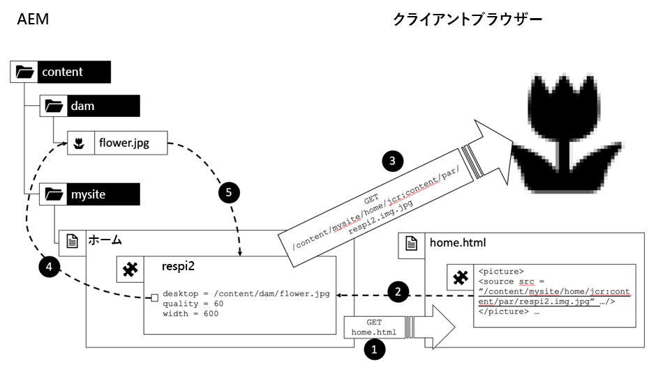

スプーラーパターンを使用すると、前の章で説明したAPIが公開される問題を回避できます。 プロパティが保存され、コンポーネントにカプセル化されます。 これらのプロパティにアクセスする必要があるのは、コンポーネントへのパスだけです。 マークアップとバイナリレンダリングの間でパラメータを送信する際に、URLを手段として使用する必要はありません。

1. クライアントは、プライマリ要求ループ内でコンポーネントが要求された場合にHTMLマークアップをレンダリングします

2. コンポーネントパスは、マークアップからコンポーネントへのバックリファレンスとして機能します

3. ブラウザーは、このバックリファレンスを使用してバイナリを要求します

4. リクエストがコンポーネントに到達した場合、バイナリデータのサイズ変更、圧縮、スプールを行うためのすべてのプロパティが手元にあります

5. 画像は、コンポーネントを介してクライアントブラウザに送信される

スプーラーパターンは結局それほど悪くないので、人気があるのです。 キャッシュの無効化に関してそれほど面倒でない場合に限り…

### 逆スプーラー — 両方の世界の長所

それで問題が出た。 なぜ両方の世界の長所を得られないのか？ スプーラーパターンを適切にカプセル化し、リソースベースのURLのキャッシュプロパティを適切にカプセル化しますか？

認めなければなりません実際のライブプロジェクトでは見たことがありません でもここでちょっと考えてみてみましょう。これは、自分のソリューションの出発点です。

このパターンを&#x200B;_逆スプーラ_&#x200B;と呼びます。 逆スプーラは、すべての良好なキャッシュ無効化プロパティを持つために、画像リソースに基づく必要があります。

ただし、パラメータを公開しないでください。 すべてのプロパティは、コンポーネント内にカプセル化する必要があります。 ただし、コンポーネントのパスは、プロパティへの不透明な参照として公開できます。

次の形式のURLが表示されます。

`/content/dam/flower.respi3.content-mysite-home-jcrcontent-par-respi.jpg`

`/content/dam/flower` は、画像のリソースへのパスです。

`.respi3` は、画像を配信する正しいサーブレットを選択するセレクターです。

`.content-mysite-home-jcrcontent-par-respi` は追加のセレクターです。画像変換に必要なプロパティを格納しているコンポーネントのパスがエンコードされます。 セレクターの文字数は、パスよりも小さい範囲に制限されます。 ここでのエンコーディングスキームは、単なる模範的なものです。 「/」を「 — 」に置き換えます。 パス自体に「 — 」を含めることもできるので、考慮されません。 実際の例では、より高度なエンコーディングスキームを使用することをお勧めします。 Base64は正常です。 でも、デバッグは少し難しくなる。

`.jpg` はファイルのサフィックス

### まとめ

へえ…スプーラの議論は思ったよりも長く複雑になった。 君に言い訳をする義務がある。 しかし、良い面と悪い面をいろいろ紹介して、ディスパッチャーの国で何が上手くいくのか、何が上手くいかないのかを直感できるようにする必要があると感じました。

## StatfileとStatfile-Level

### 基本知識

#### はじめに

前に&#x200B;_statfile_&#x200B;について簡単に述べました。 これは、自動無効化に関連します。

自動無効に設定されたディスパッチャーファイルシステム内のキャッシュファイルは、最終変更日が`statfile's`最終変更日より古い場合は無効と見なされます。

>[!NOTE]
>
>最後に変更された日付とは、キャッシュされたファイルがクライアントのブラウザから要求され、最終的にファイルシステムに作成された日付です。 リソースの`jcr:lastModified`日付ではありません。

statfileの最終変更日(`.stat`)は、AEMからの無効化要求がディスパッチャーで受信された日付です。

複数のディスパッチャーがある場合は、異常な影響を及ぼす可能性があります。 ブラウザーは、ディスパッチャー（複数のディスパッチャーを持つ場合）のより新しいバージョンを持つことができます。 また、ディスパッチャーは、他のディスパッチャーが発行したブラウザーのバージョンが古く、不必要に新しいコピーを送信すると考える場合があります。 これらの効果は、パフォーマンスや機能要件に大きな影響を与えません。 また、ブラウザーが最新バージョンの場合は、時間の経過とともにレベルアウトします。 ただし、ブラウザーのキャッシュ動作を最適化およびデバッグする場合は、やや混乱する可能性があります。 注意して。

#### /statfileslevelを使用した無効化ドメインの設定

自動無効化を導入し、先ほど申し上げたstatfileを紹介した際、**&#x200B;ファイルは変更があると無効と見なされ、すべてのファイルは相互依存関係にあります。

それはあまり正確ではない。 通常、共通のメインナビゲーションルートを共有するすべてのファイルは相互に依存します。 しかし、1つのAEMインスタンスで複数のWebサイト（*独立した* Webサイト）をホストできます。 共通のナビゲーションを共有しない（実際は、何も共有しない）。

サイトAに変更があるので、サイトBを無効にするのは無駄ではないでしょうか。 はい。 そうでなくてもいいのです

ディスパッチャーは、サイトを相互に分離する簡単な方法を提供します。`statfiles-level`.

これは、ファイルシステムのどのレベルから定義される数で、2つのサブツリーが「独立」と見なされます。

statfilelevelが0のデフォルトのケースを見てみましょう。

を含むインストール全体に及ぶ

`/statfileslevel "0":` ドキュメントルートに `.stat` ファイルが作成されます。無効化ドメインは、すべてのサイトを含むインストール全体にわたって適用されます。

どちらのファイルが無効になっても、ディスパッチャーdocrootの最上部にある`.stat`ファイルは常に更新されます。 したがって、`/content/site-b/home`を無効にすると、`/content/site-a`内のすべてのファイルも無効になります。これは、docroot内の`.stat`ファイルより古いファイルです。 `site-b`を無効にした場合は、必要なものは明らかではありません。

この例では、`statfileslevel`を`1`に設定します。

今度は、`/content/site-b/home`や`/content/site-b`以下の他のリソースをパブリッシュして無効にした場合、`.stat`ファイルは`/content/site-b/`に作成されます。

`/content/site-a/`より下のコンテンツは影響を受けません。 この内容は、`/content/site-a/`にある`.stat`ファイルと比較されます。 我々は2つの個別の無効化ドメインを作成しました。

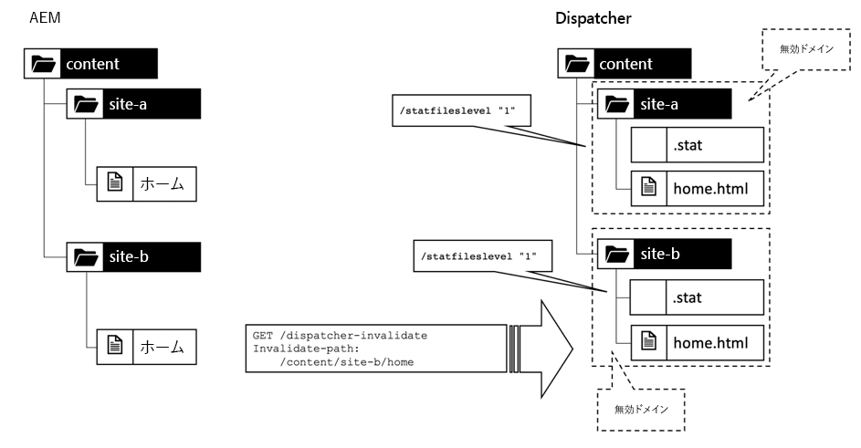

*statfilelevel「1」は、異なる無効化ドメインを作成します*

<br> 

大規模なインストールは、通常、もう少し複雑で深い構造になっています。 一般的なスキームは、ブランド、国、言語別にサイトを構築することです。 この場合、statfilelevelをさらに高く設定できます。 _1_ の場合、ブランドごとに無効化ドメイン、国 _ごとに2_ 、言語ごとに _3_ が作成されます。

### 均質な敷地構造の必要性

statfilelevelは、設定内のすべてのサイトに均等に適用されます。 したがって、同じ構造と開始に従うすべてのサイトを同じレベルに配置する必要があります。

ポートフォリオ内に、少数の小規模な市場でのみ販売されるブランドと、世界中で販売されるブランドがあるとします。 小さな市場にはたまたま1つの現地語しかないのに対し、世界市場には複数の言語が話される国がある。

```plain
  /content/tiny-local-brand/finland/home
  /content/tiny-local-brand/finland/products
  /content/tiny-local-brand/finland/about
                              ^
                          /statfileslevel "2"
  …

  /content/tiny-local-brand/norway
  …

  /content/shiny-global-brand/canada/en
  /content/shiny-global-brand/canada/fr
  /content/shiny-global-brand/switzerland/fr
  /content/shiny-global-brand/switzerland/de
  /content/shiny-global-brand/switzerland/it
                                          ^
                                /statfileslevel "3"
  ..
```

前者は&#x200B;_2_&#x200B;の`statfileslevel`を必要とし、後者は&#x200B;_3_&#x200B;を必要とします。

理想的な状況ではありません。 _3_&#x200B;に設定した場合、自動無効化は、サブブランチ`/home`、`/products`、`/about`の間の小さなサイトでは機能しません。

_2_&#x200B;に設定した場合、大きなサイトでは`/canada/en`と`/canada/fr`に依存しているのではないかもしれませんが、 したがって、`/en`の各無効化も`/fr`を無効にします。 これにより、キャッシュのヒット率がわずかに低下しますが、キャッシュされた古いコンテンツを配信するよりも効果的です。

もちろん最善の解決策は、すべてのサイトのルートを同じ深さにすることです。

```
/content/tiny-local-brand/finland/fi/home
/content/tiny-local-brand/finland/fi/products
/content/tiny-local-brand/finland/fi/about
…
/content/tiny-local-brand/norway/no/home
                                 ^
                        /statfileslevel "3"
```

### サイト間リンク

どちらが正しいレベルですか？ これは、サイト間の依存関係の数に依存します。 ページのレンダリングで解決する選択は、「ハード依存関係」と見なされます。 _Teaser_&#x200B;コンポーネントをこのガイドの最初に導入した際に、_inclusion_&#x200B;という例を示しました。

__ ハイパーリンクは、より柔らかい依存関係です。1つのウェブサイト内のハイパーリンクが作成される可能性が非常に高く、ウェブサイト間のリンクがあるとは考えにくい。 単純なハイパーリンクは、通常、Webサイト間に依存関係を作成しません。 サイトからfacebookに設定した外部リンクを考えてみてください。Facebook上で何か変化が起きた場合やその逆の場合は、ページをレンダリングする必要はありません。

リンクされたリソース（ナビゲーションタイトルなど）からコンテンツを読み取ると、依存関係が発生します。 このような依存関係は、ローカルに入力したナビゲーションタイトルだけに依存し、（外部リンクと同様に）ターゲットページから描画しない場合に回避できます。

#### 予期しない依存関係

ただし、設定の一部は、独立していると思われるサイトが一緒になる場合に限られます。 我々のプロジェクトの一つで現実のシナリオを見てみましょう

顧客は、前の章でスケッチしたような外構構造を持っていた。

```
/content/brand/country/language
```

例：

```
/content/shiny-brand/switzerland/fr
/content/shiny-brand/switzerland/de

/content/shiny-brand/france/fr

/content/shiny-brand/germany/de
```

それぞれの国には独自の領域があり

```
www.shiny-brand.ch

www.shiny-brand.fr

www.shiny-brand.de
```

言語サイトと見かけ上の含める言語の間に、ナビゲーション可能なリンクがなかったので、statfilelevelを3に設定しました。

すべてのサイトは基本的に同じコンテンツを提供していました。 唯一大きな違いは言語でした

Googleなどの検索エンジンは、同じコンテンツを異なるURLに持つことを「欺く」と考えます。 同じコンテンツを提供するファームを作成することで、より高いランク付けや高いランク付けを行ったり、より頻繁にリストに登録したりできます。 検索エンジンはこれらの試行を認識し、実際にはページのランクを低くして、単にコンテンツをリサイクルします。

透明にして下位レベルにならないようにする、同じコンテンツを持つページが複数あり、システムを「ゲーム」しないようにする、各ページのヘッダーセクションに`<link rel="alternate">`タグを設定します。[](https://support.google.com/webmasters/answer/189077?hl=en)

```
# URL: www.shiny-brand.fr/fr/home/produits.html

<head>

  <link rel="alternate" 
        hreflang="fr-ch" 
        href="http://www.shiny-brand.ch/fr/home/produits.html">
  <link rel="alternate" 
        hreflang="de-ch" 
        href="http://www.shiny-brand.ch/de/home/produkte.html">
  <link rel="alternate" 
        hreflang="de-de" 
        href="http://www.shiny-brand.de/de/home/produkte.html">

</head>

----

# URL www.shiny-brand.de/de/home/produkte.html

<head>

  <link rel="alternate" 
        hreflang="fr-fr" 
        href="http://www.shiny-brand.fr/fr/home/produits.html">
  <link rel="alternate" 
        hreflang="fr-ch" 
        href="http://www.shiny-brand.ch/fr/home/produits.html">
  <link rel="alternate" 
        hreflang="de-ch"
         href="http://www.shiny-brand.ch/de/home/produits.html">

</head>
```


*すべての*

<br> 

SEOの専門家の中には、これが高位ランクのウェブサイトの評判や「リンクジュース」を異なる言語の同じウェブサイトに転送する可能性がある、と言う人もいます。

このスキームは、多数のリンクだけでなく、いくつかの問題も生み出しました。 _n_&#x200B;言語の&#x200B;_p_&#x200B;に必要なリンク数は&#x200B;_p x (n<sup>2</sup>-n)_&#x200B;です。各ページは、それ自体(_-n_)を除き、互いにリンクし合う(_n x n_)。 このスキームは各ページに適用されます。 20ページの4言語の小さなサイトがある場合、それぞれ&#x200B;_240_&#x200B;のリンクになります。

まず、これらのリンクを手動で管理する必要がなく、システムによって自動的に生成される必要があります。

2つ目は、正確であるべきです。 新しい「相対」が検出された場合は常に、同じコンテンツを持つ（ただし別の言語の）他のすべてのページからリンクする必要があります。

当社のプロジェクトでは、新しい相対ページが頻繁に表示されていました。 しかし、「代替」リンクとしては具現化されなかった。 例えば、`de-de/produkte`ページがドイツ語のWebサイトに公開された時点で、他のサイトにはすぐには表示されませんでした。

その理由は、当社の設定では、サイトは独立しているはずだったからです。 ドイツのウェブサイトの変更はフランスのウェブサイトの無効化にトリガーしなかった。

その問題を解決する方法は既に1つ分かっている。 statfileslevelを2に減らすだけで、無効化ドメインを拡張できます。 もちろん、これは、特にパブリケーションの場合など、キャッシュヒット率も低下し、無効化がより頻繁に発生する場合も少なくなります。

私たちの場合はさらに複雑でした。

同じ内容でも、実際のブランド名ではない国が違う。

`shiny-brand` フランス `marque-brillant` とドイツで呼ば `blitzmarke` れた

```
/content/marque-brillant/france/fr
/content/shiny-brand/switzerland/fr
/content/shiny-brand/switzerland/de
/content/blitzmarke/germany/de
…
```

`statfiles`レベルを1に設定することになったので、無効化ドメインは大きすぎました。

サイトの再構築でそれは修正されただろう。 1つの共通ルートの下にすべてのブランドを結合する。 しかし、当時は能力がなかったし、レベル2しか与えられなかった。

レベル3にこだわることを決め、常に最新の「代替」リンクを持つとは限らない価格を提示しました。 影響を軽減するために、ディスパッチャーで「紙」のcronジョブを実行し、1週間より古いファイルをクリーンアップしていました。 最終的に全てのページがある時点で再レンダリングされました しかしそれは、各プロジェクトで個別に決める必要のあるトレードオフです。

## まとめ

ディスパッチャーの一般的な動作方法に関する基本原則をいくつか説明し、適切な機能を得るためにもう少し実装を重ね、トレードオフを必要とする場所を示した例をいくつか示しました。

ディスパッチャーでの設定方法の詳細は説明しませんでした。 まず、コンソールにあまりに早く移動することなく、基本的な概念と問題を理解して欲しかった。 また、実際の設定作業は十分に文書化されています。基本的な概念を理解していれば、さまざまなスイッチの用途を知っておく必要があります。

## ディスパッチャーのヒントとテクニック

本書の最初の部分を、ある状況や別の状況で役立つ可能性のあるヒントやテクニックの無作為な集めで締めくくる。 前と同じように、ソリューションは紹介していませんが、アイデアや概念を理解し、実際の設定を詳しく説明する記事へのリンクを得るためのアイデアです。

### 無効化のタイミングの修正

AEM作成者をインストールして初期状態で発行を行う場合、トポロジは少し奇数です。 作成者は、コンテンツを発行システムに送信し、無効化要求を同時にディスパッチャーに送信します。 どちらの場合も、発行システムとディスパッチャーは、キューによって作成者と切り離されているので、タイミングは少し残念です。 ディスパッチャーは、発行システムでコンテンツが更新される前に、作成者から無効化要求を受け取ることができます。

その間、クライアントがそのコンテンツをリクエストした場合、ディスパッチャーは古いコンテンツをリクエストして保存します。

よりリーナブルなセットアップは、_コンテンツを受け取った後、パブリッシュシステム_&#x200B;から無効化要求を送信します。 「[発行インスタンスからディスパッチャーキャッシュを無効にする](https://helpx.adobe.com/experience-manager/dispatcher/using/page-invalidate.html#InvalidatingDispatcherCachefromaPublishingInstance)」で詳細を説明しています。

**参照**

[helpx.adobe.com — 発行インスタンスからのディスパッチャーキャッシュの無効化](https://helpx.adobe.com/experience-manager/dispatcher/using/page-invalidate.html#InvalidatingDispatcherCachefromaPublishingInstance)

### HTTPヘッダーとヘッダーのキャッシュ

昔は、ディスパッチャーは単にプレーンファイルをファイルシステムに格納していただけでした。 HTTPヘッダをお客様に配信する必要がある場合は、ファイルや場所から入手した情報に基づいてApacheを設定することで配信できます。 これは、HTTPヘッダーに大きく依存していたAEMにWebアプリケーションを実装した場合に特に迷惑でした。 AEM専用のインスタンスでは問題なく動作しましたが、ディスパッチャーを使用した場合は動作しません。

通常は、リソースパスとサフィックスで派生できる情報を使用して、見つからないヘッダーを`mod_headers`付きのApacheサーバーのリソースに再適用し始めました。 しかしそれでは必ずしも十分ではなかった

特に迷惑だったのは、ディスパッチャーでも、ブラウザーに対する最初の&#x200B;_キャッシュされていない_&#x200B;応答が、全範囲のヘッダーを持つ発行システムから来たのに対し、後続の応答は限られたヘッダーのセットを持つディスパッチャーによって生成されたことです。

Dispatcher 4.1.11以降では、ディスパッチャーは発行システムで生成されたヘッダーを格納できます。

これにより、ディスパッチャーでのヘッダーロジックの重複を回避し、HTTPとAEMの表現力を最大限に引き出すことができます。

**参照**

* [helpx.adobe.com — 応答ヘッダーのキャッシュ](https://helpx.adobe.com/experience-manager/kb/dispatcher-cache-response-headers.html)

### 個々のキャッシュの例外

すべてのページと画像を一般的にキャッシュする場合がありますが、状況によっては例外が発生する場合があります。 例えば、キャプチャを表示するPNG画像はキャッシュしないで、PNG画像をキャッシュしたい場合（リクエストごとに変更されると想定されます）。 ディスパッチャーはcaptchaをcaptchaと認識しないかもしれませんが… AEMは確かに認識します。 応答と共にaccordingヘッダーを送信することで、ディスパッチャーにその1つのリクエストをキャッシュしないように依頼できます。

```plain
  response.setHeader("Dispatcher", "no-cache");

  response.setHeader("Cache-Control: no-cache");

  response.setHeader("Cache-Control: private");

  response.setHeader("Pragma: no-cache");
```

Cache-ControlとPragmaは、公式のHTTPヘッダーで、CDNなどの上位のキャッシュ層に伝播され、それらのヘッダーが解釈されます。 `Dispatcher`ヘッダーは、ディスパッチャーがキャッシュしないためのヒントです。 この変数は、上位のキャッシュレイヤーがキャッシュを許可しながら、ディスパッチャーにキャッシュを禁止するように指示する場合に使用できます。 実は、それが役に立つかもしれないケースを見つけるのは難しい。 でも、どこかには確かにある。

**参照**

* [ディスパッチャー — キャッシュなし](https://helpx.adobe.com/experience-manager/kb/DispatcherNoCache.html)

### ブラウザーのキャッシュ

最も速いhttp応答は、ブラウザー自体が提供する応答です。 要求と応答が高負荷のWebサーバーにネットワーク経由で送信される必要がない場合。

リソースの有効期限を設定すると、ブラウザが新しいバージョンのファイルをサーバーに要求するタイミングを判断するのに役立ちます。

通常は、Apacheの`mod_expires`を使用するか、より個別なコントロールが必要な場合はAEMのCache-ControlとExpires Headerを格納することで、静的に実行します。

ブラウザー内のキャッシュされたドキュメントは、最新の3つのレベルを持つことができます。

1. _新規保証_  — ブラウザーはキャッシュされたドキュメントを使用できます。

2. _古い可能性がある_  — ブラウザは、まず、キャッシュされたドキュメントが最新の状態かどうかをサーバに問い合わせる必要があります。

3. _Stale_  — ブラウザーがサーバーに新しいバージョンを要求する必要があります。

1つ目の値は、サーバーが設定した有効期限で保証されます。 リソースの有効期限が切れていない場合は、サーバーに再度問い合わせる必要はありません。

ドキュメントが有効期限に達した場合は、新規に設定できます。 有効期限は、ドキュメントが配信されるときに設定されます。 しかし、新しいコンテンツが提供される時には、あらかじめ知らないことが多いので、これは控えめな見積もりです。

ブラウザーのキャッシュ内のドキュメントが、新しい要求時に配信されるのと同じかどうかを判断するために、ドキュメントーの`Last-Modified`日付を使用できます。 ブラウザーがサーバーに問い合わせます。

&quot;_6月10日のバージョンがあります…更新が必要ですか？_」と入力し、

&quot;_304 — リソースを再送信せずに、お使いのバージョンは_&#x200B;最新の状態です。

&quot;_200 - HTTPヘッダーに新しいバージョン_&#x200B;があり、HTTP本文の実際の最新のコンテンツです。

2つ目の部分を機能させるには、`Last-Modified`日付をブラウザに送信して、更新を求める基準点があることを確認します。

前述したように、ディスパッチャーが`Last-Modified`日付を生成する場合、キャッシュされたファイル（および日付）はブラウザーがファイルを要求したときに生成されるので、リクエストによって異なる場合があります。 代わりに、「eタグ」を使用します。日付の代わりに、実際のコンテンツを識別する数値（ハッシュコードの生成など）です。

_ACS Commons Package_&#x200B;の&quot;[Etag Support](https://adobe-consulting-services.github.io/acs-aem-commons/features/etag/index.html)&quot;は、この方法を使用します。 ただし、これには次の価格が付いています。Eタグはヘッダーとして送信する必要がありますが、ハッシュコードの計算では応答を完全に読み取る必要があるので、応答を配信する前にメインメモリに完全にバッファリングする必要があります。 Webサイトにキャッシュされていないリソースが存在する可能性が高く、もちろんAEMシステムで消費されるメモリを監視する必要がある場合は、遅延に悪影響を与える可能性があります。

URL指紋を使用している場合は、有効期限を非常に長く設定できます。 指紋付きのリソースは、ブラウザーでいつでもキャッシュできます。 新しいバージョンには新しいURLが付けられ、古いバージョンは更新する必要はありません。

スプーラーパターンを導入した際にURL指紋を使用しました。 `/etc/design`(CSS、JS)からの静的ファイルはほとんど変更されず、指紋として使用するのに適した候補となります。

通常のファイルの場合は、30分ごと、4時間ごとなど、HTMLの再チェックなど、固定スキームを設定します。

ブラウザーのキャッシュは作成者システムで非常に役立ちます。 ブラウザー内でできるだけキャッシュして、編集操作を強化したい。 残念ながら、最も高価なアセット、htmlページはキャッシュできません。作成者で頻繁に変更されるはずです。

AEM UIを構成するGraniteライブラリは、かなり長い時間キャッシュできます。 また、サイトの静的ファイル（フォント、CSSおよびJavaScript）をブラウザーでキャッシュすることもできます。 `/content/dam`内の画像でさえ、ページ上のテキストのコピーほど頻繁に変更されないので、通常15分間キャッシュすることができます。 画像は、AEMでインタラクティブに編集されません。 AEMにアップロードされる前に、まず編集および承認が行われます。 したがって、テキストほど頻繁に変更されていないと想定できます。

UIファイルをキャッシュすると、サイトライブラリファイルと画像をキャッシュすることで、編集モードの場合にページの再読み込みを大幅に高速化できます。


**参照**

*[developer.mozilla.org - Caching](https://developer.mozilla.org/en-US/docs/Web/HTTP/Caching)

* [apache.org — 変更の有効期限](https://httpd.apache.org/docs/current/mod/mod_expires.html)

* [ACSコモンズ — Etagのサポート](https://adobe-consulting-services.github.io/acs-aem-commons/features/etag/index.html)

### URLの切り捨て

リソースは

`/content/brand/country/language/…`

ただし、これは、顧客に対して表示したいURLではありません。 美容学、可読性、SEOの理由から、ドメイン名に既に表されている部分を切り捨てたい場合があります。

ドメインがある場合

`www.shiny-brand.fi`

通常、ブランドや国を道に入れる必要はありません。 代わりに、

`www.shiny-brand.fi/content/shiny-brand/finland/fi/home.html`

君はそうしたい

`www.shiny-brand.fi/home.html`

AEMにこのマッピングを実装する必要があります。AEMは、その切り捨てられた形式に従ってリンクをレンダリングする方法を知っている必要があるからです。

AEMだけに頼るな。 そうすると、キャッシュのルートディレクトリに`/home.html`のようなパスがあります。 フィニッシュやドイツ、カナダのウェブサイトの「ホーム」か？ また、ディスパッチャーにファイル`/home.html`がある場合、`/content/brand/fi/fi/home`の無効化要求が発生したときに無効にする必要があることを、ディスパッチャーはどのようにして知りますか。

ドメインごとに異なるドクルートを持つプロジェクトを見てきました。 デバッグとメンテナンスは悪夢でした。実際、完全に動くのは見たことがありません。

キャッシュを再構築することで問題を解決できます。 すべてのドメインに対して1つのdocrootがあり、無効化要求は`/content`で始まるサーバー上のすべてのファイルとして1:1で処理できます。

切り捨ても簡単でした。  AEMでは、`/etc/map`の設定に従うために切り捨てられたリンクが生成されました。

リクエスト`/home.html`がディスパッチャーをヒットしている場合、まず最初に発生するのは、パスを内部的に拡張する書き換えルールを適用することです。

そのルールは各vhost設定で静的に設定されていました。 簡単に言えば、規則はこんな感じだった。

```plain
  # vhost www.shiny-brand.fi

  RewriteRule "^(.\*\.html)" "/content/shiny-brand/finland/fi/$1"
```

ファイルシステムには、`/content`ベースの平易なパスがあります。これはAuthorとPublishでも見つかります。これは多くのデバッグに役立ちます。 正しい無効化については言及しないでください。問題はなくなりました。

注意：これは、「表示」されるURL、ブラウザーのURLスロットに表示されるURLに対してのみ行われました。 例えば、画像のURLが純粋な「/content」URLでした。 検索エンジンの最適化に関しては、「メイン」URLを美しくするだけで十分だと考えています。

共通のdocrootがあるのもまた良い機能でした。 ディスパッチャーで何か問題が発生した場合、を実行してキャッシュ全体をクリーンアップできます。

`rm -rf /cache/dispatcher/*`

（高負荷ピーク時には行いたくないことがあります）。

**参照**

* [apache.org — 変更リライト](https://httpd.apache.org/docs/2.4/mod/mod_rewrite.html)

* [helpx.adobe.com — リソースマッピング](https://helpx.adobe.com/experience-manager/6-4/sites/deploying/using/resource-mapping.html)

### エラー処理

AEMクラスでは、Slingでエラーハンドラーをプログラムする方法を学習します。 これは、通常のテンプレートを書くのとそれほど違いません。 テンプレートはJSPかHTLで書くだけでしょ？

はい — でもこれはAEMの部分だけです。 注意：ディスパッチャーは、`404 – not found`または`500 – internal server error`の応答をキャッシュしません。

これらのページを（失敗した）リクエストごとに動的にレンダリングする場合、パブリッシュシステムで不要な負荷が大きくなります。

エラーが発生した場合はエラーページ全体をレンダリングしないで、非常に単純で小さいもの — 装飾や論理を一切使わない静的なページでさえレンダリングするのが役に立つことがわかりました。

これはもちろんお客様が見たものではありません。 Dispatcherでは、`ErrorDocuments`を登録しました。

```
ErrorDocument 404 "/content/shiny-brand/fi/fi/edocs/error-404.html"
ErrorDocument 500 "/content/shiny-brand/fi/fi/edocs/error-500.html"
```

これで、AEMシステムは、何か問題が発生したことをディスパッチャーに通知するだけで、ディスパッチャーは、エラードキュメントのピカピカで美しいバージョンを配信できました。

ここで2点留意する。

まず、`error-404.html`は常に同じページです。 そのため、「_producten_&#x200B;を検索しても結果が得られませんでした」のような個々のメッセージはありません。 私たちはそれと一緒に住むのが楽でした。

2つ目は、内部サーバエラーが発生した場合、あるいはAEMシステムが停止した場合でも、AEMにエラーページを表示するように依頼する方法はありません。 `ErrorDocument`ディレクティブで定義されている、後に必要な要求も失敗します。 この問題を回避するために、`wget`経由で定義された場所からエラーページを定期的に取り出し、`ErrorDocuments`ディレクティブで定義された静的ファイルの場所に格納するcronジョブを実行しました。

**参照**

* [apache.org — カスタムエラードキュメント](https://httpd.apache.org/docs/2.4/custom-error.html)

### 保護されたコンテンツのキャッシュ

デフォルトでリソースを配信する場合、ディスパッチャーは権限を確認しません。 公共のWebサイトを高速化するために、このように目的で実装されます。 ログインでリソースを保護したい場合、基本的に3つの方法があります。

1. リクエストがキャッシュをヒットする前に、リソースをProtectします。例えば、ディスパッチャーの前のSSO（シングルサインオン）ゲートウェイ、またはApacheサーバーのモジュールで発生します。

2. 機密リソースをキャッシュから除外し、常に公開システムからライブにします。

3. ディスパッチャーで権限に依存するキャッシュを使用する

3つのアプローチを組み合わせて使うこともできます

**オプション1**。「SSO」ゲートウェイは、いずれにしても組織によって適用される可能性があります。 アクセススキームがきわめてきめ細かい場合は、リソースへのアクセスを許可するか拒否するかを決めるのにAEMからの情報が必要ない場合があります。

>[!NOTE]
>
>このパターンには&#x200B;_Gateway_&#x200B;が必要です。_は、_&#x200B;リクエストを傍受し、実際の&#x200B;_認証_&#x200B;を実行します。これは、ディスパッチャーに対するリクエストの許可または拒否です。 SSOシステムが&#x200B;_認証子_&#x200B;の場合は、オプション3を実装する必要があるユーザーのIDのみを確立します。 SSOシステムのハンドブックの「SAML」や「OAuth」などの用語を読むと、これはOption 3を実装する必要のある強いインジケーターです。


**オプション2**.一般に、「キャッシュしない」の方が良い考えではありません。 その場合は、トラフィックの量と、除外される機密リソースの数が少ないことを確認してください。 または、パブリッシュシステムにメモリ内キャッシュがインストールされていること、パブリッシュシステムが結果の負荷（このシリーズの第3部ではその負荷）を処理できることを確認してください。

**オプション3**。「権限に依存するキャッシュ」は興味深いアプローチです。 ディスパッチャーは、リソースをキャッシュしていますが、リソースを配信する前に、AEMシステムにリソースをキャッシュするかどうかを尋ねます。 これにより、ディスパッチャーから発行に対する追加のリクエストが作成されますが、発行システムが既にキャッシュされている場合は、通常は発行システムがページの再レンダリングを妨げます。 ただし、この方法では、ある程度のカスタム実装が必要です。 詳しくは、[権限の有無に関するキャッシュ](https://helpx.adobe.com/experience-manager/dispatcher/using/permissions-cache.html)を参照してください。

**参照**

* [helpx.adobe.com — 権限に依存するキャッシュ](https://helpx.adobe.com/experience-manager/dispatcher/using/permissions-cache.html)

### 猶予期間の設定

ツリーアクティベーションや単にコンテンツを最新の状態に維持する必要がない場合など、短い連続で無効にすることが頻繁にある場合は、常にキャッシュをフラッシュし、訪問者が空のキャッシュを常にヒットすることがあります。

次の図は、単一のページにアクセスする場合のタイミングを示しています。  もちろん、要求されるページ数が増えると問題は悪化します。


*頻繁なアクティベーションが発生し、ほとんどの時間に無効なキャッシュが発生*

<br> 

この「キャッシュの無効化ストーム」の問題を軽減するために、`statfile`解釈に対してあまり厳密でない場合があります。

ディスパッチャーは、自動無効化に`grace period`を使用するように設定できます。 これは内部的に`statfiles`の変更日に時間を追加します。

例えば、`statfile`の変更時刻は今日12:00で、`gracePeriod`は2分に設定されているとします。 次に、自動無効化されたすべてのファイルは、12:01および12:02で有効と見なされます。 12:02の後に再レンダリングされます。

リファレンスコンフィギュレーションは、正当な理由で2分の`gracePeriod`を提案します。 「2分？ それはほとんど何もない。 10分待てばコンテンツが現れる…」  そのため、少なくとも10分後にコンテンツが表示されると仮定して、10分のように長い期間を設定する必要が生じる可能性があります。

>[!WARNING]
>
>`gracePeriod`の動作はこのようには行われません。 猶予期間は、ドキュメントの無効化が保証された後の時間&#x200B;__&#x200B;ではなく、無効化が発生しない時間枠です。 このフレーム&#x200B;_内に該当する後続の無効化は、それぞれタイムフレーム_&#x200B;を長くします。これは無限に長くなる場合があります。

`gracePeriod`が実際にどのようにして例を扱うかを説明しましょう。

例えば、メディアサイトを運営していて、編集スタッフが5分ごとに定期的にコンテンツの更新を提供するとします。 猶予期間を5分に設定したとします。

12:00の簡単な例を開始します。

12:00 - Statfileは12:00に設定されます。 キャッシュされたファイルはすべて12:05まで有効と見なされます。

12:01 — 無効化が発生する。 これで火葬場の時間は12時6分まで延びる。

12:05 — 別の編集者が自分の記事を公開 — 猶予期間をもう1つ猶予して12:10に延長します。

その他…コンテンツは無効にされません。 *内の各無効化*&#x200B;は、猶予期間を有効に延長します。 `gracePeriod`は無効嵐を乗り切るために設計されている…だが、最終的に雨の中に出て行かなければ…だから、`gracePeriod`をかなり短くして、シェルターに隠れるのを永遠に防ぐ。

#### 決定論的猶予期間

無効化嵐を乗り切る方法を紹介します。 それは単なる考えだ。 実稼働環境では試していませんがこのアイデアを皆さんに伝えるのに十分興味深いコンセプトを見つけました

`gracePeriod`は、通常のレプリケーション間隔が`gracePeriod`より短い場合、予想外に長くなる可能性があります。

別の考え方は次の通りです。一定の時間間隔でのみ無効にします。 間隔の時間は、常に古いコンテンツを提供することを意味します。 無効化は最終的に発生しますが、多数の無効化が1つの「一括」無効化に収集されるので、ディスパッチャーは、キャッシュされたコンテンツをその間提供し、パブリッシュシステムに呼吸用の空気を与える機会を得ます。

実装は次のようになります。

「カスタム無効化スクリプト」（参照を参照）を使用します。このスクリプトは、無効化が発生した後に実行されます。 このスクリプトは`statfile's`の最終変更日を読み込み、次の間隔の停止まで切り上げます。 Unixシェルコマンド`touch --time`を使用します。時間を指定します。

例えば、猶予期間を30秒に設定すると、ディスパッチャーは、statfileの最終変更日を次の30秒に丸めます。 次の30秒間に発生する無効化要求は同じ値に設定されます。

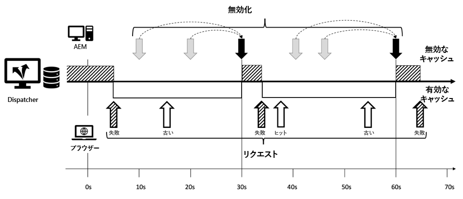

*無効化を次の30秒まで延期すると、ヒット率が増えます。*

<br> 

無効化要求と次の30秒スロットのラウンドの間で発生するキャッシュヒットは、古いものと見なされます。発行で更新が行われましたが、ディスパッチャーは古いコンテンツを提供しています。

この方法は、後続のリクエストによって期間が決定的に長くなるのを恐れることなく、より長い猶予期間を定義するのに役立ちます。 前にも述べたように、単なるアイデアで、テストする機会がなかった。

**参照**

[helpx.adobe.com — ディスパッチャーの設定](https://helpx.adobe.com/experience-manager/dispatcher/using/dispatcher-configuration.html)

### 自動再取得

貴社のサイトは非常に特定のアクセスパターンを持っています。 着信トラフィックの負荷が高く、トラフィックのほとんどはページのごく一部に集中しています。 ホームページ、キャンペーンランディングページ、および最も注目される商品の詳細ページは、トラフィックの90%を占めます。 また、新しいサイトを運営する場合は、古い記事に比べて新しい記事のトラフィック数が多くなります。

現在は、これらのページは非常に頻繁にリクエストされるので、ディスパッチャーにキャッシュされる可能性が非常に高くなります。

任意の無効化リクエストがディスパッチャーに送信され、最も人気のある一回を含むすべてのページが無効になります。

その後、これらのページは非常に人気が高いので、異なるブラウザーから新しい受信リクエストが発生します。 ホームページを例にとってみましょう

キャッシュが無効になったため、同時に入ってくるホームページへのすべての要求は、高い読み込みを生成するパブリッシュシステムに転送されます。

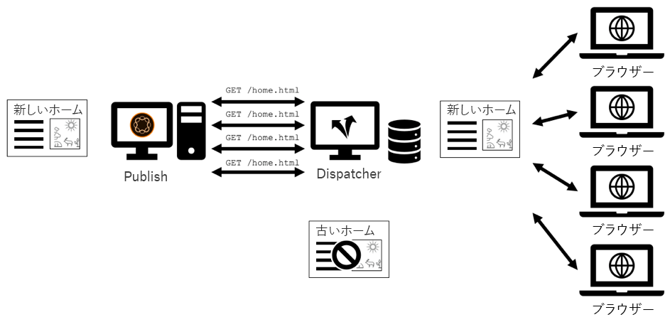

*空のキャッシュ上の同じリソースに対する並行要求：要求は発行に転送されます*

自動再フェッチを使用すると、ある程度緩和できます。 無効になったページのほとんどは、自動無効化後もディスパッチャーに物理的に保存されます。 これらは&#x200B;_古い_&#x200B;と見なされるだけです。 _自動_ 再取得とは、古いコンテンツを再取得するために、パブリッシュシステムに対して _1つの_ 単一要求を開始しながら、古いページを数秒間提供することです。

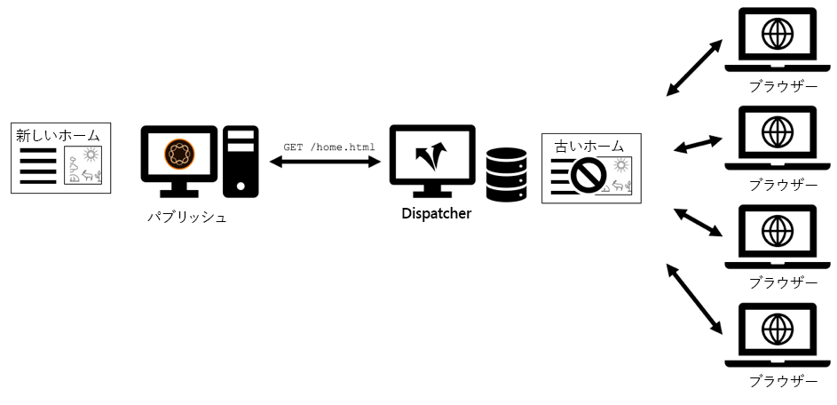

*バックグラウンドでの再フェッチ中に古いコンテンツを配信*

<br> 

再取得を有効にするには、自動無効化後に再取得するリソースをディスパッチャーに指示する必要があります。 アクティブにしたページは、人気のあるページも含め、他のすべてのページも自動的に無効になります。

再取得とは、実際には各(!)のディスパッチャーに 無効化リクエストを送信します。

これは、リソースURL(実際のURL（パスだけでなく）のリストを無効化要求の本文に配置することで達成できます。

```
POST /dispatcher/invalidate.cache HTTP/1.1

CQ-Action: Activate
CQ-Handle: /content/my-brand/home/path/to/some/resource
Content-Type: Text/Plain
Content-Length: 207

/content/my-brand/home.html
/content/my-brand/campaigns/landing-page-1.html
/content/my-brand/campaigns/landing-page-2.html
/content/my-brand/products/product-1.html
/content/my-brand/products/product-2.html
```

このようなリクエストをディスパッチャーが見ると、通常どおりトリガーの自動無効化が行われ、新しいコンテンツを発行システムから再取得するためのリクエストが直ちにキューに入れられます。

現在はリクエスト本文を使用しているので、HTTP標準に従ってcontent-typeとcontent-lengthを設定する必要もあります。

また、ディスパッチャーは、自動無効化によって無効と見なされる場合でも、これらのリソースを直接配信できることを知るために、内部的に対応するURLをマークします。

一覧に表示されているすべてのURLは、1つずつリクエストされます。 したがって、パブリッシュシステムでの負荷が高すぎるという心配は不要です。 しかし、そのリストにURLを多く入れ過ぎたくはありません。 最終的に、古いコンテンツが長い間提供されないように、キューは、期限のある時間内に最終的に処理される必要があります。 最も頻繁にアクセスされた10のページのみを含めます。

ディスパッチャーのキャッシュディレクトリを調べると、タイムスタンプの付いた一時ファイルが表示されます。 バックグラウンドで現在ロード中のファイルです。

**参照**

[helpx.adobe.com - AEMからのキャッシュページの無効化](https://helpx.adobe.com/experience-manager/dispatcher/using/page-invalidate.html)

### 発行システムのシールド

ディスパッチャーは、メンテナンスを目的とした要求から発行システムを遮断することで、セキュリティを強化します。 例えば、`/crx/de`や`/system/console`のURLを公開したくない場合です。

Webアプリケーションファイアウォール(WAF)をシステムにインストールしても問題はありません。 しかし、予算に大きな影響を与え、すべてのプロジェクトが余裕を持ち、忘れられないように、WAFの運用と維持が可能な状況にあるわけではありません。

よく目にするのは、脆弱なリソースへのアクセスを防ぐための、ディスパッチャー設定内のApache書き換えルールのセットです。

ただし、別の方法を考えることもできます。

ディスパッチャーの設定に従って、ディスパッチャーモジュールは次の特定のディレクトリにバインドされます。

```
<Directory />
  SetHandler dispatcher-handler
  …
</Directory>
```

でも、ハンドラをドクルート全体にバインドするのはなぜでしょう、後でフィルタダウンする必要があるのに？

最初に、ハンドラーの連結を絞り込むことができます。 `SetHandler` ハンドラーをディレクトリにバインドするだけで、ハンドラーをURLまたはURLパターンにバインドできます。

```
<LocationMatch "^(/content|/etc/design|/dispatcher/invalidate.cache)/.\*">
  SetHandler dispatcher-handler
</LocationMatch>

<LocationMatch "^/dispatcher/invalidate.cache">
  SetHandler dispatcher-handler
</LocationMatch>

…
```

これを行う場合は、必ずディスパッチャーハンドラーをディスパッチャーの無効化URLにバインドすることを忘れないでください。バインドしないと、AEMからディスパッチャーに無効化要求を送信できなくなります。

ディスパッチャーをフィルターとして使用する別の方法は、`dispatcher.any`内にフィルターディレクティブを設定することです

```
/filter {
  /0001  { /glob "\*" /type "deny" }
  /0002  { /type "allow"  /url "/content\*"  }
```

一方のディレクティブを他方より優先して使用するように強制するのではなく、すべてのディレクティブを適切に組み合わせることをお勧めします。

しかし、できるだけ早く、必要に応じてチェーン内でURLスペースを絞り込み、できるだけ単純な方法で行うことを検討することをお勧めします。 これらの手法は、機密性の高いWebサイト上のWAFに代わるものではないことに注意してください。 「可哀そうな人のファイアウォール」と呼ぶ人もいます。

**参照**

[apache.org- sethandlerディレクティブ](https://httpd.apache.org/docs/2.4/mod/core.html#sethandler)

[helpx.adobe.com — コンテンツフィルターへのアクセスの設定](https://helpx.adobe.com/jp/experience-manager/dispatcher/using/dispatcher-configuration.html#ConfiguringAccesstoContentfilter)

### 正規式とグローバルを使用したフィルタリング

初期の頃は、「グローバル」 — シンプルなプレースホルダーを使用して、ディスパッチャー設定のフィルターを定義するだけでした。

これは、Dispatcherの後のバージョンで変更されています。 POSIXの正規式も使えるようになり、リクエストの様々な部分にアクセスしてフィルタを定義できます。 ディスパッチャーを使い始めたばかりで、当たり前と思われる人のために。 しかし、グロブスだけを持つことに慣れていれば、それは驚きで、見落としがちです。 グロブスやレゲックスの構文は似ています 次に、同じ2つのバージョンを比較します。

```
# Version A

/filter {
  /0001  { /glob "\*" /type "deny" }
  /0002  { /type "allow"  /url "/content\*"  }

# Version B

/filter {
  /0001  { /glob "\*" /type "deny" }
  /0002  { /type "allow"  /url '/content.\*'  }
```

違いが分かる？

バージョンBは、`'`を一重引用符で囲み、_正規式パターン_&#x200B;をマークします。 「任意の文字」は`.*`を使用して表します。

_これに対して_、グロビングパターンは `"` 、重複の引用符 `*`を使用し、のような単純なプレースホルダーのみを使用できます。

その違いを知っていれば、簡単なことです。でも、知らないと、簡単に見積もりを組み合わせて、晴れた午後の設定をデバッグできます。 今は警告を受けている。

&quot;設定の`'/url'`を認識します…でも、あなたが尋ねるフィルタの`'/glob'`とは何ですか？

このディレクティブは、メソッドとパスを含む要求文字列全体を表します。 それは～のために立つ

`"GET /content/foo/bar.html HTTP/1.1"`

これは、パターンの比較対象となる文字列です。 初心者は最初の`method`(GET、POSTなど)を忘れがちです。 パターン

`/0002  { /glob "/content/\*" /type "allow" }`

「/content」が「GET...」と一致しないので、常に失敗します。 を呼び出します。

グローバルを使いたいときは

`/0002  { /glob "GET /content/\*" /type "allow" }`

が正しいと考えられます。

最初の拒否ルールの場合、

`/0001  { /glob "\*" /type "deny" }`

これでいい。 しかし、その後の許可に関しては、リクエストの個々の部分を使用する方が、より表現力が高く、より安全な方法がより明確になります。

```
/method
/url
/path
/selector
/extension
/suffix
```

次のようにします。

```
/005  {

  /type "allow"
  /method "GET"
  /extension '(css|gif|ico|js|png|swf|jpe?g)' }
```

ルールには、regexとglobの式を組み合わせることができます。

各定義の前に`/005`のような「行番号」についての最後の一語。

何の意味もない！ ルールでは、任意の分母を選択できます。 数字を使う場合、計画を考えるのに多くの労力は必要ありませんが、順序は重要です。

このようなルールが数百件ある場合：

```
/001
/002
/003
…
/100
…
```

/001から/002の間に1つ挿入し、次の数値で何が起こるかを指定します。 あなたは彼らの数を増やしていますか。 数字の間に挿入しているか。

```
/001
/001a
/002
/003
…
/100
…
```

また、/003と/001の順序を変更した場合、名前とIDを変更するか、

```
/003
/002
/001
…
/100
…
```

番号付けを行います。最初に単純な選択と見なされる場合は、長い目で見ると制限に達します。 正直に言って、識別子として数字を選択するのは、いずれにしても悪いプログラミングスタイルです。

別のアプローチを提案します。多くの場合、個々のフィルタールールに対して意味のある識別子は付きません。 しかし彼らはもっと大きな目的を果たすのでその目的に応じて何らかの方法でグループ化できます 例えば、「基本設定」、「アプリケーション固有の例外」、「グローバル例外」、「セキュリティ」などです。

その後、それに応じてルールの名前とグループ化を行い、設定（同僚のご親切な方）の読者、ファイル内の何らかの方向を示すことができます。

```plain
  # basic setup:

  /filter {

    # basic setup

    /basic_01  { /glob "\*"             /type "deny"  }
    /basic_02  { /glob "/content/\*"    /type "allow" }
    /basic_03  { /glob "/etc/design/\*" /type "allow" }

    /basic_04  { /extension '(json|xml)'  /type "deny"  }
    …


    # login

    /login_01 { /glob "/api/myapp/login/\*" /type "allow" }
    /login_02 { … }

    # global exceptions

    /global_01 { /method "POST" /url '.\*contact-form.html' }
```


おそらく、1つのグループに新しいルールを追加するか、新しいグループを作成します。 この場合、名前の変更や番号の変更を行う項目の数は、そのグループに制限されます。

>[!WARNING]
>
>より高度な設定では、フィルタリングルールを多数のファイルに分割し、各ファイルはメインの`dispatcher.any`設定ファイルに含まれます。 ただし、新しいファイルでは新しい名前空間が導入されません。 したがって、あるファイルに「001」というルールがあり、別のファイルに「001」というルールがある場合は、エラーが発生します。 意味的に強い名前を付ける理由が増えました。

**参照**

[helpx.adobe.com — グローバルプロパティのパターンの設計](https://helpx.adobe.com/experience-manager/dispatcher/using/dispatcher-configuration.html#DesigningPatternsforglobProperties)

### プロトコル仕様

最後のチップは本当のチップではありませんでも皆さんと共有する価値があると感じました

AEMとディスパッチャーは、ほとんどの場合すぐに使用できます。 したがって、独自のアプリケーションを構築する無効化プロトコルに関する包括的なディスパッチャープロトコル仕様は見つかりません。 情報は公開されていますが、多くのリソースに少し散らばっています。

私たちはここである程度ギャップを埋めようとする。 無効化リクエストは次のようになります。

```
POST /dispatcher/invalidate.cache HTTP/1.1
CQ-Action: <action>
CQ-Handle: <path-pattern>
[CQ-Action-Scope]
[Content-Type: Text/Plain]
[Content-Length: <bytes in request body>]

<newline>

<refetch-url-1>
<refetch-url-2>

…

<refetch-url-n>
```

`POST /dispatcher/invalidate.cache HTTP/1.1`  — 最初の行は、ディスパッチャー制御エンドポイントのURLです。このURLは変更しない場合があります。

`CQ-Action: <action>`  — 何が起こるか。`<action>` は次のいずれかです。

* `Activate:` deletes  `/path-pattern.*`
* `Deactive:` delete  `/path-pattern.*`
AND delete  `/path-pattern/*`
* `Delete:`   delete  `/path-pattern.*`
AND delete 
`/path-pattern/*`
* `Test:`   &quot;ok&quot;を返すが何もしない

`CQ-Handle: <path-pattern>`  — 無効にするコンテンツリソースのパス。注意：`<path-pattern>`は実際には「パターン」ではなく「パス」です。

`CQ-Action-Scope: ResourceOnly`  — オプション：このヘッダーが設定されている場合、 `.stat` ファイルには影響しません。

```
[Content-Type: Text/Plain]
[Content-Length: <bytes in request body>]
```

URLの自動再取得のリストを定義する場合は、これらのヘッダーを設定します。 `<bytes in request body>` は、HTTP本文の文字数です

`<newline>`  — リクエスト本文がある場合は、空の行でヘッダーと区切る必要があります。

```
<refetch-url-1>
<refetch-url-2>
…
<refetch-url-n>
```

URLをリストします。無効化後すぐに再取得するURLです。

## その他のリソース

ディスパッチャーキャッシュの概要と紹介を次に示します。[https://helpx.adobe.com/experience-manager/dispatcher/using/dispatcher.html](https://helpx.adobe.com/experience-manager/dispatcher/using/dispatcher.html)

その他の最適化のヒントとテクニック：[https://helpx.adobe.com/experience-manager/kb/optimizing-the-dispatcher-cache.html#use-ttls](https://helpx.adobe.com/experience-manager/kb/optimizing-the-dispatcher-cache.html#use-ttls)

ディスパッチャーのドキュメントに、以下のすべてのディレクティブが説明されています。[https://helpx.adobe.com/experience-manager/dispatcher/using/dispatcher-configuration.html](https://helpx.adobe.com/experience-manager/dispatcher/using/dispatcher-configuration.html)

よくある質問：[https://helpx.adobe.com/experience-manager/using/dispatcher-faq.html](https://helpx.adobe.com/experience-manager/using/dispatcher-faq.html)

ディスパッチャーの最適化に関するウェビナーの録画（強く推奨）[https://my.adobeconnect.com/p7th2gf8k43?proto=true](https://my.adobeconnect.com/p7th2gf8k43?proto=true)

Potsdam 2018でのプレゼンテーション「The underveluded power of content invalidation」,「adaptTo()」会議[https://adapt.to/2018/en/schedule/the-underappreciated-power-of-content-invalidation.html](https://adapt.to/2018/en/schedule/the-underappreciated-power-of-content-invalidation.html)

AEMからキャッシュされたページを無効にしています：[https://helpx.adobe.com/experience-manager/dispatcher/using/page-invalidate.html](https://helpx.adobe.com/experience-manager/dispatcher/using/page-invalidate.html)

## 次の手順

* [2 — インフラストラクチャパターン](chapter-2.md)
