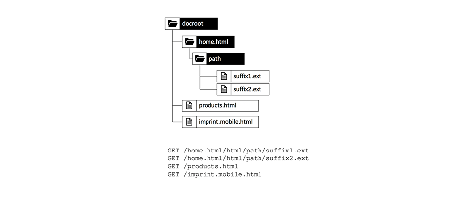

# 第 1 章 — Dispatcher の概念、パターンおよびアンチパターン

## 概要

この章では、Dispatcher の履歴と仕組みに関する簡単な概要を提供し、Dispatcher 開発者がコンポーネントをデザインする方法に影響する方法を説明します。

## 開発者がインフラストラクチャに関心を持つ理由

Dispatcher は、ほとんどの場合、重要な部分です ( 一部のAEMインストールではない場合 )。 Dispatcher の設定方法やヒント、テクニックを説明するオンライン記事が多数あります。

しかし、これらの情報の断片は常に非常に技術的なレベルで始まります。何をしたいかを既に知っていて、必要な方法の詳細のみを提供していると仮定します。 これらを説明する概念的な論文は見つかりませんでした _の内容と理由_ dispatcher でできることとできないことに関して言えば、

### Antipattern: Afterthought としての Dispatcher

この基本情報の欠如は、多くのAEMプロジェクトで見てきた多くのアンチパターンにつながります。

1. Dispatcher は Apache Web サーバーにインストールされるので、プロジェクト内の「Unix gods」のジョブで設定します。 「死に関わるジャワ開発者」は、それに関係する必要はありません。

2. Java 開発者は、このコードが動作することを確認する必要があります。後で Dispatcher が手法で高速化します。 Dispatcher は常に後考えです。 ただし、これは機能しません。 開発者は、Dispatcher を考慮してコードをデザインする必要があります。 彼はそれを行うための基本的な概念を知る必要があります

### 「最初に動作させ、次に速くする」が常に正しいとは限りません

プログラミングに関するアドバイスを聞いたかもしれません _「最初に動作させ、次に速く作ります。」_。全く間違っているわけではありません ただし、正しいコンテキストがないと、誤って解釈され、正しく適用されない傾向があります。

このアドバイスにより、開発者がコードを早めに最適化するのを防ぐ必要があります。これは、実行されない、またはほとんど実行されないので、最適化がおこなわれる十分な影響を与えないようにするためです。 さらに、最適化はより複雑なコードを引き起こし、バグを引き起こす可能性があります。 したがって、開発者の方は、1 行のコードをマイクロ最適化するのに多くの時間を費やさないでください。 適切なデータ構造、アルゴリズム、ライブラリを選択し、プロファイラーのホットスポット分析を待って、より徹底的な最適化が全体的なパフォーマンスを向上させる場所を確認するだけです。

### アーキテクチャの決定とアーティファクト

しかし、「建築」の決定に関しては、「最初に動かし、次に速く動かす」というアドバイスは全く間違っています。 建築上の決定とは何ですか？ 簡単に言えば、それらは高価で、難しく、後で変更できない決定です。 「高価」とは「不可能」と同じこともあります。  例えば、プロジェクトの予算が足りなくなった場合、高価な変更は実装できません。 インフラの変化は、ほとんどの人々の心に生じるそのカテゴリーの最初の変化です。 しかし、別の「建築」的な人工物もあり、それは変化に対して非常に厄介になる可能性があります。

1. アプリケーションの「中央」にあるコードの断片。他の多くの部分が依存します。 これらを変更するには、すべての依存関係を一度に変更し、再テストする必要があります。

2. アーティファクトは、何らかの非同期的なタイミング依存のシナリオに関係し、入力 — したがって、システムの動作は非常にランダムに変化する可能性があります。 変更は予測できない影響を及ぼし、テストが困難になる場合があります。

3. システムのあらゆる部分で使用され、何度も何度も繰り返し使用されるソフトウェアパターン。 ソフトウェアパターンが最適でないと判断された場合は、そのパターンを使用するすべてのアーティファクトを再コードする必要があります。

覚えてる？ このページの上で、Dispatcher はAEMアプリケーションの重要な部分であると述べました。 Web アプリケーションへのアクセスは非常にランダムです。ユーザーは予測不可能な時間にアクセスし、移動します。 最後に — すべてのコンテンツが Dispatcher にキャッシュされます（または必要です）。 ですから、注意を深く払えば、キャッシュは「アーキテクチャ」アーティファクトと見なされ、チームの全メンバー、開発者、管理者が同様に理解する必要があることに気付いたかもしれません。

開発者が実際に Dispatcher を設定すべきではないと言っているわけではありません。 また、Dispatcher でコードを活用できるように、ユーザーは概念（特に境界）を把握しておく必要があります。

Dispatcher は、コードの速度をマジカルに向上させません。 開発者は、Dispatcher を考慮してコンポーネントを作成する必要があります。 したがって、彼はその仕組みを知る必要があります。

## Dispatcher のキャッシュ — 基本原則

### Dispatcher as Caching Http — ロードバランサー

Dispatcher とは何ですか？まず、なぜ「Dispatcher」と呼ばれるのですか？

Dispatcher は、

* 最初にキャッシュが表示されます。

* リバースプロキシ

* Apache httpd Web サーバー用のモジュールで、Apache の汎用性にAEM関連の機能を追加し、他のすべての Apache モジュール（SSL や SSI など）とスムーズに連携します（後で説明するように、SSL や SSI が含まれます）。

Web の初期の頃は、サイトへの訪問者数が数百人になると予想されます。 1 つの Dispatcher を「ディスパッチ」するか、複数のAEMパブリッシュサーバーに対する要求の負荷を分散させる設定です。通常はこれで十分でした。つまり、「Dispatcher」という名前です。 しかし、今では、この設定はあまり頻繁にアニロンガーを使用していません。

Dispatchers とパブリッシュシステムを設定する方法については、この記事の後半で説明します。 まず、http キャッシュの基本事項を紹介します。


*Dispatcher キャッシュの基本機能*

<br>

Dispatcher の基本については、ここで説明します。 Dispatcher は、HTTP リクエストを受信および作成できる、単純なキャッシュリバースプロキシです。 通常のリクエスト/レスポンスサイクルは次のようになります。

1. ユーザーがページをリクエストします
2. Dispatcher は、そのページのレンダリングされたバージョンが既に存在する場合にチェックします。 これがこのページに対する最初の要求であり、Dispatcher がローカルにキャッシュされたコピーを見つけられないとします。
3. Dispatcher がパブリッシュシステムにページを要求します。
4. パブリッシュシステムでは、ページは JSP または HTL テンプレートによってレンダリングされます
5. ページが Dispatcher に返されます。
6. Dispatcher がページをキャッシュする
7. Dispatcher がページをブラウザーに返す
8. 同じページを 2 回目に要求した場合、パブリッシュインスタンスで再レンダリングする必要なく、Dispatcher キャッシュから直接提供できます。 これにより、パブリッシュインスタンスでのユーザーと CPU のサイクルの待ち時間を節約できます。

最後の節で「ページ」について話していました。 ただし、同じスキームは、画像、CSS ファイル、PDFのダウンロードなど、他のリソースにも適用されます。

#### データのキャッシュ方法

Dispatcher モジュールは、ホストする Apache サーバーが提供する機能を利用します。 HTMLページ、ダウンロード、画像などのリソースは、単純なファイルとして Apache ファイルシステムに保存されます。 簡単です。

ファイル名は、要求されたリソースの URL によって生成されます。 ファイルをリクエストする場合 `/foo/bar.html` 例えば、 /に格納されます。`var/cache/docroot/foo/bar.html`.

原則として、すべてのファイルがキャッシュされ、Dispatcher で静的に保存される場合は、パブリッシュシステムのプラグを取り込むと、Dispatcher は単純な Web サーバーとして機能します。 しかし、これは原理を説明するためのものです。 現実の生活はより複雑です。 すべてをキャッシュすることはできません。また、レンダリングプロセスの動的性質により、リソースの数が無限になる可能性があるので、キャッシュが完全に「フル」になることはありません。 静的ファイルシステムのモデルは、Dispatcher の機能の概要を生成するのに役立ちます。 また、Dispatcher の制限事項についても説明します。

#### AEM URL 構造とファイルシステムマッピング

Dispatcher について詳しく理解するには、単純なサンプル URL の構造を再度参照してください。  次の例を見てみましょう。

`http://domain.com/path/to/resource/pagename.selectors.html/path/suffix.ext?parameter=value&amp;otherparameter=value#fragment`

* `http` プロトコルを示します

* `domain.com` はドメイン名です。

* `path/to/resource` は、リソースが CRX に保存され、その後 Apache サーバーのファイルシステムに保存されるパスです。

ここから、AEMファイルシステムと Apache ファイルシステムでは少し異なります。

AEMでは、

* `pagename` はリソースラベルです

* `selectors` は、リソースのレンダリング方法を決定するために Sling で使用される多数のセレクターを表します。 1 つの URL に任意の数のセレクターを含めることができます。 区切り文字はピリオドです。 セレクターセクションは、例えば、「french.mobile.fancy」のようなものです。 セレクターには、文字、数字、ダッシュのみを含める必要があります。

* `html` は、「セレクター」の最後であるため、拡張と呼ばれます。 AEM/Sling では、レンダリングスクリプトも部分的に決定します。

* `path/suffix.ext` は、URL のサフィックスを指定できるパスに似た式です。  リソースのレンダリング方法をさらに制御するために、AEMスクリプトで使用できます。 この部分については後で全体を説明します。 現時点では、追加のパラメーターとして使用できることを知っておくだけで十分です。 サフィックスには拡張子が必要です。

* `?parameter=value&otherparameter=value` は、URL のクエリセクションです。 任意のパラメーターをAEMに渡すために使用されます。 パラメーターを持つ URL はキャッシュできないので、パラメーターは、絶対に必要な場合に限定する必要があります。

* `#fragment`の場合、URL のフラグメント部分は、ブラウザーでのみ使用されます。JavaScript フレームワークでは、「ルーティングパラメーター」として使用されるか、ページ上の特定の部分にジャンプします。

Apache(*以下の図を参照する*),

* `pagename.selectors.html` は、キャッシュのファイルシステムでファイル名として使用されます。

URL にサフィックスが付いている場合 `path/suffix.ext` それで

* `pagename.selectors.html` はフォルダーとして作成されます

* `path` フォルダーを `pagename.selectors.html` フォルダー

* `suffix.ext` は、 `path` フォルダー。 注意：サフィックスに拡張子がない場合、ファイルはキャッシュされません。



*Dispatcher から URL を取得した後のファイルシステムのレイアウト*

<br>

#### 基本的な制限事項

URL、リソース、ファイル名のマッピングは非常に簡単です。

しかし、お前は幾つかの罠に気づいたかもしれない

1. URL が非常に長くなる場合があります。 の「パス」部分の追加 `/docroot` ローカルファイルシステム上では、一部のファイルシステムの制限を簡単に超える可能性があります。 Windows 上で NTFS で Dispatcher を実行することは、困難な作業になる場合があります。 しかし、Linux では安全です。

2. URL には、特殊文字とウムラウトを含めることができます。 これは、通常、Dispatcher に関する問題ではありません。 ただし、URL はアプリケーションの様々な場所で解釈されます。 多くの場合、アプリケーションの奇妙な動作を見てきました — ごくまれに使用される（カスタム）コードの一部が、特殊文字に対して十分にテストされていないことを知るためです。 できるなら、避けるべきです。 できない場合は、徹底的なテストを計画します。

3. CRX では、リソースにはサブリソースが含まれます。 例えば、1 つのページに多数のサブページが含まれるとします。 ファイルシステムにはファイルまたはフォルダが含まれているので、ファイルシステム内で一致させることはできません。

#### 拡張子のない URL がキャッシュされない

URL には常に拡張子が必要です。 AEMでは拡張子のない URL を提供できますが、 これらの URL は、Dispatcher にキャッシュされません。

**例**

`http://domain.com/home.html` 次に該当 **不可解な**

`http://domain.com/home` 次に該当 **キャッシュ不可**

URL にサフィックスが含まれている場合も、同じルールが適用されます。 サフィックスには、キャッシュ可能な拡張子が必要です。

**例**

`http://domain.com/home.html/path/suffix.html` 次に該当 **不可解な**

`http://domain.com/home.html/path/suffix` 次に該当 **キャッシュ不可**

この場合、resource-part に拡張子がなく、サフィックスに拡張子が付いているとどうなりますか？ この場合、URL にはサフィックスがまったくありません。 次の例を見てみましょう。

**例**

`http://domain.com/home/path/suffix.ext`

The `/home/path/suffix` はリソースへのパスなので、URL にサフィックスは含まれません。

**まとめ**

常に、パスとサフィックスの両方に拡張子を追加します。 SEO 対応の人々は、これが検索結果でのランクを下げていると、時々主張します。 しかし、キャッシュされていないページは非常に遅くなり、さらに低いランクになります。

#### 競合するサフィックス URL

2 つの有効な URL があるとします。

`http://domain.com/home.html`

および

`http://domain.com/home.html/suffix.html`

これらはAEMでは絶対に有効です。 ローカル開発マシン（Dispatcher なし）に問題は発生しません。 また、UAT または負荷テストで問題が発生しない可能性が高くなります。 我々が直面している問題は、ほとんどのテストを抜け出すほど微妙です。  ピーク時に、対処する時間が限られている場合、サーバーへのアクセス権がない場合や、修正するリソースがない場合は、これはハードヒットします。 私たちはそこに行った…

それで…何が問題なの？

`home.html` ファイルシステムには、ファイルまたはフォルダを指定できます。 AEMと同時に両方とも同時にはできません。

次をリクエストした場合： `home.html` まず、ファイルとして作成されます。

以降のに対する要求 `home.html/suffix.html` 有効な結果を返すが、ファイルとして返す。 `home.html` ファイルシステム内の位置を「ブロック」します。  `home.html` はフォルダーとして 2 回目に作成できず、したがって `home.html/suffix.html` はキャッシュされません。


*ファイルシステム内のファイルブロック位置により、サブリソースがキャッシュされない*

<br>

逆の方法で実行する場合は、まず `home.html/suffix.html` その後 `suffix.html` は、フォルダーの下にキャッシュされます。 `/home.html` 最初は ただし、このフォルダーは削除され、ファイルに置き換えられます `home.html` その後リクエストする際 `home.html` をリソースとして使用します。


*親がリソースとして取得された場合のパス構造の削除*

<br>

したがって、キャッシュされる結果は完全にランダムで、受信要求の順序に応じて異なります。 さらに難しいのは、通常複数の Dispatcher を持つという事実です。 また、パフォーマンス、キャッシュのヒット率および動作は、Dispatcher によって異なる場合があります。 Web サイトが応答しない理由を調べたい場合は、不適切なキャッシュ順序を持つ正しい Dispatcher を確認する必要があります。 幸運にも、より好ましいリクエストパターンを持つ Dispatcher を探している場合、問題を見つけようとすると失われます。

#### 競合する URL の回避

サフィックスを持つリソースに別の拡張子を使用する場合は、「URL の競合」を回避できます。つまり、ファイルシステム内の同じパスに対してフォルダ名とファイル名が「競合」します。

**例**

* `http://domain.com/home.html`

* `http://domain.com/home.dir/suffix.html`

どちらも完璧にキャッシュ可能です。


サフィックスをリクエストする場合、またはサフィックスを完全に使用しない場合は、リソースに専用の拡張子「dir」を選択する。 有用な場合も稀にあります。 これらのケースを正しく導入するのは簡単です。  次の章で説明するように、キャッシュの無効化とフラッシュについて説明します。

#### キャッシュできないリクエスト

最後の章とその他の例外の概要を確認します。 URL がキャッシュ可能として設定されていて、データリクエストである場合は、Dispatcher が URL をキャッシュできます。 次のいずれかの例外の下でキャッシュすることはできません。

**キャッシュ可能なリクエスト**

* 要求は、Dispatcher 設定でキャッシュ可能に設定されます
* リクエストはプレーンGETリクエストです

**キャッシュ不能なリクエストまたは応答**

* 設定（パス、パターン、MIME タイプ）によってキャッシュが拒否された要求
* 「Dispatcher: no-cache」ヘッダーを返す応答
* 「Cache-Control: no-cache|private」ヘッダーを返す応答
* 「Pragma: no-cache」ヘッダーを返す応答
* クエリパラメーターを含むリクエスト
* 拡張子のない URL
* 拡張子を持たないサフィックスを持つ URL
* 200 以外のステータスコードを返すレスポンス
* POSTリクエスト

## キャッシュの無効化とフラッシュ

### 概要

最後の章では、Dispatcher が要求をキャッシュできない場合に、多数の例外がリストされていました。 しかし、考慮すべき点が他にもあります。Dispatcher が _can_ リクエストをキャッシュする場合、必ずしもそれを意味するわけではありません _should_.

ポイントは、通常、キャッシュは容易です。 Dispatcher は、応答の結果を保存し、非常に同じ要求が受信された次回にそれを返すだけで済みます。 そうでしょ？ 違う！

難しいのは _無効化_ または _フラッシュ_ キャッシュの リソースが変更された場合、Dispatcher はを見つけ出し、再度レンダリングする必要があります。

これは一見些細な仕事のようだが…。 さらに詳しくお読みください。複数のリソースのメッシュ構造に依存する単一のリソースと単純なリソース、およびページの間に、いくつかの難しい違いが見つかります。

### シンプルなリソースとフラッシュ

AEMシステムでは、要求に応じて、特別な「サムネール」セレクターを使用して各画像のサムネールレンディションを動的に作成するように設定しています。

`/content/dam/path/to/image.thumb.png`

もちろん、元の画像にセレクターのない URL を提供する URL も提供します。

`/content/dam/path/to/image.png`

サムネールと元の画像の両方をダウンロードすると、最終的には次のようになります。

```
/var/cache/dispatcher/docroot/content/dam/path/to/image.thumb.png

/var/cache/dispatcher/docroot/content/dam/path/to/image.png
```

を Dispatcher のファイルシステムに追加します。

これで、ユーザーはそのファイルの新しいバージョンをアップロードし、アクティベートします。 最終的に、無効化要求がAEMから Dispatcher に送信されます。

```
GET /invalidate
invalidate-path:  /content/dam/path/to/image

<no body>
```

無効化は非常に簡単です。Dispatcher 上の特別な「/invalidate」URL に対する単純なGETリクエストです。 HTTP-body は不要で、「payload」は単に「invalidate-path」ヘッダーです。 また、ヘッダー内の invalidate-path は、AEMが認識しているリソースであり、Dispatcher がキャッシュしたファイルやファイルではありません。 AEMはリソースについてのみ認識します。 リソースが要求されると、実行時に拡張機能、セレクターおよびサフィックスが使用されます。 AEMは、リソースで使用されているセレクターに関するブックキーピングを実行しないので、リソースをアクティブ化する際に、リソースパスが確実に把握できるのは、リソースパスだけです。

これで十分です。 リソースが変更された場合は、そのリソースのすべてのレンディションも変更されたと見なすことができます。 この例では、画像が変更された場合は、新しいサムネールもレンダリングされます。

Dispatcher は、キャッシュされたすべてのレンディションを使用して、リソースを安全に削除できます。 これは次のようなことを行います。

`$ rm /content/dam/path/to/image.*`

削除中 `image.png` および `image.thumb.png` と、そのパターンに一致する他のすべてのレンディション。

リクエストに応答するのに 1 つのリソースだけを使用する限り、非常にシンプルです。

### 参照とメッシュコンテンツ

#### メッシュコンテンツの問題

AEMにアップロードされた画像や他のバイナリファイルとは異なり、HTMLページは単独の動物ではありません。 彼らは群れの中に住み、ハイパーリンクや参照によって互いに密接に繋がっています。 シンプルなリンクは無害ですが、コンテンツ参照について話すときは、トリッキーになります。 ページ上のユビキタスなトップナビゲーションまたはティーザーは、コンテンツ参照です。

#### コンテンツ参照とそれが問題となる理由

簡単な例を見てみましょう。 ある旅行代理店は、カナダ旅行を促進する Web ページを持っています。 このプロモーションは、他の 2 ページ、「ホーム」ページ、「冬物スペシャル」ページのティーザーセクションで特集されます。

両方のページに同じティーザーが表示されるので、作成者に対して、ページごとにティーザーを複数回作成するように依頼するのは不要です。 代わりに、ターゲットページの「Canada」には、ページプロパティのセクションが予約されてティーザーの情報を提供します。または、そのティーザー全体をレンダリングする URL を提供することもできます。

`<sling:include resource="/content/home/destinations/canada" addSelectors="teaser" />`

または

`<sling:include resource="/content/home/destinations/canada/jcr:content/teaser" />`


AEMでのみチャームのように機能しますが、パブリッシュインスタンスで Dispatcher を使用すると、何か奇妙なことが起こります。

例えば、Web サイトを公開したとします。 カナダのページのタイトルは「Canada」です。 訪問者がホームページ（そのページへのティーザー参照を持つ）を要求すると、「カナダ」ページ上のコンポーネントは、

```
<div class="teaser">
  <h3>Canada</h3>
  
</div>
```

*into* ホームページ。 ホームページは、Dispatcher によって静的な.html ファイルとして保存されます。このファイルにはティーザーが含まれ、ヘッドラインも含まれます。

これで、マーケターは、ティーザーのヘッドラインが実用的である必要があることを学びました。 そこで、タイトルを「カナダ」から「カナダを訪問」に変更し、画像も更新します。

編集した「カナダ」ページを公開し、以前に公開したホームページを再度開いて、変更内容を確認します。 しかし、何も変わりはありませんでした。 古いティーザーが表示されます。 彼が「冬のスペシャル」をダブルチェックします。 そのページはこれまでに要求されたことがないので、Dispatcher で静的にキャッシュされることはありません。 したがって、このページは「公開」によって新しくレンダリングされ、このページには新しい「Visit Canada」ティーザーが含まれます。


*古くなったインクルードコンテンツをホームページに保存する Dispatcher*

<br>

何が起こったの？ Dispatcher は、レンダリング中に他のリソースから描画されたすべてのコンテンツとマークアップを含む、ページの静的バージョンを保存します。

Dispatcher は単なるファイルシステムベースの Web サーバーで、高速ですが、比較的シンプルです。 含まれるリソースが変更された場合、そのリソースには認識されません。 含めるページがレンダリングされたときに、そのコンテンツに対して引き続きクリックされます。

「冬季特別」ページはまだレンダリングされていないので、Dispatcher には静的バージョンがないので、要求に応じて新しいティーザーがレンダリングされるので、新しいティーザーと共に表示されます。

レンダリング時に、Dispatcher がタッチするすべてのリソースを追跡し、そのリソースが変更されたときに、このリソースを使用したすべてのページをフラッシュすると考えられるかもしれません。 ただし、Dispatcher はページをレンダリングしません。 レンダリングはパブリッシュシステムによって実行されます。 Dispatcher は、レンダリングされた.html ファイルに格納されるリソースを把握しません。

まだ納得してない？ 考えてみてください *&quot;何らかの依存関係の追跡を実装する方法が必要です&quot;*. そこには、あるいはより正確に存在する *が*. AEMの偉大な曽祖父である Communiqué 3 は、 _session_ ページのレンダリングに使用された

リクエストの際、このセッションを通じて取得された各リソースは、現在レンダリング中の URL の依存関係としてトラッキングされました。

しかし依存関係の追跡は非常に高価でした 依存関係のトラッキング機能を完全にオフにし、1 つの html ページが変更された後にすべての html ページを再レンダリングすることに依存している場合、Web サイトの方が速いことがすぐにわかりました。 また、その計画も完璧ではなく、途中で落とし穴や例外が多く見られました。 場合によっては、リクエストのデフォルトセッションを使用してリソースを取得するのではなく、管理者セッションを使用して、リクエストをレンダリングするヘルパーリソースを取得していました。 これらの依存関係は通常追跡されず、運用チームに対して手動でキャッシュをフラッシュするよう求める頭痛や電話が発生しました。 それを行う標準的な手順があれば、あなたは幸運でした。 途中にはもっと悩みがあったが…思い出を止めよう。 2005 年に遡ります 最終的に、この機能は Communiqué 4 でデフォルトで無効にされ、後続の CQ5 に戻されず、AEMになりました。

### 自動無効化

#### 依存関係の追跡よりもフルフラッシュの方が安い場合

CQ5 以降は、ページの 1 つだけが変更された場合、サイト全体を無効化する（多かれ少なかれ）ことに完全に依存します。 この機能は「自動無効化」と呼ばれます。

しかし、何百ものページを捨てて再レンダリングするということは、適切な依存関係のトラッキングや部分的な再レンダリングよりも安価です。

主な理由は次の 2 つです。

1. 平均的な Web サイトでは、頻繁にリクエストされるページのごく一部のみが表示されます。 したがって、レンダリングされたコンテンツをすべて破棄した場合でも、実際にはその直後に数十件しか要求されません。 ページの長い末尾のレンダリングは、実際に要求された場合に、時間の経過と共に配分できます。 したがって、実際には、レンダリングページの負荷は予想ほど高くはありません。 もちろん、常に例外があります。後で、空の Dispatcher キャッシュを持つ大きな Web サイトで均等に分散された読み込みを処理する方法に関するいくつかのテクニックを説明します。

2. どのページも、メインナビゲーションで接続されます。 つまり、最終的にはほとんどのページが互いに依存しています。 つまり、最もスマートな依存関係トラッカーでも、既に知っていることがわかります。ページの 1 つが変更された場合は、他のすべてを無効にする必要があります。

信じないの？ 最後の点を説明しよう。

リモートページのコンテンツを参照するティーザーを含む最後の例と同じ引数を使用します。 これで、より極端な例、つまり自動的にレンダリングされたメインナビゲーションを使用するようになりました。 ティーザーと同様に、ナビゲーションタイトルは、コンテンツ参照として、リンクされたページまたは「リモート」ページから描画されます。 リモートナビゲーションタイトルは、現在レンダリングされているページには保存されません。 ナビゲーションは Web サイトの各ページおよび各ページでレンダリングされることに注意してください。 したがって、メインナビゲーションを持つすべてのページで、1 つのページのタイトルが何度も繰り返し使用されます。 ナビゲーションタイトルを変更する場合は、ページを参照する各ページではなく、リモートページで 1 回だけ変更します。

この例では、ナビゲーションは、ターゲットページの「NavTitle」を使用してナビゲーションで名前をレンダリングすることで、すべてのページをメッシュ化します。 「アイスランド」のナビゲーションタイトルは、「アイスランド」ページから作成され、メインナビゲーションを持つ各ページにレンダリングされます。


*メインナビゲーションでは必ず、「NavTitles」を引き出すことですべてのページのコンテンツを一括してメッシュ化する*

<br>

アイスランドページの NavTitle を「アイスランド」から「美しいアイスランド」に変更すると、他のすべてのページのメインメニューでタイトルが直ちに変更されます。 したがって、変更前にレンダリングおよびキャッシュされたページはすべて古くなり、無効にする必要があります。

#### 自動無効化の実装方法： .stat ファイル

何千ものページを含む大規模なサイトがある場合、すべてのページをループして物理的に削除するのにかなり時間がかかります。 その間、Dispatcher は意図せず古いコンテンツを提供する可能性がありました。 さらに悪いことに、キャッシュファイルへのアクセス中に競合が発生する場合があります。削除中のページがリクエストされたり、即時のアクティベーション後に 2 回目の無効化が発生したためにページが再び削除されたりします。 何が混乱するか考えてみてください。 幸いにもこれは起こりません。 Dispatcher は巧妙なトリックを使用して、それを回避します。数百、数千のファイルを削除する代わりに、ファイルが公開されたときにシンプルで空のファイルをファイルシステムのルートに配置し、依存するすべてのファイルが無効と見なされます。 このファイルは「statfile」と呼ばれます。 statfile は空のファイルです。statfile に関して重要なのは作成日のみです。

Dispatcher 内の、statfile よりも古い作成日のファイルは、最後のアクティベーション（および無効化）より前にレンダリングされているので、「無効」と見なされます。 ファイルシステム内に物理的に存在しますが、Dispatcher はそれらを無視します。 それらは「古い」ものです。 古いリソースに対する要求がおこなわれるたびに、AEMシステムに対してページの再レンダリングを要求します。 新しくレンダリングされたページは、新しい作成日付でファイルシステムに保存され、再び新しくなります。


*.stat ファイルの作成日は、古く新しいコンテンツを定義します*

<br>

なぜ「.stat」と呼ばれるのか尋ねてもよいでしょうか？ 「.invalidated」ではない場合は、 例えば、ファイルシステムにそのファイルが含まれていると、Dispatcher がどのリソースが特定できるかを判断するのに役立つと考えられます *静的に* 静的 Web サーバーからの場合と同様に、を提供します。 これらのファイルは、これ以上動的にレンダリングする必要はありません。

しかし、名前の真の性質は比喩的ではありません。 これは Unix システムコールから派生します。 `stat()`：ファイルの変更時刻を返します（他のプロパティも含む）。

#### 混合の単純な検証と自動検証

しかし、待って…先ほど言ったように、1 つのリソースは物理的に削除されます。 現在、より新しい statfile は、Dispatcher の目では事実上無効になります。 なぜ最初に物理的な削除を？

答えは単純です。 通常は両方の戦略を並行して使用しますが、リソースの種類が異なる場合に使用します。 画像などのバイナリアセットは自己完結型です。 他のリソースとは、情報をレンダリングする必要があるという意味では結び付いていません。

一方、HTMLページは非常に相互に依存しています。 そのため、これらに対して自動無効化を適用します。 これは、Dispatcher のデフォルト設定です。 無効化されたリソースに属するすべてのファイルは、物理的に削除されます。 また、「.html」で終わるファイルは自動的に無効化されます。

Dispatcher は、ファイル拡張子を決定し、自動無効化スキームを適用するかどうかを決定します。

自動無効化のファイルの終わりは設定できます。 理論的には、自動無効化のためのすべての拡張を含めることができます。 しかし、これは非常に高い価格で来ることに注意してください。 古いリソースが意図せずに配信されることはありませんが、配信のパフォーマンスは、無効化しすぎるので大幅に低下します。

例えば、PNG とJPGが動的にレンダリングされ、他のリソースに依存するスキームを実装するとします。 高解像度の画像を Web に対応したより小さい解像度に再調整する場合があります。 また、圧縮率も変更します。 この例では、解像度と圧縮率は固定定数ではなく、画像を使用するコンポーネント内の設定可能なパラメーターです。 このパラメーターを変更した場合は、画像を無効にする必要があります。

問題なし — 自動無効化に画像を追加し、変更があった場合は常に新しくレンダリングされた画像を使用できることを学びました。

#### . .お風呂で赤ん坊を放り出す

そうです。それは大きな問題です。 最後の段落を再度読み取ります。 「。..何かが変更された場合は常に、新しくレンダリングされたイメージ」 ご存じのように、良い Web サイトは常に変更されます。新しいコンテンツをここに追加し、誤字を修正し、他の場所でティーザーを調整します。 つまり、すべての画像は常に無効化され、再レンダリングする必要があります。 それを甘く見ないで。 画像データの動的なレンダリングと転送は、ローカル開発マシン上でミリ秒単位で機能します。 実稼動環境では、1 秒あたり 100 倍の頻度でこれを実行する必要があります。

ここでは、html ページが変更された場合、またはその逆の場合、jpg を再レンダリングする必要があることを明確にします。 自動的に無効化されるファイルは 1 つの「バケット」のみです。 全体としてフラッシュされます。 これ以上詳細な構造に分解する手段もなく

自動無効化がデフォルトで「.html」に保持されるのは、適切な理由があります。 目標は、そのバケットをできるだけ小さく保つことです。 すべてを無効にして、安全な側にいるために、水浴場で赤ちゃんを捨てないでください。

自己完結型のリソースは、そのリソースのパスで提供する必要があります。 それは多くの無効化に役立ちます。 簡単にして、&quot;resource /a/b/c&quot;が&quot;/x/y/z&quot;から供給されるようなマッピングスキームを作成しないでください。 コンポーネントを、デフォルトの Dispatcher の自動無効化設定で動作させる。 Dispatcher での過度の無効化を使用して、設計が正しくないコンポーネントの修復を試みないでください。

##### 自動無効化の例外：ResourceOnly 無効化

Dispatcher の無効化要求は、通常、レプリケーションエージェントによってパブリッシュシステムから実行されます。

依存関係に対して非常に自信がある場合は、独自の無効化レプリケーションエージェントを構築してみてください。

このガイドの詳細を少し詳しく説明するのは少し難しいですが、少なくともいくつかのヒントをお伝えしたいと思います。

1. 本当に自分が何をしているかを知っている。 無効化権を取得するのは非常に難しい。 自動無効化が非常に厳しい理由の 1 つで、古いコンテンツを配信しないようにします。

2. エージェントが HTTP ヘッダーを送信する場合 `CQ-Action-Scope: ResourceOnly`つまり、この単一の無効化要求は自動無効化をトリガーしません。 この ( [https://github.com/cqsupport/webinar-dispatchercache/tree/master/src/refetching-flush-agent/refetch-bundle](https://github.com/cqsupport/webinar-dispatchercache/tree/master/src/refetching-flush-agent/refetch-bundle)) コードの一部が、独自のレプリケーションエージェントの出発点として適している可能性があります。

3. `ResourceOnly`は、自動無効化を防ぐだけです。 実際に必要な依存関係の解決と無効化をおこなうには、自身で無効化要求をトリガーする必要があります。 パッケージの Dispatcher フラッシュルール ([https://adobe-consulting-services.github.io/acs-aem-commons/features/dispatcher-flush-rules/index.html](https://adobe-consulting-services.github.io/acs-aem-commons/features/dispatcher-flush-rules/index.html)) は、それが実際にどのように起こるのかについてのインスピレーションを得るために。

依存関係解決スキームを構築することはお勧めしません。 努力が多すぎて利益も少ない — そして前に言ったように、誤りを招くことが多すぎる。

代わりに、他のリソースに依存しないリソースを調べ、自動無効化なしで無効化できます。 ただし、その場合、カスタムレプリケーションエージェントを使用する必要はありません。 Dispatcher 設定で、これらのリソースを自動無効化から除外するカスタムルールを作成するだけです。

メインナビゲーションまたはティーザーは依存関係のソースであると言いました。 ナビゲーションとティーザーを非同期で読み込むか、Apache で SSI スクリプトを使用して組み込むと、その依存関係を追跡できなくなります。 コンポーネントの非同期読み込みについては、このドキュメントの後半で「Sling Dynamic Includes」について説明します。

ポップアップウィンドウや Lightbox に読み込まれるコンテンツについても同じことが言えます。 また、ナビゲーション（「依存関係」など）を持つことはほとんどなく、単一のリソースとして無効にすることができます。

## Dispatcher を念頭に置いたコンポーネントの構築

### 実際の例での Dispatcher の仕組みの適用

最後の章では、Dispatcher の基本的な仕組み、一般的な仕組み、制限事項について説明しました。

次に、これらのメカニズムを、プロジェクトの要件に応じて見つかる可能性の高いタイプのコンポーネントに適用します。 我々は、コンポーネントを意図的に選択し、遅かれ早かれ直面する問題を示します。 恐れはない — すべてのコンポーネントが、我々が提示するその量の考慮を必要としているわけではありません。 しかし、そのようなコンポーネントを構築する必要がある場合は、結果をよく知っており、それらの処理方法を知っています。

### スプーリングコンポーネント（アンチ）パターン

#### レスポンシブ画像コンポーネント

相互に接続されたバイナリを持つコンポーネントの共通のパターン（またはアンチパターン）を説明します。 「responsive-image」用のコンポーネント「respi」を作成します。 このコンポーネントは、表示される画像を、その画像が表示されるデバイスに適応できるようにする必要があります。 デスクトップやタブレットでは、画像のフル解像度を表示し、狭い切り抜きを持つ小さなバージョン、または完全に異なるモチーフ（レスポンシブな世界では「アートディレクション」と呼ばれる）をスマートフォンで表示します。

アセットはAEMの DAM 領域にのみアップロードされます _参照_ （レスポンシブ画像コンポーネント内）

応答コンポーネントは、マークアップのレンダリングとバイナリ画像データの配信の両方を処理します。

ここでの実装方法は、多くのプロジェクトでよく見られるパターンで、AEMのコアコンポーネントの 1 つでも、そのパターンに基づいています。 したがって、開発者として、このパターンを適応させる可能性が非常に高くなります。 カプセル化の点では優れていますが、Dispatcher 対応にするには多くの労力が必要です。 後で、問題を軽減する方法についていくつかのオプションを説明します。

ここで使用するパターンを「スプーラパターン」と呼びます。問題は Communiqué 3 の初期の頃に遡り、リソース上で呼び出され、バイナリの生データを応答にストリーミングするメソッド「spool」があったからです。

元の「スプール」という用語は、実際には、プリンタなどの低速なオフライン周辺機器の共有を指すので、ここでは正しく適用されません。 しかし、私たちはとにかく、この用語が好きです。なぜなら、このように見分けられるオンライン世界では、ほとんど存在しないからです。 それぞれのパターンは区別可能な名前を持つべきですよね？ これがパターンかアンチパターンかを決めるのはあなた次第です。

#### 実装

レスポンシブ画像コンポーネントの実装方法を次に示します。

このコンポーネントには 2 つの部分があり、最初の部分は画像のHTMLマークアップをレンダリングし、2 番目の部分は参照元の画像のバイナリデータを「スプール」します。 これはレスポンシブデザインを備えた最新の Web サイトなので、単純な `` タグに貼り付け、 `<picture/>` タグを使用します。 デバイスごとに 2 つの異なる画像を DAM にアップロードし、画像コンポーネントから参照します。

このコンポーネントには、3 つのレンダリングスクリプト（JSP、HTL、またはサーブレットとして実装）があり、それぞれ専用のセレクターで指定されます。

1. `/respi.jsp` -HTMLマークアップをレンダリングするセレクターなし
2. `/respi.img.java` デスクトップバージョンをレンダリングするには
3. `/respi.img.mobile.java` モバイルバージョンをレンダリングする場合。


コンポーネントは、ホームページの parsys に配置されます。 CRX で生成される構造を次に示します。


*CRX でのレスポンシブ画像のリソース構造*

<br>

コンポーネントのマークアップは、次のようにレンダリングされます。

```plain
  #GET /content/home.html

  <html>

  …

  <div class="responsive-image>

  <picture>
    <source src="/content/home/jcr:content/par/respi.img.mobile.jpg" …/>
    <source src="/content/home/jcr:content/par/respi.img.jpg …/>

    …

  </picture>
  </div>
  …
```

そして…うまくカプセル化された部品で終わりました。

#### 動作中のレスポンシブ画像コンポーネント

これで、ユーザーはページと、Dispatcher を介してアセットを要求します。 これにより、以下に示すように、Dispatcher ファイルシステムにファイルが格納されます。


*カプセル化されたレスポンシブ画像コンポーネントのキャッシュされた構造*

<br>

ユーザーが DAM にアップロードし、2 つの花画像の新しいバージョンをアクティベートするとします。 AEMは、無効化要求に従ってを送信します

`/content/dam/flower.jpg`

および

`/content/dam/flower-mobile.jpg`

を Dispatcher に送信します。 しかし、これらの要求は無駄です。 コンテンツは、コンポーネントのサブ構造の下のファイルとしてキャッシュされています。 これらのファイルは、古くなりましたが、リクエスト時に提供されるようになりました。


*構造の不一致によりコンテンツが古くなる*

<br>

このアプローチには別の注意事項があります。 同じ flower.jpg を複数のページで使用するとします。 次に、同じアセットを複数の URL またはファイルの下にキャッシュします。

```
/content/home/products/jcr:content/par/respi.img.jpg

/content/home/offers/jcr:content/par/respi.img.jpg

/content/home/specials/jcr:content/par/respi.img.jpg

…
```

新しいキャッシュされていないページがリクエストされるたびに、そのアセットは異なる URL でAEMから取得されます。 Dispatcher のキャッシュ機能やブラウザーのキャッシュ機能がなく、配信を高速化できます。

#### スプーラパターンが輝く場所

1 つの自然例外があり、そのシンプルな形式でもこのパターンが有用です。バイナリが DAM ではなくコンポーネント自体に保存されている場合です。 ただし、これは Web サイトで 1 回だけ使用した画像に対してのみ役立ち、DAM にアセットを保存しない場合は、アセット管理が困難になることを意味します。 特定のアセットの使用ライセンスがなくなったと仮定します。 アセットを使用したコンポーネントを見つけるにはどうすればよいですか？

見えるか？ DAM の「M」は、デジタルアセット管理と同様に、「管理」を表します。 その機能を捨てたくない。

#### まとめ

AEM開発者の視点から見ると、パターンは非常にエレガントに見えました。 しかし、Dispatcher を式に取り込むと、単純なアプローチでは不十分なことに同意するかもしれません。

今のところ、これがパターンかアンチパターンかを決めるのは、君次第だ。 上で説明した問題を軽減する方法について、既に良いアイデアを心に留めているかもしれません。 良かった。 その後、他のプロジェクトがどのようにこれらの問題を解決したかを見たいと思うはずです。

### Dispatcher に関する一般的な問題の解決

#### 概要

これがどのように実装されたかについて、キャッシュに優しく実装されたかについて説明しましょう。 いくつかのオプションがあります。 最適な解決策を選べないこともあります。 既に実行中のプロジェクトに入り、予算が限られていて、「キャッシュの問題」を直すだけで、本格的なリファクタリングを行うのに十分ではないかもしれません。 または、サンプルの画像コンポーネントよりも複雑な問題に直面します。

以下の節では、原則と注意事項の概要を説明します。

繰り返しますが、これは実際の経験に基づいています。 野生のパターンはすでに見ているので学術的な運動ではありません だから私たちは反パターンを見せているので、すでに他の人が犯した間違いから学ぶ機会があるのです。

#### キャッシュキラー

>[!WARNING]
>
>これはアンチパターンです。 使用しないでください。 今まで。

以前に、次のようなクエリパラメーターを確認したことがあります。 `?ck=398547283745`? これらは cache-killer(&quot;ck&quot;) と呼ばれます。 クエリパラメーターを追加した場合、リソースはキャッシュされません。 また、パラメーターの値として乱数を追加した場合 (「398547283745」など )、URL は一意になり、AEMシステムと画面の間の他のキャッシュもキャッシュできなくなります。 通常の中間疑問者は、Dispatcher、CDN、またはブラウザーキャッシュの前にある「Vanish」キャッシュです。 繰り返します：やめてください。 リソースをできるだけ長くキャッシュする必要があります。 キャッシュは友達です。 友達を殺すな。

#### 自動無効化

>[!WARNING]
>
>これはアンチパターンです。 デジタルアセットには使用しないでください。 Dispatcher のデフォルト設定を維持するようにしてください（> は「.html」ファイルの自動無効化です）。

短期的に、Dispatcher の自動無効化設定に「.jpg」および「.png」を追加できます。 つまり、無効化が発生した場合は常に、すべての「.jpg」、「.png」および「.html」を再レンダリングする必要があります。

このパターンは、ビジネスオーナーが、自分の変更が十分な速さでライブサイトに実現されないと不満を言った場合に、非常に簡単に実装されます。 しかし、これは、より洗練されたソリューションを考え出すための時間を購入することができます。

パフォーマンスへの大きな影響を把握しておいてください。 これにより、Web サイトの速度が大幅に低下し、安定性に影響を与える可能性があります（サイトがニュースポータルなど、頻繁な変更を伴う高負荷 Web サイトの場合）。

#### URL フィンガープリント

URL のフィンガープリントは、キャッシュキラーのように見えます。 でも違う。 乱数ではなく、リソースの内容を特徴付ける値です。 これは、リソースのコンテンツのハッシュにすることも、リソースがアップロード、編集または更新されたときのタイムスタンプにすることもできます（さらにシンプルにする）。

Unix-timestamp は、実際の実装に十分適しています。 読みやすくするために、このチュートリアルでは、より読みやすい形式を使用しています。 `2018 31.12 23:59 or fp-2018-31-12-23-59`.

クエリパラメーターを持つ URL をキャッシュできないので、フィンガープリントをクエリパラメーターとして使用することはできません。 フィンガープリントには、セレクターまたはサフィックスを使用できます。

例えば、ファイル `/content/dam/flower.jpg` には、 `jcr:lastModified` 2018 年 12 月 31 日 23:59 フィンガープリントを含む URL は `/content/home/jcr:content/par/respi.fp-2018-31-12-23-59.jpg`.

この URL は、参照元のリソース (`flower.jpg`) ファイルは変更されません。 したがって、それはキャッシュキラーではなく、無期限の時間キャッシュが可能です。

この URL は、レスポンシブ画像コンポーネントで作成および提供される必要があります。 標準のAEM機能ではありません。

それが基本的な概念です。 しかし、見落としがちな詳細はいくつかあります。

この例では、コンポーネントはレンダリングされ、23:59 にキャッシュされています。 画像が変更されたので、例えば 0 時になるとします。  コンポーネント _wold_ マークアップで新しいフィンガープリント URL を生成します。

そう思うかもしれませんが _should_...........。画像のバイナリのみが変更され、含まれるページが変更されなかったので、HTMLマークアップの再レンダリングは不要です。 したがって、Dispatcher はページに古いフィンガープリント（つまり画像の古いバージョン）を提供します。


*画像コンポーネントが参照画像より新しく、新しいフィンガープリントがレンダリングされていません。*

<br>

これで、ホームページ（またはそのサイトの他のページ）を再アクティブ化した場合、statfile が更新されると、Dispatcher は home.html を古いと見なし、画像コンポーネントの新しいフィンガープリントを使用して再レンダリングします。

でもホームページはアクティベートしてなかったんでしょ？ それに、なぜ私たちはそれに触れなかったページをアクティベートする必要があるのでしょうか？ また、ページをアクティベートする権限がない、または承認ワークフローが長く時間がかかりすぎて、すぐには実行できない場合もあります。 では、何をすればいいのでしょうか。

#### 遅延管理ツール — Statfile レベルの低下

>[!WARNING]
>
>これはアンチパターンです。 短期間でのみ使用して、時間を購入し、より高度なソリューションを考え出します。

怠惰な管理者は通常、_は、auto-invalidation を jpg に設定し、statfile-level を 0 に設定します。これは、常に、あらゆる種類のキャッシュの問題に役立ちます。_.&quot; そのアドバイスはテクニカルフォーラムで確認でき、無効化の問題に役立ちます。

今まで statfile レベルについては話し合っていません。 基本的に、自動無効化は同じサブツリー内のファイルに対してのみ機能します。 ただし、ページとアセットは通常同じサブツリーに存在しないという問題が発生します。 ページは以下の場所にあります。 `/content/mysite` アセットのライブが以下 `/content/dam`.

「statfile level」は、サブツリーの深さルートノードの場所を定義します。 上の例では、レベルは「2」です (1=/content, 2=/mysite,dam)

statfile レベルを 0 に「減らす」という考え方は、ページとアセットを同じ自動無効化ドメイン内にライブにするための 1 つのサブツリーとして/content ツリー全体を定義することです。 したがって、（ドキュメントルート「/」の）レベルの大きなツリーにのみ存在します。 しかし、これにより、完全に無関係なサイトでも、何かが公開されるたびに、サーバー上のすべてのサイトが自動的に無効化されます。 信頼してください：全体的なキャッシュヒット率が大幅に低下するので、長期的にはこれは悪い考えです。 実行できるのは、AEMサーバーにキャッシュなしで実行できる十分な火力があることだけです。

詳細な statfile レベルのメリットについては、後ほど理解していただけます。

#### カスタム無効化エージェントの実装

とにかく — 「.jpg」または「.png」が新しい URL での再レンダリングを可能にするように変更された場合に Dispatcher に何らかの方法でHTMLページを無効にするよう伝える必要があります。

プロジェクトで確認されたのは、例えば、パブリッシュシステム上の特別なレプリケーションエージェントです。このエージェントは、サイトの画像が公開されるたびに、サイトの無効化要求を送信します。

命名規則を使用してアセットのパスからサイトのパスを引き出せる場合は、これは非常に役立ちます。

一般に、サイトとアセットのパスを次のように一致させるのが適切です。

**例**

```
/content/dam/site-a
/content/dam/site-b

/content/site-a
/content/site-b
```

このようにして、変更が発生した場合に、カスタム Dispatcher のフラッシュエージェントを/content/site-a に簡単に送信して無効化することができます。 `/content/dam/site-a`.

実際には、同じサイト内の同じ「サブツリー」にある限り、どのパスを無効にするかは Dispatcher に問題になりません。 実際のリソースパスを使用する必要はありません。 「仮想」にすることもできます。

```
GET /dispatcher-invalidate
Invalidate-path /content/mysite/dummy
```


1. DAM 内のファイルが変更されると、パブリッシュシステム上のリスナーがトリガーされます

2. リスナーが無効化要求を Dispatcher に送信します。 自動無効化のため、サイトのホームページの下にない限り、自動無効化で送信するパスは関係ありません。また、サイトの statfile レベルでより正確に指定することもできます。

3. statfile が更新されます。

4. 次回、ホームページが要求されると、再レンダリングされます。 新しいフィンガープリント/日付は、画像の lastModified プロパティから追加のセレクターとして取得されます。

5. これにより、新しい画像への参照が暗黙的に作成されます

6. 画像が実際に要求された場合は、新しいレンディションが作成され、Dispatcher に保存されます。


#### 清掃の必要性

ふーん。 完了。 万歳！

まあ…まだ。

パスは

`/content/mysite/home/jcr:content/par/respi.img.fp-2018-31-12-23-59.jpg`

は、無効化されたリソースに関連していません。 覚えてる？ 「ダミー」リソースを無効化し、「home」を無効と見なすために自動無効化に依存していました。 画像自体が _物理的に_ 削除されました。 したがって、キャッシュは増大し、拡大します。 画像が変更され、アクティベートされると、Dispatcher のファイルシステムで新しいファイル名が取得されます。

キャッシュされたファイルを物理的に削除せず、無期限に保持するという 3 つの問題が発生します。

1. ストレージ容量を無駄にしています。明らかに。 当たり前：過去数年で、ストレージが安く安くなりました。 しかし、画像の解像度やファイルサイズも、過去数年間に増えてきました。Retina のようなディスプレイが登場し、クリスタルシャープな画像を求めています。

2. ハードドライブが安くなっても、「ストレージ」は安くならなくなった可能性があります。 ベアメタル HDD ストレージを（安い）持たず、データセンタープロバイダが NAS 上に仮想ストレージをレンタルする傾向が見られました。 この種のストレージは、より信頼性が高く拡張性が高いものの、もう少しコストが高いものです。 古いゴミを保存して無駄にしたくない場合があります。 これは、プライマリ・ストレージに関するだけでなく、バックアップについても考えてください。 標準のバックアップソリューションがある場合は、cache-directories を除外できない可能性があります。 最後に、ごみ箱のデータもバックアップします。

3. さらに悪いことに、特定の画像の使用ライセンスを、必要に応じて、限られた期間のみ購入している可能性があります。 ライセンスの有効期限が切れた後もまだ画像を保存している場合は、著作権侵害と見なされる可能性があります。 Web ページで画像を使用しなくなった可能性がありますが、Googleでは引き続き画像が見つかります。

最後に、あなたは、すべてのファイルをより古い状態にクリーンアップするハウスキーピングの cronjob を思い付く…例えば、この種のリタリングを制御し続ける週。

#### サービス拒否攻撃に対する URL フィンガープリントの使用

しかし、待って、この解決法に別の欠陥がある。

セレクターをパラメーターとして使用しないようにしています。fp-2018-31-12-23-59は何らかの「cache-killer」と同じように動的に生成されます。 しかし、退屈した kid（または、ワイルドになった検索エンジンクローラー）がページのリクエストを開始する場合があります。

```
/content/mysite/home/jcr:content/par/img.fp-0000-00-00-00-00.jpg
/content/mysite/home/jcr:content/par/img.fp-0000-00-00-00-01.jpg
/content/mysite/home/jcr:content/par/img.fp-0000-00-00-00-02.jpg

…
```

各要求は Dispatcher をバイパスし、パブリッシュインスタンスに読み込みが発生します。 さらに悪いことに、Dispatcher に従ってファイルを作成します。

したがって、単純な cache-killer としてフィンガープリントを使用する代わりに、画像の jcr:lastModified の日付を確認し、期待される日付でない場合は 404 を返す必要があります。 パブリッシュシステムでは、この処理に時間がかかり、CPU サイクルが発生するのを防ぐ必要があります。

#### 高頻度リリースでの URL フィンガープリントの注意事項

フィンガープリントスキーマは、DAM からのアセットに対してのみならず、JS ファイルと CSS ファイル、および関連リソースに対しても使用できます。

[バージョン管理された Clientlibs](https://adobe-consulting-services.github.io/acs-aem-commons/features/versioned-clientlibs/index.html) は、この方法を使用するモジュールです。

しかし、ここでは、URL フィンガープリントを持つ別の注意事項に直面する可能性があります。URL をコンテンツに結び付けます。 URL を変更する（変更日を更新する）ことなく、コンテンツを変更することはできません。 指紋はそもそもそのために設計されているのです。 ただし、新しい CSS および JS ファイルを使用した新しいリリースを展開し、新しいフィンガープリントを使用した新しい URL を展開するとします。 すべてのHTMLページには、古いフィンガープリント URL への参照が残っています。 したがって、新しいリリースを一貫して機能させるには、すべてのHTMLページを一度に無効にして、新しくフィンガープリントされたファイルを参照してレンダリングを強制的におこなう必要があります。 同じライブラリに依存する複数のサイトがある場合は、かなりの量の再レンダリングが可能です。ここでは、 `statfiles`. ロールアウト後にパブリッシュシステムの読み込みピークを確認する準備をします。 キャッシュウォーミングを使用した青緑色のデプロイメントや、Dispatcher の前にある TTL ベースのキャッシュを考えるかもしれません。可能性は無限です。

#### 短い休憩

すごいね — それは考えるべき多くの細部ですよね？ そして、それは理解されることを拒否し、テストされ、簡単にデバッグ。 一見エレガントな解決策のために。 確かに、エレガントですが、AEMのみの観点からのみ。 Dispatcher と一緒にすると、厄介になります。

それでも、異なるページで画像が複数回使用された場合、それらのページの下にキャッシュされる場合、1 つの基本的な注意事項が解決されません。 キャッシュのシナジーはあまりありません。

一般に、URL フィンガープリントはツールキットに使用するのに適したツールですが、既存のツールを少しだけ解決しながら新しい問題を引き起こす可能性があるので、慎重に適用する必要があります。

だから…長い章だった。 しかし、このパターンを頻繁に見てきたので、全ての賛否両論で全体像を描く必要があると感じました。 URL フィンガープリントはスプーラパターンに固有の問題のいくつかを解決しますが、実装の労力は非常に高く、他のソリューションも考慮する必要があります。 提供されたリソースパスに基づいて URL を設定でき、中間コンポーネントを持たないかどうかを常に確認することをお勧めします。 次の章でこれに取り組みます。

##### 実行時の依存関係の解決

Runtime Dependency Resolution は、1 つのプロジェクトで検討されてきた概念です。 しかし、それを通して考えることは非常に複雑になり、私たちはそれを実行しないことにしました。

基本的な考え方を次に示します。

Dispatcher は、リソースの依存関係を認識しません。 ただの単一のファイルでセマンティクスが少ないだけです

AEMは依存関係もほとんど把握していません。 適切なセマンティクスまたは「依存性トラッカー」が不足しています。

AEMは参照の一部を認識しています。 この知識を使用して、参照先のページやアセットを削除または移動しようとした場合に警告が表示されます。 これは、アセットの削除時に内部検索に対する問い合わせによっておこなわれます。 コンテンツ参照には非常に特定の形式があります。 これらは、「/content」で始まるパス式です。 したがって、フルテキストのインデックスを簡単に作成し、必要に応じてクエリを実行できます。

この例では、パブリッシュシステム上にカスタマイズされたレプリケーションエージェントが必要です。このエージェントは、パスが変更されたときに特定のパスを検索するトリガーを設定します。

例えば、

`/content/dam/flower.jpg`

公開時に変更されました。 エージェントは「/content/dam/flower.jpg」の検索を実行し、これらの画像を参照するすべてのページを検索します。

その後、Dispatcher に多数の無効化要求を発行できます。 アセットを含む各ページに対して 1 つ。

理論上は、それは機能するはずです。 ただし、第 1 レベルの依存関係に対してのみ。 例えば、ページで使用されるエクスペリエンスフラグメントに画像を使用する場合など、複数レベルの依存関係にそのスキームを適用したくない場合です。 実際、アプローチは複雑すぎると考えています。また、実行時に問題が発生する可能性もあります。 一般に、イベントハンドラで高価な計算を行わないことが最善のアドバイスです。 特に検索は高価になります

##### まとめ

Spooler Pattern について、実装で使用せずに使用するタイミングを決定するのに十分な十分な情報を提供していただきたいと思います。

## Dispatcher に関する問題の回避

### リソースベースの URL

依存関係の問題を解決するもっとエレガントな方法は、依存関係を全く持たないことです。 あるリソースを使用して別のリソースをプロキシする場合に発生する人工的な依存関係を避けます。前の例で行ったようにです。 リソースは、できるだけ頻繁に「孤立した」エンティティとして表示するようにします。

この例は簡単に解決できます。


*コンポーネントではなく、画像にバインドされたサーブレットで画像をスプールします。*

<br>

アセットの元のリソースパスを使用して、データをレンダリングします。 元の画像をそのままレンダリングする必要がある場合は、アセットにAEMのデフォルトレンダラーを使用するだけです。

特定のコンポーネントに対して特別な処理をおこなう必要がある場合は、そのパスとセレクターに専用のサーブレットを登録し、コンポーネントの代わりに変換をおこないます。 ここでは「.respi」を例にとってみました セレクター。 グローバル URL スペース ( `/content/dam`) に書き込み、名前の競合を避けるために適切な命名規則を使用します。

ところで、コードの一貫性に関する問題は一切発生しません。 このサーブレットは、コンポーネント sling モデルと同じ Java パッケージで定義できます。

グローバルスペースでは、次のような追加のセレクターを使用することもできます。

`/content/dam/flower.respi.thumbnail.jpg`

簡単でしょ？ では、なぜ人々はスプーラのような複雑なパターンを思いつくのでしょうか。

内部コンテンツ参照を避けるという問題を解決できます外部コンポーネントが内部リソースのレンダリングにほとんど値や情報を追加せず単一リソースの表現を制御する静的セレクターのセットで簡単にエンコードできるからです

ただし、リソースベースの URL を使用して簡単に解決できないケースのクラスが 1 つあります。 このタイプのケースを「パラメータインジェクティングコンポーネント」と呼び、次の章で説明します。

### パラメータ挿入コンポーネント

#### 概要

最後の章のスプーラは、リソースの単純なラッパーに過ぎませんでした。 問題を解決する助け以上の問題を引き起こした。

単純なセレクターを使用してそのラッピングを簡単に置き換え、対応するサーブレットを追加して、そのようなリクエストを処理できます。

しかし、「応答」コンポーネントが単なるプロキシ以外のものである場合はどうなりますか。 コンポーネントが真にコンポーネントのレンダリングに関与している場合はどうなりますか？

少し変わったゲームのコンポーネントである「respi」コンポーネントの小さな拡張を紹介しましょう。 また、新しい課題に取り組み、それらがどこに不足しているかを示すために、まずいくつかの純潔な解決策を紹介します。

#### Respi2 コンポーネント

respi2 コンポーネントは、レスポンシブ画像を表示するコンポーネントです。respi コンポーネントと同様です。 しかしそれには少し付け加えがある


*CRX 構造： respi2 コンポーネントによる配信への品質プロパティの追加*

<br>

画像は jpeg で、jpeg は圧縮できます。 JPEG 画像を圧縮する場合、ファイルサイズの画質を取り替えます。 圧縮は、「1」から「100」までの数値の「品質」パラメーターとして定義されます。 「1」は「小さいが低い品質」を意味し、「100」は「優れた品質で大きいファイル」を意味します。 ではどれが完璧な価値なのでしょうか？

IT の全てと同じように、答えは「次に依存する」です。

ここではモチーフに依存します。 文字、建物の写真、イラスト、スケッチ、商品箱の写真（シャープな輪郭と文字が書かれている）など、コントラストの高いエッジを持つモチーフは、通常、そのカテゴリーに含まれます。 風景やポートレートのような柔らかい色とコントラストの遷移を持つモチーフは、目に見える品質の損失を受けずに、もう少し圧縮することができます。 自然写真は通常そのカテゴリーに入ります。

また、画像の使用場所に応じて、別のパラメーターを使用することもできます。 ティーザーの小さなサムネールは、画面全体のヒーローバナーで使用される画像と同じよりも、圧縮に耐えることができます。 つまり、画質パラメーターは画像にではなく、画像とコンテキストに関するものです。 著者の好みに合う。

要するに：すべての写真に対して完璧な設定はありません。 万物に合うものは無い。 著者が決めたのが一番だ。 このユーザーは、品質に満足し、帯域幅を犠牲にしないようにするまで、コンポーネントのプロパティとして「quality」パラメーターを調整します。

これで、DAM にバイナリファイルが作成され、品質プロパティを提供するコンポーネントが作成されました。 URL はどのように表示されますか？ スプールを担当するコンポーネントはどれですか？

#### ネイティブアプローチ 1：プロパティをクエリパラメーターとして渡す

>[!WARNING]
>
>これはアンチパターンです。 使用しないでください。

最後のチャプターでは、コンポーネントによってレンダリングされる画像 URL は次のようになりました。

`/content/dam/flower.respi.jpg`

欠けているのは品質の値だけです。 このコンポーネントは、作成者が入力したプロパティを把握しています。このプロパティは、マークアップがレンダリングされる際に、クエリパラメーターとして画像レンダリングサーブレットに簡単に渡すことができます。例： `flower.respi2.jpg?quality=60`:

```plain
  <div class="respi2">
  <picture>
    <source src="/content/dam/flower.respi2.jpg?quality=60" …/>
    …
  </picture>
  </div>
  …
```

これは悪い考えです。 覚えてる？ クエリパラメーターを持つリクエストはキャッシュできません。

#### ネイティブアプローチ 2：追加情報をセレクターとして渡す

>[!WARNING]
>
>これは反パターンになるかもしれません。 慎重に使用してください。


*コンポーネントのプロパティをセレクターとして渡す*

<br>

これは最後の URL の若干のバリエーションです。 この場合にのみ、セレクターを使用してプロパティをサーブレットに渡し、結果がキャッシュ可能になるようにします。

`/content/dam/flower.respi.q-60.jpg`

これはずっと良いのですが、最後の章の悪いスクリプト・キッドが、このようなパターンを探し出しているのを覚えていますか？ 彼は、値をループしながら、どれくらいの距離を得られるかを見ていただろう。

```plain
  /content/dam/flower.respi.q-60.jpg
  /content/dam/flower.respi.q-61.jpg
  /content/dam/flower.respi.q-62.jpg
  /content/dam/flower.respi.q-63.jpg
  …
```

これも再び、キャッシュをバイパスして、パブリッシュシステムに読み込みを作成します。 悪い考えかもしれません これは、小さなパラメーターのサブセットのみをフィルタリングすることで軽減できます。 次のみを許可する： `q-20, q-40, q-60, q-80, q-100`.

#### セレクター使用時の無効なリクエストのフィルタリング

セレクターの数を減らすことは、良い始めでした。 経験則として、有効なパラメーターの数は必ず絶対最小値に制限する必要があります。 その場合は、AEMの外部の Web アプリケーションファイアウォールを、基盤となるAEMシステムに関する深い知識を持たずに、静的なフィルターセットを使用して活用し、システムを保護することもできます。

```
Allow: /content/dam/(-\_/a-z0-9)+/(-\_a-z0-9)+
       \.respi\.q-(20|40|60|80|100)\.jpg
```

Web アプリケーションファイアウォールがない場合は、Dispatcher またはAEM自体でフィルタリングする必要があります。 AEMで実行する場合は、

1. CRX へのアクセスが多すぎて、メモリと時間を無駄にすることなく、フィルターを超効率的に実装できます。

2. フィルターが応答して、「404 - Not found」エラーメッセージを返します。

私たちはまた最後の点を強調しましょう。 HTTP 会話は次のようになります。

```plain
  GET /content/dam/flower.respi.q-41.jpg

  Response: 404 – Not found
  << empty response body >>
```

また、無効なパラメーターをフィルタリングしたが、無効なパラメーターが使用されると有効なフォールバックレンダリングを返した実装も確認しました。 例えば、20 ～ 100 のパラメーターのみを使用できるとします。 の間の値は、有効な値にマッピングされます。 ですから

`q-41, q-42, q-43, …`

は常に q-40 と同じイメージを返します。

```plain
  GET /content/dam/flower.respi.q-41.jpg

  Response: 200 – OK
  << flower.jpg with quality = 40 >>
```

そのアプローチは全く役に立たない。 これらのリクエストは、実際には有効なリクエストです。  処理能力を消費し、Dispatcher のキャッシュディレクトリの領域を占有します。

返す方が良い `301 – Moved permanently`:

```plain
  GET /content/dam/flower.respi.q-41.jpg

  Response: 301 – Moved permanently
  Location: /content/dam/flower.respi.q-40.jpg
```

ここで、AEMがブラウザーに伝えています。 「私は持っていません `q-41`. でもね — 君は僕に聞いてもいいよ。 `q-40` &quot;.

これにより、会話にリクエスト応答ループが追加され、オーバーヘッドが少し増加しますが、でフル処理を行うよりも安価です。 `q-41`. また、の下に既にキャッシュされているファイルを活用できます。 `q-40`. ただし、302 件の応答は Dispatcher にキャッシュされないという点を理解する必要があります。AEMで実行されるロジックについて説明します。 何度も何度も。 だから、スリムで速くした方が良い。

404 が最も反応するのが私たち自身好きです。 何が起こっているかを明確にします また、ログファイルを分析する際に、Web サイト上でエラーを検出するのに役立ちます。 301s を意図し、404 を常に分析し、排除する必要があります。

## セキュリティ — 遠足

### リクエストのフィルタリング

#### 最適なフィルタリングの場所

最後の章の最後に、既知のセレクターに対して受信トラフィックをフィルタリングする必要性を指摘しました。 それでは、「実際に要求をフィルタリングする場所はどこですか？」という質問が残ります。

まあ、それは依存します。 早い方が良い。

#### Web アプリケーションファイアウォール

Web セキュリティ向けに設計された Web アプリケーションファイアウォールアプライアンスまたは「WAF」をお持ちの場合は、これらの機能を絶対に活用する必要があります。 しかし、WAF は、コンテンツアプリケーションに関する知識が限られたユーザーによって操作され、有効なリクエストをフィルタリングするか、有害なリクエストを多く渡すことができます。 WAF を運営する人々は、異なるシフトとリリーススケジュールで別の部門に割り当てられているので、直接のチームメイトとのコミュニケーションが厳しくなく、常に時間の変化を受け取っていない場合があります。

最終的には、いくつかの一般的な規則や、あなたの腸の感覚が言うブロックリストに加える、を締め付けることができます。

#### Dispatcher とパブリッシュのフィルタリング

次の手順では、Apache コアや Dispatcher に URL フィルタールールを追加します。

ここでは、URL に対してのみアクセスできます。 パターンベースのフィルターに制限されます。 より多くのコンテンツベースのフィルターを設定する必要がある場合（正しいタイムスタンプの付いたファイルのみを許可する場合など）、または一部のフィルターを作成者で制御する場合、カスタムサーブレットフィルターのような内容を記述します。

#### 監視とデバッグ

実際には、各レベルにセキュリティが設定されます。 しかし、リクエストがどのレベルでフィルターされているかを確認する手段を持っていることを確認してください。 パブリッシュシステム、Dispatcher、WAF 上のログファイルに直接アクセスでき、チェーン内のどのフィルターが要求をブロックしているかを調べることができます。

### セレクターとセレクターの拡散

最後の章で「selector-parameters」を使用するアプローチは、すばやく簡単で、新しいコンポーネントの開発時間を短縮できますが、制限があります。

「quality」プロパティの設定は単純な例に過ぎません。 ただし、サーブレットも、「幅」のパラメーターがより汎用性が高いと想定しています。

セレクター値の数を減らすことで、有効な URL の数を減らすことができます。 幅も同様に指定できます。

quality = q-20、q-40、q-60、q-80、q-100

width = w-100, w-200, w-400, w-800, w-1000, w-1200

しかし、すべての組み合わせが有効な URL になりました。

```
/content/dam/flower.respi.q-40.w-200.jpg
/content/dam/flower.respi.q-60.w-400.jpg
…
```

現在は、1 つのリソースに対して 5x6=30 の有効な URL が既に存在します。 プロパティを追加するたびに、複雑さが増します。 そして、妥当な量の値に減らすことができない性質が存在するかもしれません。

このアプローチには限界もあります

#### 誤って API を公開する

ここで何が起こっているの？ 注意深く見ると、静的にレンダリングされた Web サイトから高度に動的な Web サイトへと、徐々に移動していくことがわかります。 そして、作成者のみが実際に使用することを意図していたお客様のブラウザーに、誤って画像レンダリング API が表示されてしまうことがあります。

画像の品質とサイズの設定は、作成者がページを編集しておこなう必要があります。 サーブレットによって公開されるのと同じ機能を持つことは、サービス拒否攻撃の特徴またはベクトルと見なすことができます。 実際の内容は、状況に応じて異なります。 Web サイトにとってビジネス上の重要性はどの程度ですか？ サーバーの負荷はどれくらいですか？ ヘッドルームはいくら残っていますか。 実装に必要な予算はどれくらいですか？ これらの要因のバランスを取らなければなりません。 賛否両論を認識する必要があります。

## スプーラのパターン — 再訪問と修復

### スプーラが API を公開しない仕組み

最後の章のスプーラのパターンを信用しなかったのです それを修復する時だ。


スプーラーパターンは、前の章で説明した API を公開する際の問題を防ぎます。 プロパティは保存され、コンポーネント内にカプセル化されます。 これらのプロパティにアクセスする必要があるのは、コンポーネントへのパスだけです。 マークアップとバイナリレンダリングの間でパラメーターを送信する際に、URL を手段として使用する必要はありません。

1. クライアントは、HTMLのマークアップが、プライマリ要求ループ内で要求された場合に、そのコンポーネントをレンダリングします

2. コンポーネントのパスは、マークアップからコンポーネントへの逆参照として機能します

3. ブラウザーは、この逆参照を使用してバイナリをリクエストします

4. リクエストがコンポーネントに到達すると、バイナリデータのサイズ変更、圧縮、スプールをおこなうためのすべてのプロパティが手に入ります

5. 画像は、コンポーネントを通じてクライアントブラウザーに送信されます

スプーラのパターンは、結局、それほど悪くはないので、人気が高いです。 キャッシュの無効化に関しては、それほど面倒でない場合にのみ

### 逆スプーラ — 両方の世界の最良？

それで問題が解決しました。 なぜ両方の世界の最高を手に入れられないのか？ スプーラーパターンを適切にカプセル化し、リソースベースの URL のキャッシュプロパティを正しくカプセル化したか。

実際のプロジェクトでは見たことがないと認めざるを得ません でも、ここで少し考えてみてみましょう — お客様独自のソリューションの出発点として。

このパターンを _反転スプーラ_... すべての優れたキャッシュ無効化プロパティを持つには、反転スプーラがイメージリソースに基づいている必要があります。

ただし、パラメーターを公開しないようにする必要があります。 すべてのプロパティは、コンポーネント内でカプセル化する必要があります。 ただし、コンポーネントのパスを、プロパティへの不透明な参照として公開できます。

次のように、フォーム内の URL になります。

`/content/dam/flower.respi3.content-mysite-home-jcrcontent-par-respi.jpg`

`/content/dam/flower` は、画像のリソースへのパスです。

`.respi3` は、画像を配信する正しいサーブレットを選択するためのセレクターです

`.content-mysite-home-jcrcontent-par-respi` は追加のセレクターです。 画像変換に必要なプロパティを格納するコンポーネントへのパスがエンコードされます。 セレクターは、パスよりも小さい文字範囲に制限されます。 ここでのエンコーディングスキームは、単なる例に過ぎません。 「/」を「 — 」に置き換えます。 パス自体に「 — 」を含めることも考慮されません。 実際の例では、より高度なエンコーディングスキームを推奨します。 Base64 は問題ありません。 でも、デバッグが少し難しくなる。

`.jpg` はファイルのサフィックスです

### まとめ

すごい…スプーラの議論は予想以上に長く複雑になった。 言い訳が必要だ。 しかし、良い面と悪い面の多くを紹介する必要があると感じました。そうすれば、Dispatcher の土地で何がうまく機能し、何が起こらないのかに関する直感を身に付けることができます。

## Statfile と Statfile-Level

### 基本知識

#### はじめに

我々はすでに、 _statfile_ 変更前 自動無効化に関連しています。

自動無効化が設定されている Dispatcher のファイルシステム内のキャッシュファイルは、最終変更日が `statfile's` 最終変更日。

>[!NOTE]
>
>最終変更日とは、キャッシュされたファイルがクライアントのブラウザーから要求され、最終的にファイルシステムに作成された日付です。 それは `jcr:lastModified` リソースの日付。

statfile の最終変更日 (`.stat`) は、AEMからの無効化要求が Dispatcher で受け取った日付です。

複数の Dispatcher がある場合は、異常な結果が生じる可能性があります。 ブラウザーは、Dispatcher に最新バージョンを持つことができます（複数の Dispatcher がある場合）。 または、他の Dispatcher によって発行されたブラウザーのバージョンが古く、不必要に新しいコピーを送信すると Dispatcher が考える場合があります。 これらの効果は、パフォーマンスや機能要件に大きな影響を与えません。 また、ブラウザーが最新バージョンの場合は、時間の経過と共にレベルアウトされます。 ただし、ブラウザーのキャッシュ動作を最適化およびデバッグする場合は、少し混乱を招く可能性があります。 警告を受けなさい。

#### /statfilelevel を使用した無効化ドメインの設定

自動無効化と statfile を導入した際には、 *すべて* 変更があった場合、およびすべてのファイルが相互に依存している場合、ファイルは無効と見なされます。

正確ではありません 通常、共通のメインナビゲーションルートを共有するすべてのファイルは相互に依存します。 しかし、1 つのAEMインスタンスで多数の Web サイトをホストできます。 *独立した* web サイト。 共通のナビゲーションを共有しない（実際には、何も共有しない）。

サイト A に変更があるので、サイト B を無効にするのは無駄ではありませんか。 はい、そうです。 そうでなくてもいいのです

Dispatcher は、サイトを相互に分離する簡単な手段を提供します。 `statfiles-level`.

これは、ファイルシステムのどのレベルから、2 つのサブツリーが「独立」と見なされるかを定義する数値です。

statfilelevel が 0 のデフォルトのケースを見てみましょう。


`/statfileslevel "0":` The `.stat` ファイルが docroot に作成されます。 無効化ドメインは、すべてのサイトを含むインストール全体にわたります。

無効にしたファイルに応じて、 `.stat` ファイルが dispatchers docroot の最上部に常に更新されます。 無効にした場合、 `/content/site-b/home`に含まれ、 `/content/site-a` は、現在よりも古いので、無効化されます。 `.stat` ファイルをドキュメントルートに配置します。 無効にした場合、何が必要かは明確には示されません `site-b`.

この例では、 `statfileslevel` から `1`.

公開すると、その後無効になります `/content/site-b/home` または以下のその他のリソース `/content/site-b`、 `.stat` ファイルの作成場所： `/content/site-b/`.

以下のコンテンツ `/content/site-a/` は影響を受けません。 このコンテンツは `.stat` ～にファイルを送る `/content/site-a/`. 2 つの異なる無効化ドメインを作成しました。


*statfilelevel「1」は、異なる無効化ドメインを作成します*

<br>

大規模なインストールは、通常、もう少し複雑で深い構造になっています。 共通のスキームは、ブランド、国、言語ごとにサイトを構築することです。 その場合は、statfilelevel をさらに高く設定できます。 _1_ ブランドごとに無効化ドメインを作成します。 _2_ 国ごと _3_ 言語ごと。

### 均質な部位構造の必要性

statfilelevel は、設定内のすべてのサイトに等しく適用されます。 したがって、同じ構造に従うすべてのサイトを持ち、同じレベルで開始する必要があります。

ポートフォリオに、少数の小規模な市場でのみ販売されるブランドと、他のブランドは世界中で販売されるブランドがあるとします。 小さな市場は、地域の言語が 1 つしかないのに対して、世界市場では、複数の言語が話される国があります。

```plain
  /content/tiny-local-brand/finland/home
  /content/tiny-local-brand/finland/products
  /content/tiny-local-brand/finland/about
                              ^
                          /statfileslevel "2"
  …

  /content/tiny-local-brand/norway
  …

  /content/shiny-global-brand/canada/en
  /content/shiny-global-brand/canada/fr
  /content/shiny-global-brand/switzerland/fr
  /content/shiny-global-brand/switzerland/de
  /content/shiny-global-brand/switzerland/it
                                          ^
                                /statfileslevel "3"
  ..
```

前者は、 `statfileslevel` / _2_&#x200B;後者の場合は _3_.

理想的な状況ではありません。 次のように設定した場合、 _3_&#x200B;その後、自動無効化は、サブブランチ間の小さなサイト内では機能しません `/home`, `/products` および `/about`.

をに設定します。 _2_ は、大きなサイトで、 `/canada/en` および `/canada/fr` 従属しているので、そうではないかもしれない。 したがって、 `/en` また、無効にします `/fr`. これにより、キャッシュのヒット率が若干低下しますが、古くなったキャッシュ済みコンテンツを配信するよりも適しています。

もちろん、すべてのサイトのルートを同じ深さにするのが最善のソリューションです。

```
/content/tiny-local-brand/finland/fi/home
/content/tiny-local-brand/finland/fi/products
/content/tiny-local-brand/finland/fi/about
…
/content/tiny-local-brand/norway/no/home
                                 ^
                        /statfileslevel "3"
```

### サイト間リンク

どちらが正しいレベルですか？ これは、サイト間の依存関係の数によって異なります。 ページのレンダリングで解決したインクルージョンは、「ハード依存関係」と見なされます。 我々はこのようなことを実証した _包含_ 我々が紹介した時 _ティーザー_ コンポーネントをこのガイドの最初に追加しました。

_ハイパーリンク_ は、より柔らかい依存関係の形式です。 1 つのウェブサイト内にハイパーリンクが存在する可能性が非常に高く、ウェブサイト間にリンクがある可能性は低くなりません。 単純なハイパーリンクは、通常、Web サイト間に依存関係を作成しません。 サイトからfacebookに設定した外部リンクを考えてみましょう。facebook上で何か変更があった場合にページをレンダリングする必要はありません（逆の場合も同様です）。

リンクされたリソース（ナビゲーションタイトルなど）からコンテンツを読み取ると、依存関係が発生します。 外部リンクの場合と同様に、ローカルに入力したナビゲーションタイトルだけに依存し、ターゲットページから描画しない場合は、このような依存関係を回避できます。

#### 予期しない依存関係

ただし、設定の一部では、（おそらく独立した）サイトが一緒に集まる場合もあります。 我々のプロジェクトの 1 つで出会った現実世界のシナリオを見てみましょう

お客様は、前の章でスケッチしたのと同じようなサイト構造を持っていました。

```
/content/brand/country/language
```

例：

```
/content/shiny-brand/switzerland/fr
/content/shiny-brand/switzerland/de

/content/shiny-brand/france/fr

/content/shiny-brand/germany/de
```

各国には独自の領域があり

```
www.shiny-brand.ch

www.shiny-brand.fr

www.shiny-brand.de
```

言語サイトと見かけ上のインクルージョンとの間にナビゲーション可能なリンクがなかったので、statfilelevel を 3 に設定しました。

すべてのサイトは基本的に同じコンテンツを提供しました。 唯一の大きな違いは言語でした。

Googleなどの検索エンジンでは、異なる URL 上に同じコンテンツを持つことを「欺く」と考えます。 同じコンテンツを提供するファームを作成することで、より高いランク付けを試みたり、より頻繁にリストに登録したりすることができます。 検索エンジンは、これらの試行を認識し、実際には、単にコンテンツをリサイクルするページのランクを低く設定します。

透明にして、同じコンテンツを含む複数のページが実際に存在し、システムを「ゲーム」しようとしていない ( [「ページのローカライズ版についてGoogleに知らせる」](https://support.google.com/webmasters/answer/189077?hl=en)) を設定して、 `<link rel="alternate">` 各ページのヘッダーセクションの各関連ページにタグを追加できます。

```
# URL: www.shiny-brand.fr/fr/home/produits.html

<head>

  <link rel="alternate" 
        hreflang="fr-ch" 
        href="http://www.shiny-brand.ch/fr/home/produits.html">
  <link rel="alternate" 
        hreflang="de-ch" 
        href="http://www.shiny-brand.ch/de/home/produkte.html">
  <link rel="alternate" 
        hreflang="de-de" 
        href="http://www.shiny-brand.de/de/home/produkte.html">

</head>

----

# URL www.shiny-brand.de/de/home/produkte.html

<head>

  <link rel="alternate" 
        hreflang="fr-fr" 
        href="http://www.shiny-brand.fr/fr/home/produits.html">
  <link rel="alternate" 
        hreflang="fr-ch" 
        href="http://www.shiny-brand.ch/fr/home/produits.html">
  <link rel="alternate" 
        hreflang="de-ch"
         href="http://www.shiny-brand.ch/de/home/produits.html">

</head>
```


*すべてをインターリンク*

<br>

SEO の専門家の中には、これが、ある言語の高いランクのウェブサイトから別の言語の同じウェブサイトに評判や「リンクジュース」を移す可能性がある、とも主張する人もいます。

このスキームは、多数のリンクだけでなく、いくつかの問題も作成しました。 に必要なリンクの数 _p_ in _n_ 言語は _p x (n)<sup>2</sup>-n)_：各ページは、互いにリンクしています (_n x n_) を除き、それ自体 (_-n_) をクリックします。 このスキームは各ページに適用されます。 20 ページの 4 言語の小さなサイトがある場合、それぞれは _240_ リンク。

まず、編集者がこれらのリンクを手動で管理する必要はありません。これらのリンクはシステムによって自動的に生成される必要があります。

2 つ目は、正確である必要がある点です。 新しい「相対」が検出された場合は、同じコンテンツ（ただし異なる言語）を持つ他のすべてのページからリンクします。

このプロジェクトでは、新しい相対ページが頻繁に表示されていました。 しかし、「代替」リンクとしては具体化しなかった。 例えば、 `de-de/produkte` ページはドイツのウェブサイトに公開されたが、他のサイトにはすぐには表示されなかった。

その理由は、私たちの設定では、サイトは独立しているはずでした。 ドイツのウェブサイト上の変更は、フランスのウェブサイト上の無効化にトリガーしませんでした。

その問題を解決する方法は既に 1 つ知っています。 statfilelevel を 2 に減らすだけで、無効化ドメインの範囲を広げることができます。 もちろん、これは、特にパブリケーションの場合にキャッシュのヒット率を減らすので、無効化が頻繁に発生します。

この場合は、さらに複雑でした。

同じ内容だったのに、実際のブランド名は国ごとに異なっていました。

`shiny-brand` が呼び出された `marque-brillant` フランスでは `blitzmarke` ドイツ：

```
/content/marque-brillant/france/fr
/content/shiny-brand/switzerland/fr
/content/shiny-brand/switzerland/de
/content/blitzmarke/germany/de
…
```

それは `statfiles` レベル 1 — 無効化ドメインが大きすぎる結果になりました。

サイトを再構築すると、それは修正されるだろう。 すべてのブランドを 1 つの共通ルートの下にマージする。 しかし、当時の私たちは能力を持っていなかった、そして — それは私たちにレベル 2 を与えるだけでした。

レベル 3 に固執することを決め、常に最新の「代替」リンクを持つとは限らない価格を提示しました。 軽減するために、Dispatcher で「紙」の cron ジョブを実行し、1 週間より古いファイルをクリーンアップしていました。 そのため、最終的には、ある時点で、すべてのページが再レンダリングされました。 しかしそれは個々のプロジェクトで個別に決める必要があるトレードオフです

## まとめ

Dispatcher の一般的な動作方法に関する基本原則をいくつか説明し、適切な実装をおこない、トレードオフの条件を満たすために、もう少し実装に取り組む必要がある例をいくつか示しました。

Dispatcher での設定方法の詳細は記載されていません。 初めに基本的な概念や問題を理解して欲しかったのですが、コンソールにあまりにも早く移動する必要はありませんでした。 また、実際の構成作業は十分に文書化されています。基本的な概念を理解している場合は、様々なスイッチの用途を知っておく必要があります。

## Dispatcher のヒントとテクニック

この本の第 1 部を、ある状況や別の状況で役立つ可能性のあるヒントやトリックのランダムなコレクションで締めくくる。 以前と同様に、ソリューションを提示していませんが、アイデアや概念を理解し、実際の設定を詳しく説明する記事へのリンクをより詳細に得るためのアイデアです。

### 無効化のタイミングを正しく

標準の状態でAEM Author と Publish をインストールした場合、トポロジは少し奇妙です。 オーサーは、コンテンツをパブリッシュシステムに送信し、無効化要求を Dispatcher に同時に送信します。 パブリッシュシステムと Dispatcher は両方とも、キューによってオーサーから切り離されているので、タイミングが少し不幸になる場合があります。 パブリッシュシステムでコンテンツが更新される前に、Dispatcher がオーサーから無効化要求を受け取ることができます。

それまでの間にクライアントがそのコンテンツを要求した場合、Dispatcher は古いコンテンツを要求し、保存します。

より責任のある設定は、パブリッシュシステムから無効化要求を送信します。 _次より後_ コンテンツを受け取りました。 記事「[パブリッシュインスタンスからの Dispatcher キャッシュの無効化](https://helpx.adobe.com/experience-manager/dispatcher/using/page-invalidate.html#InvalidatingDispatcherCachefromaPublishingInstance)」で詳細を説明します。

**参照**

[helpx.adobe.com — パブリッシュインスタンスからの Dispatcher キャッシュの無効化](https://helpx.adobe.com/experience-manager/dispatcher/using/page-invalidate.html#InvalidatingDispatcherCachefromaPublishingInstance)

### HTTP ヘッダーおよびヘッダーのキャッシュ

以前は、Dispatcher は単にプレーンファイルをファイルシステムに保存していました。 HTTP ヘッダーを顧客に配信する必要がある場合は、ファイルまたは場所から取得した小さな情報に基づいて Apache を設定し、配信を行いました。 これは、HTTP ヘッダーに大きく依存したAEMで Web アプリケーションを実装した場合に特に面倒でした。 AEMのみのインスタンスではすべて正常に動作しましたが、Dispatcher を使用した場合は機能しませんでした。

通常は、Apache サーバーのリソースに、見つからないヘッダーを `mod_headers` 情報を使用すると、リソースのパスとサフィックスで派生できます。 しかし、それは必ずしも十分ではありませんでした。

特に迷惑だったのは、Dispatcher が最初の _キャッシュなし_ ブラウザーへの応答は、完全なヘッダーを持つパブリッシュシステムからのものでしたが、後続の応答は、限られたヘッダーセットを持つ Dispatcher によって生成されました。

Dispatcher 4.1.11 以降では、Dispatcher は、パブリッシュシステムによって生成されたヘッダーを格納できます。

これにより、Dispatcher でのヘッダーロジックの複製を回避し、HTTP とAEMの表現力を完全に解放できます。

**参照**

* [helpx.adobe.com — 応答ヘッダーのキャッシュ](https://helpx.adobe.com/experience-manager/kb/dispatcher-cache-response-headers.html)

### 個々のキャッシュの例外

一般的に、すべてのページと画像をキャッシュする場合がありますが、場合によっては例外を作成することもできます。 例えば、Captcha を表示する PNG 画像（各リクエストで変更されると想定される）をキャッシュせずに、PNG 画像をキャッシュするとします。 Dispatcher は、Captcha を Captcha として認識しない場合がありますが、AEMは確かに認識しています。 応答と共に対応するヘッダーを送信することで、Dispatcher に対してこの 1 つの要求をキャッシュしないように要求できます。

```plain
  response.setHeader("Dispatcher", "no-cache");

  response.setHeader("Cache-Control: no-cache");

  response.setHeader("Cache-Control: private");

  response.setHeader("Pragma: no-cache");
```

Cache-Control と Pragma は、CDN などの上位キャッシュレイヤーに伝播され、解釈される公式の HTTP ヘッダーです。 The `Dispatcher` ヘッダーは、Dispatcher がキャッシュしないヒントです。 この変数を使用して、上位のキャッシュレイヤーでキャッシュを許可しながら、Dispatcher にキャッシュしないように伝えることができます。 実は、それが役に立つ可能性があるケースを見つけるのは難しい。 しかし、どこかに、いくつかあるのは確かです。

**参照**

* [Dispatcher — キャッシュなし](https://helpx.adobe.com/experience-manager/kb/DispatcherNoCache.html)

### ブラウザーのキャッシュ

最も速い HTTP 応答は、ブラウザー自体が提供する応答です。 要求と応答が高負荷の Web サーバーにネットワーク経由で移動する必要がない場合。

リソースに有効期限を設定すると、ブラウザーがサーバーに新しいバージョンのファイルを要求するタイミングを決めるのに役立ちます。

通常は、Apache の `mod_expires` または、より個別のコントロールが必要な場合に、AEMから取得した Cache-Control および Expires Header を保存することでもできます。

ブラウザー内のキャッシュされたドキュメントは、最新の 3 つのレベルを持つことができます。

1. _新規保証_  — ブラウザーは、キャッシュされたドキュメントを使用できます。

2. _古い可能性がある_  — ブラウザーは、まず、キャッシュされたドキュメントが最新かどうかをサーバーに問い合わせる必要があります。

3. _古い_  — ブラウザーは、サーバーに新しいバージョンを要求する必要があります。

1 つ目は、サーバーが設定した有効期限で保証されます。 リソースが期限切れでない場合は、サーバーに再度問い合わせる必要はありません。

ドキュメントの有効期限に達した場合でも、新しく設定できます。 有効期限は、ドキュメントが配信される際に設定されます。 しかし、新しいコンテンツが利用可能な時期を事前に知らないことが多いので、これは控えめな見積もりです。

ブラウザーのキャッシュ内のドキュメントが、新しいリクエストで配信されるドキュメントと同じかどうかを判断するには、ブラウザーで `Last-Modified` ドキュメントの日付。 ブラウザーがサーバーに次のように要求します。

&quot;_6 月 10 日からのバージョンがありますが、更新が必要ですか？_「サーバは、

&quot;_304 — お使いのバージョンは最新です_」が返された場合、サーバは

&quot;_200 — こちらが最新バージョンです_」が HTTP ヘッダー内に、および HTTP 本文内の実際の最新のコンテンツ内にあることを確認します。

2 番目のパーツを動作させるには、必ず `Last-Modified` 更新を要求する基準ポイントを持つように、ブラウザーに日付を設定します。

我々は先ほど、 `Last-Modified` 日付は Dispatcher で生成されるので、リクエスト間で異なる場合があります。これは、ファイルがブラウザーによって要求されたときに、キャッシュされたファイル（およびその日付）が生成されるからです。 代わりに、「e タグ」を使用します。これらは、日付の代わりに実際のコンテンツを識別する数値（ハッシュコードの生成など）です。

&quot;[Etag サポート](https://adobe-consulting-services.github.io/acs-aem-commons/features/etag/index.html)」を _ACS Commons パッケージ_ では、この方法を使用しています。 E-Tag はヘッダーとして送信する必要があるが、ハッシュコードの計算は応答を完全に読む必要があるので、応答は配信前にメインメモリに完全にバッファリングする必要がある。 Web サイトでキャッシュされていないリソースが存在する可能性が高く、もちろんAEMシステムで消費されるメモリを監視する必要がある場合、これは遅延に悪影響を与える可能性があります。

URL フィンガープリントを使用する場合、非常に長い有効期限を設定できます。 フィンガープリントされたリソースは、ブラウザーでいつでもキャッシュできます。 新しいバージョンは新しい URL でマークされますが、古いバージョンは更新する必要はありません。

スプーラのパターンを導入した際に URL フィンガープリントを使用しました。 からの静的ファイル `/etc/design` (CSS、JS) が変わることはほとんどなく、フィンガープリントとして使用するのに適した候補です。

通常のファイルでは、30 分ごとにHTMLを再確認し、4 時間ごとに画像を再確認するなど、通常は固定スキームを設定します。

ブラウザーのキャッシュは、オーサーシステムで非常に役立ちます。 ブラウザーで可能な限りキャッシュして、編集操作を強化したい場合。 残念ながら、最も高価なアセット、HTML ページをキャッシュすることはできません…作成者で頻繁に変更されるはずです。

AEM UI を構成する Granite ライブラリは、かなりの時間キャッシュが可能です。 また、サイトの静的ファイル（フォント、CSS、JavaScript）をブラウザーにキャッシュすることもできます。 の画像も含む `/content/dam` 通常、ページ上のテキストのコピーと同じ頻度で変更されないので、15 分間キャッシュできます。 画像は、AEMではインタラクティブに編集されません。 AEMにアップロードされる前に、まずレポートを編集して承認します。 したがって、テキストほど頻繁に変化していないと想定できます。

UI ファイルのキャッシュ、サイトライブラリファイルおよび画像を使用すると、編集モードの場合にページの再読み込みを大幅に高速化できます。


**参照**

*[developer.mozilla.org — キャッシュ](https://developer.mozilla.org/en-US/docs/Web/HTTP/Caching)

* [apache.org - Mod Expires](https://httpd.apache.org/docs/current/mod/mod_expires.html)

* [ACS Commons - Etag のサポート](https://adobe-consulting-services.github.io/acs-aem-commons/features/etag/index.html)

### URL の切り捨て

リソースは、に保存されます。

`/content/brand/country/language/…`

もちろん、これは顧客に表示する URL ではありません。 美学、可読性、SEO の理由により、既にドメイン名で表されている部分を切り詰める必要が生じる場合があります。

ドメインがある場合

`www.shiny-brand.fi`

通常、ブランドや国を道に入れる必要はありません。 代わりに、

`www.shiny-brand.fi/content/shiny-brand/finland/fi/home.html`

君は持ちたいと思うだろう

`www.shiny-brand.fi/home.html`

AEM上にそのマッピングを実装する必要があります。AEMは、その切り捨てられた形式に従ってリンクをレンダリングする方法を知っている必要があるからです。

ただし、AEMのみに依存しないでください。 その場合、次のようなパスになります。 `/home.html` キャッシュのルートディレクトリに保存されます。 さて、それは、フィニッシュの「ホーム」ですか、ドイツ語の「ホーム」ですか、それともカナダのウェブサイトですか。 また、ファイルがある場合は、 `/home.html` Dispatcher で、に対する無効化要求の際に無効化する必要があることを Dispatcher がどのように認識するか。 `/content/brand/fi/fi/home` 入って来る。

ドメインごとに別々の docroot を持つプロジェクトを見てきました。 デバッグと保守は悪夢で、実際には完璧に走るのを見たことはありませんでした。

キャッシュを再構築することで、問題を解決できます。 すべてのドメインに対して 1 つの docroot があり、サーバー上のすべてのファイルがで始まるので、無効化要求を 1:1 で処理できました。 `/content`.

切り捨ても非常に簡単でした。  AEMで、 `/etc/map`.

今すぐリクエスト `/home.html` が Dispatcher をヒットしている場合、まず発生するのは、パスを内部的に拡張する書き換えルールを適用することです。

このルールは各 vhost 設定で静的に設定されました。 簡単に言えば、規則は次のようになった。

```plain
  # vhost www.shiny-brand.fi

  RewriteRule "^(.\*\.html)" "/content/shiny-brand/finland/fi/$1"
```

ファイルシステムでは、次のように表示されます。 `/content`オーサーとパブリッシュでも見つかるベースのパスです。これは、多くのデバッグに役立ちました。 正しい無効化については言及しなかった。これは問題ではなくなりました。

これは、「表示可能」な URL、ブラウザーの URL スロットに表示される URL に対してのみおこないました。 例えば画像の URL は純粋な「/content」URL でした。 検索エンジン最適化では、「メイン」URL を美化するだけで十分だと考えています。

1 つの共通の docroot もまた、良い機能を持っていました。 Dispatcher で問題が発生した場合は、を実行してキャッシュ全体をクリーンアップできます。

`rm -rf /cache/dispatcher/*`

（高負荷ピーク時にはやりたくないこと）。

**参照**

* [apache.org - Mod Rewrite](https://httpd.apache.org/docs/2.4/mod/mod_rewrite.html)

* [helpx.adobe.com — リソースマッピング](https://helpx.adobe.com/experience-manager/6-4/sites/deploying/using/resource-mapping.html)

### エラー処理

AEMクラスでは、Sling でエラーハンドラーをプログラムする方法を学びます。 これは、通常のテンプレートを記述する場合とはそれほど異なりません。 テンプレートは JSP と HTL のどちらで書くだけですよね。

はい — ただし、これはAEMの部分のみです。 注意：Dispatcher はキャッシュしません `404 – not found` または `500 – internal server error` 応答。

これらのページを（失敗した）リクエストごとに動的にレンダリングする場合、パブリッシュシステムに不要な高負荷がかかります。

エラーが発生した場合、完全なエラーページをレンダリングしないで、非常に簡略で小さい、そのページの静的なバージョン（装飾やロジックを含まない）をレンダリングするのが便利でした。

もちろん、これは顧客が見たものとは異なります。 Dispatcher で、 `ErrorDocuments` 次のようにします。

```
ErrorDocument 404 "/content/shiny-brand/fi/fi/edocs/error-404.html"
ErrorDocument 500 "/content/shiny-brand/fi/fi/edocs/error-500.html"
```

これで、AEMシステムは、何か問題が発生したことを Dispatcher に通知するだけで、Dispatcher はエラードキュメントの光沢があり美しいバージョンを配信できます。

ここでは 2 つのことに留意する必要があります。

まず、 `error-404.html` は常に同じページです。 したがって、「を検索する」のような個々のメッセージはありません。_製品_「結果を生み出さなかった」 私たちはそれで簡単に生きていける。

2 つ目は、内部サーバーエラーが発生した場合、またはAEMシステムの停止が発生した場合、AEMにエラーページのレンダリングを要求する方法はありません。 以降に必要なリクエスト ( `ErrorDocument` ディレクティブも失敗しました。 その問題を回避するために、定義された場所からを経由して定期的にエラーページを取り出す cron ジョブを実行しました。 `wget` を保存し、 `ErrorDocuments` ディレクティブ。

**参照**

* [apache.org — カスタムエラードキュメント](https://httpd.apache.org/docs/2.4/custom-error.html)

### 保護されたコンテンツのキャッシュ

デフォルトでリソースを配信する場合、Dispatcher は権限を確認しません。 公開 Web サイトを高速化するために、このように意図的に実装されます。 ログインで一部のリソースを保護する場合は、基本的に 3 つのオプションがあります。

1. リクエストがキャッシュにヒットする前のリソース (Dispatcher の前にある SSO（シングルサインオン）ゲートウェイ、または Apache サーバーのモジュールによって )

2. 機密リソースをキャッシュから除外し、常にパブリッシュシステムからライブで提供します。

3. Dispatcher での権限を区別するキャッシュの使用

もちろん、3 つのアプローチの組み合わせを自分で適用することもできます。

**オプション 1**. 「SSO」ゲートウェイは、組織によって強制される場合があります。 アクセススキームが非常に粗大な場合は、リソースへのアクセスを許可するか拒否するかを決定するためにAEMからの情報が必要ない場合があります。

>[!NOTE]
>
>このパターンには _ゲートウェイ_ その _傍受する_ 各リクエストと、 _認証_ - Dispatcher に対する要求の許可または拒否。 SSO システムが _認証子_&#x200B;をクリックすると、Option 3 を実装する必要があるユーザーの id が確立されます。 SSO システムのハンドブックで「SAML」や「OAuth」のような用語を読むと、これは Option 3 を実装する必要がある強力な指標です。


**オプション 2**. 一般に、「キャッシュしない」のは悪い考えです。 その場合は、トラフィックの量と、除外される機密リソースの数が少ないことを確認してください。 または、パブリッシュシステムにメモリ内キャッシュがインストールされていることを確認します。このシリーズの第 3 部では、パブリッシュシステムが結果の読み込みを処理できるようにします。

**オプション 3**. 「権限に依存するキャッシュ」は、興味深いアプローチです。 Dispatcher はリソースをキャッシュしていますが、配信前にAEMシステムにリソースをキャッシュするかどうかを確認します。 これにより、Dispatcher からパブリッシュへの追加の要求が作成されますが、既にキャッシュされている場合は、通常、パブリッシュシステムがページの再レンダリングを防ぐことができます。 ただし、このアプローチには、いくつかのカスタム実装が必要です。 詳細はこちらの記事を参照してください [権限に影響を受けるキャッシュ](https://helpx.adobe.com/experience-manager/dispatcher/using/permissions-cache.html).

**参照**

* [helpx.adobe.com — 権限を区別するキャッシュ](https://helpx.adobe.com/experience-manager/dispatcher/using/permissions-cache.html)

### 猶予期間の設定

ツリーのアクティベーションや、単にコンテンツを最新の状態に保つ必要がないなど、短期的に無効化する場合は、常にキャッシュをフラッシュし、訪問者がほとんど常に空のキャッシュをヒットしている可能性があります。

次の図は、単一のページにアクセスする際に考えられるタイミングを示しています。  もちろん、リクエストされるページの数が多くなると、問題はさらに悪化します。


*頻繁にアクティベートすると、ほとんどの場合、無効なキャッシュが発生します*

<br>

この「キャッシュの無効化ストーム」の問題を軽減するために、 `statfile` 解釈。

Dispatcher を設定して、 `grace period` （自動無効化用） これにより、内部的に `statfiles` 変更日。

例えば、 `statfile` は、今日の 12:00 の変更時刻と `gracePeriod` が 2 分に設定されている場合。 その後、自動無効化されたすべてのファイルは、12:01 および 12:02 に有効と見なされます。 12:02 の後に再レンダリングされます。

参照設定によって、 `gracePeriod` 二分間という正当な理由で 「2 分？ それはほとんど何もありません。 コンテンツが表示されるまで 10 分待つのは簡単です…」  コンテンツが少なくともこの 10 分の後に表示される場合は、長い期間を設定したいと考えるかもしれません。例えば、10 分の場合、コンテンツはこの 10 分以上後に表示されます。

>[!WARNING]
>
>そうではない `gracePeriod` は機能しています。 猶予期間は _not_ ドキュメントが無効になる保証があるが、無効化がおこなわれない期間。 このフレーム内に含まれる後続の無効化のそれぞれ _延長する_ 時間枠 — これは、無期限に長く設定できます。

どうやって説明しようか `gracePeriod` は、実際には次の例を扱っています。

例えば、メディアサイトを運営していて、編集スタッフが 5 分ごとに定期的なコンテンツ更新を提供するとします。 gracePeriod を 5 分に設定したとします。

まず、12:00 に簡単な例を示します。

12:00 - Statfile が 12:00 に設定されている。 キャッシュされたすべてのファイルは、12:05 まで有効と見なされます。

12:01 — 無効化が発生します。 これにより、12:06 までのグレート時間が延長されます。

12:05 — 別の編集者が彼の記事を公開 — 別の猶予期間によって猶予期間を 12:10 まで延長します。

例えば、コンテンツは無効化されません。 各無効化 *範囲* gracePeriod は、猶予期間を効果的に延長します。 The `gracePeriod` 無効嵐を天気にするように設計されています…しかし、最終的に雨の中に出て行く必要があります… `gracePeriod` 非常に短く、永遠に避難所に隠れるのを防ぐ事が出来た

#### 決定論的猶予期間

無効化の嵐をどう乗り越えられるか、別のアイデアをご紹介します。 ただのアイデアです。 実稼動環境では試していませんが、アイデアを共有するのに十分な面白いコンセプトが見つかりました。

The `gracePeriod` は、通常のレプリケーション間隔が `gracePeriod`.

別の考え方は次の通りです：一定の間隔でのみ無効にします。 の間の時間は常に、古いコンテンツを提供することを意味します。 無効化は最終的に発生しますが、多数の無効化が 1 つの「一括」無効化に収集されるので、Dispatcher は、キャッシュされたコンテンツを処理し、パブリッシュシステムに息を吹き込む空気を提供する機会を得ます。

実装は次のようになります。

無効化の発生後に実行される「カスタム無効化スクリプト」（参照を参照）を使用します。 このスクリプトは、 `statfile's` 最終変更日に切り上げて、次の間隔の停止に切り上げます。 Unix シェルコマンド `touch --time`時刻を指定します。

例えば、猶予期間を 30 秒に設定した場合、Dispatcher は statfile の最終変更日を次の 30 秒に丸めます。 間に発生する無効化要求は、次にフル 30 秒に同じ値を設定するだけです。


*無効化を次のフル 30 秒に延期すると、ヒット率が高くなります。*

<br>

無効化要求と次のラウンド 30 秒のスロットの間で発生するキャッシュヒットは古いものと見なされます。公開時に更新がおこなわれましたが、Dispatcher は古いコンテンツを引き続き提供します。

この方法は、後続のリクエストによって期間が決定的に長くなるのを恐れることなく、より長い猶予期間を定義するのに役立ちます。 前に述べたように、それは単なるアイデアであり、テストする機会がありませんでした。

**参照**

[helpx.adobe.com - Dispatcher 設定](https://helpx.adobe.com/jp/experience-manager/dispatcher/using/dispatcher-configuration.html)

### 自動再取得

サイトには特定のアクセスパターンがあります。 高い負荷の着信トラフィックがあり、トラフィックの大部分はページのごく一部に集中しています。 トラフィックの 90%は、ホームページ、キャンペーンのランディングページ、および最も注目される製品の詳細ページが受け取ります。 また、新しいサイトを運営する場合は、古いサイトと比較して新しい記事のトラフィック数が多くなります。

現在、これらのページは頻繁に要求されるので、Dispatcher にキャッシュされている可能性が非常に高くなっています。

任意の無効化要求が Dispatcher に送信され、最も人気のある 1 回を含むすべてのページが無効化されます。

その後、これらのページが非常に人気が高いので、異なるブラウザーからの新しい受信リクエストが発生します。 例として、ホームページを見てみましょう。

キャッシュが無効になったので、同時に入ってくるホームページへのすべての要求がパブリッシュシステムに転送され、高い負荷が発生します。


*空のキャッシュ上の同じリソースに対する並列要求：要求は公開に転送されます。*

自動再取得を使用すると、ある程度まで軽減できます。 無効化されたページのほとんどは、自動無効化後も、引き続き Dispatcher 上に物理的に保存されます。 彼らはただの _考慮_ 古い。 _自動再取得_ を使用すると、 _1 人の_ 公開システムに対して、古いコンテンツを再取得するリクエストを実行します。


*バックグラウンドでの再取得中に古いコンテンツを配信*

<br>

再取得を有効にするには、自動無効化後に再取得するリソースを Dispatcher に伝える必要があります。 アクティブ化したページは、他のすべてのページ（人気のあるページを含む）も自動的に無効化されます。

再取得とは、実際には各 (!) で Dispatcher に指示することを意味します。 最頻使用のもの、および最も人気のあるものを再取得する無効化リクエスト。

これは、無効化リクエスト本文にリソース URL（パスだけでなく実際の URL）のリストを配置することで実現されます。

```
POST /dispatcher/invalidate.cache HTTP/1.1

CQ-Action: Activate
CQ-Handle: /content/my-brand/home/path/to/some/resource
Content-Type: Text/Plain
Content-Length: 207

/content/my-brand/home.html
/content/my-brand/campaigns/landing-page-1.html
/content/my-brand/campaigns/landing-page-2.html
/content/my-brand/products/product-1.html
/content/my-brand/products/product-2.html
```

Dispatcher がこのような要求を確認すると、通常どおり自動無効化がトリガーされ、即座にキューに入れられて、パブリッシュシステムから新しいコンテンツを再取得します。

現在はリクエスト本文を使用するので、HTTP 標準に従って content-type と content-length も設定する必要があります。

また、Dispatcher は、内部的には対応する URL にマークを付けるので、これらのリソースが、自動無効化で無効と見なされる場合でも、直接配信できることを認識します。

リストに表示されるすべての URL が 1 つずつリクエストされます。 したがって、パブリッシュシステムの負荷が高すぎることを気にする必要はありません。 しかし、このリストに入れる URL が多すぎるのは避けたいと思います。 最後に、古いコンテンツを長時間提供しないように、キューは最終的に一定の時間で処理する必要があります。 最も頻繁にアクセスした 10 ページを含めます。

Dispatcher のキャッシュディレクトリを調べると、タイムスタンプが付いた一時ファイルが表示されます。 これらは、現在バックグラウンドで読み込まれているファイルです。

**参照**

[helpx.adobe.com - AEMからのキャッシュされたページの無効化](https://helpx.adobe.com/jp/experience-manager/dispatcher/using/page-invalidate.html)

### 発行システムのシールド

Dispatcher は、メンテナンス目的のみの要求からパブリッシュシステムを遮蔽することで、セキュリティを少し強化します。 例えば、を公開したくない場合は、 `/crx/de` または `/system/console` 公開する URL。

Web アプリケーションファイアウォール (WAF) がシステムにインストールされても問題はありません。 しかし、予算に大きな数が加わり、すべてのプロジェクトが WAF を運用し、維持する余裕がある状況にあるわけではありません。

よく目にするのは、より脆弱なリソースへのアクセスを防ぐ、Dispatcher 設定に含まれる Apache の書き換えルールのセットです。

ただし、別の方法を検討することもできます。

Dispatcher の設定に従い、Dispatcher モジュールは、次の特定のディレクトリにバインドされます。

```
<Directory />
  SetHandler dispatcher-handler
  …
</Directory>
```

しかし、後でフィルターを実行する必要がある場合は、ハンドラーを docroot 全体にバインドするのはなぜですか？

まず、ハンドラーの連結を絞り込むことができます。 `SetHandler` は、ハンドラーをディレクトリにバインドするだけで、ハンドラーを URL または URL-pattern にバインドできます。

```
<LocationMatch "^(/content|/etc/design|/dispatcher/invalidate.cache)/.\*">
  SetHandler dispatcher-handler
</LocationMatch>

<LocationMatch "^/dispatcher/invalidate.cache">
  SetHandler dispatcher-handler
</LocationMatch>

…
```

その場合は、必ず dispatcher-handler を Dispatcher の無効化 URL にバインドすることをお忘れなく。そうしないと、AEMから Dispatcher に無効化要求を送信できなくなります。

Dispatcher をフィルターとして使用する別の方法として、 `dispatcher.any`

```
/filter {
  /0001  { /glob "\*" /type "deny" }
  /0002  { /type "allow"  /url "/content\*"  }
```

一方のディレクティブの使用を他方のディレクティブよりも優先するのではなく、すべてのディレクティブの適切な組み合わせをお勧めします。

しかし、できるだけ早く、必要に応じて、可能な限り簡単な方法で URL スペースをチェーン内で絞り込むことを検討することを提案します。 これらの技術は、非常に機密性の高い Web サイト上の WAF の代わりとなるものではないことに注意してください。 これらの技術を「貧しい人のファイアウォール」と呼ぶ人もいます。

**参照**

[apache.org- sethandler ディレクティブ](https://httpd.apache.org/docs/2.4/mod/core.html#sethandler)

[helpx.adobe.com — コンテンツフィルターへのアクセスの設定](https://helpx.adobe.com/experience-manager/dispatcher/using/dispatcher-configuration.html#ConfiguringAccesstoContentfilter)

### 正規表現と glob を使用したフィルタリング

初期の頃は、Dispatcher 設定でフィルターを定義するために、「glob」（シンプルなプレースホルダー）のみを使用できました。

幸いにも、後のバージョンの Dispatcher ではが変更されました。 POSIX の正規表現も使用でき、リクエストの様々な部分にアクセスしてフィルタを定義できます。 当たり前と思われる Dispatcher を使い始めたばかりのユーザーのために。 しかし、グロブだけを持つことに慣れているなら、それは驚きであり、簡単に見落とすことができます。 glob と regex の構文に加えて、あまりに似ています。 同じ処理を行う 2 つのバージョンを比較します。

```
# Version A

/filter {
  /0001  { /glob "\*" /type "deny" }
  /0002  { /type "allow"  /url "/content\*"  }

# Version B

/filter {
  /0001  { /glob "\*" /type "deny" }
  /0002  { /type "allow"  /url '/content.\*'  }
```

違いが見えるか？

バージョン B では一重引用符が使用されます `'` 印を付ける _正規表現パターン_. 「任意の文字」は、 `.*`.

_グロビングパターン_&#x200B;一方、二重引用符を使用する `"` を使用できます。 `*`.

その違いを知っているなら、それは簡単です — しかし、知らない場合は、簡単に見積もりを組み合わせて、晴れた午後のデバッグをお使いになれます。 今、警告を受けています。

「私は知っています `'/url'` 設定で…しかし何だ `'/glob'` フィルターで聞いても？

このディレクティブは、メソッドとパスを含む要求文字列全体を表します。 それは立ち向かう事が出来た

`"GET /content/foo/bar.html HTTP/1.1"`

これは、パターンの比較対象となる文字列です。 初心者は、最初の部分、 `method` (GET、POSTなど )。 つまり、パターンです

`/0002  { /glob "/content/\*" /type "allow" }`

「/content」が「GET...」に一致しないので、常に失敗します。 リクエストの。

グロブを使いたいときには、

`/0002  { /glob "GET /content/\*" /type "allow" }`

が正しいと考えられます。

最初の拒否ルールの場合（例： ）

`/0001  { /glob "\*" /type "deny" }`

これで結構です。 しかし、後続の許可では、リクエストの個々の部分を使用する方が、より表現力が高く、より安全になります。

```
/method
/url
/path
/selector
/extension
/suffix
```

次のようにします。

```
/005  {

  /type "allow"
  /method "GET"
  /extension '(css|gif|ico|js|png|swf|jpe?g)' }
```

ルール上で正規表現と glob 式を混在させることができます。

次のような「行番号」に関する最後の 1 語 `/005` 各定義の前に

何の意味もない！ ルールに任意の分母を選択できます。 数字を使用する場合は、スキームについて考えるのに多くの労力は必要ありませんが、順序が重要であることに注意してください。

次のようなルールが数百件ある場合：

```
/001
/002
/003
…
/100
…
```

また、/001 と/002 の間に 1 つを挿入し、後続の数値で何が起こるかを指定します。 数を増やしているの？ 間に数字を挿入していますか？

```
/001
/001a
/002
/003
…
/100
…
```

また、/003 と/001 の順序を変更すると、名前と ID を変更するか、または自分が

```
/003
/002
/001
…
/100
…
```

最初の場所で単純な選択と見なされながら、長期的にはその制限に達します。 正直に言って、番号を識別子として選択することは、どちらにしても悪いプログラミングスタイルです。

様々なアプローチを提案したいと考えています。ほとんどの場合、個々のフィルタールールに対して、意味のある識別子が提示されない可能性が高くなります。 しかし、彼らはおそらくより大きな目的を果たすので、その目的に応じて何らかの方法でグループ化することができます。 例えば、「基本的な設定」、「アプリケーション固有の例外」、「グローバルな例外」、「セキュリティ」などです。

その後、それに応じてルールに名前を付け、グループ化し、設定の読者（親愛なる同僚）に、ファイル内の何らかの方向での設定を提供できます。

```plain
  # basic setup:

  /filter {

    # basic setup

    /basic_01  { /glob "\*"             /type "deny"  }
    /basic_02  { /glob "/content/\*"    /type "allow" }
    /basic_03  { /glob "/etc/design/\*" /type "allow" }

    /basic_04  { /extension '(json|xml)'  /type "deny"  }
    …


    # login

    /login_01 { /glob "/api/myapp/login/\*" /type "allow" }
    /login_02 { … }

    # global exceptions

    /global_01 { /method "POST" /url '.\*contact-form.html' }
```


新しいルールを 1 つのグループに追加する場合、または新しいグループを作成する場合があります。 この場合、名前の変更や再番号付けを行う項目の数は、そのグループに制限されます。

>[!WARNING]
>
>より高度な設定では、フィルタリングルールをメインファイルに含まれる多数のファイルに分割しました。 `dispatcher.any` 設定ファイル。 ただし、新しいファイルでは新しい名前空間は導入されません。 そのため、あるファイルに「001」というルールがあり、別のファイルに「001」というルールがある場合、エラーが発生します。 意味的に強い名前を思い付く理由がさらに増えました。

**参照**

[helpx.adobe.com - glob プロパティのパターンのデザイン](https://helpx.adobe.com/experience-manager/dispatcher/using/dispatcher-configuration.html#DesigningPatternsforglobProperties)

### プロトコルの仕様

最後のヒントは本当のヒントではありませんが、私たちは、とにかくあなたにこれを共有する価値があると感じました。

ほとんどの場合、AEMと Dispatcher は初期設定で動作します。 したがって、独自のアプリケーションを上に構築するための無効化プロトコルに関する包括的な Dispatcher プロトコル仕様は見つかりません。 情報は公開されていますが、多数のリソースに散らばっています。

我々は、ある程度ここでギャップを埋めようとする。 無効化要求は次のようになります。

```
POST /dispatcher/invalidate.cache HTTP/1.1
CQ-Action: <action>
CQ-Handle: <path-pattern>
[CQ-Action-Scope]
[Content-Type: Text/Plain]
[Content-Length: <bytes in request body>]

<newline>

<refetch-url-1>
<refetch-url-2>

…

<refetch-url-n>
```

`POST /dispatcher/invalidate.cache HTTP/1.1`  — 最初の行は Dispatcher コントロールエンドポイントの URL で、変更されない可能性が高くなります。

`CQ-Action: <action>`  — 何が起こるのか。 `<action>` 次のいずれかです。

* `Activate:` 削除 `/path-pattern.*`
* `Deactive:` 削除 `/path-pattern.*`
AND 削除 `/path-pattern/*`
* `Delete:`   削除 `/path-pattern.*`
AND 削除 `/path-pattern/*`
* `Test:`   「ok」を返すが、何もしない

`CQ-Handle: <path-pattern>`  — 無効にする content-resource のパス。 注意： `<path-pattern>` は、実際には「パターン」ではなく「パス」です。

`CQ-Action-Scope: ResourceOnly`  — オプション：このヘッダーを設定すると、 `.stat` ファイルが touch されていません。

```
[Content-Type: Text/Plain]
[Content-Length: <bytes in request body>]
```

自動リフェッチ URL のリストを定義する場合は、これらのヘッダーを設定します。 `<bytes in request body>` は、HTTP 本文内の文字数です

`<newline>`  — リクエスト本文がある場合は、空の行でヘッダーと区切る必要があります。

```
<refetch-url-1>
<refetch-url-2>
…
<refetch-url-n>
```

無効化後すぐに再取得する URL をリストします。

## その他のリソース

Dispatcher キャッシュの概要と概要を次に示します。 [https://helpx.adobe.com/experience-manager/dispatcher/using/dispatcher.html](https://experienceleague.adobe.com/docs/experience-manager-dispatcher/using/dispatcher.html?lang=ja)

Dispatcher ドキュメントにすべてのディレクティブについて説明します。 [https://helpx.adobe.com/experience-manager/dispatcher/using/dispatcher-configuration.html](https://helpx.adobe.com/jp/experience-manager/dispatcher/using/dispatcher-configuration.html)

よくある質問の一部： [https://helpx.adobe.com/experience-manager/using/dispatcher-faq.html](https://helpx.adobe.com/experience-manager/using/dispatcher-faq.html)

Dispatcher の最適化に関するウェビナーの記録 — 強く推奨： [https://my.adobeconnect.com/p7th2gf8k43?proto=true](https://my.adobeconnect.com/p7th2gf8k43?proto=true)

プレゼンテーション「コンテンツ無効化の過小評価された力」、「adaptTo()」、ポツダム 2018 での会議 [https://adapt.to/2018/en/schedule/the-underappreciated-power-of-content-invalidation.html](https://adapt.to/2018/en/schedule/the-underappreciated-power-of-content-invalidation.html)

AEMからのキャッシュされたページの無効化： [https://helpx.adobe.com/experience-manager/dispatcher/using/page-invalidate.html](https://helpx.adobe.com/jp/experience-manager/dispatcher/using/page-invalidate.html)

## 次の手順

* [2 - インフラストラクチャパターン](chapter-2.md)
