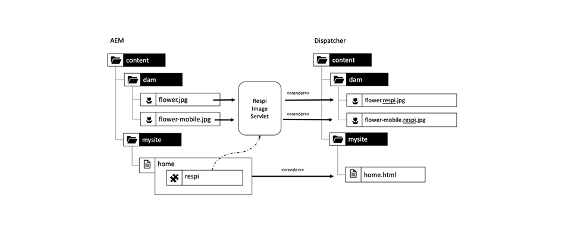
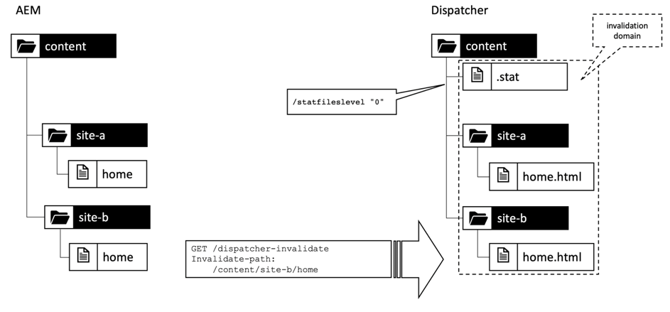

# 第1章 — Dispatcherの概念、パターンおよびアンチパターン

## 概要

この章では、Dispatcherの履歴と仕組みについて簡単に説明し、これがAEM開発者がコンポーネントをデザインする方法に与える影響について説明します。

## 開発者がインフラストラクチャに関心を持つ理由

Dispatcherは、ほとんどの場合、重要な部分です(一部のAEMインストールではない場合)。 Dispatcherの設定方法やヒント、テクニックを紹介するオンライン記事が多数あります。

しかし、これらの情報の断片は常に非常に技術的なレベルで始まります。つまり、何をしたいかが既にわかっていて、目的の達成方法に関する詳細のみを提供していると仮定します。 ディスパッチャーではできることとできないことに関しては、_の内容と理由_&#x200B;を説明する概念論文は見つかりません。

### アンチパターン：後思考としてのDispatcher

この基本的な情報が不足しているため、多くのAEMプロジェクトで見たアンチパターンが生じます。

1. DispatcherはApache Webサーバーにインストールされるので、プロジェクト内の「Unix神」の役割で設定します。 「死に際のjava開発者」は、それに関わる必要はありません。

2. Java開発者は、自分のコードが動作することを確認する必要があります。後でDispatcherが魔法のように高速化します。 Dispatcherは常に後考です。 ただし、これは機能しません。 開発者は、Dispatcherを考慮してコードをデザインする必要があります。 彼はそれを行うための基本的な概念を知る必要があります

### 「最初に動作させる — 次に速くする」が常に正しくない

_「まず動作させ、次に速くして」というプログラミングのアドバイスを聞いたことがあるかもしれません。_」を選択します。全く間違っているわけではない。 ただし、正しいコンテキストがないと、誤って解釈され、正しく適用されない傾向があります。

開発者がコードを早めに最適化するのを防ぐ必要があります。これは、実行されない、またはあまり実行されないので、最適化が最適化に組み込まれるという理由を十分に説明するのに十分な影響はありません。 さらに、最適化はより複雑なコードを引き起こし、バグを引き起こす可能性があります。 したがって、開発者は、1行のコードをマイクロ最適化するのに多くの時間を費やさないでください。 適切なデータ構造、アルゴリズム、ライブラリを選択し、プロファイラーのホットスポット分析を待って、より完全な最適化が全体的なパフォーマンスを向上させる場所を確認します。

### アーキテクチャの決定と成果物

しかし、「アーキテクチャ」の決定に関しては、「最初に動作させ、次に速くする」というアドバイスは全く間違っています。 建築上の決定とは？ 簡単に言えば、それらは高価で、難しく、後で変更できない決定です。 「高価」は「不可能」と同じ場合があることに注意してください。  例えば、プロジェクトの予算が足りない場合、高価な変更は実装できません。 インフラの変化は、ほとんどの人の心に生じる、そのカテゴリーの最初の変化です。 しかし、別の種類の「建築」の人工物もあり、それは変化に非常に厄介になる可能性があります。

1. アプリケーションの「中央」にあるコードの断片。他の多くの部分が依存しています。 これらを変更するには、すべての依存関係を一度に変更し、再テストする必要があります。

2. アーティファクトは、何らかの非同期的でタイミングに依存するシナリオに関係し、入力とシステムの動作は非常にランダムに変化する可能性があります。 変更は、予測できない影響を及ぼし、テストが困難な場合があります。

3. システムのあらゆる部分で使用され、何度も何度も繰り返し使用されるソフトウェアパターン。 ソフトウェアパターンが最適でないことが判明した場合は、そのパターンを使用するすべてのアーティファクトを再コードする必要があります。

一時保存? このページの上部で、DispatcherはAEMアプリケーションの重要な部分であると述べました。 Webアプリケーションへのアクセスは非常にランダムです。ユーザーは予測不可能なタイミングでアクセスし続けます。 最後に — すべてのコンテンツがDispatcherにキャッシュされます（または必要です）。 ですから、注意を深く払えば、キャッシュは「アーキテクチャ」アーティファクトと見なされ、チームの全メンバー、開発者、管理者に理解される必要があることに気づいたかもしれません。

開発者が実際にDispatcherを設定する必要はありません。 また、Dispatcherでコードを活用できるようにするには、概念（特に境界）を把握する必要があります。

Dispatcherは、コードの速度を魔法で向上させるわけではありません。 開発者は、Dispatcherを考慮してコンポーネントを作成する必要があります。 だから、彼はその仕組みを知る必要がある。

## Dispatcherのキャッシュ — 基本原則

### キャッシュHttp — ロードバランサーとしてのDispatcher

Dispatcherとは何ですか？そもそも「Dispatcher」と呼ばれるのはなぜですか？

Dispatcherは

* 最初にキャッシュが

* リバースプロキシ

* Apache httpd Webサーバー用のモジュールで、AEM関連の機能をApacheの汎用性に追加し、他のすべてのApacheモジュール（SSLやSSIなど、後で見るようにSSIが含まれるなど）とスムーズに動作します。

Webの初期の日には、サイトへの訪問者数が数百人になると予想されます。 1つのDispatcherを「ディスパッチ」する、または複数のAEMパブリッシュサーバーに対する要求の負荷を分散させる、つまり、通常は十分だった（したがって、「Dispatcher」という名前）設定。 しかし、現在では、この設定はあまり頻繁には使用されていません。

この記事では、Dispatcherとパブリッシュシステムを設定する様々な方法について後述します。 まず、httpキャッシュの基本事項を紹介します。


*Dispatcherキャッシュの基本機能*

<br> 

ディスパッチャーの基本については、こちらで説明します。 Dispatcherは、HTTPリクエストを受信および作成する機能を備えた、単純なキャッシュのリバースプロキシです。 通常のリクエスト/応答サイクルは次のようになります。

1. ユーザーがページをリクエストする
2. Dispatcherは、そのページのレンダリングされたバージョンが既にある場合、それを確認します。 このページに対する最初の要求で、Dispatcherがローカルにキャッシュされたコピーを見つけられないとします。
3. Dispatcherがパブリッシュシステムにページを要求します
4. パブリッシュシステムでは、ページはJSPまたはHTLテンプレートによってレンダリングされます
5. ページがDispatcherに返されます。
6. Dispatcherがページをキャッシュします
7. Dispatcherがページをブラウザーに返す
8. 同じページを2回目にリクエストした場合、パブリッシュインスタンスで再レンダリングする必要なく、Dispatcherキャッシュから直接提供できます。 これにより、パブリッシュインスタンスでのユーザーとCPUサイクルの待ち時間を節約できます。

最後の節で「ページ」について話していました。 ただし、同じスキームは、画像、CSSファイル、PDFのダウンロードなど、他のリソースにも適用されます。

#### データのキャッシュ方法

Dispatcherモジュールは、ホストするApacheサーバーが提供する機能を利用します。 HTMLページ、ダウンロード、画像などのリソースは、単純なファイルとしてApacheファイルシステムに保存されます。 簡単な話です

ファイル名は、要求されたリソースのURLによって生成されます。 ファイル`/foo/bar.html`を要求した場合は、例えば/`var/cache/docroot/foo/bar.html`の下に保存されます。

原則として、すべてのファイルがキャッシュされ、Dispatcherに静的に保存される場合は、パブリッシュシステムのプラグを取り込むと、DispatcherがシンプルなWebサーバーとして機能します。 しかし、これは原理を説明するためだけです。 現実の生活はより複雑です。 レンダリングプロセスの動的な性質上、リソースの数が無限になる可能性があるので、すべてをキャッシュすることはできません。また、キャッシュが完全に「いっぱい」になることはありません。 静的ファイルシステムのモデルは、Dispatcherの機能の概要を生成するのに役立ちます。 また、Dispatcherの制限事項を説明するのに役立ちます。

#### AEMのURL構造とファイルシステムマッピング

Dispatcherについて詳しく理解するには、単純なサンプルURLの構造をもう一度確認します。  次の例を見てみましょう。

`http://domain.com/path/to/resource/pagename.selectors.html/path/suffix.ext?parameter=value&amp;otherparameter=value#fragment`

* `http` プロトコルを示します

* `domain.com` はドメイン名です。

* `path/to/resource` は、リソースがCRXに保存され、その後Apacheサーバーのファイルシステムに保存されるパスです

ここから、AEMファイルシステムとApacheファイルシステムの間で少し違いがあります。

AEM で,

* `pagename` はリソースラベルです。

* `selectors` は、リソースのレンダリング方法を決定するためにSlingで使用される多数のセレクターを表します。URLは、任意の数のセレクターを持つことができます。 それらはピリオドで区切られます。 セレクターセクションは、例えば、「french.mobile.fancy」のようなものです。 セレクターには、文字、数字、ダッシュのみを含める必要があります。

* `html` は、「セレクター」の最後となるので、拡張と呼ばれます。AEM/Slingでは、レンダリングスクリプトも部分的に決定されます。

* `path/suffix.ext` は、URLのサフィックスとなるパスに似た式です。AEMスクリプトで使用して、リソースのレンダリング方法をさらに制御できます。 この部分については後で全体を説明します。 現時点では、追加のパラメーターとして使用できることを知っておくだけで十分です。 サフィックスには拡張子が必要です。

* `?parameter=value&otherparameter=value` は、URLのクエリセクションです。任意のパラメーターをAEMに渡すために使用されます。 パラメーターを持つURLはキャッシュできないので、パラメーターは、絶対に必要な場合に限定する必要があります。

* `#fragment`の場合、URLのフラグメント部分はAEMに渡されず、ブラウザーでのみ使用されます。JavaScriptフレームワークで、「ルーティングパラメーター」として、またはページの特定の部分にジャンプする場合。

Apache(*)では、次の図*&#x200B;を参照します。

* `pagename.selectors.html` は、キャッシュのファイルシステムでファイル名として使用されます。

URLにサフィックス`path/suffix.ext`が付いている場合、

* `pagename.selectors.html` はフォルダーとして作成されます。

* `path` フォルダー内のフォ `pagename.selectors.html` ルダー

* `suffix.ext` は、フォルダー内のファイル `path` です。注意：サフィックスに拡張子がない場合、ファイルはキャッシュされません。


*DispatcherからURLを取得した後のファイルシステムのレイアウト*

<br> 

#### 基本的な制限事項

URL、リソース、ファイル名のマッピングは非常に簡単です。

しかし、罠に気付いたかもしれない

1. URLは非常に長くなる場合があります。 `/docroot`の「パス」部分をローカルファイルシステムに追加すると、一部のファイルシステムの制限を簡単に超える可能性があります。 Windows上でNTFSでDispatcherを実行することは、困難な作業です。 しかし、Linuxを使っても安全です。

2. URLには、特殊文字とウムラウトを含めることができます。 これは通常、Dispatcherに関する問題ではありません。 URLはアプリケーションの様々な場所で解釈されます。 多くの場合、アプリケーションの奇妙な動作を見てきました — ごくまれに使用される（カスタム）コードの一部が、特殊文字に対して十分にテストされていないことを知るためです。 できるなら、避けるべきです。 できない場合は、徹底的なテストを計画します。

3. CRXでは、リソースにサブリソースが含まれます。 例えば、1つのページに複数のサブページが含まれるとします。 ファイル・システムにはファイルまたはフォルダが含まれるため、ファイル・システム内で一致させることはできません。

#### 拡張子のないURLがキャッシュされない

URLには常に拡張子が必要です。 AEMでは拡張子なしでURLを提供できますが、 これらのURLは、Dispatcherにキャッシュされません。

**例**

`http://domain.com/home.html` はキャッシュ **可能**

`http://domain.com/home` がキャッシュ **不可**

URLにサフィックスが含まれる場合も、同じルールが適用されます。 サフィックスには、キャッシュ可能な拡張子が必要です。

**例**

`http://domain.com/home.html/path/suffix.html` はキャッシュ **可能**

`http://domain.com/home.html/path/suffix` がキャッシュ **不可**

リソースパートに拡張子がなく、サフィックスに拡張子がある場合、どうなるかと思うかもしれません。 この場合、URLにはサフィックスがまったくありません。 次の例を見てみましょう。

**例**

`http://domain.com/home/path/suffix.ext`

`/home/path/suffix`はリソースへのパスなので、URLにサフィックスは含まれません。

**まとめ**

常に、パスとサフィックスの両方に拡張子を追加します。 SEOに対応する人々は、これが検索結果でのランク付けであると、時々主張します。 しかし、キャッシュされていないページは非常に遅くなり、さらにランクが下がります。

#### 競合するサフィックスURL

2つの有効なURLがあるとします。

`http://domain.com/home.html`

および

`http://domain.com/home.html/suffix.html`

これらはAEMで絶対に有効です。 ディスパッチャーなしでは、ローカル開発マシンに問題は発生しません。 また、UATや負荷テストで問題が発生しない可能性も高くなります。 我々が直面している問題は、ほとんどのテストを抜き取るほど微妙です。  ピーク時には厳しい影響を受け、対処する時間が制限され、サーバーへのアクセスもない可能性が高く、修正するリソースもない可能性があります。 私たちはそこに行った…

それで…何が問題なの？

`home.html` ファイルシステムには、ファイルまたはフォルダを指定できます。AEMの場合と同時には、両方とも同時にはできません。

最初に`home.html`を要求すると、ファイルとして作成されます。

`home.html/suffix.html`に対する以降の要求は有効な結果を返しますが、ファイル`home.html`はファイルシステム内の位置を「ブロック」するので、`home.html`を2回目にフォルダーとして作成することはできないので、`home.html/suffix.html`はキャッシュされません。


*ファイル・システム内のファイル・ブロック位置により、サブ・リソースがキャッシュされない*

<br> 

逆の方法で実行する場合は、最初に`home.html/suffix.html`を要求し、`suffix.html`は最初にフォルダー`/home.html`の下にキャッシュされます。 ただし、このフォルダーは削除され、後で`home.html`をリソースとしてリクエストすると、ファイル`home.html`に置き換えられます。


*親がリソースとして取得された場合のパス構造の削除*

<br> 

したがって、キャッシュされる結果は完全にランダムで、受信要求の順序に応じて異なります。 さらに難しいのは、通常複数のディスパッチャーを持っているという事実です。 また、パフォーマンス、キャッシュのヒット率および動作は、Dispatcherによって異なる場合があります。 Webサイトが応答しない理由を調べたい場合は、不適切なキャッシュ順序を持つ正しいDispatcherを確認する必要があります。 幸運にも、より好ましいリクエストパターンを持つDispatcherを探している場合は、問題を見つけようとすると失われます。

#### 競合するURLの回避

サフィックスを持つリソースに別の拡張子を使用する場合、「競合するURL」を回避できます。この場合、ファイルシステム内の同じパスに対してフォルダー名とファイル名が「競合」します。

**例**

* `http://domain.com/home.html`

* `http://domain.com/home.dir/suffix.html`

どちらも完全にキャッシュ可能だ


サフィックスをリクエストする場合、またはサフィックスを完全に使用しない場合は、リソースに専用の拡張子「dir」を選択する。 彼らが役に立つケースは稀だ。 そして、これらのケースを正しく実装するのは簡単です。  次の章で説明するように、キャッシュの無効化とフラッシュについて説明します。

#### キャッシュ不能なリクエスト

最後の章の簡単な概要と、その他の例外を見てみましょう。 URLがキャッシュ可能として設定されている場合、およびURLがGETリクエストである場合、DispatcherはURLをキャッシュできます。 次のいずれかの例外の下でキャッシュすることはできません。

**キャッシュ可能なリクエスト**

* 要求は、Dispatcher設定でキャッシュ可能に設定されています
* リクエストはプレーンGETリクエストです

**キャッシュ不可能なリクエストまたは応答**

* 設定（パス、パターン、MIMEタイプ）によってキャッシュが拒否された要求
* 「Dispatcher:no-cache」ヘッダー
* 「Cache-Control:no-cache|private&quot;ヘッダー
* 「Pragma:no-cache」ヘッダー
* クエリパラメーターを使用したリクエスト
* 拡張子のないURL
* 拡張子を持たないサフィックスを持つURL
* 200以外のステータスコードを返す応答
* POST 要求

## キャッシュの無効化とフラッシュ

### 概要

最後の章では、Dispatcherが要求をキャッシュできない場合に、多数の例外がリストされています。 しかし、考慮すべき点が他にもあります。Dispatcher _は_&#x200B;リクエストをキャッシュできるので、必ずしも&#x200B;_が_&#x200B;必要であるとは限りません。

ポイントは次のとおりです。通常、キャッシュは簡単です。 Dispatcherは、応答の結果を保存し、次回、まったく同じ要求が受信されたときに返すだけで済みます。 Right? 違う！

難しい点は、キャッシュの&#x200B;_無効化_&#x200B;または&#x200B;_フラッシュ_&#x200B;です。 リソースが変更された場合、Dispatcherはを見つけ出し、再度レンダリングする必要があります。

これは一見些細な仕事のように見えるが…。 さらに詳しく読むと、単一のリソースと単純なリソース、および複数のリソースの高度にメッシュされた構造に依存するページの間に、いくつかの難しい違いが見つかります。

### シンプルなリソースとフラッシュ

特別な「サム」セレクターを使用して、要求されたときに各画像のサムネールレンディションを動的に作成するAEMシステムを設定しました。

`/content/dam/path/to/image.thumb.png`

もちろん、元の画像にセレクターレスのURLを提供するURLを提供します。

`/content/dam/path/to/image.png`

サムネールと元の画像の両方をダウンロードすると、最終的には次のようなものになります。

```
/var/cache/dispatcher/docroot/content/dam/path/to/image.thumb.png

/var/cache/dispatcher/docroot/content/dam/path/to/image.png
```

をDispatcherのファイルシステムに置き換えます。

これで、ユーザーはそのファイルの新しいバージョンをアップロードし、アクティベートします。 最終的に、無効化要求がAEMからDispatcherに送信されます。

```
GET /invalidate
invalidate-path:  /content/dam/path/to/image

<no body>
```

無効化は簡単です。Dispatcher上の特別な「/invalidate」URLに対する単純なGETリクエスト。 HTTP本文は不要で、「ペイロード」は単に「invalidate-path」ヘッダーです。 また、ヘッダー内のinvalidate-pathは、AEMが認識するリソースであり、Dispatcherがキャッシュしたファイルではありません。 AEMはリソースについてのみ認識します。 拡張機能、セレクターおよびサフィックスは、リソースが要求されると実行時に使用されます。 AEMは、リソースで使用されているセレクターに関するブックキーピングを実行しないので、リソースをアクティブ化する際に、リソースパスが確実に把握できるのは、リソースパスだけです。

これで十分です。 リソースが変更された場合は、そのリソースのすべてのレンディションも変更されたと見なすことができます。 この例では、画像が変更された場合、新しいサムネールもレンダリングされます。

Dispatcherは、キャッシュされたすべてのレンディションを使用して、リソースを安全に削除できます。 これは次のようなことをします。

`$ rm /content/dam/path/to/image.*`

`image.png`と`image.thumb.png`を削除し、そのパターンに一致するその他すべてのレンディションを削除する。

リクエストに応答するのに1つのリソースを使用する限り、非常に単純です。

### 参照とメッシュコンテンツ

#### メッシュコンテンツの問題

AEMにアップロードされた画像や他のバイナリファイルとは異なり、HTMLページは孤立した動物ではありません。 彼らは群れの中に住み、ハイパーリンクと参照によって互いに深く結びついている。 シンプルなリンクは無害ですが、コンテンツ参照について話す際には難しくなります。 ページ上のユビキタスなトップナビゲーションまたはティーザーは、コンテンツ参照です。

#### コンテンツ参照とそれが問題となる理由

簡単な例を見てみましょう。 ある旅行会社は、カナダ旅行を促進するWebページを持っています。 このプロモーションは、他の2つのページ（「ホーム」ページと「冬物スペシャル」ページ）のティーザーセクションで紹介されています。

両方のページに同じティーザーが表示されるので、各ページに対して複数回ティーザーを作成するよう作成者に依頼するのは不要です。 代わりに、ターゲットページ「カナダ」は、ページプロパティのセクションを予約してティーザーの情報を提供します。または、そのティーザー全体をレンダリングするURLを提供するためにも使用します。

`<sling:include resource="/content/home/destinations/canada" addSelectors="teaser" />`

または

`<sling:include resource="/content/home/destinations/canada/jcr:content/teaser" />`


AEMでのみチャームのように機能しますが、パブリッシュインスタンスでDispatcherを使用すると、何か変なことが起こります。

例えば、Webサイトを公開したとします。 カナダのページのタイトルは「Canada」です。 訪問者がそのページへのティーザー参照を持つホームページを要求すると、「カナダ」ページのコンポーネントは、

```
<div class="teaser">
  <h3>Canada</h3>
  
</div>
```

** をホームページに追加します。ホームページは、Dispatcherによって静的な.htmlファイル（ティーザーを含む）として保存され、ファイル内で見出しとなります。

これで、マーケターは、ティーザーのヘッドラインが実用的であることを学びました。 そこで、タイトルを「カナダ」から「カナダを訪問」に変更し、画像も更新します。

彼が編集した「カナダ」のページを公開し、以前に公開したホームページを再訪問して、彼の変更を確認します。 しかし、何も変わっていない。 古いティーザーが表示されます。 彼が「冬の特別」を再確認します。 そのページはこれまでにリクエストされたことがないので、Dispatcherで静的にキャッシュされません。 したがって、このページは「公開」によって新しくレンダリングされ、このページには新しい「カナダ訪問」ティーザーが含まれます。


*古い含まれるコンテンツをホームページに保存するDispatcher*

<br> 

何があった？ Dispatcherは、レンダリング中に他のリソースから描画されたすべてのコンテンツとマークアップを含むページの静的バージョンを保存します。

Dispatcherは、単なるファイルシステムベースのWebサーバーですが、高速でありながら比較的シンプルです。 含まれるリソースが変更されても、それには気付きません。 含めるページがレンダリングされたときに、そのコンテンツに対して引き続きクリックされます。

「冬物特別」ページはまだレンダリングされていないので、Dispatcherに静的バージョンはないので、リクエストに応じて新しくレンダリングされるので、新しいティーザーと共に表示されます。

Dispatcherは、レンダリング時にタッチしたすべてのリソースを追跡し、そのリソースが変更されたときに、このリソースを使用したすべてのページをフラッシュすると考えるかもしれません。 ただし、Dispatcherはページをレンダリングしません。 レンダリングはパブリッシュシステムによって実行されます。 Dispatcherは、レンダリングされた.htmlファイルに格納されるリソースを認識しません。

まだ納得できない？ *&quot;依存関係の追跡&quot;*&#x200B;を実装する方法が必要だと思うかもしれません。 *は*&#x200B;でした。 AEMのCommuniqué 3偉大な曽祖父は、ページのレンダリングに使用された&#x200B;_session_&#x200B;に依存関係トラッカーを実装していました。

リクエストの間、このセッションを通じて取得された各リソースは、現在レンダリング中のURLの依存関係として追跡されました。

しかし、依存関係の追跡は非常に高価でした。 すぐに、依存関係のトラッキング機能を完全にオフにし、1つのHTMLページが変更された後にすべてのHTMLページを再レンダリングすることに依存している場合、Webサイトの方が速いことがわかりました。 また、その計画も完璧ではなく、途中に落とし穴や例外が多くありました。 場合によっては、リクエストのデフォルトセッションを使用してリソースを取得するのではなく、管理セッションを使用してリクエストをレンダリングするヘルパーリソースを取得することがありました。 通常、これらの依存関係は追跡されず、キャッシュを手動でフラッシュするようopsチームに問い合わせる頭痛や電話が発生しました。 彼らがそれを行う標準的な手続きを持っていたら、あなたは幸運でした。 途中にはもっと引っ掛かりがあったが…思い出はやめよう。 これは2005年に遡ります 最終的に、この機能はCommuniqué 4でデフォルトで非アクティブ化され、後続のCQ5に戻されず、AEMになりました。

### 自動無効化

#### 依存関係の追跡よりもフルフラッシュの方が安い場合

CQ5以降は、1つのページのみが変更された場合、サイト全体を無効化する（多かれ少なかれ）ことに依存します。 この機能は「自動無効化」と呼ばれます。

しかし、何百ものページを捨てて再レンダリングするというのは、適切な依存関係の追跡や部分的な再レンダリングよりも安いのはなぜでしょうか。

主な理由は次の2つです。

1. 平均的なWebサイトでは、頻繁にリクエストされるページの一部のみが表示されます。 したがって、レンダリングされたコンテンツをすべて捨てた場合でも、実際にはその直後に数十件しか要求されません。 ページの長い末尾のレンダリングは、実際にリクエストされた場合に、時間の経過と共に分散できます。 したがって、実際には、ページのレンダリングの負荷は予想ほど高くありません。 もちろん、常に例外があります。後で、空のDispatcherキャッシュを持つ大規模なWebサイトで均等に分散された読み込みを処理する方法に関するいくつかのテクニックを説明します。

2. すべてのページは、メインナビゲーションで接続されます。 したがって、最終的には、ほとんどすべてのページが相互に依存しています。 つまり、最もスマートな依存関係トラッカーでも、既に知っていることを見つけ出すことができます。いずれかのページが変更された場合は、それ以外のすべてのページを無効にする必要があります。

信じないの？ 最後の点を説明しよう。

リモートページのコンテンツを参照するティーザーを使用する場合、最後の例と同じ引数を使用します。 現時点では、より極端な例を使用しています。自動的にレンダリングされたメインナビゲーション。 ティーザーと同様に、ナビゲーションタイトルは、リンクされたページまたは「リモート」ページからコンテンツ参照として描画されます。 リモートナビゲーションタイトルは、現在レンダリングされているページには保存されません。 ナビゲーションはWebサイトの各ページおよびすべてのページでレンダリングされることに注意してください。 したがって、メインナビゲーションを持つすべてのページで、1つのページのタイトルが何度も繰り返し使用されます。 ナビゲーションタイトルを変更する場合は、ページを参照する各ページではなく、リモートページで1回だけ変更する必要があります。

この例では、ナビゲーションは、ターゲットページの「NavTitle」を使用してナビゲーションで名前をレンダリングすることで、すべてのページをメッシュ化します。 「アイスランド」のナビゲーションタイトルは、「アイスランド」ページから引き出され、メインナビゲーションを持つ各ページにレンダリングされます。


*メインナビゲーションでは、必ず「NavTitles」を引き出すことですべてのページのコンテンツをメッシュ化する*

<br> 

アイスランドページのNavTitleを「アイスランド」から「美しいアイスランド」に変更すると、他のすべてのページのメインメニューでそのタイトルが直ちに変更されます。 したがって、変更前にレンダリングおよびキャッシュされたページはすべて古くなり、無効化する必要があります。

#### 自動無効化の実装方法：.statファイル

何千ページものページを含む大規模なサイトがある場合、すべてのページをループして物理的に削除するのにかなり時間がかかります。 その間、Dispatcherは意図せず古いコンテンツを提供する可能性がありました。 さらに悪いことに、キャッシュファイルへのアクセス中に競合が発生する可能性があります。おそらく、削除中のページがリクエストされるか、その直後のアクティベーション後に2回目の無効化が発生したためページが再び削除されます。 それがどんなに乱雑か考えてみて下さい。 幸い、これは起こりません。 Dispatcherは、次のようなことを避けるために、巧妙なトリックを使用します。何百も何千ものファイルを削除する代わりに、ファイルが公開され、依存するすべてのファイルが無効と見なされるときに、単純な空のファイルがファイルシステムのルートに配置されます。 このファイルは「statfile」と呼ばれます。 statfileは空のファイルです。statfileに関して重要なのは作成日のみです。

statfileより古い作成日を持つDispatcher内のすべてのファイルは、最後のアクティベーション（および無効化）より前にレンダリングされているので、「無効」と見なされます。 これらは引き続きファイルシステムに物理的に存在しますが、Dispatcherは無視します。 それらは「古い」。 古いリソースに対する要求がおこなわれるたびに、DispatcherはAEMシステムにページの再レンダリングを要求します。 新しくレンダリングされたページは、新しい作成日付でファイルシステムに保存され、再び新しくなります。


*.statファイルの作成日により、古く新しいコンテンツを定義します*

<br> 

「.stat」と呼ばれる理由を尋ねるかもしれません。 「.invalidated」ではないのか？ ファイルシステムにそのファイルを含めると、静的なWebサーバーと同様に、Dispatcherが&#x200B;*静的に*&#x200B;提供できるリソースを判断するのに役立つと考えてもよいでしょう。 これらのファイルは、これ以上動的にレンダリングする必要はありません。

しかし、名前の真の性質は比喩的ではありません。 これは、Unixシステムコール`stat()`から派生し、ファイルの変更時刻（他のプロパティなど）を返します。

#### 単純検証と自動検証の混在

しかし…先ほど言ったように、1つのリソースは物理的に削除されます。 現在、より新しいstatfileは、Dispatcherの目では事実上無効になります。 なぜ最初に物理的な削除を？

答えは簡単です。 通常、両方の戦略を並行して使用しますが、リソースの種類が異なります。 画像などのバイナリアセットは自己完結型です。 他のリソースとは関係がなく、情報をレンダリングする必要があるという意味です。

一方、HTMLページは非常に相互に依存しています。 そのため、これらに対して自動無効化を適用します。 これは、Dispatcherのデフォルト設定です。 無効化されたリソースに属するすべてのファイルが物理的に削除されます。 また、「.html」で終わるファイルは自動的に無効化されます。

Dispatcherは、自動無効化スキームを適用するかどうかに関わらず、ファイル拡張子を決定します。

自動無効化のファイル終了は設定可能です。 理論上は、自動無効化のためにすべての拡張機能を含めることができます。 しかし、これは非常に高い価格になることに注意してください。 古いリソースが意図せずに配信されることはありませんが、配信のパフォーマンスは、過度の無効化によって大幅に低下します。

例えば、PNGとJPGが動的にレンダリングされ、他のリソースに依存するスキームを実装するとします。 高解像度の画像をWeb互換のより小さな解像度に再調整する必要が生じる場合があります。 圧縮率も変わります。 この例の解像度と圧縮率は、固定定数ではなく、画像を使用するコンポーネント内の設定可能なパラメーターです。 このパラメーターを変更した場合は、画像を無効にする必要があります。

問題なし — 自動無効化に画像を追加し、何かが変更された場合は常に新しいレンダリング画像を使用できることを学びました。

#### 湯水で赤ちゃんを放り出す

その通りで、これは大きな問題です。 最後の段落をもう一度読みます。 「。..何かが変更された場合は常に、新しくレンダリングされたイメージ」 ご存じの通り、良いウェブサイトは絶えず変わっています。ここに新しいコンテンツを追加し、そこでタイポを修正し、他の場所でティーザーを微調整します。 つまり、すべての画像は常に無効化され、再レンダリングする必要があります。 それを甘く見るな。 画像データの動的なレンダリングと転送は、ローカル開発マシン上でミリ秒単位で機能します。 実稼動環境では、1秒あたり100倍の頻度でこれを実行する必要があります。

ここでは、HTMLページが変更された場合（またはその逆の場合）、JPGを再レンダリングする必要があることを明確にします。 自動無効化するファイルの「バケット」は1つだけです。 全体としてフラッシュされる。 詳細な構造に分解する手段もなく

自動無効化がデフォルトで「.html」に保持されるのは、適切な理由があります。 目標は、そのバケットをできるだけ小さく保つことです。 全てを無効にして、安全な側にいるだけで、お湯で赤ん坊を捨てないでください。

自己完結型のリソースは、そのリソースのパスで提供する必要があります。 それは多くの無効化に役立ちます。 「/x/y/z」から「resource /a/b/c」が提供されるなど、マッピングスキームを作成しないでください。 コンポーネントをデフォルトのDispatcherの自動無効化設定で動作させます。 Dispatcherでの過度の無効化を使用して、設計が正しくないコンポーネントの修復を試みないでください。

##### 自動無効化の例外：ResourceOnlyの無効化

Dispatcherの無効化要求は、通常、レプリケーションエージェントによってパブリッシュシステムから実行されます。

依存関係に対して非常に自信を持っている場合は、独自の無効化レプリケーションエージェントを構築できます。

詳しく説明するには、このガイドの少しは過ぎますが、少なくともいくつかのヒントをお伝えします。

1. 本当に自分が何をしているか知っている。 無効化権を取るのは本当に難しい。 これが、自動無効化が非常に厳しい理由の一つです。古いコンテンツを配信しないようにする。

2. エージェントがHTTPヘッダー`CQ-Action-Scope: ResourceOnly`を送信した場合、この1回の無効化リクエストでは自動無効化がトリガーされません。 この( [https://github.com/cqsupport/webinar-dispatchercache/tree/master/src/refetching-flush-agent/refetch-bundle](https://github.com/cqsupport/webinar-dispatchercache/tree/master/src/refetching-flush-agent/refetch-bundle) )コードは、独自のレプリケーションエージェントの出発点として適しています。

3. `ResourceOnly`に設定すると、自動無効化のみを防ぎます。必要な依存関係の解決と無効化を実際におこなうには、自身で無効化リクエストをトリガーする必要があります。 パッケージのDispatcherフラッシュルール([https://adobe-consulting-services.github.io/acs-aem-commons/features/dispatcher-flush-rules/index.html](https://adobe-consulting-services.github.io/acs-aem-commons/features/dispatcher-flush-rules/index.html))を調べて、実際にどのように起こるかを確認することができます。

依存関係解決スキームを構築することはお勧めしません。 努力が多すぎて利益が少なすぎて、前にも言ったように、間違いを招くほど多い。

代わりに、他のリソースに依存しないリソースを特定し、自動無効化をおこなわずに無効化できます。 ただし、その場合はカスタムレプリケーションエージェントを使用する必要はありません。 Dispatcher設定で、これらのリソースを自動無効化から除外するカスタムルールを作成します。

主なナビゲーションやティーザーは依存関係のソースであると言いました。 ナビゲーションとティーザーを非同期で読み込む場合や、ApacheでSSIスクリプトを使用して組み込む場合、追跡する依存関係はありません。 このドキュメントでは、「Sling Dynamic Includes」について説明する際に、コンポーネントの非同期読み込みについて詳しく説明します。

ポップアップウィンドウや、Lightboxに読み込まれるコンテンツに対しても同じことが言えます。 これらの要素には、ナビゲーション（「依存関係」）がほとんどなく、単一のリソースとして無効化することもできます。

## Dispatcherを念頭に置いたコンポーネントの構築

### 実際の例でのDispatcherの仕組みの適用

最後の章では、Dispatcherの基本的な仕組み、一般的な動作、制限事項について説明しました。

次に、これらのメカニズムを、プロジェクトの要件に基づくコンポーネントのタイプに適用します。 我々は、コンポーネントを慎重に選択し、遅かれ早かれ直面する問題を示す。 恐れない — すべてのコンポーネントが、我々が提示するこの量の考慮を必要としない。 しかし、そのようなコンポーネントを構築する必要がある場合は、結果をよく知っていて、それらの処理方法を知っています。

### スプールコンポーネント（アンチ）パターン

#### レスポンシブ画像コンポーネント

相互に接続されたバイナリを持つコンポーネントの共通のパターン（またはアンチパターン）を説明します。 「レスポンシブ画像」用のコンポーネント「respi」を作成します。 このコンポーネントは、表示される画像を、その画像が表示されるデバイスに適応させることができます。 デスクトップやタブレットでは、画像のフル解像度、狭い切り抜きを含む小さなバージョン、または完全に異なるモチーフ（レスポンシブな世界では「アートディレクション」と呼ばれる）を携帯電話で表示します。

アセットはAEMのDAM領域にアップロードされ、レスポンシブ画像コンポーネントで&#x200B;_参照_&#x200B;のみが表示されます。

応答コンポーネントは、マークアップのレンダリングとバイナリ画像データの配信の両方を処理します。

ここでの実装方法は、多くのプロジェクトで見た共通のパターンで、AEMのコアコンポーネントの1つでも、そのパターンに基づいています。 したがって、開発者としてそのパターンを適応させる可能性が非常に高くなります。 カプセル化の点では優れていますが、Dispatcher対応にするには多くの労力が必要です。 後で、問題を軽減する方法についていくつかのオプションを説明します。

ここで使用するパターンを「スプーラパターン」と呼びます。これは、問題がCommuniqué 3の初期の頃に起こったもので、リソース上で呼び出してバイナリの生データを応答に送る方法「スプール」があったからです。

元の「スプール」という用語は、実際には、プリンターなどの、共有の低速なオフライン周辺機器を指すので、ここでは正しく適用されません。 でも私たちはこの言葉が好きですなぜならオンライン上でこのように区別できる言葉はめったにないからです それぞれのパターンは区別可能な名前を持つべきです これがパターンか反パターンかを決めるのは君次第だ。

#### 実装

レスポンシブ画像コンポーネントの実装方法を次に示します。

コンポーネントは2つの部分で構成されます。最初の部分は画像のHTMLマークアップをレンダリングし、2番目の部分は参照先の画像のバイナリデータを「スプール」します。 これはレスポンシブデザインを備えた最新のWebサイトなので、単純な``タグではなく、`<picture/>`タグ内の画像のセットをレンダリングします。 各デバイスに対して、2つの異なる画像をDAMにアップロードし、画像コンポーネントから参照します。

このコンポーネントには、3つのレンダリングスクリプト（JSP、HTLまたはサーブレットとして実装）があり、それぞれ専用のセレクターで指定されます。

1. `/respi.jsp` - HTMLマークアップをレンダリングするセレクターなし
2. `/respi.img.java` デスクトップバージョンをレンダリングするには
3. `/respi.img.mobile.java` モバイルバージョンをレンダリングする場合。


コンポーネントは、ホームページのparsysに配置されます。 CRXの結果の構造を次に示します。


*CRX内のレスポンシブ画像のリソース構造*

<br> 

コンポーネントのマークアップは、次のようにレンダリングされます。

```plain
  #GET /content/home.html

  <html>

  …

  <div class="responsive-image>

  <picture>
    <source src="/content/home/jcr:content/par/respi.img.mobile.jpg" …/>
    <source src="/content/home/jcr:content/par/respi.img.jpg …/>

    …

  </picture>
  </div>
  …
```

そして…うまくカプセル化された部品を完成させました。

#### 実行中のレスポンシブ画像コンポーネント

これで、ユーザーはページとアセットをDispatcher経由で要求します。 これにより、以下に示すように、Dispatcherファイルシステムにファイルが格納されます。


*カプセル化されたレスポンシブ画像コンポーネントのキャッシュ構造*

<br> 

ユーザーが2つの花画像の新しいバージョンをDAMにアップロードしてアクティベートするとします。 AEMは、無効化要求に従ってを送信します

`/content/dam/flower.jpg`

および

`/content/dam/flower-mobile.jpg`

をDispatcherに送信します。 しかし、これらの要求は無駄です。 コンテンツは、コンポーネントのサブ構造の下にファイルとしてキャッシュされています。 これらのファイルは、古くなりましたが、要求時に引き続き提供されます。


*構造が一致しないため、コンテンツが古くなる*

<br> 

このアプローチには、もう一つ注意が必要です。 複数のページで同じflower.jpgを使用するとします。 次に、同じアセットを複数のURLまたはファイルでキャッシュします。

```
/content/home/products/jcr:content/par/respi.img.jpg

/content/home/offers/jcr:content/par/respi.img.jpg

/content/home/specials/jcr:content/par/respi.img.jpg

…
```

新しいキャッシュされていないページがリクエストされるたびに、そのアセットが異なるURLでAEMから取得されます。 Dispatcherのキャッシュがなく、ブラウザーのキャッシュもなく、配信を高速化できます。

#### スプーラのパターンが輝く場所

自然な例外が一つあり、その単純な形でもこのパターンが役に立つ。バイナリがコンポーネント自体に保存され、DAMには保存されない場合。 ただし、これはWebサイトで1回だけ使用する画像に役立ち、DAMにアセットを保存しないと、アセットの管理が困難になります。 特定のアセットの使用ライセンスがなくなったとします。 アセットを使用したコンポーネントを見つけるにはどうすればよいですか？

見える？ DAMの「M」は、デジタルアセット管理と同様に、「管理」の意味です。 その機能を捨てたくない。

#### まとめ

AEMの開発者の視点から見ると、このパターンは非常にエレガントに見えた。 しかし、Dispatcherを式に取り入れれば、単純なアプローチでは不十分なことに同意できるかもしれません。

今のところ、これがパターンか反パターンかを決めるのは君の任せだ。 上述の問題を軽減する方法について、既に良い考えが頭にあるのではないか。 良かった。 その後、他のプロジェクトがどのようにこれらの問題を解決したかを見たいと思います。

### 一般的なDispatcherの問題の解決

#### 概要

これが、キャッシュに適した方法で実装された可能性について説明します。 オプションはいくつかあります。 時には、最適な解決策を選べない。 既に実行中のプロジェクトに遭遇し、「キャッシュの問題」を直すだけで十分で、本格的なリファクタリングを行うのに十分ではない予算が限られているかもしれません。 または、サンプルの画像コンポーネントよりも複雑な問題に直面します。

以降の節では、原則と注意事項の概要を説明します。

繰り返しますが、これは実際の経験に基づいています。 野生のパターンは既に見ているので学術的な運動ではありません だから反パターンを見せるので、すでに他の人が犯した間違いから学ぶ機会がある。

#### キャッシュキラー

>[!WARNING]
>
>これは反パターンです 使用しないでください。 今まで。

`?ck=398547283745`のようなクエリーパラメーターを見たことがありますか？ これらは、キャッシュキラー(「ck」)と呼ばれます。 クエリパラメーターを追加した場合、リソースはキャッシュされません。 また、パラメーターの値として乱数を追加した場合(「398547283745」など)、URLは一意になり、AEMシステムと画面の間の他のキャッシュもキャッシュできなくなります。 通常の中間容疑者は、Dispatcher、CDN、またはブラウザーキャッシュの前にある「ワニス」キャッシュです。 もう一度：やめなさい。 リソースをできるだけ長くキャッシュする必要がある。 キャッシュはあなたの友人です。 友達を殺すな。

#### 自動無効化

>[!WARNING]
>
>これは反パターンです デジタルアセットには使用しないでください。 Dispatcherのデフォルト設定（「.html」ファイルの場合のみ自動無効化）を維持するようにしてください。

短期的に、Dispatcherの自動無効化設定に「.jpg」と「.png」を追加できます。 つまり、無効化が発生した場合は常に、すべての「.jpg」、「.png」および「.html」を再レンダリングする必要があります。

このパターンは、ビジネスオーナーが自分の変更が十分な速さでライブサイトに実現されないと不満を言う場合に、非常に簡単に実装されます。 しかし、これは、より洗練されたソリューションを考え出すために、時間を購入することしかできません。

パフォーマンスへの大きな影響を必ず理解してください。 これにより、Webサイトの速度が大幅に低下し、ニュースポータルなど、頻繁に変更される負荷の高いWebサイトの場合は、安定性に影響を与える可能性があります。

#### URLフィンガープリント

URLのフィンガープリントは、キャッシュキラーのように見えます。 でも違う。 乱数ではなく、リソースの内容を特徴付ける値です。 これは、リソースのコンテンツのハッシュ、またはリソースがアップロード、編集または更新されたときのタイムスタンプ（さらにシンプル）にすることができます。

Unixタイムスタンプは、実際の実装に十分に適しています。 読みやすさを向上させるために、このチュートリアルでは、より読みやすい形式を使用します。`2018 31.12 23:59 or fp-2018-31-12-23-59`.

フィンガープリントは、クエリパラメーターと共にURLとして使用できません   キャッシュできません。 フィンガープリントには、セレクターまたはサフィックスを使用できます。

例えば、`/content/dam/flower.jpg`ファイルの日付が2018年12月31日(23:59)の`jcr:lastModified`であるとします。 フィンガープリントを含むURLは`/content/home/jcr:content/par/respi.fp-2018-31-12-23-59.jpg`です。

このURLは、参照されるリソース(`flower.jpg`)ファイルが変更されない限り、安定した状態を維持します。 したがって、キャッシュの時間は不定で、キャッシュキラーではありません。

このURLは、レスポンシブ画像コンポーネントで作成および提供する必要があります。 標準のAEM機能ではありません。

それが基本的な概念です。 しかし、見落としがちな細かい点がいくつかある。

この例では、コンポーネントはレンダリングされ、23:59にキャッシュされています。 画像が変更されたので、例えば0時に変更します。  コンポーネント&#x200B;_は、マークアップに新しいフィンガープリントURLを生成します。_

__...と思うかもしれませんが、そうではありません。画像のバイナリのみが変更され、含まれるページに触れなかったので、HTMLマークアップの再レンダリングは不要です。 したがって、Dispatcherはページに古いフィンガープリントを提供し、画像の古いバージョンを提供します。


*画像コンポーネントが参照画像より新しく、新しいフィンガープリントがレンダリングされない。*

<br> 

これで、ホームページ（またはそのサイトの他のページ）を再アクティブ化した場合、statfileは更新され、Dispatcherはhome.htmlを古いと見なし、画像コンポーネントの新しいフィンガープリントを使用して再レンダリングします。

でもホームページは開けなかったよね？ なぜ私たちは、私たちはそれに触れなかったページをアクティベートする必要があるのでしょうか？ また、ページをアクティブ化する権限が十分にない場合や、承認ワークフローに時間がかかりすぎる場合があります。そのため、簡単にはお知らせできません。 では、どうすればいいのでしょうか。

#### 遅延管理ツール — Statfileレベルの低下

>[!WARNING]
>
>これは反パターンです 短期的にのみ使用して、時間を購入し、より高度なソリューションを考え出します。

遅延管理者は通常、自動無効化をjpgに設定し、statfileレベルをゼロに設定します。これは、常にすべての種類の&#x200B;_のキャッシュ問題に役立ちます。_&#x200B;そのアドバイスはテクニカルフォーラムで確認でき、無効化問題に役立ちます。

今までstatfileレベルについては話し合っていない。 基本的に、自動無効化は同じサブツリー内のファイルに対してのみ機能します。 ただし、ページとアセットは通常同じサブツリーに存在しないという問題があります。 ページは`/content/mysite`の下の位置にあり、アセットは`/content/dam`の下の位置にあります。

「statfile level」は、サブツリーの深さルートノードの位置を定義します。 上の例では、レベルは「2」です(1=/content, 2=/mysite,dam)。

statfileレベルを「0に減らす」という考え方は、基本的に/contentツリー全体を1つのサブツリーとして定義し、ページとアセットを同じ自動無効化ドメイン内にライブにすることです。 したがって、（ドキュメントルート「/」で）レベルの大きなツリーにのみ存在します。 ただし、完全に無関係なサイトでも、何かが公開されるたびに、サーバー上のすべてのサイトが自動的に無効化されます。 お問い合わせ：全体的なキャッシュヒット率が大幅に低下するので、長い目で見ると、これは悪い考えです。 お使いのAEMサーバーにキャッシュなしで実行できる十分な火力があることを願っています。

より深いstatfileレベルのメリットは、後で理解できます。

#### カスタム無効化エージェントの実装

とにかく — 「.jpg」または「.png」が変更され、新しいURLで再レンダリングできるようになった場合に、Dispatcherに何らかの方法でHTML-Pagesを無効にする必要があります。

プロジェクトで確認されたのは、例えば、パブリッシュシステム上の特殊なレプリケーションエージェントで、そのサイトの画像が公開されるたびにサイトの無効化要求を送信します。

ここでは、命名規則を使用してアセットのパスからサイトのパスを引き出すことができる場合に、非常に役立ちます。

一般に、サイトとアセットパスを次のように一致させることをお勧めします。

**例**

```
/content/dam/site-a
/content/dam/site-b

/content/site-a
/content/site-b
```

これにより、`/content/dam/site-a`で変更が発生した場合に、カスタムDispatcherフラッシュエージェントが/content/site-aに対して簡単に無効化要求を送信できます。

実際には、同じサイト内で、同じ「サブツリー」内にある限り、Dispatcherに無効にするように指示するパスは関係ありません。 実際のリソースパスを使用する必要もありません。 「仮想」にすることもできます。

`GET /dispatcher-invalidate
Invalidate-path /content/mysite/dummy`


1. DAM内のファイルが変更されると、パブリッシュシステム上のリスナーがトリガーされます

2. リスナーが無効化要求をDispatcherに送信します。 自動無効化のため、サイトのホームページの下にない限り、自動無効化で送信するパスは関係ありません。また、サイトのstatfileレベルでより正確に指定できます。

3. statfileが更新されます。

4. 次回、ホームページが要求されると、再レンダリングされます。 新しいフィンガープリント/日付は、画像のlastModifiedプロパティから追加のセレクターとして取得されます

5. これにより、新しいイメージへの参照が暗黙的に作成されます

6. 画像が実際に要求された場合、新しいレンディションが作成され、Dispatcherに保存されます


#### 掃除の必要性

ふぅ。 完了. 万歳！

まあ…まだ。

パス

`/content/mysite/home/jcr:content/par/respi.img.fp-2018-31-12-23-59.jpg`

は、無効化されたリソースには関連しません。 一時保存? 「ダミー」リソースを無効化し、「ホーム」を無効と見なすための自動無効化に依存していました。 画像自体が&#x200B;_物理的に_&#x200B;削除されることはありません。 したがって、キャッシュは増大し、拡大します。 画像が変更およびアクティブ化されると、Dispatcherのファイルシステムに新しいファイル名が取得されます。

キャッシュされたファイルを物理的に削除せず、無期限に保持する場合は、次の3つの問題があります。

1. ストレージ容量を無駄にしています。 当然：過去数年で、ストレージのコストが低下し、コストが低下しています。 しかし、画像の解像度やファイルサイズも、水晶のような画像を求める網膜のようなディスプレイが登場し、過去数年で大きく成長しています。

2. ハードドライブが安くなったとしても、「ストレージ」は安くならなかったかもしれません。 ベアメタルHDDストレージ（安価）ではなく、データセンタープロバイダがNAS上に仮想ストレージをレンタルする傾向が見られました。 この種のストレージは、より信頼性と拡張性が高いものの、より高コストです。 古くなったゴミを貯めて無駄にしたくないかもしれません。 これは、プライマリ・ストレージに関するだけでなく、バックアップについても考慮します。 標準のバックアップソリューションがある場合は、キャッシュディレクトリを除外できない可能性があります。 最後に、ガベージデータもバックアップします。

3. さらに悪いことに：特定の画像の使用ライセンスを購入した期間は、必要な場合に限り、限られた期間のみに限られます。 ライセンスの有効期限が切れた後もまだ画像を保存している場合は、著作権侵害と見なされる可能性があります。 Webページで画像を使用しなくなる可能性がありますが、Googleでは引き続き画像を見つけます。

最後に、あなたは以前のすべてのファイルをクリーンアップするための家事のcronjobを思いつく…この種の汚れを制御し続ける1週間を例にしましょう。

#### サービス拒否攻撃のURL指紋の使用

しかし、待って、この解決策に別の欠陥がある。

セレクターをパラメーターとして使用しないようにしています。fp-2018-31-12-23-59は、何らかの「キャッシュキラー」として動的に生成される。 しかし、退屈なkid（またはワイルドになった検索エンジンクローラ）がページのリクエストを開始する可能性があります。

```
/content/mysite/home/jcr:content/par/img.fp-0000-00-00-00-00.jpg
/content/mysite/home/jcr:content/par/img.fp-0000-00-00-00-01.jpg
/content/mysite/home/jcr:content/par/img.fp-0000-00-00-00-02.jpg

…
```

各要求はDispatcherをバイパスし、パブリッシュインスタンスに読み込みが発生します。 さらに悪いことに、Dispatcherに従ってを作成します。

したがって、指紋を単純なキャッシュキラーとして使用するのではなく、画像のjcr:lastModified日付を確認し、期待された日付でない場合は404を返す必要があります。 これは、パブリッシュシステムでCPUサイクルが発生するまでに時間がかかります。これは、最初に防ぎたいものです。

#### 高頻度リリースでのURLフィンガープリントの注意事項

フィンガープリントスキーマは、DAMからのアセットに対してのみならず、JSファイルとCSSファイル、および関連リソースに対しても使用できます。

[バージョン管](https://adobe-consulting-services.github.io/acs-aem-commons/features/versioned-clientlibs/index.html) 理されたクライアントライブラリは、この方法を使用するモジュールです。

しかし、ここでは、URL指紋を持つ別の注意事項に直面する可能性があります。URLをコンテンツに結び付けます。 URLを変更する（変更日を更新する）ことなく、コンテンツを変更することはできません。 それが指紋のデザインの原点です。 しかし、新しいCSSおよびJSファイルを使用し、新しい指紋を持つ新しいURLをリリースするとします。 すべてのHTMLページには、古いフィンガープリントURLへの参照が残ります。 したがって、新しいリリースを一貫して機能させるには、すべてのHTMLページを一度に無効にして、新しくフィンガープリントされたファイルを参照して再レンダリングを強制する必要があります。 同じライブラリに依存する複数のサイトがある場合は、かなりの量の再レンダリングが可能です。ここでは、`statfiles`を利用できません。 したがって、ロールアウト後にパブリッシュシステムの読み込みピークを確認する準備をします。 キャッシュウォーミングを使用した青緑のデプロイメントや、Dispatcherの前にあるTTLベースのキャッシュを考えることもできます。可能性は無限です。

#### 短い休憩

わあ — それは考慮すべき細かい部分が多いでしょ？ そしてそれは理解され、テストされ、簡単にデバッグされることを拒否します。 一見エレガントに見える解決策のために。 確かに、エレガントですが、AEMのみの観点からのみ。 Dispatcherと一緒にすると、厄介になります。

それでも、1つの基本的な注意事項を解決しません。画像が異なるページで複数回使用された場合、それらのページの下にキャッシュされます。 そこでは、キャッシュのシナジーはあまりありません。

一般に、URLフィンガープリントはツールキットに含めるのに適したツールですが、既存のツールを少ししか解決せずに新しい問題を引き起こす可能性があるので、慎重に適用する必要があります。

それで…長い章だった。 しかし、このパターンを何度も見てきたので、全ての賛否両論で全体像を示す必要があると感じました。 URLフィンガープリントは、スプーラパターンに固有の問題のいくつかを解決しますが、実装の労力は非常に高く、他の — より簡単な — ソリューションも検討する必要があります。 提案は、提供されたリソースパスに基づいてURLを設定でき、中間コンポーネントを持たないかどうかを常に確認することです。 次の章でこれに取り組みます。

##### 実行時の依存関係の解決

ランタイム依存関係の解決は、1つのプロジェクトで検討してきた概念です。 しかし、それを通して考えることは非常に複雑になり、私たちはそれを実行しないことにした。

基本的な考え方を次に示します。

Dispatcherは、リソースの依存関係を認識しません。 これは、セマンティクスが少ない単一のファイルの束です。

AEMは依存関係もほとんど認識しません。 適切なセマンティクスや「依存性トラッカー」が欠けています。

AEMは、参照の一部を認識しています。 この知識を使用して、参照先のページやアセットを削除または移動しようとした場合に警告が表示されます。 これは、アセットを削除する際に内部検索に対してクエリを実行することで実行されます。 コンテンツ参照には、非常に特定の形式があります。 これらは、「/content」で始まるパス式です。 したがって、フルテキストインデックスを簡単に作成し、必要に応じてクエリを実行できます。

この例では、パブリッシュシステム上にカスタマイズされたレプリケーションエージェントが必要です。このエージェントは、パスが変更されたときに特定のパスを検索するトリガーを設定します。

例えば、

`/content/dam/flower.jpg`

公開時に変更されました。 エージェントは、「/content/dam/flower.jpg」を検索し、これらの画像を参照するすべてのページを検索します。

その後、Dispatcherに多数の無効化要求を発行できます。 アセットを含む各ページに対して1つ。

理論上は、それは機能するはずです。 ただし、第1レベルの依存関係に対してのみ。 例えば、ページで使用されるエクスペリエンスフラグメントに画像を使用する場合など、複数レベルの依存関係に対してそのスキームを適用する必要はありません。 実際、アプローチは複雑すぎると考え、実行時に問題が生じる可能性があります。 一般に、イベントハンドラで高価な計算を行わないことが最善のアドバイスです。 特に検索は高価になる。

##### まとめ

実装で使用するのではなく、使用するタイミングを決定するのに十分な十分な役割を果たすために、Spooler Patternについて十分に議論していることを願っています。

## Dispatcherに関する問題の回避

### リソースベースのURL

依存関係の問題を解決するもっとエレガントな方法は、依存関係を全く持たないことです。 1つのリソースを使用して別のリソースをプロキシする場合に発生する人工的な依存関係を避けます。これは、前の例でおこなったようになります。 リソースは、できるだけ頻繁に「孤立した」エンティティとして表示します。

この例は簡単に解決できます。



*コンポーネントではなく、画像にバインドされたサーブレットを使用して画像をスプールします。*

<br> 

アセットの元のリソースパスを使用して、データをレンダリングします。 元の画像をそのままレンダリングする必要がある場合は、アセットに対してAEMのデフォルトのレンダラーを使用するだけです。

特定のコンポーネントに対して特別な処理をおこなう必要がある場合は、そのパスに専用のサーブレットを登録し、コンポーネントの代わりに変換をおこなうセレクターを登録します。 我々はここで「.respi」を例示して行った。 selector. グローバルURLスペース（`/content/dam`など）で使用されるセレクター名を追跡し、名前の競合を避けるために適切な命名規則を使用することをお勧めします。

ちなみに、コードの一貫性に関する問題は何もありません。 このサーブレットは、コンポーネントslingモデルと同じJavaパッケージで定義できます。

グローバル空間では、次のような追加のセレクターを使用することもできます。

`/content/dam/flower.respi.thumbnail.jpg`

簡単だろ？ ではなぜ人々はスプーラのような複雑なパターンを思いつくのか？

外部コンポーネントが内部リソースのレンダリングにほとんど値や情報を追加せず、単一リソースの表現を制御する静的セレクターのセットに簡単にエンコードできるので、内部コンテンツ参照を避けることができます。

ただし、リソースベースのURLでは簡単に解決できないケースのクラスが1つあります。 このタイプのケースを「パラメータ注入コンポーネント」と呼び、次の章で説明します。

### パラメータ挿入コンポーネント

#### 概要

最後の章のスプーラは、リソースの単純なラッパーに過ぎませんでした。 問題を解く助けになるよりも多くの問題を引き起こした。

単純なセレクターを使用して、そのラッピングを簡単に置き換え、対応するサーブレットを追加して、そのような要求を処理できます。

しかし、「応答」コンポーネントが単なるプロキシではない場合はどうなりますか。 コンポーネントがコンポーネントのレンダリングに真に貢献する場合はどうなりますか？

私たちの&quot;respi&quot;コンポーネントの少しの拡張を紹介しましょう、これは少しのゲームチェンジャーです。 ここでも、新しい課題に取り組み、どこで問題が生じたかを示すために、まずいくつかの率直な解決策を紹介します。

#### Respi2コンポーネント

respi2コンポーネントは、レスポンシブ画像を表示するコンポーネントで、respiコンポーネントと同様にです。 でも、ちょっとした付け足しがある。


*CRX構造：respi2コンポーネントによる配信への品質プロパティの追加*

<br> 

画像はjpegで、jpegは圧縮できます。 JPEG画像を圧縮する場合、ファイルサイズに対する画質を取り替えます。 圧縮は、「1」から「100」までの数値の「品質」パラメーターとして定義されます。 「1」は「小さいが低い」を意味し、「100」は「優れた品質で大きいファイル」を意味します。 では、どの値が完璧なのか？

ITに関するすべての点と同様に、答えは次のとおりです。「そうだよ」

ここはモチーフによって決まります。 文字、建物の写真、イラスト、スケッチ、商品箱の写真など、コントラストの高いエッジを持つモチーフは、通常、そのカテゴリーに分類されます。 風景やポートレートのように、より柔らかい色とコントラストのトランジションを持つモティフは、目に見える品質を損なうことなく、もう少し圧縮できます。 自然写真は通常そのカテゴリーに入る。

また、画像の使用場所に応じて、別のパラメーターを使用することもできます。 ティーザーの小さなサムネールは、画面全体のヒーローバナーで使用される画像と同じように、より良い圧縮に耐える場合があります。 つまり、画質パラメーターは画像に対してではなく、画像とコンテキストに対して生成されます。 著者の好みに合う。

要するに：すべての画像に対して完璧な設定はありません。 一寸の寸法も無い。 著者が決めるのが一番だ。 彼は、品質に満足し、帯域幅を犠牲にしないようにするまで、コンポーネントのプロパティとして「quality」パラメーターを調整します。

これで、DAMにバイナリファイルが作成され、品質プロパティを提供するコンポーネントが作成されました。 URLはどのようになりますか。 スプールを担当するコンポーネントはどれですか？

#### ナイヴのアプローチ1:プロパティをクエリパラメーターとして渡す

>[!WARNING]
>
>これは反パターンです 使用しないでください。

最後のチャプターでは、コンポーネントによってレンダリングされる画像URLは次のようになりました。

`/content/dam/flower.respi.jpg`

欠けているのは品質の値だけです。 このコンポーネントは、作成者が入力したプロパティを把握します。マークアップをレンダリングする際に、`flower.respi2.jpg?quality=60`のように、クエリパラメーターとして画像レンダリングサーブレットに簡単に渡すことができます。

```plain
  <div class="respi2">
  <picture>
    <source src="/content/dam/flower.respi2.jpg?quality=60" …/>
    …
  </picture>
  </div>
  …
```

これは悪い考えだ。 一時保存? クエリパラメーターを持つリクエストはキャッシュできません。

#### ナイヴ・アプローチ2:追加情報をセレクターとして渡す

>[!WARNING]
>
>これは反パターンになるかもしれない。 慎重に使って。


*コンポーネントのプロパティをセレクターとして渡す*

<br> 

これは、最後のURLの若干のバリエーションです。 この場合にのみ、セレクターを使用してプロパティをサーブレットに渡し、結果がキャッシュ可能になるようにします。

`/content/dam/flower.respi.q-60.jpg`

この方がずっと良いのですが、前章の悪い脚本家が、こんな柄を探しているのを覚えていますか？ 彼は値をループしてどれくらいの距離を得られるかを見た。

```plain
  /content/dam/flower.respi.q-60.jpg
  /content/dam/flower.respi.q-61.jpg
  /content/dam/flower.respi.q-62.jpg
  /content/dam/flower.respi.q-63.jpg
  …
```

これも再び、キャッシュをバイパスし、パブリッシュシステムに負荷を作成します。 悪い考えかもしれません これは、小さなパラメーターのサブセットのみをフィルタリングすることで軽減できます。 `q-20, q-40, q-60, q-80, q-100`のみを許可します。

#### セレクターを使用する際の無効な要求のフィルタリング

セレクターの数を減らすのが良いスタートでした。 経験則として、有効なパラメーターの数は必ず絶対最小限に制限する必要があります。 その場合は、AEMの外部にあるWebアプリケーションファイアウォールを、基盤となるAEMシステムに関する深い知識がなくても、静的なフィルターセットを使用して活用し、システムを保護することもできます。

`Allow: /content/dam/(-\_/a-z0-9)+/(-\_a-z0-9)+
\.respi\.q-(20|40|60|80|100)\.jpg`

Webアプリケーションファイアウォールがない場合は、DispatcherまたはAEM自体でフィルタリングする必要があります。 AEMで実行する場合は、

1. CRXにアクセスしすぎたり、メモリや時間を無駄にしたりすることなく、フィルターを超効率的に実装できます。

2. フィルターが、「404 - Not found」エラーメッセージを返します

私たちはまた最後の点を強調しましょう。 HTTP会話は次のようになります。

```plain
  GET /content/dam/flower.respi.q-41.jpg

  Response: 404 – Not found
  << empty response body >>
```

また、無効なパラメーターをフィルターしたが、無効なパラメーターが使用された場合に有効なフォールバックレンダリングを返した実装についても確認しました。 例えば、20 ～ 100のパラメーターのみを使用できるとします。 の間の値は有効な値にマップされます。 だから

`q-41, q-42, q-43, …`

は常にq-40と同じイメージに応答します。

```plain
  GET /content/dam/flower.respi.q-41.jpg

  Response: 200 – OK
  << flower.jpg with quality = 40 >>
```

そのアプローチは全く役に立たない。 これらのリクエストは、実際には有効なリクエストです。  処理能力を消費し、Dispatcherのキャッシュディレクトリの領域を占有します。

`301 – Moved permanently`を返す方が良い：

```plain
  GET /content/dam/flower.respi.q-41.jpg

  Response: 301 – Moved permanently
  Location: /content/dam/flower.respi.q-40.jpg
```

ここで、AEMがブラウザーに通知します。 「`q-41`は持っていません。 でもね —`q-40`について聞いてもいい。

これにより、会話にリクエスト応答ループが追加されます。これは少しオーバーヘッドですが、`q-41`でフル処理を行うよりも安価です。 また、`q-40`の下に既にキャッシュされているファイルを利用できます。 ただし、302応答はDispatcherにキャッシュされないという点を理解する必要があります。ここでは、AEMで実行されるロジックについて説明します。 何度も何度も。 だからスリムで速くした方がいい。

404が最も多く反応するのが私たち自身好きです。 何が起きているのかを明らかにします また、ログファイルを分析する際に、Webサイト上のエラーを検出するのに役立ちます。 301sは、常に404を分析し、排除する必要がある意図的な場合があります。

## セキュリティ — 遠足

### リクエストのフィルタリング

#### 最適なフィルタリングの場所

最後の章の最後に、既知のセレクターの受信トラフィックをフィルタリングする必要性を指摘しました。 それで問題は終わりだ。実際にリクエストをフィルターする場所

まあ、それは違う。 早い方がいい。

#### Webアプリケーションファイアウォール

Webセキュリティ向けに設計されたWebアプリケーションファイアウォールアプライアンスまたは「WAF」をお持ちの場合は、これらの機能を必ず活用する必要があります。 しかし、WAFは、コンテンツアプリケーションに関する知識が限られたユーザーによって操作され、有効なリクエストをフィルタリングするか、有害なリクエストを多く受け渡すことができます。 WAFを運営する人々は、シフトやリリースのスケジュールが異なる別の部門に割り当てられ、コミュニケーションが直接のチームメイトほど厳しくない可能性があり、常に時間の変化を受け取っていないことが分かるかもしれません。

数個の一般的なルールや、直感で言うブロックリストでも締め付けられるかもしれません。

#### Dispatcherとパブリッシュのフィルタリング

次の手順では、ApacheコアやDispatcherにURLフィルタールールを追加します。

ここでは、URLに対してのみアクセスできます。 パターンベースのフィルターに制限されます。 より多くのコンテンツベースのフィルタリングを設定する必要がある場合（正しいタイムスタンプの付いたファイルのみを許可する場合など）、または作成者でフィルタリングの一部を制御する場合、カスタムサーブレットフィルターのような内容を記述します。

#### 監視とデバッグ

実際には、各レベルにセキュリティがあります。 しかし、リクエストがどのレベルでフィルターで除外されているかを知る手段があることを確認してください。 パブリッシュシステム、Dispatcher、WAF上のログファイルに直接アクセスでき、チェーン内のどのフィルターが要求をブロックしているかを調べます。

### セレクターとセレクターの拡散

前の章で「セレクターパラメーター」を使用するアプローチは、すばやく簡単で、新しいコンポーネントの開発時間を短縮できますが、制限があります。

「quality」プロパティの設定は簡単な例に過ぎません。 ただし、サーブレットは、「幅」のパラメーターもより汎用性が高いと想定しています。

セレクターの値の数を減らすことで、有効なURLの数を減らすことができます。 幅も同様に指定できます。

q-20、q-40、q-60、q-80、q-100

width = w-100、w-200、w-400、w-800、w-1000、w-1200

ただし、すべての組み合わせが有効なURLになりました。

```
/content/dam/flower.respi.q-40.w-200.jpg
/content/dam/flower.respi.q-60.w-400.jpg
…
```

1つのリソースに対して5x6=30の有効なURLが既に存在します。 プロパティを追加するたびに、複雑さが増します。 また、適切な量の値に減らすことができない特性が存在する場合もあります。

このアプローチには限界もあります

#### 誤ってAPIを公開する

ここで何が起こっているの？ 注意深く見ると、静的にレンダリングされたWebサイトから非常に動的なWebサイトへと徐々に移行していくことがわかります。 そして、実際に作成者のみが使用する目的で使用された画像レンダリングAPIを顧客のブラウザーに誤って表示してしまう。

画像の画質とサイズの設定は、作成者がページを編集する際におこなう必要があります。 サーブレットによって公開される機能と同じものが、サービス拒否攻撃の特徴として、またはベクトルとして見られます。 実際の内容は、状況に応じて異なります。 Webサイトでのビジネスの重要性 サーバーの負荷はどれくらいか。 ヘッドルームはいくら残っていますか。 実装に必要な予算を教えてください。 これらの要因のバランスを取らなければなりません 賛否両論に気づくべきだ。

## スプーラのパターン — 再訪問と修復

### スプーラーによるAPI公開の回避方法

最後の章ではスプーラのパターンを信用しなかった。 それを修復する時だ。


スプーラーパターンは、前の章で説明したAPIが公開される問題を防ぎます。 プロパティは保存され、コンポーネントにカプセル化されます。 これらのプロパティにアクセスする必要があるのは、コンポーネントへのパスだけです。 マークアップとバイナリレンダリングの間でパラメーターを送信する際に、URLを手段として使用する必要はありません。

1. プライマリ要求ループ内でコンポーネントが要求された場合、クライアントはHTMLマークアップをレンダリングします

2. コンポーネントのパスは、マークアップからコンポーネントへの逆参照として機能します

3. ブラウザーは、この逆参照を使用してバイナリをリクエストします

4. リクエストがコンポーネントに到達すると、バイナリデータのサイズ変更、圧縮、スプールをおこなうためのすべてのプロパティが手に入ります

5. 画像は、コンポーネントを介してクライアントブラウザーに送信されます

スプーラーのパターンは、結局、それほど悪くないので、人気がある。 キャッシュの無効化に関しては、それほど煩雑でない場合に限り…

### 逆スプーラ — 両方の世界のベスト？

それで問題が解決した。 なぜ両方の世界の最善を手に入れられないのか？ Spooler Patternの適切なカプセル化と、Resource Based URLの優れたキャッシュプロパティを使用していますか？

実際のライブプロジェクトでは見たことがないと認めざるを得ません でも、ここで少し考えてみましょう — 独自のソリューションの出発点として。

このパターンを&#x200B;_逆スプーラ_&#x200B;と呼びます。 すべての優れたキャッシュ無効化プロパティを持つために、反転スプーラはイメージリソースに基づいている必要があります。

ただし、パラメーターを公開しないでください。 すべてのプロパティは、コンポーネント内でカプセル化する必要があります。 ただし、コンポーネントのパスを、プロパティへの不透明な参照として公開できます。

次のURLがフォームに表示されます。

`/content/dam/flower.respi3.content-mysite-home-jcrcontent-par-respi.jpg`

`/content/dam/flower` は、画像のリソースへのパスです。

`.respi3` は、画像を配信する正しいサーブレットを選択するセレクターです。

`.content-mysite-home-jcrcontent-par-respi` は追加のセレクターです。画像変換に必要なプロパティを格納するコンポーネントへのパスがエンコードされます。 セレクターは、パスよりも小さい文字の範囲に制限されます。 ここでのエンコーディングスキームは、単なる例に過ぎません。 「/」を「 — 」に置き換えます。 パス自体に「 — 」を含めることも考慮されません。 実際の例では、より高度なエンコーディングスキームを推奨します。 Base64は問題ありません。 でも、デバッグが少し難しくなります。

`.jpg` はファイルのサフィックスです

### まとめ

うわ…スプーラの議論は予想以上に長く複雑になった。 君に言い訳がある。 しかし、良い面と悪い面の多くをお見せする必要があると感じました。そうすれば、Dispatcherの土地で何がうまく機能し、何が起こらないかに関する直感を持つことができます。

## StatfileとStatfileレベル

### 基本知識

#### はじめに

_statfile_&#x200B;については、前に簡単に述べました。 自動無効化に関連しています。

自動無効化するように設定されているDispatcherファイルシステム内のすべてのキャッシュファイルは、最終変更日が`statfile's`最終変更日より古い場合、無効と見なされます。

>[!NOTE]
>
>最後に変更された日付は、キャッシュされたファイルとは、クライアントのブラウザーからファイルが要求され、最終的にファイルシステムに作成された日付です。 リソースの`jcr:lastModified`日付ではありません。

statfileの最終変更日(`.stat`)は、AEMからの無効化要求がDispatcherで受信された日付です。

複数のDispatcherがある場合は、異常な影響が生じる可能性があります。 ブラウザーは、Dispatcherの最新バージョンを持つことができます（複数のDispatcherがある場合）。 または、他のDispatcherによって発行されたブラウザーのバージョンが古く、不必要に新しいコピーを送信するとDispatcherが考える場合もあります。 これらの効果は、パフォーマンスや機能要件に大きな影響を与えません。 また、ブラウザーが最新バージョンの場合は、時間の経過と共にレベルアウトされます。 ただし、ブラウザーのキャッシュ動作を最適化およびデバッグする場合は、少し混乱を招く可能性があります。 注意して下さい

#### /statfilelevelでの無効化ドメインの設定

自動無効化とstatfileを導入した際、変更があった場合は&#x200B;*すべての*&#x200B;ファイルが無効と見なされ、いずれにせよすべてのファイルが相互に依存しています。

それは正確ではない。 通常、共通のメインナビゲーションルートを共有するすべてのファイルは相互に依存します。 しかし、1つのAEMインスタンスで複数のWebサイト（*独立した* Webサイト）をホストできます。 共通のナビゲーションを共有しない（実際には、何も共有しない）。

サイトAに変更があるので、サイトBを無効にするのは無駄ではありませんか。 はい。 そうでなくても良いのです

Dispatcherは、サイトを相互に分離する簡単な手段を提供します。`statfiles-level`。

これは、ファイルシステムのどのレベルから2つのサブツリーが「独立」と見なされるかを定義する数値です。

statfilelevelが0のデフォルトのケースを見てみましょう。



`/statfileslevel "0":` ドキュ `.stat` メントルートにファイルが作成されます。無効化ドメインは、すべてのサイトを含むインストール全体にわたります。

どのファイルが無効になっても、Dispatchersのdocrootの最上部にある`.stat`ファイルは常に更新されます。 したがって、`/content/site-b/home`を無効にすると、`/content/site-a`内のすべてのファイルもドキュメントルート内の`.stat`ファイルよりも古くなるので、無効化されます。 `site-b`を無効にした場合、何が必要かは明らかではありません。

この例では、`statfileslevel`を`1`に設定します。

次に、パブリッシュして、`/content/site-b/home`または`/content/site-b`の下にある他のリソースを無効にした場合、`.stat`ファイルは`/content/site-b/`に作成されます。

`/content/site-a/`の下のコンテンツは影響を受けません。 このコンテンツは、`/content/site-a/`にある`.stat`ファイルと比較されます。 2つの異なる無効化ドメインを作成しました。


*statfilelevel 「1」は、異なる無効化ドメインを作成します*

<br> 

大規模なインストールでは、通常、構造が少し複雑で深くなります。 共通のスキームは、ブランド、国、言語ごとにサイトを構築することです。 その場合は、statfileslevelをさらに高く設定できます。 _1_ は、ブランドごとに無効化ドメインを作成し、国ごと _に2_ 、言語ごと _に3_ を作成します。

### 均質な敷地構造の必要性

statfileslevelは、設定内のすべてのサイトに等しく適用されます。 したがって、すべてのサイトが同じ構造に従い、同じレベルで開始する必要があります。

ポートフォリオ内に、少数の小さな市場でのみ販売されるブランドと、世界中で販売されるブランドがあるとします。 小さな市場は、地元の言語を1つしか持たないのに対し、世界の市場では、複数の言語が話される国が存在する。

```plain
  /content/tiny-local-brand/finland/home
  /content/tiny-local-brand/finland/products
  /content/tiny-local-brand/finland/about
                              ^
                          /statfileslevel "2"
  …

  /content/tiny-local-brand/norway
  …

  /content/shiny-global-brand/canada/en
  /content/shiny-global-brand/canada/fr
  /content/shiny-global-brand/switzerland/fr
  /content/shiny-global-brand/switzerland/de
  /content/shiny-global-brand/switzerland/it
                                          ^
                                /statfileslevel "3"
  ..
```

前者は&#x200B;_2_&#x200B;の`statfileslevel`、後者は&#x200B;_3_&#x200B;が必要です。

理想的な状況ではありません。 _3_&#x200B;に設定した場合、自動無効化は、サブブランチ`/home`、`/products`、`/about`の間の小さなサイトでは機能しません。

これを&#x200B;_2_&#x200B;に設定すると、大きなサイトでは`/canada/en`と`/canada/fr`に依存するを宣言しますが、そうではない可能性があります。 したがって、`/en`の各無効化も`/fr`を無効にします。 これにより、キャッシュのヒット率が若干低下しますが、キャッシュされた古いコンテンツを配信するよりも適しています。

もちろん、すべてのサイトのルートを同じ深さにするのが最善のソリューションです。

```
/content/tiny-local-brand/finland/fi/home
/content/tiny-local-brand/finland/fi/products
/content/tiny-local-brand/finland/fi/about
…
/content/tiny-local-brand/norway/no/home
                                 ^
                        /statfileslevel "3"
```

### サイト間リンク

どちらが正しいレベルですか？ これは、サイト間の依存関係の数に依存します。 ページのレンダリングで解決されるインクルージョンは、「ハード依存関係」と見なされます。 このガイドの最初に&#x200B;_Teaser_&#x200B;コンポーネントを導入した際に、_inclusion_&#x200B;の例を示しました。

__ ハイパーリンクは、依存関係のより柔らかい形式です。1つのWebサイト内にハイパーリンクが挿入される可能性が非常に高く、Webサイト間にリンクがある可能性は低くなります。 単純なハイパーリンクは、通常、Webサイト間に依存関係を作成しません。 サイトからfacebookに設定した外部リンクを考えてみましょう。facebookで何か変更があった場合や、その逆の場合は、ページをレンダリングする必要はありませんよね？

リンクされたリソースからコンテンツ（ナビゲーションタイトルなど）を読み取ると、依存関係が発生します。 外部リンクの場合と同様に、ローカルに入力したナビゲーションタイトルだけを使用して、ターゲットページから描画しない場合は、このような依存関係を回避できます。

#### 予期しない依存関係

ただし、設定の一部では（おそらく独立した）サイトが一緒になる場合もあります。 我々のプロジェクトの1つで見つけた現実世界のシナリオを見てみましょう

顧客は、最後の章でスケッチしたのと同じサイト構造を持っていました。

```
/content/brand/country/language
```

例：

```
/content/shiny-brand/switzerland/fr
/content/shiny-brand/switzerland/de

/content/shiny-brand/france/fr

/content/shiny-brand/germany/de
```

各国には独自の領域があり

```
www.shiny-brand.ch

www.shiny-brand.fr

www.shiny-brand.de
```

言語サイト間にナビゲーション可能なリンクがなく、見かけ上のインクルージョンもないので、 statfilelevelを3に設定しました。

すべてのサイトは基本的に同じコンテンツを提供しました。 唯一の大きな違いは言語でした

Googleなどの検索エンジンは、異なるURLに同じコンテンツを持つことを「欺く」と考えます。 同一のコンテンツを提供するファームを作成することで、ランクを上げたり、リストを増やしたりする頻度を増やしたい場合があります。 検索エンジンは、これらの試行を認識し、実際にはページのランクを低くし、単にコンテンツを再利用するだけです。

透明にして、同じコンテンツを含む複数のページが実際に存在し、各ページのヘッダーセクションの各関連ページに`<link rel="alternate">`タグを設定して、システムを「ゲーム」しないようにします（[「Googleにページのローカライズ版を伝える」](https://support.google.com/webmasters/answer/189077?hl=en)を参照）。

```
# URL: www.shiny-brand.fr/fr/home/produits.html

<head>

  <link rel="alternate" 
        hreflang="fr-ch" 
        href="http://www.shiny-brand.ch/fr/home/produits.html">
  <link rel="alternate" 
        hreflang="de-ch" 
        href="http://www.shiny-brand.ch/de/home/produkte.html">
  <link rel="alternate" 
        hreflang="de-de" 
        href="http://www.shiny-brand.de/de/home/produkte.html">

</head>

----

# URL www.shiny-brand.de/de/home/produkte.html

<head>

  <link rel="alternate" 
        hreflang="fr-fr" 
        href="http://www.shiny-brand.fr/fr/home/produits.html">
  <link rel="alternate" 
        hreflang="fr-ch" 
        href="http://www.shiny-brand.ch/fr/home/produits.html">
  <link rel="alternate" 
        hreflang="de-ch"
         href="http://www.shiny-brand.ch/de/home/produits.html">

</head>
```


*すべての*

<br> 

SEOの専門家の中には、これが高いランクを持つWebサイトの評判や「リンク汁」を、異なる言語で同じWebサイトに移す可能性があるとも主張する人もいます。

このスキームは、多数のリンクだけでなく、いくつかの問題を作成しました。 _n_&#x200B;言語の&#x200B;_p_&#x200B;に必要なリンクの数は、_p x (n<sup>2</sup>-n)_&#x200B;です。各ページは、それ自体(_-n_)を除き、互いにページ(_n x n_)にリンクします。 このスキームは各ページに適用されます。 20ページの4つの言語の小さなサイトがある場合、それぞれ&#x200B;_240_&#x200B;リンクになります。

まず、編集者がこれらのリンクを手動で管理する必要はありません。これらのリンクはシステムによって自動的に生成される必要があります。

2つ目は、正確である必要があります。 新しい「相対」が検出された場合は、同じコンテンツ（ただし異なる言語）を持つ他のすべてのページからリンクする必要があります。

このプロジェクトでは、新しい相対ページが頻繁にポップアップされていました。 しかし、「代替」リンクとしては具現化されなかった。 例えば、`de-de/produkte`ページがドイツ語のWebサイトに公開されたとき、他のサイトにすぐには表示されませんでした。

その理由は、私たちの設定では、サイトは独立するはずでした。 したがって、ドイツのウェブサイト上の変更は、フランスのウェブサイト上の無効化にトリガーしませんでした。

その問題を解決する方法は既に一つ分かっている。 statfileslevelを2に減らすだけで、無効化ドメインの範囲を広げることができます。 もちろん、これは、特にパブリケーションの場合にキャッシュのヒット率を減らすので、無効化の頻度が高くなります。

この場合は、さらに複雑でした。

コンテンツは同じでも、実際のブランド名は国によって異なっていた。

`shiny-brand` はフランスと `marque-brillant` ドイツで呼び `blitzmarke` 出された。

```
/content/marque-brillant/france/fr
/content/shiny-brand/switzerland/fr
/content/shiny-brand/switzerland/de
/content/blitzmarke/germany/de
…
```

これは、`statfiles`レベルを1に設定することを意味していました。無効化ドメインが大きすぎる結果になります。

サイトを再構築すると、それは修正されたでしょう。 すべてのブランドを1つの共通ルートの下に結合する。 しかし、当時の私たちは能力を持っていなかった — それは私たちにレベル2を与えただけでした。

私たちは、レベル3に固執することを決定し、常に最新の&quot;代替&quot;リンクを持っていない価格を支払った。 軽減のために、Dispatcherで「Reaper」Cronジョブを実行し、1週間より古いファイルをクリーンアップしていました。 そのため、最終的には、ある時点で、すべてのページが再レンダリングされました。 しかしそれは個々のプロジェクトで個別に決める必要があるトレードオフです

## まとめ

Dispatcherの一般的な動作方法に関する基本原則をいくつか説明し、適切な実装をおこない、トレードオフの判断を下すためにもう少し実装作業が必要な例をいくつか示しました。

Dispatcherでの設定方法の詳細は説明されていません。 まず、コンソールに早く戻らずに、基本的な概念や問題を理解して欲しかった。 また、実際の設定作業は十分に文書化されています。基本的な概念を理解している場合は、さまざまなスイッチが何に使用されているかを知る必要があります。

## Dispatcherのヒントとテクニック

この本の第1部は、ある状況で役立つ可能性のあるヒントとテクニックのランダムなコレクションで締めくくる。 以前と同様に、ソリューションを提示するのではなく、アイデアや概念を理解し、実際の設定を詳しく説明する記事にリンクする機会を得るためのアイデアです。

### 正しい無効化タイミング

AEMオーサーとパブリッシュを初期設定でインストールした場合、トポロジは少し奇妙です。 オーサーは、コンテンツをパブリッシュシステムに送信し、無効化要求を同時にDispatcherに送信します。 パブリッシュシステムとDispatcherの両方がキューによってオーサーから切り離されているので、タイミングが少し不幸になる可能性があります。 パブリッシュシステムでコンテンツが更新される前に、Dispatcherはオーサーから無効化要求を受け取ることができます。

その間、クライアントがそのコンテンツを要求すると、Dispatcherは古いコンテンツを要求し、保存します。

より責任のある設定は、パブリッシュシステムがコンテンツを受け取った&#x200B;_後に_、パブリッシュシステムから無効化要求を送信します。 詳細については、「[パブリッシュインスタンスからのDispatcherキャッシュの無効化](https://helpx.adobe.com/experience-manager/dispatcher/using/page-invalidate.html#InvalidatingDispatcherCachefromaPublishingInstance)」の記事を参照してください。

**参照**

[helpx.adobe.com — パブリッシュインスタンスからのDispatcherキャッシュの無効化](https://helpx.adobe.com/experience-manager/dispatcher/using/page-invalidate.html#InvalidatingDispatcherCachefromaPublishingInstance)

### HTTPヘッダーおよびヘッダーキャッシュ

昔は、Dispatcherは単にプレーンファイルをファイルシステムに保存していました。 お客様にHTTPヘッダーを配信する必要がある場合は、ファイルまたは場所から取得した小さな情報に基づいてApacheを設定します。 これは、HTTPヘッダーに大きく依存したAEMでWebアプリケーションを実装する場合に特に面倒でした。 AEMのみのインスタンスでは正常に動作しましたが、Dispatcherを使用した場合は正常に動作しません。

通常は、リソースパスとサフィックスで取得できる情報を使用して、見つからないヘッダーを`mod_headers`でApacheサーバー内のリソースに再適用し始めました。 でもそれでは必ずしも十分ではなかった。

特に迷惑だったのは、Dispatcherでも、ブラウザーに対する最初の&#x200B;_キャッシュされていない_&#x200B;応答が、様々なヘッダーを持つパブリッシュシステムから来ているのに対し、以降の応答は、限られたヘッダーのセットでDispatcherによって生成されたことです。

Dispatcher 4.1.11以降では、Dispatcherは、パブリッシュシステムによって生成されたヘッダーを格納できます。

これにより、Dispatcherでのヘッダーロジックの複製を防ぎ、HTTPとAEMの完全な表現力を解放できます。

**参照**

* [helpx.adobe.com — 応答ヘッダーのキャッシュ](https://helpx.adobe.com/experience-manager/kb/dispatcher-cache-response-headers.html)

### 個々のキャッシュの例外

一般的に、すべてのページと画像をキャッシュする場合がありますが、状況によっては例外を作成する場合もあります。 例えば、キャプチャを表示するPNG画像（各リクエストで変更されるものと想定される）をキャッシュせずに、PNG画像をキャッシュする場合などです。 Dispatcherは、CaptchaをCaptchaとして認識しない可能性がありますが、AEMは確かに認識します。 応答と共に従うヘッダーを送信することで、Dispatcherに対してその1つのリクエストをキャッシュしないように要求できます。

```plain
  response.setHeader("Dispatcher", "no-cache");

  response.setHeader("Cache-Control: no-cache");

  response.setHeader("Cache-Control: private");

  response.setHeader("Pragma: no-cache");
```

Cache-ControlとPragmaは、CDNなどの上位キャッシュレイヤーに伝播され、解釈される公式のHTTPヘッダーです。 `Dispatcher`ヘッダーは、Dispatcherがキャッシュしないヒントです。 これを使用して、上位のキャッシュレイヤーでキャッシュを許可しながら、Dispatcherにキャッシュしないように伝えることができます。 実は、それが役に立つ可能性があるケースを見つけるのは難しい。 しかし、どこかに何かがあるのは確かです。

**参照**

* [Dispatcher — キャッシュなし](https://helpx.adobe.com/experience-manager/kb/DispatcherNoCache.html)

### ブラウザーのキャッシュ

最も速いHTTP応答は、ブラウザー自体が提供する応答です。 リクエストと応答が高負荷のWebサーバーにネットワーク経由で送信される必要がない場合。

リソースに有効期限を設定することで、ブラウザーが新しいバージョンのファイルをサーバーに要求するタイミングを決めるのに役立ちます。

通常は、Apacheの`mod_expires`を使用するか、より個別のコントロールが必要な場合にAEMから提供されるCache-ControlおよびExpires Headerを保存することで、静的に実行します。

ブラウザー内のキャッシュされたドキュメントには、最新の3つのレベルを設定できます。

1. _新規保証_  — ブラウザーは、キャッシュされたドキュメントを使用できます。

2. _古い可能性がある_  — ブラウザーは、最初に、キャッシュされたドキュメントがまだ最新かどうかをサーバーに問い合わせる必要があります。

3. _古い_  — ブラウザーはサーバーに新しいバージョンを要求する必要があります。

1つ目は、サーバーが設定した有効期限で保証されます。 リソースの有効期限が切れていない場合は、サーバーに再度問い合わせる必要はありません。

ドキュメントの有効期限に達した場合でも、新しいドキュメントを使用できます。 有効期限は、ドキュメントが配信される際に設定されます。 しかし、新しいコンテンツが利用可能になった時に事前に知らないことが多いので、これは控えめな見積もりです。

ブラウザーのキャッシュ内のドキュメントが、新しい要求で配信されるドキュメントと同じかどうかを判断するために、ブラウザーはドキュメントの`Last-Modified`日付を使用できます。 ブラウザーがサーバーに次のように要求します。

&quot;_6月10日からのバージョンがあります。更新が必要ですか？_「サーバーは、

&quot;_304 — リソースを再送信せずに、バージョンが最新の_&#x200B;であるか、サーバーが

&quot;_200 - HTTPヘッダーに新しいバージョン_&quot;、およびHTTP本文内の実際の最新のコンテンツが表示されます。

2つ目のパーツが動作するようにするには、更新を要求する参照ポイントを持つように、必ず`Last-Modified`日付をブラウザに送信してください。

先ほど説明したように、`Last-Modified`日付がDispatcherで生成される場合、キャッシュされたファイル（およびブラウザーでファイルが要求された場合に生成される日付）が異なるので、要求間で異なる可能性があります。 代わりに、「eタグ」を使用します。これらは、日付の代わりに、実際のコンテンツを識別する数値です（例えば、ハッシュコードを生成する）。

_ACS Commonsパッケージ_&#x200B;の「[Etag Support](https://adobe-consulting-services.github.io/acs-aem-commons/features/etag/index.html)」は、このアプローチを使用します。 ただし、価格が付いています。E-Tagはヘッダーとして送信する必要があるが、ハッシュコードの計算では応答を完全に読み取る必要があるので、応答を配信する前に、メインメモリに完全にバッファリングする必要がある。 これは、Webサイトでキャッシュされていないリソースが使用される可能性が高く、もちろんAEMシステムで消費されるメモリを監視する必要がある場合、遅延に悪影響を与える可能性があります。

URLフィンガープリントを使用する場合は、非常に長い有効期限を設定できます。 フィンガープリントのリソースは、ブラウザーでいつでもキャッシュできます。 新しいバージョンは新しいURLでマークされ、古いバージョンは更新する必要はありません。

スプーラーパターンを導入した時にURL指紋を使用しました。 `/etc/design`(CSS、JS)からの静的ファイルはほとんど変更されず、フィンガープリントとして使用するのに適した候補です。

通常のファイルの場合は、30分ごとにHTMLを再確認し、4時間ごとに画像を再確認するなど、通常は固定スキームを設定します。

ブラウザーのキャッシュは、オーサーシステムで非常に役立ちます。 ブラウザー内でできるだけキャッシュして、編集操作を強化する必要がある場合。 残念ながら、最も高価なアセット、HTMLページをキャッシュすることはできません…作成者で頻繁に変更されるはずです。

AEM UIを構成するGraniteライブラリは、かなりの時間キャッシュが可能です。 また、サイトの静的ファイル（フォント、CSS、JavaScript）をブラウザーでキャッシュすることもできます。 `/content/dam`内の画像でも、ページ上のテキストのコピーと同じ頻度で変更されないので、通常は約15分間キャッシュできます。 画像は、AEMではインタラクティブに編集されません。 AEMにアップロードされる前に、まず編集および承認されます。 したがって、テキストほど頻繁に変化していないと仮定できます。

UIファイル、サイトライブラリファイルおよび画像のキャッシュは、編集モードの場合にページの再読み込みを大幅に高速化できます。


**参照**

*[developer.mozilla.org - Caching](https://developer.mozilla.org/en-US/docs/Web/HTTP/Caching)

* [apache.org - Mod Expires](https://httpd.apache.org/docs/current/mod/mod_expires.html)

* [ACS Commons - Etagのサポート](https://adobe-consulting-services.github.io/acs-aem-commons/features/etag/index.html)

### URLの切り捨て

リソースは、

`/content/brand/country/language/…`

ただし、これは、顧客に公開するURLではありません。 美学、可読性、SEOの理由により、ドメイン名で既に表されている部分を切り詰める必要が生じる場合があります。

ドメインがある場合

`www.shiny-brand.fi`

通常、ブランドや国を道に入れる必要はありません。 代わりに、

`www.shiny-brand.fi/content/shiny-brand/finland/fi/home.html`

あなたが欲しいと思う

`www.shiny-brand.fi/home.html`

AEMは、その切り捨てられた形式に従ってリンクをレンダリングする方法を知っておく必要があるので、AEMにそのマッピングを実装する必要があります。

ただし、AEMのみに依存しないでください。 その場合は、キャッシュのルートディレクトリに`/home.html`のようなパスが存在します。 さて、それはフィニッシュ、ドイツ、カナダのウェブサイトの「ホーム」ですか？ また、Dispatcherにファイル`/home.html`がある場合、`/content/brand/fi/fi/home`の無効化要求が発生したときに無効化する必要があることをDispatcherはどのようにして把握します。

ドメインごとに別々のドキュメントルートを持つプロジェクトを見てきました。 デバッグとメンテナンスは悪夢でした。実際には完璧に動くのは見たことがありません。

キャッシュを再構築することで問題を解決できます。 すべてのドメインに対して1つのdocrootがあり、サーバー上のすべてのファイルが`/content`で開始されたので、無効化要求を1:1で処理できます。

切り詰めも簡単でした。  `/etc/map`の設定に従って、AEMで切り捨てられたリンクが生成されました。

現在、リクエスト`/home.html`がDispatcherをヒットしている場合、最初に発生するのは、パスを内部的に拡張する書き換えルールを適用することです。

このルールは、各vhost設定で静的に設定されました。 簡単に言えば、規則は次のようになった。

```plain
  # vhost www.shiny-brand.fi

  RewriteRule "^(.\*\.html)" "/content/shiny-brand/finland/fi/$1"
```

ファイルシステムには、オーサーとパブリッシュでも見つかる、プレーンな`/content`ベースのパスがあり、多くのデバッグに役立ちました。 正しい無効化については言うまでもなく、問題ではなくなりました。

これは、「表示可能な」URL、ブラウザーのURLスロットに表示されるURLに対してのみおこないました。 例えば、画像のURLは純粋な「/content」URLでした。 検索エンジンの最適化に関しては、「メイン」URLを美化すれば十分だと考えています。

共通のdocrootがあるのもまた、良い機能を持っていました。 Dispatcherで何か問題が発生した場合は、を実行してキャッシュ全体をクリーンアップできます。

`rm -rf /cache/dispatcher/*`

（高負荷ピーク時には行いたくないことがあります）。

**参照**

* [apache.org - Mod Rewrite](https://httpd.apache.org/docs/2.4/mod/mod_rewrite.html)

* [helpx.adobe.com — リソースマッピング](https://helpx.adobe.com/experience-manager/6-4/sites/deploying/using/resource-mapping.html)

### エラー処理

AEMクラスでは、Slingでエラーハンドラーをプログラムする方法を学習します。 これは、通常のテンプレートを作成する場合とそれほど変わりません。 テンプレートはJSPまたはHTLで記述するだけですよね？

はい — ただし、これはAEMの部分のみです。 注意：Dispatcherは`404 – not found`または`500 – internal server error`応答をキャッシュしません。

これらのページを（失敗した）リクエストごとに動的にレンダリングする場合、パブリッシュシステムに不要な高負荷がかかります。

エラーが発生した場合、エラーページ全体をレンダリングするのではなく、非常にシンプルで小さい — 飾りやロジックがなくても静的なバージョンのページのみをレンダリングするのが便利でした。

もちろん、これは顧客が見たものではありません。 Dispatcherでは、次のように`ErrorDocuments`を登録しました。

```
ErrorDocument 404 "/content/shiny-brand/fi/fi/edocs/error-404.html"
ErrorDocument 500 "/content/shiny-brand/fi/fi/edocs/error-500.html"
```

これで、AEMシステムは、何か問題が発生したことをDispatcherに通知するだけで、Dispatcherは、エラードキュメントの光沢のある美しいバージョンを配信できます。

ここで2つの点に留意する必要があります。

まず、`error-404.html`は常に同じページです。 したがって、「_producten_&#x200B;を検索しても結果が得られなかった」という個々のメッセージはありません。 私たちはそれで楽に暮らせた。

第2に、内部サーバーエラーが発生した場合、またはAEMシステムの停止が発生した場合、AEMにエラーページのレンダリングを依頼する方法はありません。 `ErrorDocument`ディレクティブで定義されている後続の要求も失敗します。 この問題を回避するために、`wget`を介して定義された場所からエラーページを定期的に取り出し、`ErrorDocuments`ディレクティブで定義された静的なファイルの場所に格納するcron-jobを実行しました。

**参照**

* [apache.org — カスタムエラードキュメント](https://httpd.apache.org/docs/2.4/custom-error.html)

### 保護されたコンテンツのキャッシュ

デフォルトでリソースを配信する場合、Dispatcherは権限を確認しません。 公開Webサイトの速度を上げるために、このように目的で実装されます。 ログインでリソースを保護する場合は、基本的に3つのオプションがあります。

1. リクエストがキャッシュにヒットする前のリソース(Dispatcherの前にあるSSO（シングルサインオン）ゲートウェイ、またはApacheサーバーのモジュールによって)

2. 機密リソースがキャッシュされないように除外し、常に公開システムからライブリソースを提供します。

3. Dispatcherでの権限を区別するキャッシュの使用

もちろん3つのアプローチの組み合わせも自分で使えます

**オプション1**。「SSO」ゲートウェイは、組織によって強制される場合があります。 アクセススキームが非常に粗大な場合は、リソースへのアクセスを許可するか拒否するかを決めるのにAEMの情報が必要ない場合があります。

>[!NOTE]
>
>このパターンでは、_Gateway_&#x200B;が必要です。_は各要求を傍受し、実際の_ authorization _を実行します。これにより、Dispatcherに対する要求の許可または拒否が行われます。_ SSOシステムが&#x200B;_認証子_&#x200B;の場合は、Option 3を実装する必要があるユーザーのIDを確立するだけです。 SSOシステムのハンドブックで「SAML」や「OAuth」などの用語を読むと、これはオプション3を実装する必要がある強力な指標です。


**オプション2**。一般に、「キャッシュしない」のは悪い考えです。 この方法では、トラフィックの量と除外される機密リソースの数が少ないことを確認します。 または、パブリッシュシステムにメモリ内キャッシュがインストールされていることを確認してください。このシリーズの第3部では、パブリッシュシステムが結果の負荷を処理できるようにします。

**オプション3**。「権限に敏感なキャッシュ」は興味深いアプローチです。 Dispatcherはリソースをキャッシュしていますが、配信する前に、AEMシステムにリソースをキャッシュするかどうかを確認します。 これにより、Dispatcherからパブリッシュに対する追加の要求が作成されますが、既にキャッシュされている場合は、通常、パブリッシュシステムによるページの再レンダリングをスペアとして実行します。 ただし、このアプローチには、いくつかのカスタム実装が必要です。 詳しくは、[権限に依存するキャッシュ](https://helpx.adobe.com/experience-manager/dispatcher/using/permissions-cache.html)の記事を参照してください。

**参照**

* [helpx.adobe.com — 権限を区別するキャッシュ](https://helpx.adobe.com/experience-manager/dispatcher/using/permissions-cache.html)

### 猶予期間の設定

ツリーのアクティベーションや、単にコンテンツを最新の状態に保つ必要がないなど、短期的に無効化することが多い場合は、常にキャッシュをフラッシュし、訪問者がほとんど常に空のキャッシュをヒットする可能性があります。

次の図は、単一のページにアクセスする際に考えられるタイミングを示しています。  もちろん、リクエストされるページの数が増えると、問題は悪化します。


*頻繁にアクティベートすると、ほとんどの場合、キャッシュが無効になる*

<br> 

この「キャッシュの無効化ストーム」の問題を軽減するために、`statfile`の解釈に関しては、それほど厳密でない場合があります。

自動無効化に`grace period`を使用するようにDispatcherを設定できます。 これにより、`statfiles`変更日に内部的に時間が追加されます。

例えば、`statfile`の変更時刻が12:00で、`gracePeriod`が2分に設定されているとします。 その後、自動無効化されたすべてのファイルは、12:01と12:02に有効と見なされます。 12:02の後に再レンダリングされます。

参照設定は、2分間の`gracePeriod`を提案します。 「2分？ それはほとんど何でもない。 コンテンツが現れるまで10分待つのは簡単だ」  そのため、コンテンツが少なくともこの10分後に表示される場合は、10分など、より長い期間を設定したいと考えられる場合があります。

>[!WARNING]
>
>`gracePeriod`の動作方法ではありません。 猶予期間は、ドキュメントが無効化される保証がある後の時間&#x200B;_ではなく、無効化がおこなわれない時間枠です。_&#x200B;このフレーム&#x200B;_内で後続の無効化がおこなわれるたびに、_&#x200B;時間枠が延長されます。これは、無期限に長くなる可能性があります。

`gracePeriod`が実際にどのように例を使用しているかを説明します。

例えば、メディアサイトを運営していて、編集スタッフが5分ごとに定期的にコンテンツの更新を提供するとします。 猶予期間を5分に設定したとします。

まず、12:00の簡単な例を見てみましょう。

12:00 - Statfileが12:00に設定されている。 キャッシュされたすべてのファイルは、12:05まで有効と見なされます。

12:01 — 無効化が発生します。 これにより、12:06までの時間が延びます

12:05 — 別の編集者が彼の記事を公開 — 別の猶予期間が猶予期間を12:10まで延長する。

コンテンツが無効化されることはありません。 *内の各無効化*&#x200B;は、猶予期間を効果的に延長します。 `gracePeriod`は、無効嵐を天気にするように設計されていますが、最終的に雨の中に出なければなりません…避難所に隠れるのを永久に防ぐために、`gracePeriod`をかなり短くしておいてください。

#### 決定論的猶予期間

私たちは、あなたが無効嵐を乗り切る方法を別のアイデアを紹介したい。 それは単なる考えだ。 実稼動環境では試していませんが、このアイデアを共有するのに十分な興味深いコンセプトが見つかりました。

通常のレプリケーション間隔が`gracePeriod`より短い場合、`gracePeriod`は予想外に長くなる可能性があります。

別の考え方を次に示します。一定の間隔でのみ無効にします。 の間の時間は、常に古いコンテンツを提供することを意味します。 無効化は最終的に発生しますが、多数の無効化が1つの「一括」無効化に収集されるので、Dispatcherは、キャッシュされたコンテンツを提供し、パブリッシュシステムに呼吸用の空気を与える機会を得ます。

実装は次のようになります。

無効化の発生後に実行される「カスタム無効化スクリプト」（参照を参照）を使用します。 このスクリプトは、`statfile's`最終変更日を読み取り、次の間隔の停止まで切り上げます。 Unixシェルコマンド`touch --time`では、時刻を指定します。

例えば、猶予期間を30秒に設定した場合、Dispatcherはstatfileの最終変更日を次の30秒に丸めます。 間に発生する無効化要求は、次に完全に30秒に同じに設定するだけです。


*無効化を次のフル30秒に延期すると、ヒット率が向上します。*

<br> 

無効化要求と次のラウンド30秒スロットの間で発生するキャッシュヒットは、古いものと見なされます。パブリッシュで更新がおこなわれましたが、Dispatcherは古いコンテンツを引き続き提供します。

このアプローチは、後続のリクエストによって期間が決定的に長くなるのを恐れることなく、より長い猶予期間を定義するのに役立ちます。 前にも述べたように、それは単なるアイデアであり、私たちはそれをテストする機会がなかった。

**参照**

[helpx.adobe.com - Dispatcherの設定](https://helpx.adobe.com/experience-manager/dispatcher/using/dispatcher-configuration.html)

### 自動再取得

サイトには、非常に特定のアクセスパターンがあります。 受信トラフィックの負荷が高く、トラフィックの大部分はページのごく一部に集中しています。 ホームページ、キャンペーンのランディングページ、および最も注目すべき製品の詳細ページは、トラフィックの90%を受け取ります。 また、新しいサイトを運営する場合は、新しい記事のトラフィック数が古い記事のトラフィック数よりも多くなります。

現在、これらのページは非常に頻繁に要求されるので、Dispatcherにキャッシュされる可能性が高くなっています。

任意の無効化要求がDispatcherに送信され、最も人気のある1回を含むすべてのページが無効化されます。

その後、これらのページは人気が高いので、異なるブラウザーから新しく受信するリクエストが発生します。 例として、ホームページを見てみましょう。

キャッシュが無効になったので、同時に入ってくるホームページへのすべての要求がパブリッシュシステムに転送され、高い負荷が発生します。


*空のキャッシュ上の同じリソースに対する並列要求：要求はPublishに転送されます*

自動再取得を使用すると、ある程度緩和できます。 無効化されたページのほとんどは、自動無効化後も引き続きDispatcherに物理的に保存されます。 これらは&#x200B;_古いと見なされるだけです。_ _自動再_ 取得とは、古いコンテンツを再取得するために、パブリッシュシステムへの1つの単一の要求を開始している間、古いページを数秒間提供するこ _とを意味しま_ す。


*バックグラウンドで再取得中の古いコンテンツの配信*

<br> 

再取得を有効にするには、自動無効化後に再取得するリソースをDispatcherに指示する必要があります。 アクティブ化したページは、人気のあるページも含め、他のすべてのページも自動的に無効化されます。

再取得とは、実際には各(!)でDispatcherに指示することを意味します。 最も人気のあるもの（および最も人気のあるもの）を再取得する無効化リクエスト。

これは、リソースURL（パスだけでなく、実際のURL）のリストを無効化リクエスト本文に配置することで実現されます。

```
POST /dispatcher/invalidate.cache HTTP/1.1

CQ-Action: Activate
CQ-Handle: /content/my-brand/home/path/to/some/resource
Content-Type: Text/Plain
Content-Length: 207

/content/my-brand/home.html
/content/my-brand/campaigns/landing-page-1.html
/content/my-brand/campaigns/landing-page-2.html
/content/my-brand/products/product-1.html
/content/my-brand/products/product-2.html
```

このような要求が表示されると、Dispatcherは通常どおり自動無効化をトリガーし、即座にキューに入れられてパブリッシュシステムから新しいコンテンツを再取得します。

現在はリクエスト本文を使用するので、HTTP標準に従ってcontent-typeとcontent-lengthも設定する必要があります。

また、Dispatcherは、自動無効化によって無効と見なされる場合でも、これらのリソースを直接配信できることを認識できるように、対応するURLを内部的にマークします。

リストに表示されているすべてのURLは、1つずつ要求されます。 したがって、パブリッシュシステムでの負荷が高すぎることを気にする必要はありません。 ただし、リスト内にURLを多く入れすぎることは避けたいと思います。 最後に、古いコンテンツを長時間提供しないように、キューは最終的に期限切れの時間内に処理される必要があります。 最も頻繁にアクセスする10ページのみを含めます。

Dispatcherのキャッシュディレクトリを調べると、タイムスタンプが付いた一時ファイルが表示されます。 これらは、現在バックグラウンドで読み込まれているファイルです。

**参照**

[helpx.adobe.com - AEMからのキャッシュされたページの無効化](https://helpx.adobe.com/experience-manager/dispatcher/using/page-invalidate.html)

### 発行システムのシールド

Dispatcherは、メンテナンス目的のみの要求からパブリッシュシステムを遮蔽することで、セキュリティを少し強化します。 例えば、`/crx/de`や`/system/console`のURLを公開したくない場合などです。

お使いのシステムにWebアプリケーションファイアウォール(WAF)がインストールされていても問題はありません。 しかし、予算に大きな数を加え、すべてのプロジェクトが余裕があり、忘れられないように、WAFを運用し、維持する状況にあるわけではありません。

よくあるのは、脆弱なリソースへのアクセスを防ぐ、Dispatcher設定内のApache書き換えルールのセットです。

ただし、次のように異なるアプローチを考えることもできます。

Dispatcherの設定に従い、Dispatcherモジュールは、特定のディレクトリにバインドされます。

```
<Directory />
  SetHandler dispatcher-handler
  …
</Directory>
```

しかし、後でフィルターダウンする必要がある場合、ハンドラーをドキュメントルート全体にバインドするのはなぜですか？

まず、ハンドラーのバインディングを絞り込むことができます。 `SetHandler` ハンドラーをディレクトリにバインドするだけで、ハンドラーをURLまたはURLパターンにバインドできます。

```
<LocationMatch "^(/content|/etc/design|/dispatcher/invalidate.cache)/.\*">
  SetHandler dispatcher-handler
</LocationMatch>

<LocationMatch "^/dispatcher/invalidate.cache">
  SetHandler dispatcher-handler
</LocationMatch>

…
```

その場合は、必ずdispatcher-handlerをDispatcherの無効化URLにバインドすることを忘れないでください。そうしないと、AEMからDispatcherに無効化要求を送信できなくなります。

Dispatcherをフィルターとして使用する別の方法は、`dispatcher.any`にフィルターディレクティブを設定することです

```
/filter {
  /0001  { /glob "\*" /type "deny" }
  /0002  { /type "allow"  /url "/content\*"  }
```

一方のディレクティブの使用を他方のディレクティブよりも優先するのではなく、すべてのディレクティブの適切な組み合わせをお勧めします。

しかし、できるだけ早くチェーン内のURLスペースを絞り込み、必要に応じて絞り込み、最も簡単な方法でおこなうことをお勧めします。 これらの手法は、非常に機密性の高いWebサイト上のWAFの代わりとなるものではありません。 これらの技術を「貧しい人のファイアウォール」と呼ぶ人もいます。

**参照**

[apache.org- sethandlerディレクティブ](https://httpd.apache.org/docs/2.4/mod/core.html#sethandler)

[helpx.adobe.com — コンテンツフィルターへのアクセスの設定](https://helpx.adobe.com/jp/experience-manager/dispatcher/using/dispatcher-configuration.html#ConfiguringAccesstoContentfilter)

### 正規表現とglobを使用したフィルタリング

初期の頃は、「glob」（単純なプレースホルダー）のみを使用してDispatcher設定でフィルターを定義できました。

幸いなことに、Dispatcherの後のバージョンでは、が変更されました。 POSIXの正規表現も使用でき、リクエストの様々な部分にアクセスしてフィルタを定義できます。 Dispatcherを使い始めたばかりの人にとって、当然のことと思われるかもしれません。 しかし、グロブだけを持つのに慣れているなら、それは驚きであり、簡単に見落とすことができます。 グロブやレーグエックスの構文は似通っています。 同じ処理を行う2つのバージョンを比較します。

```
# Version A

/filter {
  /0001  { /glob "\*" /type "deny" }
  /0002  { /type "allow"  /url "/content\*"  }

# Version B

/filter {
  /0001  { /glob "\*" /type "deny" }
  /0002  { /type "allow"  /url '/content.\*'  }
```

違いが見えるか？

バージョンBでは、`'`という一重引用符を使用して、_正規表現パターン_&#x200B;をマークします。 「任意の文字」は、`.*`を使用して表します。

_一方、グロビングパターン_&#x200B;は二重引用符を使用しま `"` す。で使用できるのは、のような単純なプレースホルダーの `*`みです。

その違いを知っているなら、それは簡単です — しかし、そうでない場合は、簡単に見積もりを混ぜて、晴れた午後の設定のデバッグを費やすことができます。 今、警告を受けています。

「設定の`'/url'`はでも、フィルターの`'/glob'`は何ですか？

このディレクティブは、メソッドとパスを含むリクエスト文字列全体を表します。 ～に耐えうる

`"GET /content/foo/bar.html HTTP/1.1"`

これは、パターンの比較対象となる文字列です。 初心者は、最初の部分`method`(GET、POST、...)を忘れがちです。 つまり、パターン

`/0002  { /glob "/content/\*" /type "allow" }`

「/content」が「GET...」と一致しないので、常に失敗します。 リクエストの

したがって、Globを使用する場合、

`/0002  { /glob "GET /content/\*" /type "allow" }`

正しいでしょう

最初の拒否ルールの場合（例： ）

`/0001  { /glob "\*" /type "deny" }`

これでいい。 しかし、その後の許可を得るためには、要求の個々の部分を使用する方が、より表現力が明確で安全性が高くなります。

```
/method
/url
/path
/selector
/extension
/suffix
```

次のようにします。

```
/005  {

  /type "allow"
  /method "GET"
  /extension '(css|gif|ico|js|png|swf|jpe?g)' }
```

ルールで正規表現とglob式を混在させることができます。

各定義の前に`/005`のような「行番号」の最後の単語

何の意味もない！ ルールの任意の分母を選択できます。 数字を使用する場合は、計画を考えるのに多くの労力は必要ありませんが、順序は重要です。

次のようなルールが数百件ある場合：

```
/001
/002
/003
…
/100
…
```

/001と/002の間に1つを挿入し、後続の数値で何が起こるかを指定します。 彼らの数を増やしているのか？ 間に数字を挿入していますか？

```
/001
/001a
/002
/003
…
/100
…
```

また、 /003と/001の順序を変更すると、名前とIDを変更するか、または自分が

```
/003
/002
/001
…
/100
…
```

最初に単純な選択と見なされながら、長期的にはその制限に達します。 正直に言って、識別子として数字を選ぶのは、いずれにせよ悪いプログラミングスタイルです。

別のアプローチを提案します。多くの場合、個々のフィルタールールに対して意味のある識別子は表示されません。 しかし、彼らはおそらくより大きな目的を果たし、その目的に従って何らかの方法でグループ化することができます。 例えば、「基本的な設定」、「アプリケーション固有の例外」、「グローバルな例外」、「セキュリティ」などです。

その後、それに応じてルールに名前を付けてグループ化し、設定の読者（同僚の親愛なる方）にファイル内の何らかの方向を指定できます。

```plain
  # basic setup:

  /filter {

    # basic setup

    /basic_01  { /glob "\*"             /type "deny"  }
    /basic_02  { /glob "/content/\*"    /type "allow" }
    /basic_03  { /glob "/etc/design/\*" /type "allow" }

    /basic_04  { /extension '(json|xml)'  /type "deny"  }
    …


    # login

    /login_01 { /glob "/api/myapp/login/\*" /type "allow" }
    /login_02 { … }

    # global exceptions

    /global_01 { /method "POST" /url '.\*contact-form.html' }
```


新しいルールを1つのグループに追加する、または新しいグループを作成する、などの可能性が高くなります。 その場合、名前の変更や再番号付けを行う項目の数は、そのグループに制限されます。

>[!WARNING]
>
>より高度な設定では、フィルタリングルールを多数のファイルに分割し、メインの`dispatcher.any`設定ファイルに格納します。 ただし、新しいファイルでは新しい名前空間は導入されません。 そのため、あるファイルに「001」と、別のファイルに「001」というルールがある場合、エラーが発生します。 意味的に強い名前を思いつく理由がさらに増えました。

**参照**

[helpx.adobe.com - globプロパティのパターンのデザイン](https://helpx.adobe.com/experience-manager/dispatcher/using/dispatcher-configuration.html#DesigningPatternsforglobProperties)

### プロトコル仕様

最後のヒントは本当のヒントではありませんが、私たちは、とにかく、これを共有する価値があると感じました。

ほとんどの場合、AEMとDispatcherは標準で動作します。 したがって、独自のアプリケーションを構築する無効化プロトコルに関する包括的なDispatcherプロトコル仕様は見つかりません。 情報は公開されていますが、多数のリソースに少し散らばっています。

我々は、ここである程度の差を埋めようとする。 無効化リクエストは次のようになります。

```
POST /dispatcher/invalidate.cache HTTP/1.1
CQ-Action: <action>
CQ-Handle: <path-pattern>
[CQ-Action-Scope]
[Content-Type: Text/Plain]
[Content-Length: <bytes in request body>]

<newline>

<refetch-url-1>
<refetch-url-2>

…

<refetch-url-n>
```

`POST /dispatcher/invalidate.cache HTTP/1.1`  — 最初の行はDispatcherコントロールエンドポイントのURLで、変更しない可能性が高くなります。

`CQ-Action: <action>`  — 何が起こるのか。`<action>` は次のいずれかです。

* `Activate:` deletes  `/path-pattern.*`
* `Deactive:` 削除 `/path-pattern.*`
および削除  `/path-pattern/*`
* `Delete:`   削除 `/path-pattern.*`
および削除 
`/path-pattern/*`
* `Test:`   「ok」を返すが何も実行しない

`CQ-Handle: <path-pattern>`  — 無効化するcontent-resourceパス。注意： `<path-pattern>`は、実際には「パターン」ではなく「パス」です。

`CQ-Action-Scope: ResourceOnly`  — オプション：このヘッダーを設定した場合、ファ `.stat` イルはtouchされません。

```
[Content-Type: Text/Plain]
[Content-Length: <bytes in request body>]
```

自動リフェッチURLのリストを定義する場合は、これらのヘッダーを設定します。 `<bytes in request body>` は、HTTP本文内の文字数です

`<newline>`  — リクエスト本文がある場合は、空の行でヘッダーと区切る必要があります。

```
<refetch-url-1>
<refetch-url-2>
…
<refetch-url-n>
```

無効化後すぐに再取得するURLをリストします。

## その他のリソース

Dispatcherキャッシュの概要と概要を次に示します。[https://helpx.adobe.com/experience-manager/dispatcher/using/dispatcher.html](https://helpx.adobe.com/experience-manager/dispatcher/using/dispatcher.html)

その他の最適化のヒントとテクニック：[https://helpx.adobe.com/experience-manager/kb/optimizing-the-dispatcher-cache.html#use-ttls](https://helpx.adobe.com/experience-manager/kb/optimizing-the-dispatcher-cache.html#use-ttls)

Dispatcherドキュメントにすべてのディレクティブが記述されている。[https://helpx.adobe.com/experience-manager/dispatcher/using/dispatcher-configuration.html](https://helpx.adobe.com/experience-manager/dispatcher/using/dispatcher-configuration.html)

よくある質問：[https://helpx.adobe.com/experience-manager/using/dispatcher-faq.html](https://helpx.adobe.com/experience-manager/using/dispatcher-faq.html)

Dispatcherの最適化に関するウェビナーの記録 — 強く推奨します。[https://my.adobeconnect.com/p7th2gf8k43?proto=true](https://my.adobeconnect.com/p7th2gf8k43?proto=true)

プレゼンテーション「コンテンツの無効化の過小評価」、「adaptTo()」、ポツダム2018での会議[https://adapt.to/2018/en/schedule/the-underappreciated-power-of-content-invalidation.html](https://adapt.to/2018/en/schedule/the-underappreciated-power-of-content-invalidation.html)

AEMからのキャッシュされたページの無効化：[https://helpx.adobe.com/experience-manager/dispatcher/using/page-invalidate.html](https://helpx.adobe.com/experience-manager/dispatcher/using/page-invalidate.html)

## 次の手順

* [2 — インフラストラクチャのパターン](chapter-2.md)
