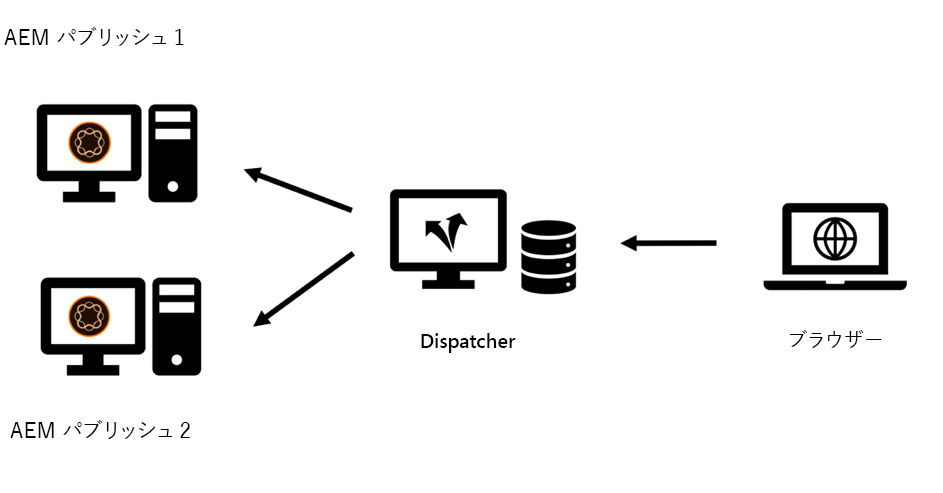
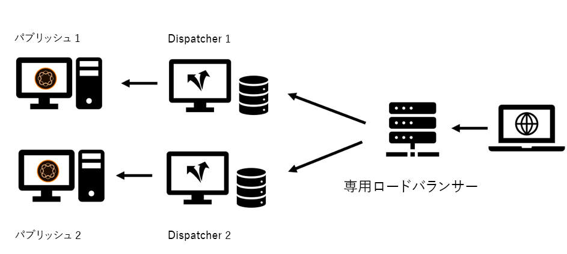
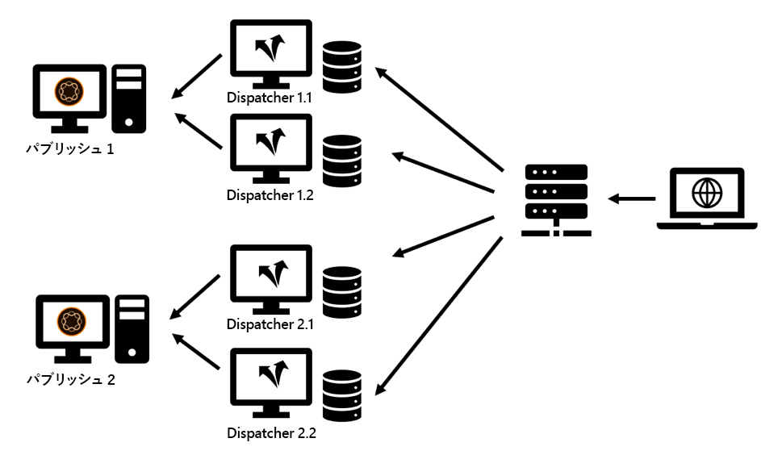
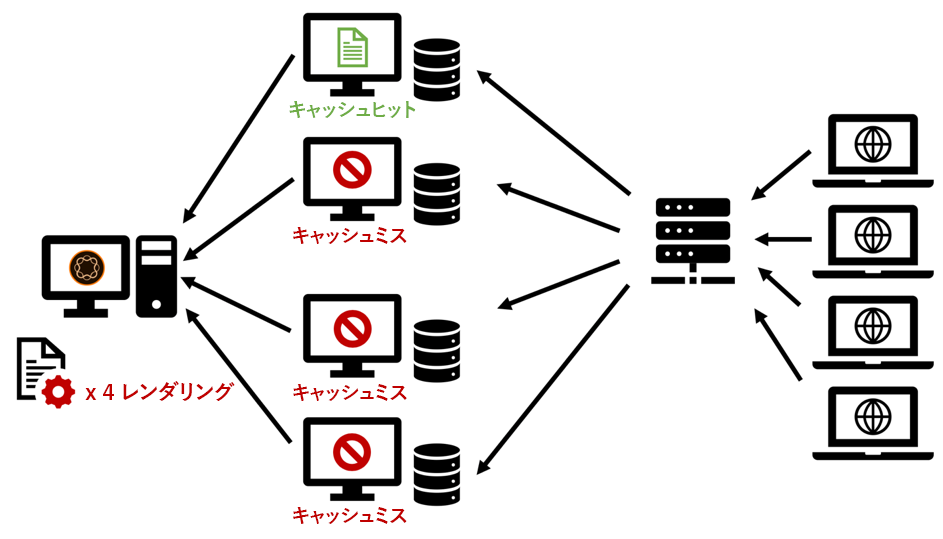
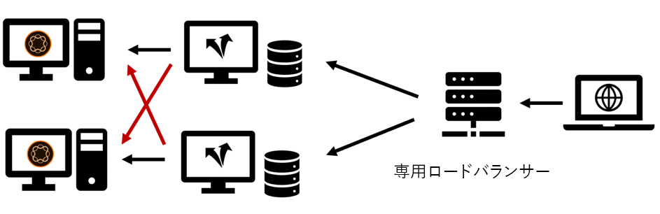

# 第2章 — インフラ

## キャッシュ・インフラストラクチャの設定

このシリーズの第1章では、発行システムとディスパッチャーの基本的なトポロジーを導入しました。 発行サーバーとディスパッチャーサーバーのセットは、予想される読み込み、データセンターのトポロジ、および必要なフェイルオーバープロパティに応じて、様々なバリエーションで設定できます。

最も一般的なトポロジをスケッチし、その利点と不足する場所を説明します。 もちろん、リストは包括的ではありません。 唯一の限界は、あなたの想像力です。

### 「レガシー」設定

初期の頃は、訪問者の数は少なく、ハードウェアは高価で、Webサーバは現在のようなビジネス・クリティカルとは見なされませんでした。 一般的な設定では、1つのディスパッチャーをロードバランサーとして機能させ、複数の発行システムの前にキャッシュを置く必要がありました。 ディスパッチャーのコアにあるApacheサーバーは非常に安定していて、ほとんどの設定で、かなりの量のリクエストを処理できます。

*「従来の」ディスパッチャーの設定 — 今日の標準ではあまり一般的ではありません*

  

ディスパッチャーは次の場所から名前を受け取ります。要求を出していた。 この設定は、今日必要とされるパフォーマンスと安定性の高い要求を満たせないため、今後あまり一般的ではありません。

### 複数脚の設定

最近は少し異なるトポロジーが多くなっています。 複数の義足を持つトポロジでは、パブリッシュサーバーごとに1つのディスパッチャーが作成されます。 AEMインフラストラクチャの前には、専用の（ハードウェア）ロードバランサが設置されており、以下の2本以上の脚にリクエストを送信します。

*最新の「標準」ディスパッチャーの設定 — 扱いやメンテナンスが容易*

  

こういう設定の理由は以下の通り。

1. 平均的に、Webサイトは過去に比べてはるかに多くのトラフィックを提供しています。 したがって、「Apacheインフラストラクチャ」を拡張する必要があります。

2. 「レガシー」設定では、ディスパッチャーレベルで冗長性が提供されませんでした。 Apacheサーバーがダウンした場合、Webサイト全体が未到達でした。

3. Apacheサーバーは安価です。 オープンソースに基づいており、仮想データセンターを持っている場合は、プロビジョニングを非常に高速に実行できます。

4. この設定により、更新シナリオが「ローリング」または「スタッガー」されるのを簡単に行えます。 Dispatcher 1は、Publish 1に新しいソフトウェアパッケージをインストールする際にシャットダウンするだけです。 インストールが完了し、内部ネットワークから十分に煙を吐くテストを実施したPublish 1を作成したら、Dispatcher 1のキャッシュをクリーンアップし、新たに開始し、Dispatcher 2をダウンロードしてPublish 2のメンテナンスを行います。

5. キャッシュの無効化は、この設定で非常に簡単で確実になります。 1つの発行システムが1つのディスパッチャーに接続されているだけなので、無効にするディスパッチャーは1つだけです。 無効化の順序とタイミングは些細です。

### 「スケールアウト」設定

Apacheサーバーは安価でプロビジョニングが容易です。そのレベルをもう少し押しのけてスケールアウトしてみましょう。 各公開サーバの前に2つ以上のディスパッチャーが置かれていないのはなぜですか。

*「スケールアウト」設定 — 一部のアプリケーション領域がありますが、制限事項と注意事項もあります。*

  

絶対にできる！ その設定には多くの有効なアプリケーションシナリオがあります ただし、考慮すべき制限事項と複雑さもあります。

#### 無効化

各発行システムは複数のディスパッチャーに接続され、コンテンツが変更された場合は各ディスパッチャーを無効にする必要があります。

#### メンテナンス

もちろん、ディスパッチャーシステムと発行システムの初期設定は、もう少し複雑です。 しかし、「ローリング」リリースの取り組みも少し高いことにも留意してください。 AEMシステムは、実行中に更新でき、更新する必要があります。 しかし、積極的にリクエストを処理している間は、そうしないのが賢明です。 通常は、一部の発行システムのみを更新し、残りのパブリッシュシステムはトラフィックを積極的に扱い、テスト後は他の部分に切り替えます。 運が良く、デプロイメントプロセスでロードバランサーにアクセスできる場合は、ここでメンテナンス中のサーバーへのルーティングを無効にできます。 直接アクセスできない共有ロードバランサーを使用している場合は、更新する発行のディスパッチャーをシャットダウンします。 あればあるほど、シャットダウンしなければならない。 大量の数が存在し、頻繁な更新を計画している場合は、一部の自動化をお勧めします。 自動化ツールがない場合は、スケールアウトは悪いアイデアです。

以前のプロジェクトでは、ロードバランサー自体に直接アクセスすることなく、発行システムをロードバランシングから削除する別の方法を使用しました。

ロードバランサは通常「ping」を行い、サーバが起動して実行されているかどうかを確認する特定のページです。 簡単な選択は、通常、ホームページにpingを送信することです。 ただし、ロードバランサに対してトラフィックのバランスを取らないようにpingを使用したい場合は、別の方法を選択します。 `"up"`または`"down"`（本文またはhttp応答コード）と応答するように設定できる専用のテンプレートまたはサーブレットを作成します。 もちろん、そのページの応答はディスパッチャーにキャッシュしないでください。したがって、常に発行システムから新しく取得されます。 ロードバランサを設定してこのテンプレートまたはサーブレットをチェックすると、簡単に「偽り」を発行させることができます。 ロードバランシングに含まれないため、更新できます。

#### 世界的な流通

「世界での配布」は「スケールアウト」設定で、各発行システムの前に複数のディスパッチャーがいます。現在は、お客様に近いパフォーマンスを提供するため、世界中に配布されています。 もちろん、このシナリオでは、中央のロードバランサーはなく、DNSおよび地域IPベースのロードバランシング方式を使用します。

>[!NOTE]
>
>実際には、この方法でコンテンツ配信ネットワーク(CDN)の一種を構築しているので、自社で構築する代わりに、既製のCDNソリューションを購入することを検討する必要があります。 カスタムCDNの作成と管理は、簡単なタスクではありません。

#### 水平方向の拡大縮小

ローカルデータセンターでも、各パブリッシュシステムの前に複数のディスパッチャが存在する「スケールアウト」トポロジにはいくつかの利点があります。 トラフィック量が多く、キャッシュヒット率も高いためにApacheサーバーのパフォーマンスがボトルネックになっている場合、（CPU、RAM、高速ディスクを追加して）ハードウェアを拡張できない場合は、ディスパッチャーを追加してパフォーマンスを向上できます。 これは「水平方向の拡大・縮小」と呼ばれます。 ただし、これは制限があります。特に、トラフィックを頻繁に無効にする場合に限定されます。 その効果については、次の節で説明します。

#### スケールアウトトポロジの制限

通常は、プロキシサーバーを追加するとパフォーマンスが向上します。 ただし、サーバーを追加するとパフォーマンスが実際に低下する可能性があるシナリオもあります。 どうやって？ ニュースポータルがあり、新しい記事やページを毎分導入する場合を考えてみましょう。 ディスパッチャーは、「自動無効化」によって無効にします。ページが公開されるたびに、同じサイトのキャッシュ内のすべてのページが無効になります。 これは便利な機能です。このシリーズの[第1章](chapter-1.md)で取り上げましたが、ウェブサイトに頻繁に変更を加えると、キャッシュを無効にすることが非常に多くなります。 発行インスタンスごとに1つのディスパッチャーのみを持つ場合、ページをリクエストする最初の訪問者は、そのページの再キャッシュをトリガーします。 2番目の訪問者は、既にキャッシュされたバージョンを取得しています。

2人のディスパッチャーがいる場合、2番目の訪問者はそのページがキャッシュされない50%の確率でページがキャッシュされ、そのページが再度レンダリングされると、より大きな遅延が発生します。 1回の公開でディスパッチャー数を増やすと、事態はさらに悪化します。 発行サーバーは、各ディスパッチャーのページを個別に再レンダリングする必要があるので、より多くの読み込みを受け取ることになります。

*キャッシュのフラッシュが頻繁に発生する、スケールアウトシナリオのパフォーマンスが低下しました。*

  

#### 過大規模化の問題の緩和

すべてのディスパッチャーに対して中央共有ストレージを使用するか、Apacheサーバーのファイルシステムを同期して問題を軽減することを検討します。 最初の経験は限られているだけですが、システムの複雑さを増し、全く新しいクラスのエラーを導入できるように準備しています。

NFSの実験はいくつかありますが、NFSはコンテンツのロックに伴うパフォーマンスの大きな問題を引き起こしています。 これにより、実際に全体的なパフォーマンスが低下しました。

**結論**  — 複数のディスパッチャ間で共通のファイルシステムを共有する方法は、推奨されない方法です。

パフォーマンスの問題が発生する場合は、発行インスタンスのピーク読み込みを回避するために、発行とディスパッチャーを等しくスケールアップします。 発行とディスパッチャーの比率には、ゴールデンルールはありません。これは、リクエストの配布、パブリケーションの配布、およびキャッシュの無効化の頻度に大きく依存します。

訪問者が経験する遅延も心配な場合は、コンテンツ配信ネットワーク、キャッシュの再取得、プリエンプティブキャッシュのウォーミングの使用、猶予時間の設定（このシリーズの[第1章](chapter-1.md)で説明）、または[第3部](chapter-3.md)の高度なアイデアを参照してください。

### 「クロス接続」設定

次の設定は、時々見ることができる「クロスコネクト」設定です。発行インスタンスには専用のディスパッチャーはありませんが、すべてのディスパッチャーはすべての発行システムに接続されます。

  

*クロス接続トポロジ：冗長性の向上と複雑さの増加。*

一見して、これは比較的小さな予算に対してより冗長性を提供します。 Apacheサーバーの1つがダウンした場合でも、2つのパブリッシュシステムがレンダリング作業を行うことができます。 また、発行システムの1つがクラッシュした場合でも、2人のディスパッチャーがキャッシュされた読み込みを提供します。

しかし、これは値段が付く。

1つ目は、1本の脚を取り出すのはとても面倒です。 実は、この計画はこのために設計されたので、より耐障害性が高く、あらゆる手段で起き上がり、走り続ける。 これに対する取り組みに関しては、複雑なメンテナンス計画を見てきました。 最初にディスパッチャー2を再設定し、クロス接続を削除します。 ディスパッチャー2を再起動しています。 ディスパッチャー1をシャットダウンし、発行1を更新…など。 脚が2本以上になる場合は注意が必要です。 この結論に達すると、複雑さやコストが増し、人間の誤りの恐ろしい原因となります。 これは自動化するのが最善です。 この自動化タスクをプロジェクトのスケジュールに組み込む人材が実際にいる場合は、より良いチェックを行ってください。 これにより、ハードウェアコストを削減できますが、ITスタッフに重複を費やすこともできます。

2つ目は、ログインが必要なAEM上で何らかのユーザーアプリケーションを実行している場合です。 スティッキーセッションを使用すると、1人のユーザーが常に同じAEMインスタンスから提供され、そのインスタンスのセッション状態を維持できるようになります。 このクロスコネクトセットアップを行う場合は、スティッキーセッションがロードバランサーとディスパッチャーで正しく動作していることを確認する必要があります。 不可能ではありません。しかし、そのことに気をつけ、構成やテスト時間を追加する必要があります。これもまた、ハードウェアの節約で計画したコストを削減できる場合があります。

### まとめ

このクロスコネクト方式をデフォルトのオプションとして使用することはお勧めしません。 ただし、使用する場合は、リスクや隠れたコストを慎重に評価し、構成の自動化をプロジェクトの一部として組み込む計画を立てる必要があります。

## 次のステップ

* [3 — 高度なキャッシュに関するトピック](chapter-3.md)
