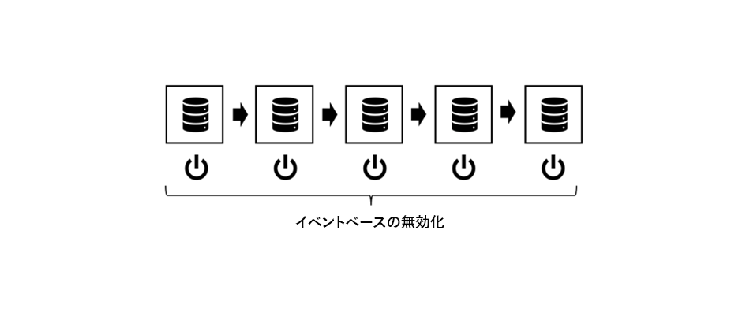
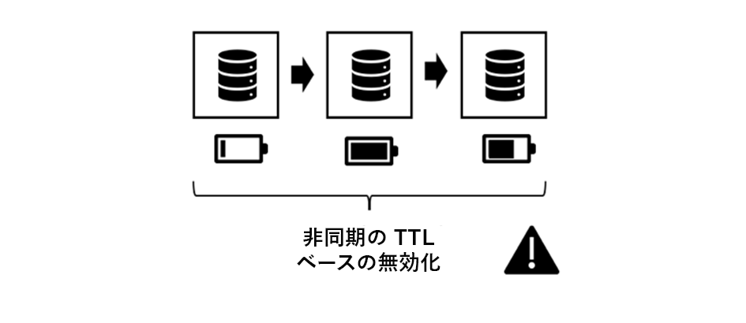
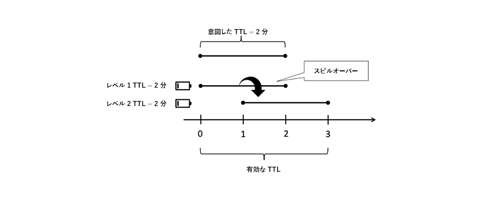
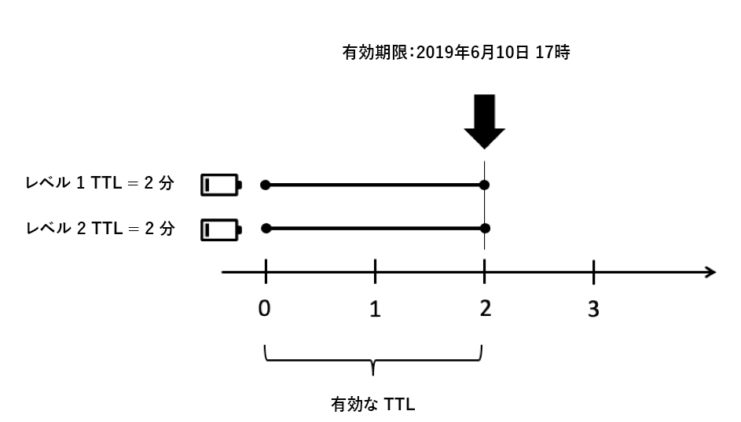
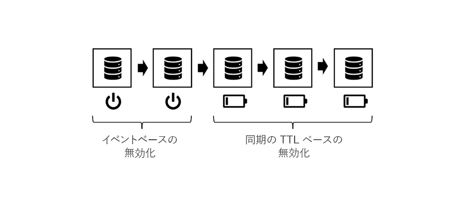
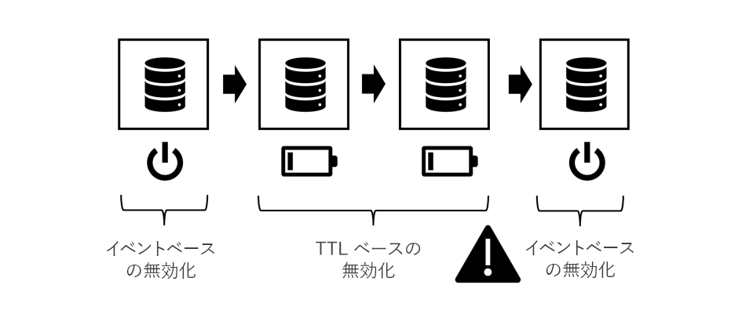
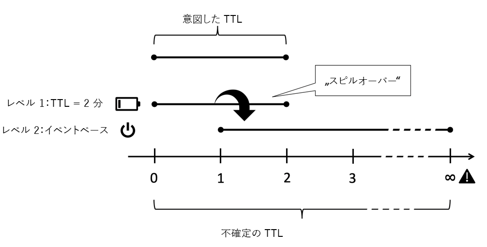
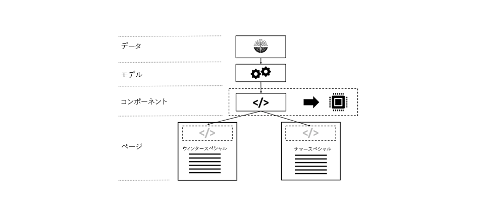
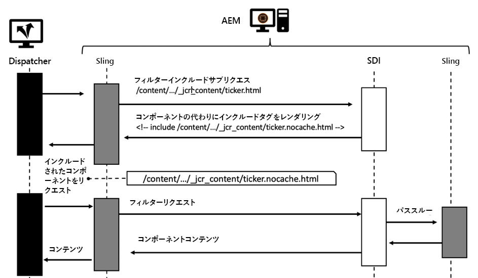
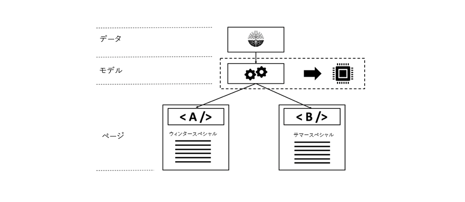

# 第3章 — 高度なキャッシュに関するトピック

*「コンピューターサイエンスには、難しい点が二つだけあります。キャッシュの無効化と命名を行います。」*

 — フィル・カールトン

## 概要

これは、AEMでのキャッシュに関連する3つの部分のパート3です。 最初の2つの部分は、ディスパッチャーのプレーンHTTPキャッシュに焦点を当てており、その制限事項は何か。 ここでは、これらの制限を克服する方法に関するアイデアをいくつか説明します。

## 一般的なキャッシュ

[本シリーズの第1章](chapter-1.md) と第2 [](chapter-2.md) 章では、主にディスパッチャーに焦点を当てています。 基本、限界、ある程度のトレードオフをする必要がある場所について説明しました。

キャッシュの複雑さと複雑さは、ディスパッチャーに固有の問題ではありません。 キャッシュは一般的に難しいです。

ツールボックスにディスパッチャーを唯一のツールとして持つことは、実際には大きな制限となります。

この章では、キャッシュに関する表示をさらに広げ、ディスパッチャーの欠点を克服する方法をいくつかアイデアを開発します。 決め手はありません。プロジェクトでトレードオフをする必要があります。 キャッシュと無効化の精度は常に複雑になり、複雑になるとエラーが発生する可能性があることに注意してください。

これらの領域でトレードオフをする必要がある

* パフォーマンスと遅延
* リソース消費量/CPU負荷/ディスク使用量
* 正確さ/通貨/安定性/セキュリティ
* シンプルさ/複雑さ/コスト/保守性/エラー回答性

これらのディメンションは、かなり複雑なシステムで相互にリンクされています。 それは簡単な事ではない。 システムをシンプルにすると、速くも遅くもできます。 開発コストは低くなりますが、ヘルプデスクのコストは増えます。例えば、古いコンテンツを見たり、低速なWebサイトに関する不満を言ったりする場合などです。 これらの要因はすべて、互いに考慮し、均衡を保つ必要があります。 でも今のところ、良い考えを持つべきですが、銀の弾や「ベストプラクティス」は一つもないのです。悪い習慣が多く、良い習慣が少ししかないのです。

## Chained Caching

### 概要

#### データフロー

サーバーからクライアントのブラウザーにページを配信すると、多数のシステムとサブシステムがまたがります。 注意深く見ると、ソースからドレインまでのホップ数データが必要になります。各ホップ数データは、キャッシュの候補となる可能性があります。


*一般的なCMSアプリケーションのデータフロー*

<br> 

ハードディスクに配置されブラウザに表示する必要のあるデータを使って、この旅を開始しましょう。

#### ハードウェアおよびオペレーティングシステム

まず、ハードディスクドライブ(HDD)自体には、ハードウェアに内蔵されたキャッシュがあります。 第2に、ハードディスクをマウントするオペレーティングシステムは、頻繁にアクセスされるブロックをキャッシュしてアクセスを高速化するために、空きメモリを使用します。

#### コンテンツリポジトリ

次のレベルは、AEMが使用するドキュメントデータベースであるCRXまたはOakです。 CRXとOakは、HDDへのアクセスの遅延を防ぐために、データをメモリ内にキャッシュできるセグメントに分割します。

#### サードパーティデータ

大規模なWebインストールのほとんどは、サードパーティのデータも含みます。製品情報システム、顧客関係管理システム、レガシーデータベース、またはその他の任意のWebサービスからのデータ。 このデータは、必要に応じてソースから取り出す必要はありません。特に、あまり頻繁に変更されないことがわかっている場合は除きます。 したがって、CRXデータベース内で同期されていない場合はキャッシュできます。

#### ビジネスレイヤー — アプリ/モデル

通常、テンプレートスクリプトは、JCR APIを介してCRXから来た生のコンテンツをレンダリングしません。 多くの場合、ビジネスドメインオブジェクトのデータの結合、計算、変換を、その間にビジネスレイヤーを置いていると考えられます。 推測できます。これらの操作にコストがかかる場合は、キャッシュを考慮する必要があります。

#### マークアップフラグメント

モデルが、コンポーネントのマークアップのレンダリングの基になります。 レンダリングされたモデルもキャッシュしないのはなぜですか？

#### ディスパッチャー、CDNおよび他のプロキシ

Offを指定すると、レンダリングされたHTMLページがディスパッチャーに送られます。 既に説明しましたが、ディスパッチャーの主な目的は、HTMLページや他のWebリソース（名前に関係なく）をキャッシュすることです。 リソースがブラウザーに到達する前に、キャッシュできるリバースプロキシ（キャッシュ可能）とキャッシュに使用されるCDN(CDN)を渡す場合があります。 クライアントは、プロキシ経由でのみWebアクセスを許可するオフィスに常駐し、そのプロキシはトラフィックを節約するのと同じようにキャッシュを行うことを決定する場合があります。

#### ブラウザーキャッシュ

最後ですが、最後ではありません。ブラウザーがキャッシュするのも同じです。 これは見落としがちな資産だ。 ただし、キャッシュチェーン内に最も近く、最も速いキャッシュです。 残念ながら、1人のユーザー間では共有されませんが、1人のユーザーの異なるリクエスト間では共有されます。

### キャッシュする場所と理由

それはキャッシュの長い連鎖です。 古いコンテンツを目にした問題に直面しています しかし、いくつの段階があるかを考えると、ほとんどの時間がうまくいっているのは奇跡です。

でもこの鎖のどこを隠すのが意味をなすの？ 最初に？ 最後に？ どこでも？ それは…大きな要因に左右される。 同じウェブサイトの2つのリソースでさえ、その質問に対する異なる回答を望む場合があります。

どのような要因を考慮に入れるかを大まかに理解するために

**有効期間** — オブジェクトに短い固有のライブ時間がある場合（トラフィックデータは天気データよりも短いライブ時間になる可能性がある）、キャッシュの価値はありません。

**本番コスト —** CPUサイクルとI/Oの面では、オブジェクトの再生と配信のコストがどれだけ高くなるか。 安いキャッシュが必要ない場合は、

**Size** — 大きいオブジェクトは、キャッシュするリソースが多く必要です。 これは限界的な要素であり、その利益とバランスを取る必要があります。

**アクセス頻度** — オブジェクトにほとんどアクセスしない場合は、キャッシュが有効でない可能性があります。 キャッシュから2回目にアクセスする前に、古くなったり無効にされたりするだけです。 このようなアイテムは、メモリリソースをブロックするだけです。

**共有アクセス** — 複数のエンティティで使用されるデータは、チェーンの上にキャッシュする必要があります。 実際には、キャッシュチェーンはチェーンではなくツリーです。 リポジトリ内の1つのデータは、複数のモデルで使用される場合があります。 同様に、これらのモデルは、複数のレンダリングスクリプトでHTMLフラグメントを生成するために使用できます。 これらのフラグメントは複数のページに含まれ、複数のユーザーにはブラウザー内のプライベートキャッシュを使用して配布されます。 したがって、「共有」とは、人間だけでなく、ソフトウェアの断片間で共有することを意味する。 潜在的な「共有」キャッシュを見つけたい場合は、ツリーをルートに戻し、共通の祖先を見つけます。

**地理空間配信** — ユーザが世界中に配信されている場合、キャッシュの分散ネットワークを使用すると遅延を減らすことができます。

**ネットワーク帯域幅と遅延** — 遅延と言えば、お客様は誰で、どのような種類のネットワークを使用しているか。 お客様は、旧世代スマートフォンの3G接続を利用した先進国のモバイル顧客か。 小さなオブジェクトを作成して、ブラウザーのキャッシュにキャッシュすることを検討してください。

このリストは大して包括的ではありませんが、今のところ、皆さんもその考えを理解していると思います。

### Chained Cachingの基本規則

繰り返します。キャッシュはハードです。 以前のプロジェクトから抽出した基本的な規則をいくつか共有して、プロジェクト内の問題を回避します。

#### 重複キャッシュの回避

前の章で紹介した各レイヤーは、キャッシュチェーンに何らかの値を提供します。 コンピューティング・サイクルを節約するか、データを消費者に近づけることで、 データをチェーンの複数の段階でキャッシュするのは間違っていません。ただし、次の段階のメリットとコストは何かを常に考慮する必要があります。 発行システムでのページ全体のキャッシュは、既にディスパッチャーで行われているので、通常は何のメリットもありません。

#### 無効化方法の混合

3つの基本的な無効化方法があります。

* **TTL, Time to Live:** オブジェクトの有効期限は、一定時間（「2時間後」など）後に切れます。
* **有効期限：** オブジェクトの有効期限は、将来定義された時刻（「2019年6月10日午後5時」など）に切れます。
* **イベントベース：** プラットフォームで発生したイベント（ページが変更され、アクティブ化された場合など）によって、オブジェクトは明示的に無効化されます。

異なるキャッシュレイヤで異なる方法を使用できますが、「毒性」のある方法がいくつかあります。

#### イベントに基づく無効化



*純粋なイベントベースの無効化：内側のキャッシュから外側のレイヤーへの無効化*

<br> 

純粋なイベントに基づく無効化は、理論的に正しく、最も正確に得るのが最も容易で、理解しやすい方法です。

単純に言うと、オブジェクトが変更された後にキャッシュが1つずつ無効になります。

次のルールを1つ覚えておく必要があります。

内側から外側のキャッシュに常に無効にします。 外部キャッシュを最初に無効にした場合は、古いコンテンツが内部キャッシュから再キャッシュされる場合があります。 キャッシュが再び新規になった時刻を推測しないでください。確かめてください。 最良の方法は、内側のキャッシュを無効にした _後に_ 、外側のキャッシュの無効化をトリガーすることです。

これが理論です しかし実際には多くの了解があります イベントは、ネットワーク経由で配布する必要があります。 実際には、これは実行を最も困難にする無効化スキームです。

#### 自動修復

イベントベースの無効化では、コンティンジェンシープランを用意する必要があります。 無効イベントが失われた場合はどうなりますか？ 単純な方法では、一定時間が経過すると無効にしたり、削除したりできます。 そのため、そのイベントを見逃した可能性があり、古いコンテンツを提供しています。 ただし、オブジェクトには、数時間（日）のみの暗黙的なTTLもあります。 ついにシステムは自動修復します

#### 純粋なTTLベースの無効化



*非同期TTLベースの無効化*

<br> 

それも非常に一般的な計画です 複数のレイヤーのキャッシュを積み重ねると、各レイヤーは一定時間オブジェクトを提供できます。

実装は簡単です。 残念ながら、データの有効寿命を予測するのは難しい。



*外側のキャッシュは内側のオブジェクトの寿命を延ばす*

<br> 

上の図を考えてみましょう。 各キャッシュレイヤーのTTLは2分です。 現在は、TTL全体も2分です。 まだ。 外側のレイヤが古くなる直前にオブジェクトを取り込むと、外側のレイヤは実際にオブジェクトの有効ライブ時間を延長します。 有効なライブタイムは、2 ～ 4分の間です。 あなたは自分のビジネス部門に同意したとしよう、ある日は耐えやすく、そして4層のキャッシュを持っている。 各層の実際のTTLは、6時間以下にする必要があります。キャッシュミス率を増やす…

悪い計画だとは言っていません。 限界を知るべきです 開始するのは素晴らしく簡単な戦略です サイトのトラフィックが増加した場合にのみ、より正確な戦略を検討できます。

*特定の日付の設定による無効化時間の同期*

#### 失効日に基づく無効化

内側のオブジェクトに特定の日付を設定し、それを外部のキャッシュに伝播すると、より予測可能な有効な有効期間が得られます。



*有効期限の同期*

<br> 

ただし、すべてのキャッシュが日付を反映できるわけではありません。 外側のキャッシュが2つの内側のオブジェクトを異なる有効期限で集計すると、これは不快になります。

#### イベントベースとTTLベースの無効化の混合



*イベントベースとTTLベースの戦略の混在*

<br> 

また、AEMの世界では、イベントベースの無効化を内部キャッシュ(例えば、イベントをほぼリアルタイムで処理できるメモリ内キャッシュ)で使用し、TTLベースのキャッシュを外部に使用します。明示的な無効化にはアクセスできない場合もあります。

AEMの世界では、発行システムのビジネスオブジェクトとHTMLフラグメントのメモリ内キャッシュがあり、基になるリソースが変更され、この変更イベントをイベントベースでも機能するディスパッチャーに伝播すると無効になります。 その前に、例えばTTLベースのCDNがあります。

ディスパッチャーの前に（短い）TTLベースのキャッシュのレイヤーがあると、通常は自動無効化後に発生するスパイクを効果的に緩和できます。

#### 混合TTLとイベントベースの無効化



*毒性：混合TTLとイベントベースの無効化*

<br> 

この組み合わせは毒性がある。 TTLまたは有効期限に基づいてキャッシュされた後は、決してイベントベースのキャッシュを配置しないでください。 「ピュアTTL」戦略でのスピルオーバー効果を覚えていますか。 ここでも同じ効果が観察できる。 外部キャッシュの無効化イベントが既に発生している場合に限り、再び発生することはありません。これは、キャッシュされたオブジェクトの寿命を無限に延ばすことができます。



*TTLベースとイベントベースの組み合わせ：無限大までスピルオーバー*

<br> 

## 部分キャッシュとメモリ内キャッシュ

キャッシュレイヤーを追加するには、レンダリングプロセスのステージにフックします。 リモートデータ転送オブジェクトを取得したり、ローカルビジネスオブジェクトを作成したりして、1つのコンポーネントのレンダリングされたマークアップをキャッシュする。 具体的な実装は、後のチュートリアルに残します。 しかし、既にこれらのキャッシュ層をいくつか実装しておく予定があるかもしれません。 ですから、ここでできる最も少ないのは、基本的な原理と了解事項を紹介することです。

### 警告の単語

#### アクセス制御の尊重

ここで説明するテクニックは非常に強力で、各AEM開発者のツールボックスに _必要な_ 。 でもあまり興奮しないで、賢く使って。 オブジェクトをキャッシュに格納し、フォローアップ要求で他のユーザに共有することは、実際にアクセス制御を回避することを意味します。 これは、通常、公開Webサイトに関する問題ではありませんが、アクセスする前にユーザーがログインする必要がある場合に発生する可能性があります。

サイトのメインメニューのHTMLマークアップをメモリ内キャッシュに格納して、様々なページ間で共有することを検討してください。 これは、部分的にレンダリングされたHTMLを保存する最適な例です。ナビゲーションの作成は多くのページを移動する必要があるので、通常は高価です。

同じメニュー構造をすべてのページ間で共有するのではなく、より効率的なすべてのユーザーと共有します。 しかし、待って…。ただし、メニューには、特定のユーザーのグループのみに予約されている項目が含まれている場合があります。 この場合、キャッシュはもう少し複雑になります。

#### カスタムビジネスオブジェクトのみをキャッシュ

それが最も重要なアドバイスであれば、以下の点にご注意ください。

>[!WARNING]
>
>自分のもの、不変のもの、自分で構築したもの、浅くて出てくる参照のないものだけをキャッシュします。

どういう意味だ？

1. 他の人の物のライブサイクルが意図されているのは知りません リクエストオブジェクトへの参照を見て、それをキャッシュすることを検討します。 これで、リクエストは終了し、サーブレットコンテナは次の受信リクエストに対してそのオブジェクトをリサイクルしたいと考えます。 その場合、他の誰かが、あなたが排他的に制御していたと思っていたコンテンツを変更します。 それを却下しないでください。プロジェクトでそのようなことが起きています。 顧客が自分のデータではなく他の顧客データを見ていた。

2. オブジェクトが他の参照のチェーンによって参照されている限り、そのオブジェクトをヒープから削除することはできません。 小さいと思われるオブジェクトをキャッシュに保持して参照する場合は、4 MBのイメージ表現を保持すると、メモリの漏洩で問題が発生する可能性が高くなります。 キャッシュは弱参照に基づいていると想定されます。 しかし、弱参照は期待どおりに機能しません。 これは、メモリリークを発生させ、メモリ不足エラーに終わる絶対的な最善の方法です。 そして、外部のオブジェクトの保存メモリのサイズは分かりませんね。

3. 特にSlingでは、各オブジェクトを互いに（ほぼ）適応させることができます。 キャッシュにリソースを配置することを検討します。 次のリクエスト（アクセス権が異なる）は、そのリソースを取得し、そのリソースをresourceResolverまたはセッションに適合させて、アクセス権を持たない他のリソースにアクセスします。

4. AEMのリソースに対して薄い「ラッパー」を作成する場合でも、それが自分のもので不変のものであっても、それをキャッシュしてはいけません。 ラップされたオブジェクトは参照（以前は禁止していました）で、鋭く見ると、基本的に前の項で説明したのと同じ問題を引き起こします。

5. キャッシュする場合は、プリミティブデータを独自のシャローオブジェクトにコピーして独自のオブジェクトを作成します。 オブジェクトのツリーをキャッシュする場合など、参照を使用して、独自のオブジェクト間をリンクすることができます。 これは問題ありません。ただし、作成したオブジェクトだけを同じリクエスト内にキャッシュし、他の場所からリクエストされたオブジェクトは（「自分の」オブジェクトの名前空間であっても）存在しません。 _オブジェクトのコピーが重要_ 。 また、リンクされたオブジェクトの構造全体を一度に削除し、構造への参照の出入りを防ぎます。

6. はい — オブジェクトを不変に保ちます。 プライベートプロパティ。設定なし。

多くのルールを守る価値があります 経験があって、頭が良くて、何でもコントロールできる。 君のプロジェクトの若い同僚は、今大学を卒業したばかりだ。 彼はこうした落とし穴を全く知らない。 落とし穴がなければ避けるものは何もない。 簡単で分かりやすいようにします。

### ツールとライブラリ

このシリーズは、概念を理解し、ユースケースに最適なアーキテクチャを構築できるようにすることを目的としています。

特に、ツールの販売は進めていません。 でも、どう評価するかを示すヒントを与えてください。 例えば、AEMには、バージョン6.0以降の固定TTLを持つ単純な組み込みキャッシュがあります。使用しますか？ イベントベースのキャッシュがチェーン内で続く場合は、おそらく公開にありません(ヒント：ディスパッチャー)。 しかし、著者にとってはまともな選択によるかもしれない。 AdobeのACSコモン別のHTTPキャッシュもありますが、検討する価値があるかもしれません。

または、Ehcacheのような成熟したキャッシュ・フレームワークに基づいて独自に構築 [します](https://www.ehcache.org)。 これは、Javaオブジェクトとレンダリングされたマークアップ(`String` オブジェクト)をキャッシュするために使用できます。

単純な場合は、同時ハッシュマップの使用に慣れることもあります。ツールまたはスキルの制限を簡単に確認できます。 並行性は、名前付けとキャッシュと同じくらいマスターしづらい。

#### 参照

* [ACSコモンのHTTPキャッシュ ](https://adobe-consulting-services.github.io/acs-aem-commons/features/http-cache/index.html)
* [Ehcacheキャッシュフレームワーク](https://www.ehcache.org)

### 基本用語

ここではあまり深くキャッシング理論には入りませんが、うまく飛び跳ねる開始を得るためには、バズワードを少し提供しなければならないと感じています。

#### キャッシュの削除

私たちは無効化とパージについて多く話しました。 _キャッシュの削除_ は、次の用語に関連します。エントリを削除すると、そのエントリは使用できなくなります。 ただし、エントリが古くなった場合ではなく、キャッシュがいっぱいになった場合に削除が発生します。 より新しい（「より重要」な）アイテムは、古い（またはあまり重要でない）アイテムをキャッシュからプッシュします。 どの入口を犠牲にする必要があるかは、ケース・ツー・ケースの決定です。 最も古いものや、ほとんど使用されない、または長い間アクセスされたものを削除できます。

#### 先取りキャッシュ

プリエンプティブキャッシュとは、無効になった時点や古いと見なされた時点で、新しいコンテンツを使用してエントリを再作成することを意味します。 もちろん、少数のリソースを使用するだけで、頻繁にすぐにアクセスできることを確認できます。 そうしないと、要求されないキャッシュエントリを作成する際にリソースを浪費することになります。 キャッシュエントリをプリエンプティブに作成することで、キャッシュの無効化後にリソースに対する最初の要求の待ち時間を短縮できます。

#### キャッシュ・ウォーミング

キャッシュウォーミングは、プリエンプティブキャッシュと密接に関連しています。 その用語は実稼動システムには使わないでしょうが。 時間の制約は前者に比べて少ない 無効化の直後にキャッシュを再実行する必要はありませんが、時間が許せば徐々にキャッシュを埋めます。

例えば、ロードバランサーから発行/ディスパッチャーのレッグを取り出して、それを更新します。 再統合する前に、最も頻繁にアクセスされるページを自動的にクロールして、再度キャッシュに取り込みます。 キャッシュが「ウォーム」の場合 — 十分に満たされるように、脚をロードバランサに再統合します。

または、脚を直ちに再組み込みしても、通常の使用でキャッシュを温める機会を得るために、脚へのトラフィックを制限することもできます。

また、実際の要求で実際にアクセスされる場合に待ち時間を短縮するために、システムがアイドル状態になっている時に、アクセス頻度の低いページをキャッシュしたい場合もあります。

#### キャッシュオブジェクトID、ペイロード、無効化依存関係、およびTTL

一般に、キャッシュされたオブジェクト（「エントリ」）には5つの主なプロパティがあります。

#### キー

これは、識別とオブジェクトを識別するプロパティです。 ペイロードを取得するか、キャッシュからペイロードを削除します。 例えば、ディスパッチャーはページのURLをキーとして使用します。 ディスパッチャーはページのパスを使用しません。 これは、異なるレンダリングを区別するためには不十分です。 他のキャッシュでは、異なるキーを使用する場合があります。 後でいくつか例を見てみよう。

#### 値/ペイロード

これが、取得したいデータであるオブジェクトの宝箱です。 ディスパッチャーの場合は、ファイルの内容です。 ただし、Javaオブジェクトツリーにすることもできます。

#### TTL

TTLは既に有効です。 エントリが古いと見なされ、配信されなくなるまでの時間。

#### 依存関係

これは、イベントベースの無効化に関する。 その対象は何に依存しているのですか。 第1部では既に述べましたが、真の正確な依存関係の追跡は複雑すぎるということです。 しかし、システムの知識があれば、より単純なモデルを使って依存関係を近似できます。 古いコンテンツを削除するのに十分なオブジェクトを無効にします。不注意で必要以上に多くのコンテンツを削除する可能性があります。 しかし、我々は「すべてをパージする」の下に留めておく。

どのオブジェクトが、各アプリケーションで他のどのオブジェクトが真のものであるかによって異なります。 後で、依存関係戦略の導入方法に関する例をいくつか示します。

### HTMLフラグメントのキャッシュ



*別のページでのレンダリングされたフラグメントの再使用*

<br> 

HTMLフラグメントキャッシュは強力なツールです。 コンポーネントによって生成されたHTMLマークアップをメモリ内キャッシュにキャッシュするというアイデアです。 なぜ私がそうしなければならないのかと尋ねるかもしれません ディスパッチャー内のページ全体のマークアップ（そのコンポーネントのマークアップを含む）をキャッシュします。 同意します。 1ページに1回だけ、 ページ間でそのマークアップを共有していません。

例えば、各ページの上部にナビゲーションが表示されるとします。 マークアップは各ページで同じように表示されます。 ただし、ディスパッチャー内ではなく、各ページに対して何度も繰り返しレンダリングします。 次の点に注意してください。自動無効化の後、すべてのページを再レンダリングする必要があります。 つまり同じコードを何百回も同じ結果で動かしているのです

アドビの経験から言えば、ネストされたトップナビゲーションのレンダリングは非常に高価なタスクです。 通常は、ドキュメントツリーの十分な部分を移動して、ナビゲーション項目を生成します。 ナビゲーションタイトルとURLのみが必要な場合でも、ページはメモリに読み込む必要があります。 彼らは貴重な資源を詰まらせています 何度も繰り返す。

ただし、コンポーネントは多くのページで共有されます。 そして何かを共有することは、キャッシュを使うことを意味します。 そのため、ナビゲーションコンポーネントが既にレンダリングされ、キャッシュされているかどうかを確認し、再レンダリングする代わりにキャッシュの値を生成します。

その計画には2つの不思議な点が簡単に見逃せる。

1. Java文字列をキャッシュしている。 文字列型(String)の値には、参照元が含まれず、不変です。 上の警告を考えると、これは超安全です。

2. 無効化も非常に簡単です。 Webサイトが変更された場合は常に、このキャッシュエントリを無効にする必要があります。 再構築は1回だけ実行し、数百ページすべてで再利用する必要があるので、比較的安価です。

これは、公開サーバにとって大きな安心です。

### フラグメントキャッシュの実装

#### カスタムタグ

JSPをテンプレート化エンジンとして使用した昔は、コンポーネントのレンダリングコードの周りにカスタムJSPタグのラッピングを使用するのが一般的でした。

```
<!-- Pseudo Code -->

<myapp:cache
  key=' ${info.homePagePath} + ${component.path}'
  cache='main-navigation'
  dependency='${info.homePagePath}'>

… original components code ..

</myapp:cache>
```

カスタムタグは、本文を取り込んでキャッシュに書き込んだり、本文の実行を防いだり、キャッシュエントリのペイロードを出力したりする必要はありません。

「キー」は、ホームページ上に配置するコンポーネントのパスです。 現在のページでは、コンポーネントのパスは使用されません。これにより、ページごとに1つのキャッシュエントリが作成されます。これは、コンポーネントを共有する意図と矛盾します。 また、コンポーネントの相対パス(`jcr:conten/mainnavigation`)だけを使用しないので、異なるサイトで異なるナビゲーションコンポーネントを使用できません。

「キャッシュ」は、エントリを保存する場所を示すインジケーターです。 通常、アイテムを格納するキャッシュは複数あります。 それぞれの動作は少し異なるかもしれません。 つまり、格納されている内容を識別し、最終的に文字列である場合でも問題はありません。

「依存関係」は、キャッシュエントリが依存する関係です。 「メインナビゲーション」キャッシュには、ノード「依存関係」の下に変更がある場合は、従属エントリを削除する必要があるというルールが含まれている場合があります。 したがって、キャッシュの実装は、変更を認識するためにリポジトリのイベントリスナーとして登録し、キャッシュ固有のルールを適用して無効化する必要があるものを見つけ出す必要があります。

上記は一例に過ぎない。 また、キャッシュのツリーを持つように選択することもできます。 1つ目のレベルをサイト（またはテナント）の分離に使用し、2つ目のレベルをコンテンツのタイプ（「メインナビゲーション」など）に分岐します。これにより、上の例のようにホームページパスを追加する手間が省けます。

ちなみに、この方法は、よりモダンなHTLベースのコンポーネントでも使用できます。 その後、HTLスクリプトの周りにJSPラッパーが作成されます。

#### コンポーネントフィルター

ただし、純粋なHTLアプローチでは、Slingコンポーネントフィルターを使用してフラグメントキャッシュを作成します。 未だ未だに見ていませんが、その問題に取り組むのがこのアプローチです。

#### Sling動的インクルード

フラグメントキャッシュは、環境の変化（異なるページ）のコンテキストで、何か定数（ナビゲーション）がある場合に使用されます。

しかし、その逆もあるかもしれません。比較的一定のコンテキスト（ほとんど変化しないページ）と、そのページ上で絶え間なく変化するフラグメント（例えば、ライブティッカー）です。

この場合、 [Sling Dynamic Includesにチャンスを与えることができます](https://sling.apache.org/documentation/bundles/dynamic-includes.html) 。 基本的に、これはコンポーネントフィルターで、動的コンポーネントを囲み、コンポーネントをページにレンダリングする代わりに参照を作成します。 この参照はAjax呼び出しにすることができます。これにより、コンポーネントをブラウザーに含め、周囲のページを静的にキャッシュできます。 または — Sling Dynamic Includeは、SSIディレクティブ（サーバ側インクルード）を生成できます。 このディレクティブはApacheサーバーで実行されます。 ESI - Edge Side Includeディレクティブも使用できます。



*Sling動的インクルードを使用したリクエストのシーケンス図*

<br> 

SDIのドキュメントでは、「*.nocache.html」で終わるURLのキャッシュを無効にする必要があります。これは、動的コンポーネントを扱う際に意味があります。

SDIの使用方法には、次のような別のオプションがあります。インクルードのディスパッチャーキャッシュ _を無効にしない場合_ 、ディスパッチャーは、前の章で説明したのと同じように、フラグメントキャッシュのように機能します。ページとコンポーネントフラグメントは、等しく独立してディスパッチャーにキャッシュされ、ページが要求されたときにApacheサーバーのSSIスクリプトによって繋ぎ合わされます。 これにより、（常に同じコンポーネントURLを使用する場合は）メインナビゲーションなどの共有コンポーネントを実装できます。

それは理論的にはうまくいくはずだ。 でも…

以下のようにするのは避けることをお勧めします。実際の動的コンポーネントのキャッシュをバイパスする機能は失われます。 SDIはグローバルに設定され、「poor-mans-fragment-cache」に対して行う変更は、ダイナミックコンポーネントにも適用されます。

SDIのドキュメントを注意深く検討することをお勧めします。 他にもいくつか制限がありますが、SDIは場合によっては貴重なツールです。

#### 参照

* [docs.oracle.com — カスタムJSPタグの作成方法](https://docs.oracle.com/cd/E11035_01/wls100/taglib/quickstart.html)
* [ドミニクスース — コンポーネントフィルターの作成と使用](https://www.slideshare.net/connectwebex/prsentation-dominik-suess)
* [sling.apache.org - Sling動的インクルード](https://sling.apache.org/documentation/bundles/dynamic-includes.html)
* [helpx.adobe.com - AEMでのSling動的インクルードの設定](https://helpx.adobe.com/experience-manager/kt/platform-repository/using/sling-dynamic-include-technical-video-setup.html)


#### モデルのキャッシュ



*モデルベースのキャッシュ：2つの異なるレンダリングを持つ1つのビジネスオブジェクト*

<br> 

ナビゲーションをもう一度見てみよう。 各ページに同じナビゲーションマークアップが必要となると想定していました。

でもそうではないかもしれません _現在のページを表すナビゲーション内のアイテムに対して異なるマークアップをレンダリングする場合があります_。

```
Travel Destinations

<ul class="maninnav">
  <li class="currentPage">Travel Destinations
    <ul>
      <li>Finland
      <li>Canada
      <li>Norway
    </ul>
  <li>News
  <li>About us
<ul>
```

```
News

<ul class="maninnav">
  <li>Travel Destinations
  <li class="currentPage">News
    <ul>
      <li>Winter is coming>
      <li>Calm down in the wild
    </ul>
  <li>About us
<is
```

これら2つはまったく異なるレンダリングです。 しかし、 _ビジネス・オブジェクト_ （完全なナビゲーション・ツリー）は同じです。  この _ビジネス・オブジェクトは_ 、ツリー内のノードを表すオブジェクト・グラフです。 このグラフは、メモリ内キャッシュに容易に格納できます。 ただし、このグラフには、自分で作成しなかったオブジェクト（特に現在はJCRノード）を含めたり、オブジェクトを参照したりすることはできません。

#### ブラウザーでのキャッシュ

ブラウザでのキャッシュの重要性にすでに気がつきましたし、多くの優れたチュートリアルが紹介されています。 最終的には、（ブラウザーの場合は）ディスパッチャーは、HTTPプロトコルに従うWebサーバーに過ぎません。

しかし、その理論にもかかわらず、私たちは、他にどこにも見つからず、共有したいと思う知識を少し集めてきました。

基本的に、ブラウザーのキャッシュは、

1. ブラウザーには、正確な有効期限の日付がわかるリソースがキャッシュされています。 その場合は、再度リソースを要求しません。

2. ブラウザーにリソースがありますが、まだ有効かどうかは不明です。 その場合は、Webサーバー（この場合はディスパッチャー）に問い合わせます。 最後に配信した後に変更された場合は、資料をお送りください。 変更されていない場合、サーバは「304 — 未変更」と回答し、メタデータのみが送信された。

#### デバッグ

ディスパッチャーの設定をブラウザーのキャッシュ用に最適化する場合は、ブラウザーとWebサーバーの間でデスクトッププロキシサーバーを使用すると非常に役立ちます。 Karl Von Randowの「Charles Web Debugging Proxy」が好まれます。

Charlesを使用すると、サーバーとの間で送信される要求と応答を読み取ることができます。 HTTPプロトコルについて多くを学ぶことができます。 最新のブラウザもデバッグ機能の一部をオファーしていますが、デスクトッププロキシの機能は前例のないものです。 転送されたデータの操作、送信の制限、単一の要求の再生などを行うことができます。 ユーザインターフェースは明確に整理されていて非常に包括的です

最も基本的なテストは、通常のユーザー（プロキシを使用）としてWebサイトを使用し、静的な要求(/etc/..)の数が時間と共に少なくなっている場合はプロキシをチェックインします。これらはキャッシュ内にあるはずで、これ以上要求されません。

キャッシュされた要求はログに表示されないのに対し、一部のブラウザ組み込みデバッガは「0ミリ秒」または「ディスクから」の値を使用して要求を表示します。 これは正確で正確ですが、表示を少し曇らせることができます。

次に、ドリルダウンして転送されたファイルのヘッダーを確認し、例えば「Expires」 httpヘッダーが正しいかどうかを確認できます。 if-modified-sinceヘッダーを設定してリクエストを再生し、サーバーが304または200の応答コードで正しく応答するかどうかを確認できます。 非同期呼び出しのタイミングを観察でき、セキュリティ上の前提条件をある程度テストすることもできます。 明示的に予期されないセレクターをすべて受け入れないように指示したのを覚えていますか？ ここで、URLとパラメーターを再生し、アプリケーションが正常に動作するかどうかを確認できます。

キャッシュのデバッグを行う際には、行わないようにする必要があることが一つだけあります。

ブラウザーでページをリロードしないでください。

「ブラウザのリロード」、 _単純なリロード_ 、 _強制的なリロード_ (「_shift-reload_」)は、通常のページリクエストとは異なります。 単純な再読み込み要求はヘッダーを設定します

```
Cache-Control: max-age=0
```

また、Shiftキーを押しながらリロード（Shiftキーを押しながらリロードボタンをクリック）すると、通常、リクエストヘッダーが設定されます

```
Cache-Control: no-cache
```

どちらのヘッダーも、ほとんど異なる効果がありますが、最も重要な点は、URLスロットからURLを開く場合やサイト上のリンクを使用する場合に、通常のリクエストと完全に異なる点です。 通常のブラウジングでは、Cache-Controlヘッダは設定されませんが、おそらくif-modified-sinceヘッダになります。

したがって、通常の閲覧動作をデバッグする場合は、次の操作を正確に行う必要があります。 _通常どおり閲覧_。 設定でキャッシュ設定エラーを表示しないには、ブラウザの[再読み込み]ボタンを使用するのが最善の方法です。

Charles Proxyを使用して、我々が話している内容を確認します。 はい（開いている間は、その場でリクエストを再生できます）。 ブラウザーから再読み込みする必要はありません。

## パフォーマンステスト

プロキシを使用すると、ページのタイミング動作を把握できます。 もちろん、それは性能テストでは決してありません。  パフォーマンステストを行うには、ページを同時に要求する多数のクライアントが必要になります。

よくある間違いは、パフォーマンステストに含まれるページの数が非常に少なく、これらのページはディスパッチャーキャッシュからのみ配信されるという点です。

アプリケーションを本番用最新システムにプロモートする場合、負荷はテスト済みの負荷とは完全に異なります。

ライブシステムでは、アクセスパターンは、テストで割り当てる均等に配布されるページの数に比べて少ない数ではありません(ホームページページと少ないコンテンツページ)。 ページ数が非常に多く、リクエストの配分が非常に不均等になります。 もちろん、ライブページはキャッシュから100%提供できません。発行システムからの無効化要求があり、貴重なリソースの大部分を自動的に無効にします。

ああはい（ディスパッチャーキャッシュを再構築する場合も、発行システムの動作は、リクエストするページ数が一握りか、それより大きいかによって異なります）。 すべてのページが同じように複雑な場合でも、ページの数字は影響を与えます。 連鎖キャッシュについて何を言ったか覚えていますか？ 常に同じ少数のページ数を要求する場合は、生データを含むブロックがハードドライブのキャッシュに格納されるか、ブロックがオペレーティングシステムによってキャッシュされる可能性が高くなります。 また、リポジトリがメインメモリ内の対応するセグメントをキャッシュした可能性も高くなります。 したがって、再レンダリングは、他のページが同時に様々なキャッシュから別のページを切り離した場合よりも大幅に高速です。

キャッシュはハードであり、キャッシュに依存するシステムのテストも行われています。 もっと正確な現実のシナリオを作るには何が出来るでしょう？

複数のテストを実施し、ソリューションの品質を測定するために、複数のパフォーマンスインデックスを提供する必要があると考えられます。

既に既存のWebサイトがある場合は、リクエストの数と配布方法を測定します。 リクエストの分布が似ているテストをモデル化してみてください。 ランダム性を加えても問題ありません。 JSやCSSなどの静的リソースを読み込むブラウザーをシミュレートする必要はありません。実際にはそうでもかまいません。 最終的には、これらの変数はブラウザーまたはディスパッチャーにキャッシュされ、読み込みに大幅に対応しません。 しかし、参照画像は重要です。 古いログファイルでも配布されているファイルを探し、同様のリクエストパターンをモデル化します。

ディスパッチャーがキャッシュをまったく行わない状態でテストを実行します。 それが君の最悪のシナリオだ。 最悪の状況下で、システムが不安定になっている負荷がピーク時にどの程度かを調べます。 また、必要に応じて、いくつかのディスパッチャー/発行の脚を取り出すことで、さらに悪化させる可能性があります。

次に、必要なキャッシュ設定をすべて「オン」にして、同じテストを実行します。 並列要求をゆっくり増やしてキャッシュをウォーミングし、これらの最適な状況下でシステムがどの程度要するかを確認します。

平均的なケースシナリオとしては、ディスパッチャーを有効にしてテストを実行する一方で、無効化が発生する場合もあります。 cronjobでstatfileに触れたり、無効化要求を不規則な間隔でディスパッチャーに送信したりして、これをシミュレートできます。 また、自動無効化されていないリソースを時々削除することも忘れないでください。

無効化要求を増やし、読み込みを増やすことで、最後のシナリオを変更できます。

これは、単なる線形読み込みテストよりも少し複雑ですが、ソリューションに対する信頼性が高くなります。

君はその努力を避けるかもしれない。 しかし、発行システムでは、ページ数が多い（均等に配布される）最悪のテストを行って、システムの制限を確認する必要があります。 ベストケースシナリオの数を正しく解釈し、十分なヘッドルームをシステムにプロビジョニングしてください。