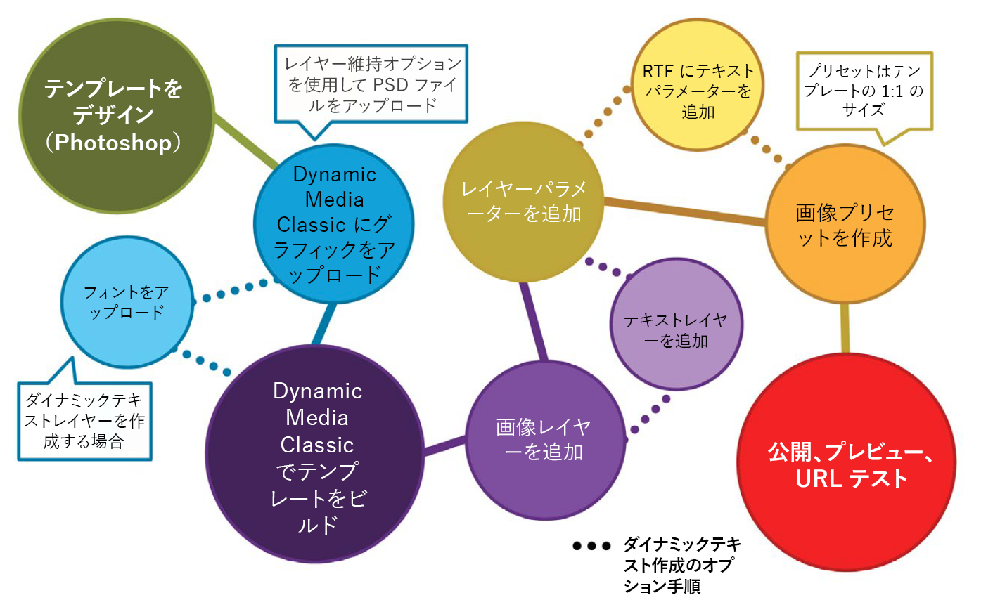
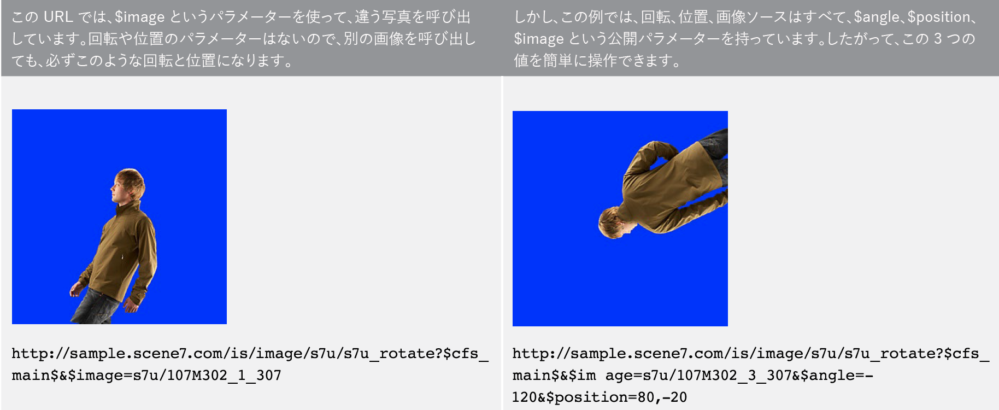
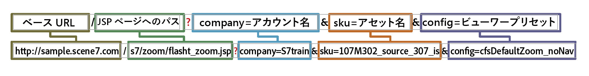
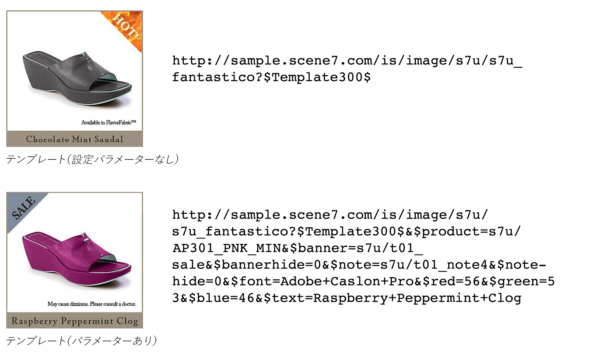

# 基本テンプレートの概要{#basic-templates}

Dynamic Media Classicの用語では、テンプレートは、テンプレートが公開された後に、URLを使用して動的に変更できるドキュメントです。 Dynamic Media Classicは、Image Serverから呼び出され、画像とレンダリングされたテキストで構成される、基本的なテンプレートです。

テンプレートの最も強力な側面の1つは、直接統合ポイントを持ち、それらをデータベースに結び付けることです。 したがって、画像を提供してサイズを変更できるだけでなく、データベースに対して新しい商品や販売商品を検索し、それを画像上にオーバーレイとして表示することができます。 項目の説明を求め、選択およびレイアウトのフォントでラベルとして表示することができます。 可能性は無限です。

基本テンプレートは、単純なものから複雑なものまで、様々な方法で実装できます。 以下に例を示します。

- 基本的なマーチャンダイジング。 その製品が無料で出荷される場合は、「無料発送」などのラベルを使用します。 これらのラベルは、Photoshopの商品チームによって設定され、Webでは、画像に適用するタイミングを知るロジックを使用します。
- 高度なマーチャンダイジング。 各テンプレートには複数の変数があり、同時に複数のオプションを表示できます。 データベース、在庫およびビジネス・ルールを使用して、製品を「ジャストイン」、「クリアランス」、「売り切れ」のいずれに表示するかを決定します。 また、製品の背後に透明度を使用して、別の部屋など、異なる背景で表示する場合もあります。 同じテンプレートやアセットを製品の詳細ページで再利用して、同じ製品の大きいバージョンやズーム可能なバージョンを様々な背景で表示することができます。

Dynamic Media Classicは、これらのテンプレートベースのアプリケーションの視覚的な部分のみを提供することを理解することが重要です。 Dynamic Media Classicの企業またはその統合パートナーは、アプリケーションを作成するために、ビジネスルール、データベース、開発スキルを提供する必要があります。 「組み込み」テンプレートアプリケーションはありません。設計者はDynamic Media Classicでテンプレートを設定し、開発者はURL呼び出しを使用してテンプレート内の変数を変更します。

このチュートリアルの最後までに、次の方法を理解できます。

- Photoshop PSDをDynamic Media Classicにアップロードして、テンプレートの基礎として使用します。
- 画像レイヤーで構成されるシンプルなマーチャンダイジング基本テンプレートを作成します。
- テキストレイヤーを追加し、パラメーターを使用して変数を設定します。
- テンプレートURLを作成し、Webブラウザーを使用して画像を動的に操作します。

>[!NOTE]
>
>この章のURLはすべて例示用です。これらはライブリンクではありません。

## 基本テンプレートの概要

基本テンプレートの定義（つまり、単に「テンプレート」）は、URLアドレス可能なレイヤー画像です。 最終結果は画像ですが、URLで変更できる画像です。 Dynamic Media ClassicのP-TIFFアセットの組み合わせは、写真、テキスト、グラフィックで構成することができます。

テンプレートは、Photoshop PSDファイルに最も似ています。同様のワークフローと機能を持ちます。

- どちらも、積み重ねられた酢酸塩のシートのような層で構成されています。 部分的に透明な画像を合成して、レイヤーの透明な領域を下のレイヤーに透けて見ることができます。
- レイヤーを移動および回転して、コンテンツの位置を変更したり、不透明度や描画モードを変更して、コンテンツを部分的に透明にしたりできます。
- テキストベースの画層を作成できます。 Image ServerはPhotoshopやIllustratorと同じテキストエンジンを使用するので、画質は非常に高くなる可能性があります。
- 単純なレイヤースタイルを各レイヤーに適用して、ドロップシャドウやグローなどの特殊効果を作成できます。

ただし、Photoshop PSDとは異なり、レイヤーは完全に動的に、Image Server上のURLを使用して制御できます。

- すべてのテンプレートプロパティに変数を追加できるので、その場で簡単に構成を変更できます。
- 「パラメーター」と呼ばれる変数を使用すると、変更するテンプレートの部分のみを公開できます。

Photoshopと同様に、すべてのレイヤーを1つのファイルに配置して表示/非表示にするのではなく、変更する各レイヤーにプレースホルダーを追加するだけで済みます（ただし、必要に応じて追加することもできます）。

プレースホルダーを使用すると、レイヤーのコンテンツを、パブリッシュ済みの別のアセットと動的に入れ替えることができ、置き換えられたレイヤーと同じプロパティ（サイズや回転など）が自動的に取得されます。

基本テンプレートは通常、Photoshopで設計され、URLを使用してデプロイされるので、テンプレートプロジェクトにはデザインと技術の両方のスキルが混在している必要があります。 一般に、クリエイティブテンプレートの作業をおこなう人はPhotoshopのデザイナーで、テンプレートを実装する人はWeb開発者であると仮定します。 クリエイティブチームと開発チームは、テンプレートを正常に作成するために緊密に連携する必要があります。

テンプレートプロジェクトは、アプリケーションのビジネスルールやニーズに応じて、比較的シンプルな場合も非常に複雑な場合もあります。 基本テンプレートはImage Serverから呼び出されますが、Dynamic Media Classic環境は柔軟性があるので、他のテンプレート内にテンプレートをネストすることもでき、一般的な名前の変数でリンクできる、かなり複雑な画像を作成できます。

- [テンプレートの基本](https://docs.adobe.com/content/help/en/dynamic-media-classic/using/template-basics/quick-start-template-basics.html)の詳細を説明します。
- [基本テンプレート](https://docs.adobe.com/content/help/en/dynamic-media-classic/using/template-basics/creating-template.html#creating_a_template)の作成方法を説明します。

## 基本テンプレートの作成

基本テンプレートを使用する場合は、通常、次の図に示すワークフロー手順に従います。 ダイナミックテキストレイヤーを使用する場合、点線が付いたステップはオプションで、以下の手順で「テキストワークフロー」と示されます。 テキストを使用しない場合は、メインパスにのみ従います。

_基本テンプレートワークフロー。_

1. アセットをデザインし、作成します。 ほとんどのユーザーは、Adobe Photoshopでこれをおこないます。 必要なサイズでアセットをデザインします。サムネールページの200ピクセルの画像の場合は、200ピクセルでデザインします。 ズームする必要がある場合は、約2,000ピクセルのサイズでデザインします。 Photoshop(またはビットマップとして保存されたIllustrator)を使用してアセットを作成し、Dynamic Media Classicを使用してパーツを組み立て、レイヤーを管理し、変数を追加します。
2. グラフィックアセットをデザインしたら、Dynamic Media Classicにアップロードします。 PSDから個々のアセットをアップロードするのではなく、レイヤー化されたPSDファイル全体をアップロードし、Dynamic Media Classicでレイヤーごとにファイルを作成することをお勧めします（詳しくは、以下を参照）。 ****_テキストワークフロー：ダイナミックテキストを作成する場合は、フォントもアップロードします。動的テキストは変数で、URLを使用して制御します。 テキストが静的である、または変更しない短いフレーズが少数の場合（例えば、「X% Off」ではなく「New」や「Sale」というタグ）、Xが可変数の数の場合は、Photoshopでテキストをプレレンダリングし、ラスタライズレイヤーとしてアップロードすることをお勧めします。 簡単になり、テキストのスタイルを好きなように設定できます。_
3. ビルドメニューの基本テンプレートエディターを使用して、Dynamic Media Classicでテンプレートを作成し、画像レイヤーを追加します。 テキストワークフロー：同じエディターでテキストレイヤーを作成します。 この手順は、Dynamic Media Classicでテンプレートを手動で作成する場合に必要です。 デザインに合ったカンバスサイズを選択し、画像をキャンバスにドラッグ&amp;ドロップして、レイヤープロパティ（サイズ、回転、不透明度など）を設定します。 テンプレートにすべての可能なレイヤーを配置するのではなく、画像レイヤーごとに1つのプレースホルダーを配置します。 _テキストワークフロー：テキストレイヤーは、Photoshopでテキストレイヤーを作成する場合と同様に、テキストツールを使用して作成します。フォントを選択し、Photoshopの文字ツールと同じオプションを使用してスタイルを設定できます。_ もう1つのワークフローは、PSDをアップロードし、Dynamic Media Classicで「無料」テンプレートを生成し、テキストレイヤーを再作成することです。これについては後で詳しく説明します。
4. レイヤーを作成したら、URLを使用して制御するレイヤーの任意のプロパティ(レイヤーのソース（画像自体）を含む)にパラメーター（変数）を追加します。 _テキストワークフロー：また、テキストレイヤーにパラメーターを追加して、テキストの内容、レイヤー自体のサイズと位置、およびフォントカラー、フォントサイズ、横置きなどのすべての書式設定オプションを制御することもできます。_
5. テンプレートのサイズと一致する画像プリセットを作成します。 これをお勧めします。そのため、テンプレートは常に1対1のサイズで呼び出され、また、テンプレートに合わせてサイズ変更される大きな画像レイヤーにシャープを追加することもお勧めします。 ズームするテンプレートを作成する場合、この手順は不要です。
6. Dynamic Media ClassicプレビューからURLを公開、コピーし、ブラウザーでテストします。

## テンプレートアセットの準備とDynamic Media Classicへのアップロード

テンプレートアセットをDynamic Media Classicにアップロードする前に、いくつかの手順を完了する必要があります。

### アップロード用のPSDの準備

PhotoshopファイルをDynamic Media Classicにアップロードする前に、Photoshopのレイヤーを簡略化して、の操作が容易になり、Image Serverとの互換性が最も高くなります。 PSDファイルは、Dynamic Media Classicで認識されない多くの要素で構成される場合が多く、管理が困難な小さな要素も多く含まれる場合があります。 後で元のPSDを編集する必要がある場合は、必ずマスターPSDのバックアップを保存してください。 シンプル化されたコピーは、マスターではなくアップロードされます。

1. オン/オフを切り替える必要のある関連レイヤーを1つのレイヤーにマージ/フラット化することで、レイヤー構造を簡略化します。 例えば、「NEW」と青いバナーは単一のレイヤーに結合され、1回のクリックで表示/非表示を切り替えることができます。
   
2. 一部のレイヤータイプとレイヤー効果は、Dynamic Media ClassicまたはImage Serverではサポートされていないので、アップロードの前にラスタライズする必要があります。 そうしないと、効果が無視されたり、レイヤが破棄されたりする場合があります。 レイヤーをラスタライズすると、編集可能から編集不可に変換することになります。 レイヤーエフェクトまたはテキストレイヤーをラスタライズするには、空のレイヤーを作成し、**レイヤー/レイヤーを結合**&#x200B;またはCtrl + E/Cmd + Eキーを使用して、両方を選択して結合します。

   - Dynamic Media Classicでは、レイヤーのグループ化やリンクはできません。 グループまたはリンクセット内のすべての画層は、グループ化/リンクされなくなった個別の画層に変換されます。
   - レイヤーマスクはアップロード時に透明度に変換されます。
   - 調整レイヤーはサポートされていないので、破棄されます。
   - 塗りつぶしレイヤー（べた塗りレイヤーなど）はラスタライズされます。
   - スマートオブジェクトレイヤーとベクトルレイヤーは、アップロード時に通常の画像にラスタライズされ、スマートフィルターが適用され、ラスタライズされます。
   - 「テキストを抽出」オプションを使用しない限り、テキストレイヤーもラスタライズされます。詳しくは、以下を参照してください。
   - ほとんどのレイヤー効果は無視され、一部の描画モードのみがサポートされます。 不明な場合は、Dynamic Media Classicでシンプルな効果（内側またはドロップシャドウ、内側または外側のグローなど）を追加するか、空白のレイヤーを使用してPhotoshopで効果を統合およびラスタライズします。

### フォントの操作

また、ダイナミックテキストを生成する必要がある場合は、フォントをアップロードして公開します。 Dynamic Media Classicに含まれているフォントはArialのみです。

Web上でフォントを使用するライセンスを取得するのは、各企業の責任です。単に、コンピュータにフォントをインストールしても、Web上でフォントを使用する権利は与えられず、許可なく使用すると会社が法的措置を受ける可能性があります。 また、ライセンス条件は異なります。例えば、印刷用と画面表示用に別々のライセンスが必要になる場合があります。

Dynamic Media Classicは、標準OpenType(OTF)、TrueType(TTF)およびType 1 Postscriptフォントをサポートしています。 Macのみのスーツケースフォント、タイプコレクションファイル、Windowsのシステムフォント、および独自の機械フォント（彫刻や刺繍の機械で使用されるフォントなど）は、すべてサポートされていません。Dynamic Media ClassicやImage Serverで使用する標準フォントに変換する必要があります。

他のアセットと同様に、フォントがDynamic Media Classicにアップロードされた後は、Image Serverにも公開する必要があります。 テンプレートエラーは、フォントを公開するのを忘れるとよく発生します。その結果、画像エラーが発生します。Image Serverは、別のフォントを置き換えません。 また、アップロード時に「**テキストを抽出**」オプションを使用する場合は、それらのフォントを使用するPSDをアップロードする前にフォントファイルをアップロードする必要があります。 **テキストを抽出**&#x200B;機能は、テキストを編集可能なテキストレイヤーとして再作成し、Dynamic Media Classicテンプレート内に配置しようとします。 これは、次のトピック「PSDオプション」で説明します。

フォントには、外部ファイル名とは異なる複数の内部名が付けられることが多いことに注意してください。 Dynamic Media Classicでは、そのアセットの詳細ページに様々な名前が表示されます。 Dynamic Media Classicの「メタデータ」タブに表示される、Adobe Caslon Pro Semiboldフォントの名前を次に示します。

_Dynamic Media Classicのフォントの詳細ページの「メタデータ」タブ_

Dynamic Media Classicでは、このフォントのファイル名(ACaslonPro-Semibold)がアセットIDとして使用されますが、これはテンプレートで使用される名前ではありません。 テンプレートは、下部に表示されるリッチテキストフォーマット(RTF)名を使用します。 RTFは、Image Serverテキストエンジンのネイティブ「言語」です。

URL経由でフォントを変更する必要がある場合は、を呼び出して、（アセットIDではなく）フォントのRTF名を指定する必要があります。そうしないと、エラーが発生します。 この場合、このフォントの正しい名前は「Adobe Caslon Pro」になります。 フォントとRTFについては、以下の「RTFとテキストパラメータ」のトピックで詳しく説明します。

WindowsおよびMacシステムで最も一般的なフォントファイル形式は、OpenTypeとTrueTypeです。 OpenTypeの拡張子は.OTFですが、TrueTypeは.TTFです。 Dynamic Media Classicでは、どちらの形式も同様に機能します。

### PSDをアップロードする際のオプションの選択

テンプレートを作成するためにPhotoshopファイル(PSD)をアップロードする必要はありません。テンプレートは、Dynamic Media Classicの任意の画像アセットから作成できます。 ただし、PSDをアップロードすると、通常はレイヤー化されたPSDに既にこれらのアセットが含まれるので、オーサリングが容易になります。 さらに、Dynamic Media Classicは、レイヤー化されたPSDをアップロードする際に、自動的にテンプレートを生成します。

- **レイヤーを維持.** これは最も重要なオプションです。これにより、Dynamic Media Classicは、Photoshopレイヤーごとに1つの画像アセットを作成します。 オフにすると、他のすべてのオプションが無効になり、PSDは1つの画像に統合されます。
- **** **CreateTemplate.** このオプションは、生成された様々なレイヤを取り込み、それらを組み合わせて自動的にテンプレートを作成します。自動生成テンプレートを使用する際の欠点は、Dynamic Media Classicではすべてのレイヤーが1つのファイルに配置される点ですが、レイヤーごとに1つのプレースホルダーしか必要ない点です。 余分なレイヤを削除するのは簡単ですが、レイヤが多い場合は、レイヤを再作成する方が簡単です。 新しいテンプレートの名前は必ず変更してください。そうしないと、次に同じPSDを再度アップロードする際に上書きされます。
- **テキストを抽出.** これにより、PSD内のテキストレイヤーが、アップロードしたフォントを使用して、テンプレート内のテキストレイヤーとして再作成されます。この手順は、テキストがPhotoshopのパス上にあり、そのパスをテンプレートに維持する場合に必要です。 この機能を使用するには、「**テンプレートを作成**」オプションを使用する必要があります。抽出されたテキストは、アップロード時に生成されたテンプレートでのみ作成できます。
- **レイヤーを背景サイズに拡張** この設定により、各レイヤーがPSDキャンバス全体と同じサイズになります。これは、常に固定された状態に保たれるレイヤーにとって非常に便利です。画像を同じレイヤに入れ替える場合は、画像の位置を変更する必要が生じる場合があります。
- **レイヤーの名前.** これにより、Dynamic Media Classicで、レイヤーごとに生成された各アセットの名前を指定する方法が示されます。**Photoshop** **およびレイヤー** **名前**&#x200B;またはPhotoshopと&#x200B;**レイヤー** **数値**&#x200B;のいずれかをお勧めします。 どちらのオプションも、名前の最初の部分にPSD名を使用し、最後にレイヤー名または番号を追加します。 例えば、「shirt.psd」という名前のPSDがあり、「front」、「sleeves」、「collar」という名前のレイヤーがある場合、**Photoshopと**&#x200B;レイヤーの「Name **」オプションを使用してアップロードすると、Dynamic Media ClassicはアセットID「shirt_front」、「shirt_sleves」、「」と「s_s&quot;**&#x200B;これらのオプションの1つを使用すると、Dynamic Media Classicで名前が一意になるようにできます。

## 画像レイヤーを使用したテンプレートの作成

Dynamic Media Classicは、レイヤー化されたPSDからテンプレートを自動的に作成できますが、手動でテンプレートを作成する方法を知っておく必要があります。 前述のように、Dynamic Media Classicで作成したテンプレートを使用しない場合もあります。

### テンプレートの基本UI

まず、編集インターフェイスについて説明します。

左側の中央には、最終的なテンプレートのプレビューを示す作業領域が表示されます。 右側には、[レイヤ]パネルと[レイヤプロパティ]パネルが表示されます。 これらの領域は、最も多くの作業を行う場所です。

_ビルドテンプレートの基本ページ_

- **プレビュー/作業領域** これはメインウィンドウです。ここでは、マウスを使用してレイヤを移動、サイズ変更、回転できます。 レイヤーの輪郭は破線で表示されます。
- **レイヤー。** これは、Photoshopのレイヤーパネルに似ています。テンプレートにレイヤを追加すると、ここにレイヤが表示されます。 レイヤーは上から下に積み重ねられます。レイヤーパネルの上のレイヤーは、リスト内の下の他のレイヤーの上に表示されます。
- **画層のプロパティ** ここでは、数値コントロールを使用して、レイヤーのすべてのプロパティを調整できます。まず画層を選択し、次にそのプロパティを調整します。
- **** **CompositeURL。** UIの下部には、複合URL領域が表示されます。この節では説明しませんが、ここでは、一連の画像サービングURL修飾子として分解されたテンプレートを確認できます。 この領域は編集可能です。Image Serverのコマンドに詳しい場合は、ここで手動でテンプレートを編集できます。 しかし、あなたもそれを壊すことができます。 Photoshopと同様に、レイヤー番号は0から始まります。 キャンバスはレイヤ0で、最初に追加するレイヤはレイヤ1です。 描画モードは、レイヤーのピクセルとその下のピクセルとのブレンド方法を決定します。 描画モードを使用して、様々な特殊効果を作成できます。

#### テンプレートの基本エディタの使用

基本テンプレートを開始するためのワークフロー手順を次に示します。

1. Dynamic Media Classicで、**ビルド/テンプレートの基本**&#x200B;に移動します。 何も選択していない場合や、テンプレートの最初のレイヤーとなる画像を選択して開始する場合があります。
2. サイズを選択し、**OK**&#x200B;を押します。 このサイズは、Photoshopで設計したサイズと一致する必要があります。 テンプレートエディターが読み込まれます。
3. 手順1で画像を選択していない場合は、左側のアセットパネルで画像を検索または参照し、作業領域にドラッグします。

   - 画像はキャンバスのサイズに合わせて自動的にサイズ変更されます。 高解像度の画像をスワップアウトする場合は、通常、大きな(2,000 px)P-TIFF画像の1つを取り込み、プレースホルダーとして使用します。
   - これはテンプレートの一番下のレイヤーにする必要がありますが、後でレイヤーを並べ替えることもできます。

4. 作業領域で直接、またはレイヤーのプロパティパネルで設定を調整して、レイヤーのサイズを変更または再配置します。
5. 必要に応じて、追加の画像レイヤをドラッグします。 必要に応じて、レイヤー効果も追加します。 以下の&#x200B;_レイヤー効果の追加_&#x200B;を参照してください。
6. 「**保存**」をクリックし、保存場所を選択し、テンプレートに名前を付けます。 ただし、この時点では、テンプレートは統合されたPhotoshop画像とまったく同じように見えます。まだ変更できません。

### レイヤー効果の追加

Image Serverは、いくつかのプログラムレイヤー効果（レイヤーのコンテンツの外観を変える特殊効果）をサポートしています。 これらは、Photoshopのレイヤー効果と同様に機能します。 レイヤにアタッチされているが、レイヤとは独立して制御されている。 レイヤ自体に恒久的な変更を加えることなく、調整や削除を行うことができます。

- **ドロップシャドウ**&#x200B;を参照してください。レイヤーの境界の外側に、xおよびyピクセルのオフセットで配置するシャドウを適用します。
- **シャドウ（内側）**&#x200B;を参照してください。レイヤーの境界内にシャドウを適用し、xとyのピクセルオフセットで配置します。
- **外側光彩**。レイヤーのすべてのエッジの周りにグロー効果を均等に適用します。
- **光彩（内側）**&#x200B;レイヤーのすべてのエッジの内側にグロー効果を均等に適用します。

_ドロップシャドウのあるレイヤーとないレイヤー_

効果を追加するには、**効果を追加**&#x200B;をクリックし、メニューから効果を選択します。 通常のレイヤーと同様に、レイヤーパネルで効果を選択し、レイヤーのプロパティパネルを使用して設定を調整できます。

シャドウ効果は、レイヤーから水平または垂直にオフセットされますが、グロー効果はすべての方向に均等に適用されます。 内側のエフェクトは、レイヤーの不透明部分の上に作用しますが、外側のエフェクトは透明部分にのみ作用します。

[レイヤー効果](https://docs.adobe.com/content/help/en/dynamic-media-classic/using/template-basics/creating-template.html#using-shadow-and-glow-effects-on-layers)の追加について詳しく説明します。

### パラメーターの追加

レイヤーを組み合わせて保存するだけの場合、統合されたPhotoshopイメージと同じ結果になります。 テンプレートに特殊なのは、各レイヤーのプロパティにパラメーターを追加し、URLを使用して動的に変更できる機能です。

Dynamic Media Classicの用語では、パラメーターは、URLを使用して操作できるように、テンプレートプロパティにリンクできる変数です。 レイヤーにパラメーターを追加すると、Dynamic Media ClassicはURLでそのプロパティをドル記号($)で先頭に追加して公開します。例えば、「size」というパラメーターを作成してレイヤーのサイズを変更すると、Dynamic Media Classicはパラメーターの名前を$sizeに変更します。

プロパティにパラメーターを追加しない場合、そのプロパティはDynamic Media Classicデータベースで非表示のままとなり、URLには表示されません。

パラメーターがない場合、特に動的テキストを使用する場合は、URLは通常より長くなります。 テキストは、各URLに数十の追加文字を追加します。

最後に、最初のパラメーターセットがテンプレートのプロパティのデフォルト値になります。 テンプレートを作成し、パラメーターを追加して、パラメーターを指定せずにURLを呼び出すと、Image Serverはテンプレートに保存したすべてのデフォルトを使用して画像を作成します。 パラメーターは、プロパティを変更する場合にのみ必要です。 プロパティを変更する必要がない場合は、パラメーターを設定する必要はありません。

#### パラメータの作成

次に、パラメーターを作成するワークフローを示します。

1. パラメータを作成するレイヤーの名前の横にある「**パラメータ**」ボタンをクリックします。 「パラメーター」画面が開きます。 画層上の各プロパティとその値が一覧表示されます。
1. パラメーターにする各プロパティの名前の横にある&#x200B;**On**&#x200B;オプションを選択します。 デフォルトのパラメーター名が表示されます。 プロパティに追加できるのは、デフォルトの状態から変更されたパラメータのみです。

   - 例えば、レイヤーを追加し、デフォルトのxy位置を0,0のままにした場合、Dynamic Media Classicは&#x200B;**Position**&#x200B;プロパティを表示しません。 固定するには、レイヤーを少なくとも1ピクセル移動します。 現在、Dynamic Media Classicは、パラメータ化可能なプロパティとして&#x200B;**位置**&#x200B;を公開します。
   - 表示/非表示プロパティにパラメータを追加するには（レイヤーの表示/非表示を切り替える）、**表示**&#x200B;アイコンまたは&#x200B;**レイヤーを非表示**&#x200B;アイコンをクリックします（必要に応じて後でオンに戻すことができます）。 Dynamic Media Classicは、パラメーター化可能な&#x200B;**Hide**&#x200B;プロパティを公開するようになりました。

1. デフォルトのパラメーター名を、URLで識別しやすい名前に変更します。 例えば、画像の上のバナーレイヤーを変更するパラメーターを追加する場合、「layer_2_src」のデフォルト名を「banner」に変更します。
1. **閉じる**&#x200B;を押して、パラメーター画面を終了します。
1. **パラメータ**&#x200B;ボタンをクリックし、パラメータの追加と名前の変更を行って、他のレイヤーに対してこの手順を繰り返します。
1. 完了したら、変更を保存します。

>[!TIP]
>
>パラメーターの名前を意味のある名前に変更し、名前を標準化する命名規則を作成します。 設計チームと開発チームの両方で、あらかじめ命名規則に合意されていることを確認します。
>
>プロパティが表示されないため、パラメータを追加できませんか？ レイヤーのプロパティをデフォルトから（移動、サイズ変更、非表示など）変更するだけです。 これで、そのプロパティが公開されたのがわかります。

[テンプレートパラメーター](https://docs.adobe.com/content/help/en/dynamic-media-classic/using/template-basics/creating-template-parameters.html)の詳細をご覧ください。

## テキストレイヤーを使用したテンプレートの作成

次に、テキストレイヤーを含む基本テンプレートを作成する方法を学びます。

### ダイナミックテキストについて

これで、画像レイヤを使用して基本テンプレートを作成する方法がわかりました。 多くのアプリケーションでは、これが必要です。 前の練習で見たように、単純なテキスト（「Sale」や「New」など）を持つレイヤは、テキストを変更する必要がないので、画像としてラスタライズおよび処理できます。

ただし、次の操作が必要な場合はどうすればよいですか。

- 値が25%の可変で、「25%オフ」というラベルを追加します。
- 製品名を画像の上に付けたテキストラベルを追加します。
- テンプレートが表示されている国に応じて、レイヤーを異なる言語にローカライズする

この場合、テキストや書式を制御するためのパラメータを含むダイナミックテキストレイヤーを追加します。

テキストを作成するには、いくつかのフォントをアップロードする必要があります。アップロードしない場合、Dynamic Media ClassicはデフォルトでArialに設定されます。 フォントもImage Serverに公開する必要があります。公開しないと、そのフォントを使用するテキストをレンダリングしようとするとエラーが発生します。

### RTFおよびテキストパラメータ

テンプレートの基本ツールを使用してテキストに変数を追加するには、テキストのレンダリング方法を理解する必要があります。 Image Serverは、PhotoshopとIllustratorが使用するのと同じエンジンであるAdobeテキストエンジンを使用してテキストを生成し、最終的な画像のレイヤーとして合成します。 Image Serverは、エンジンと通信するために、リッチテキスト形式(RTF)を使用します。

RTFは、ドキュメントのフォーマットを指定するためにMicrosoftが開発したファイル形式仕様です。 ほとんどのワード処理と電子メールソフトウェアで使用される標準のマークアップ言語です。 URL &amp;text=\b1 Helloに書き込むと、\b1はテキストを太字にするRTFコマンドなので、Image Serverは「Hello」という単語を太字で画像を生成します。

良い知らせは、Dynamic Media ClassicがRTFを生成することです。 テンプレートにテキストを入力して書式を追加する場合、Dynamic Media ClassicはRTFコードを自動的にテンプレートに書き込みます。 これを言及する理由は、RTF自体に直接パラメータを追加するからです。

#### テキストレイヤーの作成

Dynamic Media Classicのテンプレートでテキストレイヤーを作成するには、次の2つの方法があります。

1. Dynamic Media Classicのテキストツール。 この方法については、以下で説明します。 テンプレートの基本エディターには、テキストボックスの作成、テキストの入力、テキストの書式設定を行うためのツールが用意されています。 Dynamic Media Classicは、必要に応じてRTFを生成し、別のレイヤーに配置します。
2. テキストの抽出（アップロード時） もう1つの方法は、Photoshopでテキストレイヤーを作成し、（画像レイヤーとしてラスタライズするのではなく）通常のテキストレイヤーとしてPSDに保存することです。 次に、ファイルをDynamic Media Classicにアップロードし、「**テキストを抽出**」オプションを使用します。 Dynamic Media Classicは、RTFコマンドを使用して、各Photoshopテキストレイヤーを画像サービングテキストレイヤーに変換します。 この方法を使用する場合は、最初にDynamic Media Classicにフォントをアップロードしてください。それ以外の場合は、Dynamic Media Classicはアップロード時にデフォルトフォントを置き換え、正しいフォントを簡単に置き換える方法はありません。

### テキストエディタ

テキストを入力するには、テキストエディタを使用します。 テキストエディターは、PhotoshopやIllustratorの場合と同様の書式設定コントロールを使用して、テキストの入力と書式設定を行えるWYSIWYGインターフェイスです。

_テンプレートの基本テキストエディター。_

ほとんどの作業は、「**プレビュー**」タブで行います。このタブでは、テキストを入力し、テンプレート内での表示を確認できます。 また、必要に応じて、RTFを手動で編集するために使用する「**ソース**」タブもあります。

一般的なワークフローでは、「**プレビュー**」タブを使用してテキストを入力します。

次に、テキストを選択し、上部のコントロールを使用して、フォントカラー、フォントサイズ、位置揃えなどの書式を選択します。 テキストのスタイルを希望どおりに設定したら、[**適用**]をクリックして、作業領域のプレビューで更新を確認します。 次に、テキストエディタを閉じて、テンプレートの基本メインウィンドウに戻ります。

#### テキストエディタの使用

次に、テンプレートの基本ビルドページ内にテキストを追加するワークフロー手順を示します。

1. ビルドページの上部にある「**テキスト**」ツールボタンをクリックします。
2. テキストを表示するテキストボックスをドラッグします。 テキストエディターウィンドウがモーダルウィンドウで開きます。 バックグラウンドでは、テンプレートが表示されますが、テキストの編集が終了するまで編集できません。
3. テンプレートの初回読み込み時に表示するサンプルテキストを入力します。 例えば、パーソナライズされた電子メール画像用のテキストボックスを作成する場合、「名前をこんにちは」というテキストが表示されます。 今こそ救う時だ！」 後で、NameをURLで送信する値に置き換えるためのテキストパラメーターを追加します。 「**適用**」をクリックするまで、テキストはウィンドウの下のテンプレートに表示されません。
4. テキストの書式を設定するには、マウスでドラッグして選択し、UIで書式設定コントロールを選択します。

   - 多くの書式設定オプションがあります。 最も一般的なものは、フォント（面）、フォントサイズ、フォントカラー、および左/中央/右揃えです。
   - 最初にテキストを選択することを忘れないでください。 そうしないと、書式を適用できなくなります。
   - 別のフォントを選択する場合は、テキストを選択し、フォントメニューを開いてください。 エディターには、Dynamic Media Classicにアップロードされたすべてのフォントのリストが表示されます。 フォントがコンピューターにもインストールされている場合は、黒で表示されます。 コンピュータにインストールされていない場合は、赤で表示されます。 ただし、「**適用**」をクリックしても、プレビューウィンドウでレンダリングされます。 Dynamic Media Classicを使用しているすべてのユーザーがフォントを使用できるようにするには、Dynamic Media Classicにフォントをアップロードするだけで済みます。 公開すると、Image Serverはこれらのフォントを使用してテキストを生成します。ユーザーは、作成したテキストを表示するためにフォントをインストールする必要はありません。画像の一部であるからです。
   - PhotoshopやIllustratorとは異なり、Image Serverはテキストボックス内でテキストを垂直方向に揃えることができます。 デフォルトは上揃えです。 これを変更するには、テキストを選択し、**垂直方向の配置**&#x200B;メニューから&#x200B;**中央**&#x200B;または&#x200B;**下**&#x200B;を選択します。
   - テキストをボックスに対して大きすぎる（またはテキストボックスが小さすぎる）場合、テキストのすべてまたは一部が切り取られて消えます。 フォントサイズを小さくするか、ボックスを大きくします。

5. 「**適用**」をクリックして、変更が作業領域ウィンドウに反映されることを確認します。 「**適用**」をクリックする必要があります。クリックしないと、編集内容が失われます。
6. 完了したら、「**閉じる**」をクリックします。 編集モードに戻る場合は、テキストレイヤーをダブルクリックして、テキストエディターを再度開きます。

フォントがシステム上にローカルにインストールされている場合、テキストエディターは、フォントの大きさを正確にプレビューします。

### テキストレイヤーへのパラメータの追加について

次に、レイヤパラメータと同じ手順で、テキストパラメータを追加します。 テキストレイヤーは、サイズや位置などのレイヤーパラメータを取ることもできます。ただし、追加のパラメータを取得して、RTFのあらゆる側面を制御できます。

レイヤパラメータとは異なり、変更する値を選択し、プロパティ全体にパラメータを追加するのではなく、その値にパラメータを追加するだけです。

サンプルRTF:

RTFを調べる際に、各設定を変更する場所を見つけ出す必要があります。 上記のRTFでは、一部の形式が意味を持つ場合があり、書式設定の元の場所を確認できます。

「チョコレートミントサンダル」という言葉が見えます

- Poor Richardというフォントへの参照があります。ここでフォントが選択されます。
- RGB値を確認できます。\red56\green53\blue4  — これはテキストカラーです。
- フォントサイズは20ですが、20の数字は表示されません。 しかし、\fs40というコマンドは、何か奇妙な理由で、RTFはフォントをハーフポイントとして測定します。 したがって、\fs40はフォントサイズです！

パラメータを作成するのに十分な情報がありますが、画像サービングのドキュメントには、すべてのRTFコマンドの完全な参照が記載されています。 [画像サービングのドキュメント](https://docs.adobe.com/content/help/en/dynamic-media-developer-resources/image-serving-api/image-serving-api/http-protocol-reference/text-formatting/c-text-formatting.html#concept-0d3136db7f6f49668274541cd4b6364c)を参照してください。

#### テキストレイヤーにパラメータを追加する

次に、テキストレイヤーにパラメータを追加する手順を示します。

1. パラメータを作成するテキストレイヤーの名前の横にある「**パラメーター**」ボタン(「P」)をクリックします。 「パラメーター」画面が開きます。 「**共通**」タブには、レイヤー上の各プロパティとその値が一覧表示されます。 ここで、通常のレイヤパラメータを追加できます。
1. 「**テキスト**」タブをクリックします。 上部にRTFが表示されます。追加するパラメーターは、その下に表示されます。
1. パラメーターを追加するには、まず変更する値をハイライト表示し、「**パラメーターを追加**」ボタンをクリックします。 コマンド自体ではなく、コマンドの値のみを選択するようにしてください。 例えば、上記のサンプルRTFでフォント名のパラメータを設定するには、「Poor Richard」だけをハイライト表示し、それにパラメータを追加しますが、「\f0」は追加しません。 「**パラメーターを追加**」をクリックすると、下のリストに表示され、RTFでパラメーター値が選択されている間は赤で表示されます。 パラメーターを削除する必要がある場合は、**オン**&#x200B;の横にあるチェックボックスをクリックしてそのパラメーターをオフにすると、表示が消えます。
1. 「 」をクリックして、パラメータの名前をわかりやすい名前に変更します。
1. 完了すると、パラメータが存在するRTFが緑色でハイライト表示され、パラメータ名と値が次に示されます。
1. 「**閉じる**」をクリックして、パラメーター画面を終了します。 次に、「 **保存** 」を押して、テンプレートを保存します。 編集が終了したら、**閉じる**&#x200B;を押して、「テンプレートの基本」ページを終了します。
1. 「**プレビュー**」をクリックして、Dynamic Media Classicでテンプレートをテストします。 テキストパラメーターをテストするには、プレビューウィンドウに新しいテキストまたは新しい値を入力します。 フォントを変更するには、フォントの正確なRTF名を入力する必要があります。

>[!TIP]
>
>テキストの色にパラメータを追加するには、赤、緑、青のパラメータを別途追加します。 例えば、RTFが`\red56\green53\blue46`の場合、値56、53、46に赤、緑、青の各パラメータを個別に追加します。 URLで、3つすべてを呼び出して色を変更します。`&$red=56&$green=53&$blue=46`.

[ダイナミックテキストパラメーター](https://docs.adobe.com/content/help/en/dynamic-media-classic/using/template-basics/creating-template-parameters.html#creating-dynamic-text-parameters)の作成方法を説明します。

## テンプレートURLの公開と作成

### 画像プリセットの作成

テンプレートのプリセットの作成は必須の手順ではありません。 ベストプラクティスとして、テンプレートは常に1:1のサイズで呼び出し、また、テンプレートに合わせてサイズ変更される大きな画像レイヤーにシャープを追加することをお勧めします。 プリセットを指定せずに画像を呼び出した場合、Image Serverでは任意に画像のサイズをデフォルトサイズ（約400ピクセル）に変更し、デフォルトのシャープニングは適用されません。

テンプレートの画像プリセットに関して特別なことはありません。 同じサイズの静的画像のプリセットが既にある場合は、代わりに使用できます。

### 公開

Image Serverにプッシュされた変更を確認するには、公開を実行する必要があります。 公開する必要がある点に注意してください。様々な画像アセットレイヤー、ダイナミックテキストのフォント、およびテンプレート自体。 基本テンプレートは、画像セットやスピンセットなど、他のDynamic Media Classicのリッチメディアアセットと同様に、人工的な構成です。一連の画像サービングコマンドを使用して画像とフォントを参照する、データベース内の行項目です。 そのため、テンプレートを公開する際には、Image Server上のデータを更新するだけです。

[テンプレートのパブリッシュ](https://docs.adobe.com/content/help/en/dynamic-media-classic/using/template-basics/publishing-templates.html)の詳細をご覧ください。

### テンプレートURLの構成

基本テンプレートには、前述の通常の画像呼び出しと同じ必須URL構文があります。 通常、テンプレートには、値を持つパラメータなど、アンパサンド(&amp;)で区切られた多くの修飾子が含まれます。 ただし、主な違いは、静的な画像を呼び出すのではなく、をメイン画像としてテンプレートを呼び出すことです。

プリセット名の両側にドル記号($)が付く画像プリセットとは異なり、パラメーターの先頭には1つのドル記号が付きます。 これらのドル記号の配置は重要です。

**正解**

`$text=46-inch LCD HDTV`

**不正解**

`$text$=46-inch LCD HDTV`

`$text=46-inch LCD HDTV$`

`text=46-inch LCD HDTV`

前述のように、パラメーターはテンプレートを変更するために使用されます。 パラメーターを指定せずにテンプレートを呼び出すと、Template Basicsオーサリングツールで設計されたデフォルト設定に戻ります。 プロパティを変更する必要がない場合は、パラメーターを設定する必要はありません。

_imageパラメーターを設定しない（上記）テンプレートとパラメーターを設定する（下記）テンプレートの例。_
