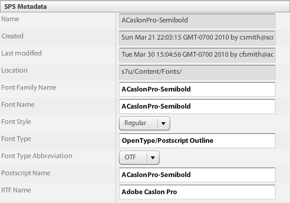

# 基本テンプレートの紹介{#basic-templates}

Dynamic Mediaクラシック用語では、テンプレートは、テンプレートが公開された後、URLを使用して動的に変更できるドキュメントです。 Dynamic Mediaクラシックオファー基本テンプレート。Image Serverから呼び出され、画像とレンダリングされたテキストで構成される画像ベースのテンプレートです。

テンプレートの最も強力な点の1つは、テンプレートには、データベースに直接統合できる点がある点です。 したがって、画像を提供してサイズを変更するだけでなく、データベースをクエリして新品や販売品を探し、それを画像上にオーバーレイとして表示することができます。 項目の説明を尋ねると、それを選択したフォントとレイアウトでラベルとして表示できます。 可能性は無限です。

基本テンプレートは、単純なものから複雑なものまで、様々な方法で実装できます。 次に例を示します。

- 基本的なマーチャンダイジング。 製品に送料が無料の場合は、「送料無料」などのラベルを使用します。 これらのラベルはPhotoshopの商品チームによって設定され、ウェブはそれらをいつ画像に適用するかを知るロジックを使用します。
- 高度なマーチャンダイジング。 各テンプレートには複数の変数があり、同時に複数のオプションを表示できます。 データベース、在庫、ビジネスルールを使用して、製品を「ジャストイン」、「クリアランス」、「売り切れ」のいずれに表示するかを決定します。 また、商品の背後で透明度を使用して、部屋ごとなどの異なる背景に商品を表示することもできます。 同じテンプレートやアセットを製品の詳細ページに転用して、異なる背景に同じ製品の大きいまたはズーム可能なバージョンを表示することができます。

Dynamic Mediaクラシックは、テンプレートベースのアプリの視覚的な部分しか提供しないことを理解することが重要です。 Dynamic Mediaクラシック会社またはその統合パートナーは、アプリケーションを作成するためのビジネスルール、データベース、開発スキルを提供する必要があります。 「組み込み」のテンプレートアプリケーションはありません。デザイナーは、Dynamic Mediaクラシックでテンプレートを設定し、開発者はURL呼び出しを使用してテンプレート内の変数を変更します。

チュートリアルのこの節を終えるまでに、次の方法を習得できます。

- PhotoshopPSDをDynamic Mediaクラシックにアップロードして、テンプレートの基本として使用します。
- 画像レイヤーから成るシンプルなマーチャンダイジング基本テンプレートを作成します。
- テ追加キストレイヤーを作成し、パラメータを使用して可変にします。
- テンプレートURLを作成し、Webブラウザーを使用して画像を動的に操作します。

>[!NOTE]
>
>この章のURLはすべて、例示的な目的でのみ使用します。これらのリンクはライブリンクではありません。

## 基本テンプレートの概要

基本テンプレート（短くは「テンプレート」）の定義は、URLアドレス指定可能なレイヤー画像です。 最終的には画像が生成されますが、URLによって変更できる画像が生成されます。 写真、テキスト、グラフィックで構成できます。P-TIFFアセットは、Dynamic Mediaクラシックで任意に組み合わせて使用できます。

テンプレートは、PhotoshopPSDファイルに最も似ています。テンプレートは、同様のワークフローと同様の機能を備えています。

- どちらも、酢酸が積み重ねられたシートのような層で構成されます。 部分的に透明な画像を合成して、レイヤーの透明部分を透けて下のレイヤーを見ることができます。
- レイヤーを移動および回転してコンテンツの位置を変更したり、不透明度や描画モードを変更してコンテンツを部分的に透明にしたりできます。
- テキストベースのレイヤーを作成できます。 Image ServerはPhotoshopやIllustratorと同じテキストエンジンを使用するので、高画質を得ることができます。
- 単純なレイヤスタイルを各レイヤに適用して、ドロップシャドウやグローなどの特殊効果を作成できます。

ただし、PhotoshopのPSDとは異なり、レイヤーは、Image ServerのURLを使用して、完全に動的で制御できます。

- すべてのテンプレートプロパティに変数を追加できるので、その場で簡単に構成を変更できます。
- パラメーターと呼ばれる変数を使用すると、テンプレートの変更する部分のみを公開できます。

レイヤーごとにプレースホルダーを追加するだけで、すべてのレイヤーをPhotoshopのように1つのファイルに配置して表示/非表示にするのではなく、変化するレイヤーごとにプレースホルダーを追加できます（ただし、必要に応じて追加することもできます）。

プレースホルダを使用すると、レイヤのコンテンツを、パブリッシュ済みの別のアセットと動的に入れ替えることができ、置き換えられたレイヤと同じプロパティ（サイズや回転など）を自動的に取得します。

基本テンプレートは通常、Photoshopで設計され、URLを介してデプロイされるので、テンプレートプロジェクトにはデザインと技術の両方のスキルが組み合わされている必要があります。 一般に、クリエイティブテンプレートの作業を行う人はPhotoshopのデザイナーで、テンプレートの実装者はWeb開発者であると想定します。 クリエイティブチームと開発チームは、テンプレートを成功させるために緊密に連携する必要があります。

テンプレートプロジェクトは、ビジネスルールやアプリケーションのニーズに応じて、比較的単純でも非常に複雑でも構いません。 基本テンプレートはImage Serverから呼び出されますが、Dynamic Mediaクラシック環境の柔軟性により、他のテンプレート内にテンプレートをネストすることも可能で、一般的な名前の変数でリンクできる非常に複雑な画像を作成できます。

- [基本テンプレート](https://docs.adobe.com/content/help/en/dynamic-media-classic/using/template-basics/quick-start-template-basics.html)の詳細を表示します。
- [基本テンプレート](https://docs.adobe.com/content/help/en/dynamic-media-classic/using/template-basics/creating-template.html#creating_a_template)の作成方法を説明します。

## 基本テンプレートの作成

基本テンプレートを使用する場合、通常は次の図のワークフロー手順に従います。 ダイナミックテキストレイヤーを使用している場合は、点線でマークされた手順はオプションで、以下の手順で「テキストワークフロー」と示されます。 テキストを使用しない場合は、メインパスにのみ従います。

_基本テンプレートのワークフロー。_

1. アセットを設計および作成します。 ほとんどの場合、Adobe Photoshopで行います。 サムネールページ用の200ピクセルの画像の場合は、必要に応じてサイズを調整し、200ピクセルでデザインします。 ズームする必要がある場合は、約2000 pixelのサイズでデザインします。 Photoshop(および/またはビットマップとして保存したIllustrator)を使用してアセットを作成し、Dynamic Mediaクラシックを使用してパーツをまとめ、レイヤーを管理し、変数を追加します。
2. グラフィックアセットを設計した後、それらをDynamic Mediaクラシックにアップロードします。 PSDから個々のアセットをアップロードするのではなく、レイヤーPSDファイル全体をアップロードし、Dynamic Mediaクラシックで、アップロード時に「**レイヤーを維持**」オプションを使用してレイヤーごとにファイルを作成することをお勧めします（詳しくは、以下を参照）。 _テキストワークフロー：ダイナミックテキストを作成する場合は、フォントもアップロードします。動的テキストは可変で、URLを介して制御されます。 テキストが静的であるか、変更されない短いフレーズがいくつかある場合（タグの「X% Off」は可変番号ではなく「New」や「Sale」）は、Photoshopでテキストを事前レンダリングし、ラスタライズレイヤーとして画像としてアップロードすることをお勧めします。 簡単になり、テキストのスタイルを自由に設定できます。_
3. ビルドメニューの基本テンプレートエディターを使用して、Dynamic Mediaクラシックでテンプレートを作成し、画像レイヤーを追加します。 テキストワークフロー：同じエディターでテキストレイヤーを作成します。 この手順は、Dynamic Mediaクラシックでテンプレートを手動で作成する場合に必要です。 デザインに合ったカンバスサイズを選択し、画像をカンバスにドラッグ&amp;ドロップし、レイヤーのプロパティ（サイズ、回転、不透明度など）を設定します。 テンプレート上に可能なすべてのレイヤーを配置するわけではありません。各画像レイヤーに1つのプレースホルダーが必要です。 _テキストワークフロー：テキストレイヤーは、Photoshopでテキストレイヤーを作成するのと同様に、テキストツールを使用して作成します。Photoshop文字ツールと同じオプションを使用して、フォントを選択し、スタイルを設定することができます。_ もう1つのワークフローは、PSDをアップロードし、Dynamic Mediaクラシックで「無料」のテンプレートを生成し、テキストレイヤーを再作成することです。これについては後で詳しく説明します。
4. レイヤーを作成したら、URLを介して制御したいレイヤーのプロパティ(レイヤーのソース（画像自体）を含む)にパラメータ（変数）を追加します。 _テキストワークフロー：また、テキストレイヤーにパラメータを追加して、テキストの内容、レイヤー自体のサイズ、位置、フォント色、フォントサイズ、水平方向の追跡などのすべての形式設定オプションを制御することもできます。_
5. テンプレートのサイズと一致する画像プリセットを作成します。 この方法では、テンプレートは常に1:1サイズで呼び出されるようにし、また、テンプレートに合わせてサイズ変更される大きな画像レイヤーにシャープを追加することをお勧めします。 ズームするテンプレートを作成している場合は、この手順は不要です。
6. 公開し、Dynamic MediaクラシックプレビューからURLをコピーして、ブラウザーでテストします。

## テンプレートアセットの準備とDynamic Mediaクラシックへのアップロード

テンプレートアセットをDynamic Mediaクラシックにアップロードする前に、いくつかの準備手順を実行する必要があります。

### PSDをアップロード用に準備する

PhotoshopファイルをDynamic Mediaクラシックにアップロードする前に、Photoshopのレイヤーを単純化して、作業が容易になり、Image Serverとの互換性が最も高くなるようにします。 PSDファイルは、多くの場合、Dynamic Mediaクラシックでは認識できない多くの要素で構成され、管理が困難な小さな要素が多く生じる可能性があります。 後で元のPSDを編集する必要が生じた場合に備えて、マスターPSDのバックアップを必ず保存してください。 シンプル化されたコピーはアップロードされ、マスターはアップロードされません。

1. 関連するレイヤーを結合/統合して、オン/オフを切り替えて1つのレイヤーにすることで、レイヤー構造を簡略化します。 例えば、「NEW」というラベルと青いバナーは1つのレイヤーに結合され、1回のクリックで表示/非表示を切り替えることができます。
   
2. 一部のレイヤータイプとレイヤー効果は、Dynamic MediaクラシックまたはImage Serverでサポートされていないので、アップロードする前にラスタライズする必要があります。 そうしないと、エフェクトが無視されるか、レイヤーが破棄されます。 レイヤーをラスタライズするとは、編集可能から編集不可に変換することを意味します。 レイヤー効果またはテキストレイヤーをラスタライズするには、空のレイヤーを作成し、両方を選択して、**レイヤー/レイヤーを結合**&#x200B;またはCtrl + E/Command + Eキーを使用して結合します。

   - Dynamic Mediaクラシックでは、レイヤーをグループ化したり、リンクしたりすることはできません。 グループまたはリンクセット内のすべてのレイヤーは、グループ化/リンクされなくなった個別のレイヤーに変換されます。
   - レイヤーマスクは、アップロード時に透明度に変換されます。
   - 調整レイヤーはサポートされていないため、破棄されます。
   - べた塗りレイヤーなどの塗りレイヤーは、ラスタライズされます。
   - スマートオブジェクトレイヤーとベクトルレイヤーは、アップロード時に通常の画像にラスタライズされ、スマートフィルターが適用されラスタライズされます。
   - 「テキストを抽出」オプションを使用しない限り、テキストレイヤーもラスタライズされます。詳しくは、以下を参照してください。
   - ほとんどのレイヤー効果は無視され、いくつかの描画モードのみがサポートされます。 不明な場合は、Dynamic Mediaクラシックで単純な効果（内側またはドロップシャドウ、内側または外側の光彩など）を追加するか、空白のレイヤーを使用してPhotoshopで効果を合成およびラスタライズします。

### フォントの操作

また、動的テキストを生成する必要がある場合は、フォントをアップロードして公開します。 Dynamic Mediaクラシックに含まれる唯一のフォントはArialです。

Web上のフォントを使用するライセンスを取得するのは、会社の責任です。単に、フォントをコンピューターにインストールするだけでは、Web上でフォントを商用に使用する権利は得られず、許可がなければ、会社はフォント発行者から法的措置を受ける可能性があります。 また、ライセンス条件は異なります。例えば、印刷用と画面表示用に別々のライセンスが必要になる場合があります。

Dynamic Mediaクラシックは、標準OpenType(OTF)、TrueType(TTF)、およびType 1 Postscriptフォントをサポートしています。 Mac専用のスーツケースフォント、種類収集ファイル、Windowsシステムフォント、および独自の機械フォント（彫刻や刺しゅうの機械で使用するフォントなど）はすべてサポートされていません。標準フォント形式のフォントに変換するか、Image Serverで使用するのに似たフォントに置き換える必要があります。

フォントが他のアセットと同様にDynamic Mediaクラシックにアップロードされたら、それらもImage Serverに公開する必要があります。 非常に一般的なテンプレートエラーは、フォントの公開を忘れて画像エラーが発生することです。Image Serverが別のフォントを置き換えません。 また、アップロード時に「**テキストを抽出**」オプションを使用する場合は、これらのフォントを使用するPSDをアップロードする前にフォントファイルをアップロードする必要があります。 **「テキストを抽出」**&#x200B;機能を使用すると、テキストを編集可能なテキストレイヤーとして再作成し、Dynamic Mediaクラシックテンプレート内に配置しようとします。 これについては、次の「PSDオプション」トピックで説明します。

フォントには複数の内部名があり、外部ファイル名とは異なる場合が多いことに注意してください。 Dynamic Mediaクラシックでは、そのアセットの詳細ページに異なる名前がすべて表示されます。 Dynamic Mediaクラシックの「メタデータ」タブに表示される、フォントAdobe CaslonPro Semiboldの名前を次に示します。

_Dynamic Mediaクラシックのフォントの詳細ページの「メタデータ」タブ_

Dynamic Mediaクラシックでは、このフォントのファイル名(ACaslonPro-Semibold)がアセットIDとして使用されますが、テンプレートで使用される名前ではありません。 テンプレートは、下部に表示されるリッチテキスト形式(RTF)名を使用します。 RTFファイルは、Image Serverテキストエンジンのネイティブ「言語」です。

URL経由でフォントを変更する必要がある場合は、（アセットIDではなく）フォントのRTF名を呼び出す必要があります。そうしないと、エラーが発生します。 この場合、このフォントの正しい名前は「Adobe Caslonプロ」になります。 フォントとRTFに関する詳細は、後述の「RTFパラメータとテキストパラメータ」のトピックで説明します。

WindowsおよびMacシステムで最も一般的に使用されるフォントファイル形式は、OpenTypeとTrueTypeです。 OpenTypeには.OTF拡張子がありますが、TrueTypeは.TTFです。 Dynamic Mediaクラシックでは、どちらの形式も同様に機能します。

### PSDのアップロード時のオプションの選択

Photoshopファイル(PSD)をアップロードしてテンプレートを作成する必要はありません。テンプレートは、Dynamic Mediaクラシックの任意の画像アセットから作成できます。 ただし、PSDをアップロードすると、通常はこれらのアセットがレイヤー化されたPSDに既に存在するので、オーサリングが容易になります。 また、レイヤーPSDをアップロードすると、Dynamic Mediaクラシックは自動的にテンプレートを生成します。

- **レイヤーを維持.** これは最も重要なオプションです。これにより、Dynamic Mediaクラシックでは、Photoshopレイヤごとに1つの画像アセットが作成されます。 選択しない場合、他のすべてのオプションは無効になり、PSDは1つの画像に統合されます。
- **CreateTemplateを** **参照してください。** このオプションでは、生成された様々なレイヤーを取り込み、それらを組み合わせて自動的にテンプレートを作成します。自動生成テンプレートを使用する難点は、Dynamic Mediaクラシックではすべてのレイヤーが1つのファイルに配置される点ですが、レイヤーごとに1つのプレースホルダーしか必要にならない点です。 余分なレイヤを削除するのは簡単ですが、多数のレイヤがある場合は、レイヤを再作成する方が高速です。 新しいテンプレートの名前は必ず変更してください。そうしないと、次回同じPSDを再アップロードしたときに上書きされます。
- **テキストを抽出.** これにより、PSD内のテキストレイヤーが、アップロードしたフォントを使用して、テンプレート内のテキストレイヤーとして再作成されます。この手順は、テキストがPhotoshopのパス上にあり、そのパスをテンプレートで維持する場合に必要です。 この機能を使用するには、「テンプレートを作成」**オプションを使用する必要があります。抽出されたテキストは、アップロード時に生成されたテンプレートによってのみ作成できるからです。**
- **レイヤーを背景サイズに拡大** この設定により、各レイヤーはPSDカンバス全体と同じサイズになります。これは、常に固定された状態に保たれるレイヤーにとって非常に役立ちます。画像を同じレイヤに入れ替える場合は、再配置が必要になる場合があります。
- **レイヤーの名前.** これにより、レイヤーごとに生成された各アセットの名前を付ける方法がDynamic Mediaクラシックに示されます。**Photoshop** **とレイヤ** **名前**、Photoshopと&#x200B;**レイヤ** **番号**&#x200B;のどちらかを推奨します。 どちらのオプションでも、名前の最初の部分にPSD名が使用され、最後にレイヤー名または番号が追加されます。 例えば、「shirt.psd」というPSDがあり、「front」、「sleeves」、「collar」という名前のレイヤーがある場合、**Photoshopと**&#x200B;レイヤー&#x200B;**名前**&#x200B;を使用してアップロードすると、Dynamic MediaクラシックではアセットIDが「shirt_front」、「shrot_sleves」、&quot; これらのオプションの1つを使用すると、名前をDynamic Mediaクラシックで一意にすることができます。

## 画像レイヤーを使用したテンプレートの作成

Dynamic Mediaクラシックでは、レイヤー化されたPSDから自動的にテンプレートを作成できますが、テンプレートを手動で作成する方法を理解している必要があります。 上述のように、Dynamic Mediaクラシックで作成したテンプレートを使用しない場合があります。

### 基本テンプレートUI

まず、編集インターフェイスを見てみましょう。

左中央には、最終的なテンプレートのプレビューを示す作業領域が表示されます。 右側には、レイヤーパネルとレイヤープロパティパネルがあります。 最も多くの作業を行うのは、これらの領域です。

_基本テンプレートページを作成します。_

- **プレビュー/作業領域を参照してください。** これがメインウィンドウです。ここでは、レイヤーの移動、サイズ変更および回転をマウスで行うことができます。 レイヤーの輪郭は破線で表示されます。
- **レイヤー。** これは、Photoshopのレイヤーパネルに似ています。テンプレートにレイヤーを追加すると、レイヤーはここに表示されます。 レイヤーは上から下に積み重ねられます。レイヤーパネルの上のレイヤーは、リスト内で下の他のレイヤーの上に表示されます。
- **レイヤーのプロパティ** ここでは、数値コントロールを使用して、レイヤーのすべてのプロパティを調整できます。最初にレイヤーを選択し、そのプロパティを調整します。
- **** **CompositeURL** UIの下部には、複合URL領域があります。これについては、チュートリアルのこの節では説明しませんが、ここでは、テンプレートが一連の画像サービングURL修飾子として分解されているのを確認します。 この領域は編集可能です。Image Serverのコマンドに詳しい場合は、ここで手動でテンプレートを編集できます。 しかし、それを壊すこともできます。 Photoshopと同様、レイヤー番号の開始は0です。 キャンバスはレイヤ0で、自分で追加する最初のレイヤはレイヤ1です。 描画モードは、レイヤーのピクセルをその下のピクセルとどのようにブレンドするかを決定します。 描画モードを使用して、様々な特殊効果を作成できます。

#### 基本テンプレートエディタの使用

基本テンプレートを開始するためのワークフロー手順は、次のとおりです。

1. Dynamic Mediaクラシックで、**ビルド/基本テンプレート**&#x200B;に移動します。 何も選択しないことも、開始を選択して画像を選択することもできます。これがテンプレートの最初のレイヤーになります。
2. サイズを選択し、**OK**&#x200B;を押します。 このサイズは、Photoshopでデザインしたサイズと一致する必要があります。 テンプレートエディターが読み込まれます。
3. 手順1で画像を選択していない場合は、左側のアセットパネルで画像を検索または参照して、作業領域にドラッグします。

   - 画像はカンバスのサイズに合わせて自動的にサイズ変更されます。 高解像度の画像をスワップアウトする場合は、通常、サイズの大きい(2000 px)P-TIFF画像の1つを取り込み、それをプレースホルダーとして使用します。
   - これはテンプレートの一番下のレイヤーになりますが、後でレイヤーの順序を変更することもできます。

4. 作業領域で直接、またはレイヤーのプロパティパネルで設定を調整して、レイヤーのサイズを変更または位置を変更します。
5. 必要に応じて、追加の画像レイヤーをドラッグします。 「追加レイヤー」エフェクトも有効にします。 後述の&#x200B;_レイヤー効果の追加_&#x200B;を参照してください。
6. 「**保存**」をクリックし、保存場所を選択して、テンプレートに名前を付けます。 プレビューはできますが、この時点では、テンプレートは分割・統合したPhotoshop画像とまったく同じように見えます。まだ変更することはできません。

### レイヤー効果を追加する

Image Serverでは、いくつかのプログラムによるレイヤー効果（レイヤーのコンテンツの外観を変更する特殊効果）をサポートしています。 これらは、Photoshopのレイヤー効果と同様に機能します。 これらは画層にアタッチされますが、画層とは独立して制御されます。 レイヤー自体を永続的に変更することなく、調整または削除できます。

- **ドロップシャドウ**。レイヤーの境界の外側に、xおよびyピクセルのオフセットで配置したシャドウを適用します。
- **シャドウ(内側**)レイヤーの境界内にシャドウを適用し、xおよびyピクセルのオフセットで配置します。
- **光彩(外側**)レイヤーのすべての辺を均等に光彩効果を適用します。
- **光彩(内側**)レイヤーのすべての辺の内側に光彩効果を均等に適用します。

_ドロップシャドウのあるレイヤーとないレイヤー_

効果を追加するには、「**効果追加**」をクリックし、メニューから効果を選択します。 通常のレイヤーと同様に、レイヤーパネルで効果を選択し、レイヤーのプロパティパネルを使用して設定を調整できます。

シャドウ効果は、レイヤーから水平または垂直にオフセットされます。一方、光彩効果は、すべての方向に均等に適用されます。 内側の効果はレイヤーの不透明部分の上に作用しますが、外側の効果は透明部分にのみ作用します。

[レイヤー効果の追加](https://docs.adobe.com/content/help/en/dynamic-media-classic/using/template-basics/creating-template.html#using-shadow-and-glow-effects-on-layers)の詳細を参照してください。

### パラメータの追加

レイヤーを結合して保存するだけで、統合したPhotoshop画像と同じ結果になります。 テンプレートが特別になるのは、各レイヤーのプロパティにパラメータを追加して、URLを使用して動的に変更できる機能です。

Dynamic Mediaクラシックの用語では、パラメーターはテンプレートプロパティにリンクできる変数で、URLを使用して操作できます。 レイヤーにパラメーターを追加すると、そのプロパティがURLに表示されます。例えば、レイヤーのサイズを変更する「size」というパラメーターを作成した場合、Dynamic Mediaクラシックではパラメーターの$sizeの名前が変更されます。

プロパティのパラメーターを追加しない場合、そのプロパティはDynamic Mediaクラシックデータベースに表示されず、URLには表示されません。

パラメーターがないと、特に動的テキストを使用している場合、URLは通常非常に長くなります。 テキストは、各URLに数十個の余分な文字を追加します。

最後に、パラメーターの初期セットが、テンプレート内のプロパティのデフォルト値になります。 テンプレートを作成し、パラメータを追加し、パラメータを指定せずにURLを呼び出すと、Image Serverは、テンプレートに保存したすべての初期設定を使用して画像を作成します。 パラメーターは、プロパティを変更する場合にのみ必要です。 プロパティを変更する必要がない場合は、パラメータを設定する必要はありません。

#### パラメータの作成

次に、パラメーターを作成するワークフローを示します。

1. パラメータを作成するレイヤーの名前の横にある&#x200B;**パラメータ**&#x200B;ボタンをクリックします。 パラメータ画面が開きます。 レイヤー上の各プロパティとその値をリストします。
1. パラメーターにする各プロパティの名前の横にある&#x200B;**オン**&#x200B;オプションを選択します。 デフォルトのパラメーター名が表示されます。 プロパティに追加できるのは、デフォルトの状態から変更したパラメーターのみです。

   - 例えば、レイヤーを追加し、そのレイヤーをデフォルトのxy位置0,0のままにした場合、Dynamic Mediaクラシックでは&#x200B;**位置**&#x200B;プロパティが公開されません。 固定するには、レイヤーを少なくとも1ピクセル移動します。 現在は、Dynamic Mediaクラシックは、**位置**&#x200B;をパラメータ化可能なプロパティとして公開します。
   - 表示/非表示プロパティにパラメータを追加する（レイヤーのオン/オフを切り替える）には、**表示**&#x200B;アイコンまたは&#x200B;**レイヤーを非表示**&#x200B;アイコンをクリックして、レイヤーのオフを切り替えます（必要に応じて、オンに戻すこともできます）。 Dynamic Mediaクラシックは、パラメータ化可能な&#x200B;**Hide**&#x200B;プロパティを公開するようになりました。

1. デフォルトのパラメーター名を、URLで識別しやすい名前に変更します。 例えば、画像の上のバナーレイヤーを変更するパラメーターを追加する場合は、「layer_2_src」のデフォルト名を「banner」に変更します。
1. 「**閉じる**」を押してパラメータ画面を終了します。
1. **「パラメーター**」ボタンをクリックし、パラメーターを追加して名前を変更し、他のレイヤーに対してこのプロセスを繰り返します。
1. 完了したら変更を保存します。

>[!TIP]
>
>パラメーターの名前を意味のある名前に変更し、名前を標準化するための命名規則を作成します。 命名規則は、設計チームと開発チームの両方が事前に合意していることを確認します。
>
>プロパティが表示されないため、パラメータを追加できませんか？ レイヤーのプロパティを初期設定のプロパティから変更するだけです（移動、サイズ変更、非表示など）。 次に、そのプロパティが公開されていることを確認します。

[テンプレートパラメーター](https://docs.adobe.com/content/help/en/dynamic-media-classic/using/template-basics/creating-template-parameters.html)の詳細を表示します。

## テキストレイヤーを使用したテンプレートの作成

次に、テキストレイヤーを含む基本テンプレートの作成方法を学びます。

### ダイナミックテキストについて

これで、画像レイヤーを使用して基本テンプレートを作成する方法がわかります。 多くのアプリケーションでは、これが必要です。 前の練習で見たように、単純なテキスト（「Sale」や「New」など）を含むレイヤーは、テキストを変更する必要がないので、画像としてラスタライズして扱うことができます。

ただし、次の操作が必要な場合はどうします。

- 「25%オフ」と追加表すラベル。値が25%で可変
- 画像追加の上に製品の名前が付いたテキストラベル
- テンプレートが表示されている国に応じて、レイヤーを異なる言語にローカライズします。

その場合は、テキストや書式を制御するパラメータを持つダイナミックテキストレイヤーを追加します。

テキストを作成するには、いくつかのフォントをアップロードする必要があります。アップロードしない場合、Dynamic MediaクラシックのデフォルトはArialになります。 また、フォントをImage Serverに公開する必要があります。公開しないと、そのフォントを使用するテキストをレンダリングしようとするとすぐにエラーが発生します。

### RTFパラメータとテキストパラメータ

基本テンプレートツールを使用してテキストに変数を追加するには、テキストのレンダリング方法を理解する必要があります。 Image Serverは、PhotoshopとIllustratorが使用するのと同じAdobeテキストエンジンを使用してテキストを生成し、最終的な画像のレイヤーとして合成します。 エンジンと通信するために、Image Serverはリッチテキスト形式(RTF)を使用します。

RTFは、ドキュメントのフォーマットを指定するためにMicrosoftが開発したファイルフォーマット仕様です。 これは、ほとんどのワードプロセッシングおよび電子メールソフトウェアで使用される標準のマークアップ言語です。 「&amp;text=\b1 Hello」というURLに書き込むと、「\b1」はテキストを太字にするRTFコマンドなので、Image Serverでは「Hello」という語を太字で含む画像が生成されます。

良い知らせは、Dynamic Media・クラシックがRTFファイルを生成することです。 テンプレートにテキストを入力し、書式を追加すると、RTFコードが自動的にテンプレートに書き込まれます。 これが言及されるのは、RTFファイル自体に直接パラメータを追加するので、少し詳しいことが重要です。

#### テキストレイヤーの作成

次の2つの方法で、Dynamic Mediaクラシックのテンプレート内にテキストレイヤーを作成できます。

1. Dynamic Mediaクラシックのテキストツール この方法については、以下で説明します。 基本テンプレートエディタには、テキストボックスの作成、テキストの入力、テキストの書式設定を行うためのツールが用意されています。 必要に応じて、Dynamic MediaクラシックによってRTFファイルが生成され、別のレイヤーに配置されます。
2. テキストを抽出（アップロード時） もう1つの方法は、Photoshopでテキストレイヤーを作成し、それを（画像レイヤーとしてラスタライズするのではなく）通常のテキストレイヤーとしてPSDに保存する方法です。 その後、ファイルをDynamic Mediaクラシックにアップロードし、**「テキストを抽出**」オプションを使用します。 Dynamic Mediaクラシックでは、RTFコマンドを使用して、各Photoshopテキストレイヤーを画像サービングのテキストレイヤーに変換します。 この方法を使用する場合は、最初にフォントをDynamic Mediaクラシックにアップロードする必要があります。そうしないと、Dynamic Mediaクラシックはアップロード時にデフォルトのフォントを置き換えます。また、簡単に正しいフォントを置き換えることはできません。

### テキストエディタ

テキストを入力するには、テキストエディタを使用します。 テキストエディタは、WYSIWYGのインターフェイスで、PhotoshopやIllustratorと同様の書式設定コントロールを使用して、テキストを入力し、書式を設定できます。

_基本テンプレートテキストエディタ_

ほとんどの作業は、「**プレビュー**」タブで行います。このタブでは、テキストを入力し、テンプレートでの表示と同じように表示できます。 また、必要に応じてRTFファイルを手動で編集するために使用する&#x200B;**「Source**」タブもあります。

一般的なワークフローは、「**プレビュー**」タブを使用してテキストを入力することです。

次に、テキストを選択し、上部のコントロールを使用して、フォントの色、フォントサイズ、位置揃えなどの書式を選択します。 テキストのスタイルを希望どおりに設定したら、「**適用**」をクリックして、作業領域プレビューで更新を確認します。 次に、テキストエディタを閉じて基本テンプレートメインウィンドウに戻ります。

#### テキストエディタの使用

基本テンプレートビルドページ内にテキストを追加するワークフローの手順を次に示します。

1. ビルドページの上部にある&#x200B;**テキスト**&#x200B;ツールボタンをクリックします。
2. テキストを表示するテキストボックスをドラッグして囲みます。 テキストエディタウィンドウがモーダルウィンドウで開きます。 バックグラウンドでは、テンプレートが表示されますが、テキストの編集が終了するまで編集できません。
3. テンプレートを最初に読み込むときに表示するサンプルテキストを入力します。 例えば、パーソナライズされた電子メール画像のテキストボックスを作成する場合、テキストには「名前を入力」と表示されます。 今が救う時だ！」 後で、NameをURL上で送信する値に置き換えるテキストパラメータを追加します。 「**適用**」をクリックするまで、テキストはウィンドウの下のテンプレートに表示されません。
4. テキストの書式を設定するには、マウスでドラッグして選択し、UIで書式設定コントロールを選択します。

   - 形式設定オプションは多数あります。 最も一般的なのは、フォント（面）、フォントサイズ、フォントの色、左/中央/右揃えです。
   - 最初にテキストを選択するのを忘れないでください。 そうしないと、書式を適用できなくなります。
   - 別のフォントを選択する場合は、テキストを選択し、フォントメニューを開いてください。 エディターには、Dynamic Mediaクラシックにアップロードされたすべてのフォントのリストが表示されます。 コンピューターにもフォントがインストールされている場合は、黒で表示されます。 コンピューターにインストールされていない場合は、赤で表示されます。 ただし、**Apply**&#x200B;をクリックしても、プレビューーウィンドウに表示されます。 フォントをDynamic Mediaクラシックにアップロードするだけで、Dynamic Mediaクラシックを使用しているすべてのユーザーが使用できます。 公開すると、Image Serverはこれらのフォントを使用してテキストを生成します。ユーザは、作成したテキストを表示するためのフォントをインストールする必要はありません。これは、画像の一部であるためです。
   - PhotoshopやIllustratorとは異なり、Image Serverでは、テキストボックス内のテキストを垂直方向に揃えることができます。 デフォルトは上揃えです。 これを変更するには、テキストを選択し、**垂直方向の配置**&#x200B;メニューから&#x200B;**中央**&#x200B;または&#x200B;**下**&#x200B;を選択します。
   - テキストをボックスに対して大きすぎる（またはテキストボックスが小さすぎる）場合は、テキストのすべてまたは一部が切り取られて表示されなくなります。 フォントサイズを小さくするか、ボックスを大きくします。

5. 「**適用**」をクリックして、変更内容が作業領域ウィンドウで有効になることを確認します。 「**適用**」をクリックする必要があります。クリックしないと、編集内容が失われます。
6. 終了したら、「**閉じる**」をクリックします。 編集モードに戻る場合は、テキストレイヤーを重複クリックして、テキストエディタを再び開きます。

フォントがローカルにインストールされている場合、テキストエディタには、フォントの大きさが正確にプレビューされます。

### テキストレイヤーへのパラメータの追加について

ここでは、レイヤーパラメータと同じように、テキストパラメータを追加する手順に従います。 テキストレイヤーは、サイズや位置などに対応したレイヤーのパラメーターも取ることができます。ただし、RTFファイルでは、RTFファイルのあらゆる側面を制御できる追加のパラメータを使用できます。

レイヤーのパラメータとは異なり、変更する値を選択し、プロパティ全体にパラメータを追加するのではなく、その値にパラメータを追加するだけです。

サンプルRTF:

RTFファイルを調べる場合は、それぞれの設定を変更する場所を知る必要があります。 上記のRTFファイルでは、一部のファイルが意味を持つ場合があり、フォーマットの由来を確認できます。

チョコレートミントサンダルという言葉が見えますテキストそのものです

- Por Richardというフォントの参照があります。フォントが選択されている場所です。
- RGB値を表示できます。\red56\green53\blue4  — これはテキストカラーです。
- 20のフォントサイズですが、20は表示されません。 ただし、\fs40というコマンドが表示されます — 何か奇妙な理由から、RTFはフォントをハーフポイントとして測定します。 つまり、\fs40はフォントサイズです。

パラメータの作成に必要な情報が十分にありますが、画像サービングドキュメントには、すべてのRTFコマンドの完全な参照が記載されています。 [画像サービングドキュメント](https://docs.adobe.com/content/help/en/dynamic-media-developer-resources/image-serving-api/image-serving-api/http-protocol-reference/text-formatting/c-text-formatting.html#concept-0d3136db7f6f49668274541cd4b6364c)を参照してください。

#### テキストレイヤーへのパラメータの追加

テキストレイヤーにパラメータを追加する手順を次に示します。

1. パラメータを作成するテキストレイヤーの名前の横にある「**パラメータ**」ボタン(「P」)をクリックします。 パラメータ画面が開きます。 「**共通**」タブでは、レイヤー上の各プロパティとその値がリストされます。 ここで、通常のレイヤーパラメータを追加できます。
1. 「**テキスト**」タブをクリックします。 RTFファイルが上部に表示されます。追加したパラメータは、その下に表示されます。
1. パラメーターを追加するには、まず変更する値をハイライト表示し、「**追加パラメーター**」ボタンをクリックします。 コマンド自体ではなく、コマンドの値だけを選択するようにしてください。 例えば、上記のサンプルRTFファイルでフォント名のパラメータを設定する場合、「Por Richard」をハイライトするだけで、「\f0」は追加できません。 「**パラメータ**&#x200B;追加」をクリックすると、下のリストに表示され、パラメータ値は選択された状態のRTFに赤で表示されます。 パラメーターを削除する必要がある場合は、**On**&#x200B;の横にあるチェックボックスをクリックしてそのパラメーターをオフにすると、パラメーターは表示されなくなります。
1. パラメーターの名前をわかりやすい名前に変更する場合にクリックします。
1. 完了すると、パラメータが存在するRTFファイルは緑色でハイライト表示され、パラメータ名と値は下に表示されます。
1. 「**閉じる**」をクリックしてパラメータ画面を終了します。 次に、**「保存**」を押して、テンプレートを保存します。 編集が終了したら、**「**&#x200B;を閉じる」を押して基本テンプレートページを終了します。
1. **プレビュー**&#x200B;をクリックして、Dynamic Mediaクラシックでテンプレートをテストします。 テキストパラメータをテストするには、プレビューーウィンドウに新しいテキストまたは新しい値を入力します。 フォントを変更するには、フォントのRTFファイル名を正確に入力する必要があります。

>[!TIP]
>
>テキストカラーにパラメータを追加するには、赤、緑、青のパラメータを個別に追加します。 例えば、RTFファイルが`\red56\green53\blue46`の場合、56、53、46の値に対して、赤、緑、青の各パラメータを個別に追加します。 URLで色を変更するには、3つすべてを呼び出します。`&$red=56&$green=53&$blue=46`.

[ダイナミックテキストパラメーターの作成](https://docs.adobe.com/content/help/en/dynamic-media-classic/using/template-basics/creating-template-parameters.html#creating-dynamic-text-parameters)の方法を説明します。

## テンプレートURLの公開と作成

### 画像プリセットの作成

テンプレート用のプリセットを作成する必要はありません。 1:1サイズでテンプレートが常に呼び出されるようにし、また、テンプレートに合わせてサイズ変更される大きな画像レイヤーにシャープを追加することをお勧めします。 プリセットを指定せずに画像を呼び出すと、Image Serverで画像のサイズが任意に初期設定のサイズ（約400ピクセル）に変更され、初期設定のシャープは適用されません。

テンプレートの画像プリセットについて、特別なことはありません。 同じサイズの静的な画像のプリセットが既に存在する場合は、代わりにプリセットを使用できます。

### 公開

変更をライブにImage Serverにプッシュしたことを確認するには、公開を実行する必要があります。 投稿する必要がある内容に注意してください。様々な画像アセットレイヤー、ダイナミックテキストのフォント、テンプレート自体。 基本テンプレートは、画像セットやスピンセットなど、他のDynamic Mediaクラシックリッチメディアアセットと同様、人工的な構成です。基本テンプレートは、一連の画像サービングコマンドを使用して画像とフォントを参照する、データベース内の行項目です。 したがって、テンプレートを公開する際は、Image Server上のデータを更新するだけで済みます。

[テンプレートの公開](https://docs.adobe.com/content/help/en/dynamic-media-classic/using/template-basics/publishing-templates.html)についての詳細。

### テンプレートURLの構築

基本テンプレートには、前に説明した通常の画像呼び出しと同じ必須のURL構文が含まれます。 通常、テンプレートには、値を持つパラメータなど、アンパサンド(&amp;)で区切られたコマンドなど、より多くの修飾子が含まれます。 ただし、主な違いは、静的な画像を呼び出すのではなく、メイン画像としてテンプレートを呼び出すことです。

プリセット名の両側にドル記号($)が付いている画像プリセットとは異なり、パラメータの先頭にはドル記号が1つあります。 そのドル記号の配置は重要だ。

**正解**

`$text=46-inch LCD HDTV`

**不正解**

`$text$=46-inch LCD HDTV`

`$text=46-inch LCD HDTV$`

`text=46-inch LCD HDTV`

前述したように、パラメータを使用してテンプレートが変更されます。 パラメーターなしでテンプレートを呼び出すと、基本テンプレートオーサリングツールで設計されたデフォルト設定に戻ります。 プロパティを変更する必要がない場合は、パラメータを設定する必要はありません。

_パラメーター（上）およびパラメーター（下）を設定しないテンプレートの例。_
