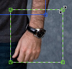

# 切り抜き、調整した画像、ズームターゲット {#crop-adjusted-zoom-targets}

Dynamic Media Classicのマスター画像概念の主な強みの1つは、画像アセットを様々な用途に再利用できることです。 従来は、詳細やスウォッチを表示するには、切り抜かれた個別のバージョンを画像ごとに作成する必要がありました。 Dynamic Media Classicを使用する場合は、1つのマスターに対して同じタスクを行い、切り抜かれたバージョンを新しい物理ファイルとして、またはストレージ領域を必要としない仮想派生物として保存できます。

チュートリアルのこの節を終えるまでに、次の方法を習得できます。

- Dynamic Media Classicで画像を切り抜き、新しいマスターファイルまたはバーチャル画像として保存します。 [詳細情報](https://docs.adobe.com/help/en/dynamic-media-classic/using/master-files/cropping-image.html)を参照してください。
- 仮想調整済み画像を保存し、マスターアセットの代わりに使用します。 [詳細情報](https://docs.adobe.com/content/help/en/dynamic-media-classic/using/master-files/adjusting-image.html)を参照してください。
- 画像にズームターゲットを作成して、ハイライトを表示します。 [詳細情報](https://docs.adobe.com/content/help/en/dynamic-media-classic/using/zoom/creating-zoom-targets-guided-zoom.html)を参照してください。

## 切り抜き

Dynamic Media Classicには、切り抜きツールなど、UIで使いやすいいくつかの画像編集ツールが用意されています。 様々な理由で、Dynamic Media Classic内でマスター画像を切り抜くことができます。 次に例を示します。

- 元のファイルにアクセスできません。 切り抜きや縦横比が異なる画像を表示したいが、元のファイルがコンピューターにない場合、または自宅で作業している場合。 この場合、Dynamic Media Classicに移動し、画像を探し、切り抜いて保存するか、新しいバージョンとして保存できます。
- 余分な空白を除去する。 空白が多過ぎるので商品が小さく見える。 サムネール画像をカンバスにできるだけ埋める必要があります。
- 調整された画像を作成するには、ディスク容量を必要としない画像の仮想コピーを使用します。 一部の会社には、同じ画像の別のコピーを別の名前で保持する必要があるビジネスルールがあります。 または、同じ画像を切り抜いて切り抜かないバージョンを使用します。
- ソース画像から新たな画像を作成する。 例えば、カラースウォッチやメイン画像の詳細を作成できます。 これは、Adobe Photoshopで行い、個別にアップロードするか、Dynamic Media Classicの切り抜きツールを使用して行うことができます。

>[!NOTE]
>
>以下の切り抜きに関する説明に記載されているURLはすべて、例示的な目的でのみ使用されます。これらのリンクはライブリンクではありません。

### 切り抜きツールの使用

Dynamic Media Classicの切り抜きツールには、アセットの詳細ページからアクセスするか、「 **編集** 」ボタンをクリックしてアクセスします。 切り抜きには、次の2つの方法があります。

- 初期設定の切り抜きモードです。切り抜きウィンドウのハンドルをドラッグするか、「サイズ」ボックスに値を入力します。 手動で切り抜く方法を [説明します](https://docs.adobe.com/content/help/en/dynamic-media-classic/using/master-files/cropping-image.html#select-an-area-to-crop)。
- トリミング 画像と一致しないピクセル数を計算して、画像の周囲の余分な空白を削除する場合に使用します。 トリミングによる [切り抜きの方法を説明します](https://docs.adobe.com/content/help/en/dynamic-media-classic/using/master-files/cropping-image.html#crop-to-remove-white-space-around-an-image)。

### _手動切り抜き_

手動で切り抜いたバージョンを保存すると、画像が完全に切り抜かれたように見えます。Dynamic Media Classicでは、実際には、画像を切り抜く内部URL修飾子を追加して、ピクセルを非表示にしています。 公開すると、画像が切り抜かれたときにすべてのユーザに表示されますが、切り抜きエディタに戻って、後で切り抜きを削除することもできます。

次に、新しいマスター画像として保存するか、マスターの追加の表示として保存するかを選択できます。 新しいマスターは、ストレージ容量を消費する新しい物理ファイル（TIFFやJPEGなど）です。 追加の表示とは、サーバの空き容量を取らない仮想イメージです。 「オリジナルを置換」は選択しないことをお勧めします。これは、マスターが上書きされ、切り抜きが永久的に終了するためです。 新しいマスターまたは追加の表示として保存する場合は、新しいアセットIDを選択する必要があります。 他のアセットIDと同様に、これはDynamic Media Classicでは一意の名前である必要があります。

### _トリミング_

画像のメインサブジェクトの周囲に空白（余分なカンバス）が多すぎる画像をアップロードすると、Web上でのサイズ変更時に画像のサイズが大幅に小さくなります。 これは特に、150ピクセル以下のサムネール画像の場合に当てはまります。その周りの余分なスペースに写真の被写体が収まらなくなる場合があります。

同じ画像の2つのバージョンを比較します。

右側の画像は、製品の周囲の余分なスペースを取り除くことで、より目立たせます。 切り抜きツールを使用して、一度に1つの画像に対してトリミングを行うことも、アップロード時にバッチ処理として実行することもできます。 すべての画像を常にメインの件名の境界に沿って切り抜く場合は、バッチプロセスとして実行することをお勧めします。 トリミングして、バウンディングボックス（画像を囲む長方形）までトリミングします。

>[!NOTE]
>
>トリミングしても、画像の周囲に透明部分は作成されません。 その場合は、画像にクリッピングパスを埋め込み、「クリップパス **」アップロードオプションから「マスクを** 作成」を使用する必要があります。
>
>また、「 **保存** 」オプションを使用したときに切り抜いた後に画像を元の状態に戻すには、切り抜きエディタ画面で画像を表示し、「 **リセット** 」ボタンを選択します。

### _アップロード時の切り抜き_

前述したように、画像のアップロード時に画像を切り抜くこともできます。 アップロード時にトリミング切り抜きを使用するには、 **ジョブオプション** ボタンをクリックし、「切り抜きオプション」で「 **トリミング**」を選択します。

Dynamic Media Classicでは、次回のアップロード時にこのオプションが記憶されます。 このアップロード用に画像を切り抜く場合でも、アップロードごとに切り抜かれないようにする必要があります。 別のオプションとして、特別な予定FTPアップロードジョブを設定し、切り抜きオプションをそこに配置することもできます。 この方法では、画像を切り抜く必要がある場合にのみジョブを実行します。

>[!IMPORTANT]
>
>アップロード用に切り抜きを設定した場合、Dynamic Media Classicでは、次回にその設定を記憶するためにcookieが設定されます。 ベストプラクティスとして、次にアップロードする前に「会社のデフォルトに **リセット** 」ボタンをクリックし、最後にアップロードされた切り抜きオプションをすべて消去します。そうしないと、誤って次の画像のバッチが切り抜かれる可能性があります。

### URLによる切り抜き

これはDynamic Media Classicでは明らかではありませんが、URL全体で純粋に切り抜く（または画像プリセットに切り抜きを追加する）こともできます。

切り抜きツールを使用する場合は、常に下部のフィールドにURL値が表示されます。 これらの値を受け取って、URL修飾子として画像に直接適用できます。

_切り抜きエディタの下部にある切り抜きコマンド修飾子_

トリミングによる切り抜きを使用する場合は、画像単位でサイズを計算する必要があるので、URLを使用して自動化することはできません。 トリミング切り抜きは、アップロード時または一度に1つの画像を適用した場合にのみ実行できます。

### _画像プリセットでの切り抜き_

画像プリセットには、画像サービングコマンドを追加できるフィールドがあります。 上記と同じ切り抜きを画像プリセットに追加するには、プリセットを編集し、「URL修飾子」フィールドに値を貼り付けるか入力して、保存して公開します。

_切り抜きコマンド（または任意のコマンド）を、画像プリセットのURL修飾子に対して指定できます。_

これで、切り抜きがその画像プリセットの一部になり、使用されるたびに自動的に適用されます。 もちろん、この方法は同じ切り抜き量が必要なすべての画像に依存します。 画像がすべて同じ方法で撮影されない場合、この方法は使用できません。

## 調整された画像

切り抜きツールを使用する場合は、「追加のマスター表示として **保存**」を選択できます。 保存すると、新しい種類のDynamic Media Classicアセット、つまり調整された画像が作成されます。 調整された画像は、派生物とも呼ばれ、仮想画像です。 実際のイメージとはちがう。物理マスター画像へのデータベース参照（エイリアスやショートカットなど）。

### 本物のイメージは立ち上がるか`?`

どちらがマスターで、どちらが調整済みの画像かわかりますか。

Dynamic Media Classicで確認し、SBR_MAIN2の「Adjusted Image」のアセットタイプを確認しないと、見分けられません。

調整済みの画像は、データベース内の行項目としてのみ存在するため、ディスク領域を使用しません。 また、元のアセットにも永続的に関連付けられます。元の画像が削除されると、調整後の画像も削除されます。 切り抜かれていない画像全体または画像の一部（切り抜き）から構成できます。

調整後の画像は、通常切り抜きツールで作成します。ただし、他の画像エディタ（調整ツールとシャープツール）でも作成できます。

調整された画像には、一意のアセットIDが必要です。 公開する場合（他のアセットと同様に公開する必要がある）、他の画像として機能し、アセットIDによってURLで呼び出されます。 詳細ページの「 **ビルトと派生」タブで、マスター画像に関連付けられた表示調整済み画像を参照できます** 。

_調整されたマスター画像の表示ASIAN_BR_MAIN_

## ズームターゲット

ズームターゲットは、画像の **編集** メニューおよび **詳細** ページにもあります。 この機能を使用すると、ズーム画像の特定のマーチャンダイジング機能を強調表示する「ホットスポット」を設定できます。 大きなマスターを切り抜いて個別の画像を作成する代わりに、ズームビューアでは、画像の上部の詳細と、作成した短いラベルを提供できます。

ズームターゲットは基本的にマーチャンダイジング機能で、製品の販売地点に関する知識が必要なので、通常は、マーチャンダイジングや会社チームの担当者が作成します。

この処理は非常に簡単です。機能をクリックし、わかりやすい名前を付けて保存します。 ターゲットは、同じような場合に別の画像にコピーできますが、手動の処理です。 Dynamic Media Classicでは、各画像が異なり機能も異なるので、ズームターゲットの作成を自動化する方法はありません。

ズームターゲットを使用するかどうかを決定する別の要因として、ビューアを選択することもできます。 ズームターゲットを表示できないビューアタイプもあります（例えば、フライアウトビューアではサポートされていません）。

ズームターゲットを [作成する方法を説明します](https://docs.adobe.com/content/help/en/dynamic-media-classic/using/zoom/creating-zoom-targets-guided-zoom.html#creating-and-editing-zoom-targets)。

### ズームターゲットツールの使用

Dynamic Media Classicでターゲットを作成する際のワークフローを次に示します。

1. 画像を参照し、「 **編集** 」ボタンをクリックし、「 **ズームターゲット**」を選択します。
2. ズームターゲットエディタが読み込まれます。 中央に画像が表示され、上部にボタンが表示され、右側に空のターゲットパネルが表示されます。 左下に、ビューアプリセットが選択されています。 デフォルト値は「Zoom1-Guided」です。
3. マウスで赤いボックスを動かし、クリックして新しいターゲットを作成します。

   - 赤いボックスはターゲット領域です。 ユーザがそのターゲットをクリックすると、ボックス内の領域が拡大します。
   - ターゲットのサイズは、ビューアプリセット内の表示サイズによって決まります。 これは、メインのズーム画像のサイズを決定します。 下の「表示サイズの _設定_」を参照してください。

4. 作成したターゲットが青に変わり、右側にそのターゲットのサムネール版と、デフォルト名「ターゲット-0」が表示されます。
5. ターゲットの名前を変更するには、サムネールをクリックし、新しい **名前を入力します**。「 **Enter** 」または「 **Tab** 」をクリックします。クリックしない場合は、名前は保存されません。
6. ターゲットを選択した場合、ボックスの周りに緑の破線が表示され、サイズ変更や移動が可能です。 角をドラッグしてサイズを変更するか、ターゲットボックスをドラッグして移動します。

   - 初期設定のカスタムズームビューア内に画像が読み込まれます。 ビューアプリセットがズームターゲットをサポートしていることを確認します。通常、「 —Guided」という単語を含むすべての標準プリセットは、ズームターゲットで使用するために設計されています。 ターゲットを使用するには、ターゲットのサムネール（ホットスポットアイコン）の上にマウスポインターを置いてラベルを表示し、ラベルをクリックして、ビューアがその機能にズームインするのを確認します。
   - Dynamic Media Classicでの他の作業と同様に、ズームターゲットをWeb上で動かすには、公開する必要があります。 ターゲットをサポートするViewerを既に使用している場合は、それらが即座に表示されます（キャッシュがクリアされると）。 ただし、ズームターゲット対応ビューアを使用していない場合は、非表示のままです。

      

7. また、ターゲットを削除する必要がある場合は、そのサムネールをクリックして選択し、 **削除ターゲット** ボタンを押すか、キーボードのDELETEキーを押します。
8. 追加後、クリックし続けて新しいターゲットを追加し、名前を変更したり、サイズを変更したりします。
9. 完了したら、[ **保存** ]ボタンをクリックし、 **プレビュー**。

### ズームビューアプリセットでの表示サイズの設定

ズームターゲットのサイズの元となる場所について説明します。 ズームビューアのビューアプリセット内に、表示サイズと呼ばれる設定があります。 表示サイズは、ビューア内のズーム画像のサイズです。 これは、UIコンポーネントやアートワークを含むビューアの合計サイズであるステージサイズとは異なります。

新しいターゲットを作成する場合、サイズと縦横比は表示サイズから引き継がれます。 例えば、表示サイズが200 x 200の場合、最大ズーム領域が200ピクセルの正方形ターゲットのみ作成できます。 ターゲットのサイズは200ピクセルを超える場合がありますが、常に四角形です。 また、ズームビューア内の画像は200ピクセルのみであり、ズームターゲットのサイズはビューアのサイズと直接関係があります。 ターゲットを設定する前に、まずビューアのデザインを決定する必要があります。

ただし、デフォルトでは、表示サイズは空白（0 x 0に設定）になっています。これは、メイン表示のサイズが動的で、ステージのサイズに従って自動的に生成されるからです。 問題は、プリセットで表示サイズを明示的に設定しないと、ズームターゲットツールでターゲットを作成するサイズがわからなくなる点です。

ズームターゲットツールを読み込むと、表示サイズがプリセット名の横に表示されます。 組み込みのZoom1-GuidedプリセットとカスタムのZT_AUTHORINGプリセットの表示サイズを比較します。

組み込みのプリセットのサイズは900 x 550で、ターゲットがその大きさより小さくなることはありません。 これは大きすぎるかもしれません。2000ピクセルの画像がある場合、全体で900ピクセル以上の機能しか呼び出せません。 ユーザは手動でズームを続けることができますが、ズームを近づけることはできません。 表示サイズを350 x 350に設定すると、ターゲットはズームインしたり、サイズを大きくしたりできます。 ただし、ビューアで大きいズーム画像を使用する場合は、新しいプリセットを作成する必要があります。これは、350ピクセルでロックされているからです。

### ズームターゲットをサポートするビューアプリセットの作成または編集

表示サイズを設定するには、ズームターゲットをサポートするビューアプリセットを作成または編集します。

1. ビューアプリセットで、「 **ズーム設定** 」オプションに移動します。
2. 幅と高さを設定します。
3. プリセットを保存し、閉じます。 ライブサイトでそのプリセットを使用する場合は、後で同様に公開する必要があります。
4. ズームターゲットツールに移動し、左下で編集したプリセットを選択します。 新しい表示サイズがターゲットに反映され、すぐに確認できます。
