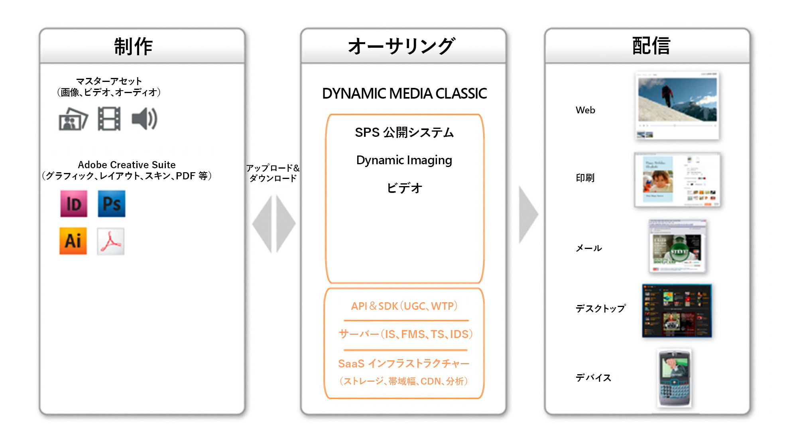
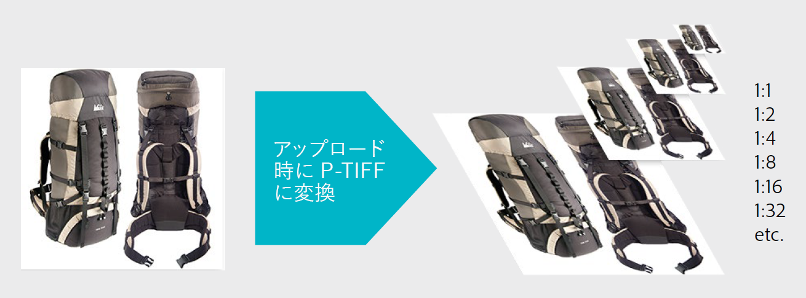
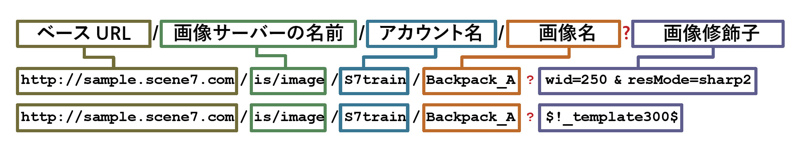

# Dynamic Media Classicのメインワークフローとアセットのプレビュー{#main-workflow}

Dynamic Mediaは、作成（およびアップロード）、作成（および公開）、配信のワークフロープロセスをサポートしています。 まずアセットをアップロードし、画像セットの構築などのアセットを操作して、最終的に公開してライブにします。 一部のワークフローでは、ビルド手順はオプションです。 例えば、画像の動的なサイズ変更とズームのみ、またはストリーミング用にビデオを変換して公開することを目的としている場合、必要なビルド手順はありません。

Dynamic Media Classicソリューションのワークフローは、次の3つの主な手順で構成されます。

1. SourceContentの作成（およびアップロード）
2. アセットの作成（および公開）
3. アセットの配信

## 手順1:作成（およびアップロード）

これは、ワークフローの開始です。 この手順では、使用しているワークフローに合ったソースコンテンツを収集または作成して、Dynamic Media Classicにアップロードします。 システムは、画像、ビデオ、フォントの複数のファイルタイプをサポートしますが、PDF、Adobe Illustrator、Adobe InDesignの場合もサポートします。

[サポートされているファイルタイプ](https://docs.adobe.com/content/help/en/dynamic-media-classic/using/upload-publish/uploading-files.html#supported-asset-file-formats)の完全なリストを参照してください。

ソースコンテンツは、様々な方法でアップロードできます。

- デスクトップまたはローカルネットワークから直接。 の方法を説明します。
- Dynamic Media Classic FTPサーバーから。 の方法を説明します。

デフォルトのモードは「デスクトップから」です。ここでは、ローカルネットワーク上のファイルを参照し、アップロードを開始します。

>[!TIP]
>
>フォルダーを手動で追加しないでください。 代わりに、FTPからアップロードを実行し、「**サブフォルダーを含める**」オプションを使用して、Dynamic Media Classic内でフォルダー構造を再作成します。

最も重要な2つのアップロードオプションがデフォルトで有効になっています。**公開用にマーク**（前述の手順）と&#x200B;**上書き**&#x200B;です。 上書きとは、アップロード中のファイルがシステムに既に存在するファイルと同じ名前の場合、新しいファイルが既存のバージョンを置き換えることを意味します。 このオプションをオフにすると、ファイルがアップロードされない可能性があります。

### 画像のアップロード時の上書きオプション

「画像を上書き」オプションには、会社全体に対して設定できる4つのバリエーションがあり、多くの場合、誤解されます。 つまり、同じ名前のアセットをより頻繁に上書きするようにルールを設定するか、上書きの頻度を減らします（新しい画像の名前を「 —1」または「 —2」の拡張子に変更します）。

- **現在のフォルダーでベース名と拡張子が同じファイルを上書き**&#x200B;このオプションは最も厳格な置換規則です。置き換え画像を元の画像と同じフォルダーにアップロードし、置き換え画像と元の画像のファイル名拡張子が同じになっている必要があります。これらの要件が満たされない場合は、重複する画像が作成されます。

- **現在のフォルダーでベース名が同じファイルを上書き**。置き換える画像を元の画像と同じフォルダーにアップロードする必要がありますが、ファイル名の拡張子は元の画像と異なる場合があります。 例えば、chair.jpgの代わりにchair.tifを使用します。

- **任意のフォルダーでベース名と拡張子が同じを上書き**&#x200B;置き換え画像のファイル名拡張子が元の画像と同じである必要があります（例えば、 chair.jpgはchair.tifではなくchair.jpgを置き換える必要があります）。ただし、置き換え画像を、元の画像と別のフォルダーにアップロードできます。更新された画像は新しいフォルダーにあり、元の場所のファイルはなくなります.

- **任意のフォルダーでベース名が同じファイルを上書き(拡張子**&#x200B;に関係なく)。このオプションは、最も包括的な置換規則です。置き換え画像を、元の画像と別のフォルダーにアップロードでき、ファイル名拡張子が異なるファイルをアップロードして、元のファイルと置き換えることができます。元のファイルが別のフォルダーにある場合、置き換え画像は、アップロード先の新しいフォルダーに存在します。

[画像を上書きオプション](https://docs.adobe.com/content/help/en/dynamic-media-classic/using/setup/application-setup.html#using-the-overwrite-images-option)の詳細を説明します。

必須ではありませんが、上記の2つの方法のいずれかを使用してアップロードする際に、特定のアップロードに対して「ジョブオプション」を指定できます。例えば、繰り返しアップロードのスケジュールを設定したり、アップロード時に切り抜きオプションを設定したりできます。 これらは一部のワークフローにとって有用なものなので、お客様のワークフローにとって有効かどうかを検討する価値があります。

[ジョブオプション](https://docs.adobe.com/content/help/en/dynamic-media-classic/using/upload-publish/uploading-files.html#upload-options)の詳細をご覧ください。

Dynamic Media Classicは、まだシステムに含まれていないコンテンツを処理できないので、ワークフローで最初に必要な手順です。 アップロード中は、バックグラウンドで、アップロードされたすべてのアセットが一元化されたDynamic Media Classicデータベースに登録され、IDが割り当てられてストレージにコピーされます。 また、画像ファイルは、動的なサイズ変更やズームが可能な形式に変換され、ビデオファイルはMP4 Webに対応した形式に変換されます。

### 概念：画像をDynamic Media Classicにアップロードすると、画像は次のようになります

任意の種類の画像をDynamic Media Classicにアップロードすると、ピラミッドTIFF(P-TIFF)と呼ばれるマスター画像形式に変換されます。 P-TIFFは、レイヤTIFFビットマップ画像の形式に似ていますが、異なるレイヤではなく、同じ画像の複数のサイズ（解像度）を含む点が異なります。

画像が変換されると、Dynamic Media Classicは画像の最大サイズの「スナップショット」を作成し、半分に拡大縮小して保存し、再び半分に拡大縮小して保存します。元のサイズの倍にもなるまで同様に保存します。 例えば、2000ピクセルのP-TIFFは、同じファイル内で1000ピクセル、500ピクセル、250ピクセル、125ピクセルのサイズ（およびそれより小さい）になります。 P-TIFFファイルは、Dynamic Media Classicでは「マスター画像」と呼ばれる形式です。

特定のサイズの画像を要求する場合、P-TIFFを作成すると、Image Server for Dynamic Media Classicで次に大きいサイズをすばやく見つけて縮小できます。 例えば、2000ピクセルの画像をアップロードして100ピクセルの画像を要求した場合、Dynamic Media Classicでは125ピクセルのバージョンが見つかり、2000 ～ 100ピクセルに拡大縮小されるのではなく、100ピクセルに縮小されます。 これにより、操作が非常に高速になります。 また、画像にズームするときに、ズームビューアは最大解像度の画像全体ではなく、ズーム中の画像のタイルのみを要求できます。 これは、マスター画像形式であるP-TIFFファイルが、動的サイズ変更とズームの両方をサポートする方法です。

同様に、マスターソースビデオをDynamic Media Classicにアップロードし、Dynamic Media Classicをアップロードすると、自動的にサイズを変更してMP4 Webに適した形式に変換できます。

### アップロードする画像の最適なサイズを決定するための経験則

**必要な最大サイズの画像をアップロードします。**

- ズームする必要がある場合は、1,500～2,500ピクセルの長辺の高解像度画像をアップロードします。 表示する詳細度、ソース画像の画質、表示する製品のサイズを考慮します。 例えば、小さなリングに1000ピクセルの画像をアップロードし、部屋の中心全体に3000ピクセルの画像をアップロードします。
- ズームする必要がない場合は、表示される正確なサイズでアップロードします。 例えば、ページに配置するロゴやスプラッシュ/バナー画像がある場合は、1:1のサイズでアップロードし、そのサイズで正確に呼び出します。

**Dynamic Media Classicにアップロードする前に、決して画像をアップサンプルしたり、爆発させたりしないでください。** 例えば、2000ピクセルの画像にするために、小さい画像をアップサンプルしないでください。見た目が悪い。 アップロードする前に、可能な限り画像を完全に近づける。

**ズームには最小サイズはありませんが、初期設定では、100%を超えるズームは行われません。** 画像が小さすぎる場合は、全くズームしないか、少しだけズームして画像が悪く見えないようにします。

**画像サイズに関する最小要件はありませんが、大きな画像をアップロードすることはお勧めしません。** 巨大な画像は、4000ピクセル以上と見なすことができます。このサイズの画像をアップロードすると、画像内の埃や毛の粒などの潜在的な欠陥が表示される場合があります。 また、このような画像を使用すると、Dynamic Media Classicサーバーの容量が増え、契約されたストレージの制限を超える可能性があります。

[ファイルのアップロード](https://docs.adobe.com/content/help/en/dynamic-media-classic/using/upload-publish/uploading-files.html#uploading-your-files)の詳細をご覧ください。

## 手順2:オーサー（およびパブリッシュ）

コンテンツを作成してアップロードした後、1つ以上のサブワークフローを実行して、アップロードしたアセットから新しいリッチメディアアセットを作成します。 これには、画像、スウォッチ、スピン、混在メディアの各種セットコレクションのほか、テンプレートが含まれます。 また、ビデオも含まれています。 後で、各タイプの画像コレクションセットとビデオリッチメディアに関する詳細を詳しく説明します。 ただし、ほとんどの場合は、まず1つ以上のアセットを選択し（またはアセットを選択していない）、作成するアセットのタイプを選択します。 例えば、メイン画像とその画像のいくつかのビューを選択し、同じ製品の代替ビューのコレクションである画像セットを作成する場合に使用します。

>[!IMPORTANT]
>
>すべてのアセットが公開用にマークされていることを確認します。 デフォルトでは、すべてのアセットがアップロード時に公開用に自動的にマークされますが、アップロードされたコンテンツから新しく作成したアセットも公開用にマークする必要があります。

新しいアセットをビルドしたら、公開ジョブを実行します。 手動で実行するか、自動的に実行される公開ジョブをスケジュールできます。 公開では、非公開のDynamic Media Classic球体から公開サーバー球体に、すべてのコンテンツがコピーされます。 Dynamic Media公開ジョブの製品は、公開された各アセットの一意のURLです。

公開先のサーバーは、コンテンツのタイプとワークフローに応じて異なります。 例えば、すべての画像がImage Serverに送信され、ビデオがFMSサーバにストリーミングされます。 便宜上、「パブリッシュ」を単一のサーバーに対する単一のイベントとして扱います。

公開すると、コンテンツだけでなく、公開用にマークされたすべてのコンテンツが公開されます。 通常、単一の管理者が、パブリッシュを実行する個々のユーザーではなく、全員の代わりに公開します。 管理者は、必要に応じて公開したり、毎日、毎週、または10分ごとに自動公開する繰り返しジョブを設定したりできます。 ビジネスに合ったスケジュールでのパブリッシュ。

>[!TIP]
>
>公開ジョブを自動化し、毎日午前12:00または夕方遅くに実行するように完全公開をスケジュールします。

### 概念：Dynamic Media Classic URLについて

Dynamic Media Classicワークフローの最終製品は、アセット（画像セットかアダプティブビデオセットかに関わらず）を指すURLです。 これらのURLは予測可能で、同じパターンに従います。 画像の場合、各画像はP-TIFFマスタ画像から生成される。

画像のURLの構文と例を次に示します。

URLで疑問符の左側にあるのはすべて、特定の画像への仮想パスです。 疑問符の右側にあるのはImage Server修飾子で、画像の処理方法を示す命令です。 複数の修飾子がある場合、アンパサンドで区切られます。

最初の例では、画像「Backpack_A」への仮想パスは`http://sample.scene7.com/is/image/s7train/BackpackA`です。 Image Serverの修飾子は、画像の幅を250ピクセルにサイズ変更し（wid=250から）、Lanczos補間アルゴリズムを使用して画像を再サンプルします。このアルゴリズムは、サイズ変更に合わせてシャープにします（resMode=sharp2から）。

2つ目の例では、「画像プリセット」と呼ばれるものを、$！で示される同じBackpack_A画像に適用します。_template300$. 式の両側にある$記号は、画像プリセット（パッケージ化された一連の画像修飾子）が画像に適用されていることを示します。

Dynamic Media Classic URLの組み合わせ方法を理解したら、プログラムを使用してURLを変更する方法と、URLをサイトおよびバックエンドシステムに統合する方法を理解します。

### 概念：キャッシュ遅延について

新しくアップロードおよび公開されたアセットはすぐに表示されますが、更新されたアセットには10時間のキャッシュ遅延が生じる場合があります。 デフォルトでは、すべての公開済みアセットに有効期限が切れるまでに10時間以上かかります。 最小と言います。画像が表示されるたびに、10時間が経過するまで有効期限が切れない時計が開始され、誰もその画像を表示していないからです。 この10時間は、アセットの「有効期間」です。 そのアセットのキャッシュの期限が切れると、更新されたバージョンを配信できます。

これは通常、誤りが発生し、画像/アセットの名前が以前に公開されたバージョンと同じでない限り、問題は発生しませんが、画像に問題があります。 例えば、誤って低解像度のバージョンをアップロードしたり、アートディレクターが画像を承認しなかったりします。 この場合、元の画像を呼び出し、同じアセットIDを使用する新しいバージョンに置き換えます。

[更新が必要なURLのキャッシュを手動でクリアする方法を説明します](https://docs.adobe.com/content/help/en/experience-manager-65/assets/dynamic/invalidate-cdn-cached-content.html)。

>[!TIP]
>
>キャッシュ遅延の問題を回避するには、必ず夜、日、2週間など前に作業を進めます。 内部の関係者が作業を証明してから公開するためのQA/承認に時間を設けます。 前の晩に作業しても、その晩に変更を加え、再公開できます。 朝までに、10時間が経過し、キャッシュが正しい画像で更新されます。

- [公開ジョブの作成](https://docs.adobe.com/content/help/en/dynamic-media-classic/using/upload-publish/publishing-files.html#creating-a-publish-job)の詳細を説明します。
- [公開](https://docs.adobe.com/content/help/en/dynamic-media-classic/using/upload-publish/publishing-files.html)の詳細をご覧ください。

## 手順3:配信

Dynamic Media Classicワークフローの最終製品は、アセットを指すURLです。 このURLは、個々の画像、画像セット、スピンセット、その他の画像セットコレクションやビデオを指す場合があります。 そのURLを取得して、HTMLの編集などをおこなう必要があります。例えば、``タグが、現在のサイトからの画像を指す代わりに、Dynamic Media Classic画像を指すようにします。

配信手順では、これらのURLを、アセットを表示するWebサイト、モバイルアプリ、電子メールキャンペーンまたはその他のデジタルタッチポイントに統合する必要があります。

画像のDynamic Media Classic URLをWebサイトに統合する例：

赤色のURLは、Dynamic Media Classicに固有の唯一の要素です。

ITチームまたは統合パートナーは、Dynamic Media Classic URLをサイトに統合するためのコードの記述と変更をリードできます。 Adobeには、技術的、クリエイティブ、一般的なガイダンスを提供することで、この作業を支援できるコンサルティングチームがいます。

ズームビューアや代替ビューを組み合わせたビューアなど、より複雑なソリューションの場合、通常、URLはDynamic Media Classicでホストされているビューアを指し、そのURL内でもアセットIDを参照します。

新しいポップアップウィンドウでビューアの画像セットを開くリンクの例（赤）:

>[!IMPORTANT]
>
>Dynamic Media ClassicのURLをWebサイト、モバイルアプリ、電子メールおよびその他のデジタルタッチポイントに統合する必要があります。Dynamic Media Classicでは統合できません。

## アセットのプレビュー

アップロードしたアセット、作成中または編集中のアセットをプレビューして、顧客が表示したときに望みどおりに表示されることを確認する必要が生じる可能性があります。 プレビューウィンドウにアクセスするには、アセットのサムネールの&#x200B;**プレビュー**&#x200B;ボタン（**参照/ビルドパネル**&#x200B;の上部）をクリックするか、**ファイル/プレビュー**&#x200B;に移動します。 ブラウザーウィンドウでは、現在パネルに表示されているアセット（画像、ビデオ、画像セットなどのビルトアセット）をプレビューします。

### 動的サイズのプレビュー（画像プリセット）

**サイズ**&#x200B;プレビューを使用して、複数のサイズの画像をプレビューできます。 使用可能な画像プリセットのリストが読み込まれます。 後で画像プリセットについて説明しますが、画像を特定の量のシャープと画質で指定されたサイズで読み込む「レシピ」と考えます。

### ズームプレビュー

**ズーム**&#x200B;オプションを使用して、付属の様々なズームビューアに基づいた、多くの事前定義済みズームプリセットの1つで画像をプレビューすることもできます。

[アセットのプレビュー](https://docs.adobe.com/content/help/en/dynamic-media-classic/using/managing-assets/previewing-asset.html)の詳細を説明します。
