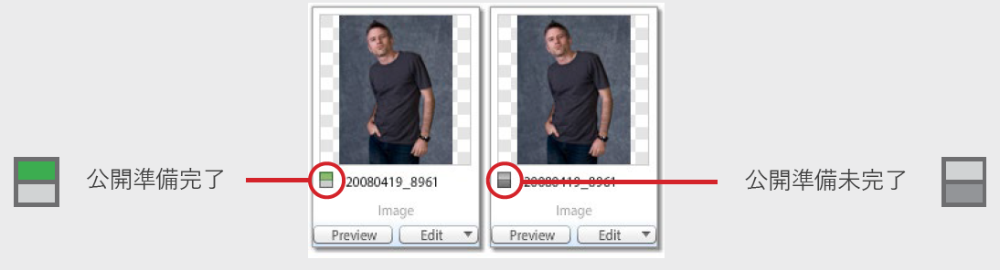

# 「 Dynamic Media Classicベストプラクティスチュートリアル」へようこそ

このガイドは、Dynamic Media Classicの現在および新規ユーザーが、Adobeの強力なリッチメディアソリューションで実行できる操作をより深く理解するのに役立つように作成されています。 それには、次の手順を実行します。

- Dynamic Media Classicの概要とその概要、および主な機能とユーザーインターフェイス(UI)の概要を説明します。
- ソリューション内のアセットを操作する際に従う一般的な作成、作成、配信ワークフローについて説明します。
- ソリューションを導入し使用する前に設定する重要な項目について説明します。
- ソリューションのコア機能のいくつかの使用について詳しく説明します。

このガイド全体を通して、例、ヒント、ベストプラクティスを示します。 また、Dynamic Media Classicを使用する際に理解しておく必要がある重要な用語と概念についても説明します。 特定のトピックに関して利用可能な場合は、関連するウェビナー、ブログ投稿、オンラインドキュメントを参照します。

このガイドでは、Dynamic Media Classicソリューションから大きな価値を引き出すために必要な情報を提供していただきます。 このガイドの各章をより簡単に移動するには、ガイドの左側にあるブックマークアイコンをクリックして、その内容を確認します。

## Dynamic Media Classicの概要

Dynamic Media Classicは、リッチメディアコンテンツの作成、作成、配信をおこなうお客様の中心となります。 Dynamic Media Classicは、統合されたリッチメディア管理、公開、および提供環境です。 リッチメディアは、Web、印刷資料、電子メールキャンペーン、Webアプリケーション、デスクトップ、デバイスを含む、すべてのマーケティングおよび販売チャネルに配信できます。

画像サービングは、おそらくDynamic Media Classicで最も使用される機能です。 実際、ほとんどのお客様はDynamic Media Classicを使用して、ズーム用やリッチメディア用の画像を含め、Webサイト上のすべての画像を提供します。 ただし、ビデオの配信や、配信する画像を最適化するAIの使用など、他の多くの目的にも使用できます。

## Dynamic Media Classicの主な機能

このガイドでは、Dynamic Media Classicの次の主な機能について説明します。

- **ダイナミックイメージング.** リアルタイムの編集、書式設定とサイズ設定、インタラクティブなズームとパンを指す包括的な用語。カラーとテクスチャのスウォッチ360度スピン；画像テンプレート；マルチメディアビューア
- **ビデオ.** 最終的なビデオをアップロードし、公開し、設定可能なビデオビューアにプログレッシブにダウンロードします。
- **スマートイメージング.** Adobe Sensei AIの機能を活用し、既存の「画像プリセット」と連携して、クライアントのブラウザー機能に基づいて画像形式、サイズ、画質を自動的に最適化し、画像配信のパフォーマンスを向上させるテクノロジー。

このソリューションのその他の機能を見つけるには、Dynamic Media Classicの[ドキュメント](https://docs.adobe.com/content/help/en/dynamic-media-classic/using/intro/introduction.html)を参照してください。

## Dynamic Media Classicユーザーインターフェイス(UI)

Dynamic Media ClassicのメインUIは、次の3つの主な領域で構成されます。グローバルナビゲーションバー、アセットライブラリ、参照パネル/ビルドパネル。

_Dynamic MediaクラシックUI_

**グローバルナビゲーションバー.** 画面の上部にあるこのバーのボタンを使用して、ソリューションの主な領域と機能にアクセスします。例えば、この機能を使用してアップロード機能にアクセスし、様々なアセット作成領域（画像セット、スピンセットなど）を開き、画像プリセットやビューアプリセットの設定、アセットの公開などの重要なタスクを実行します。 ここから、ジョブの監視、最近のアクティビティの表示、様々なヘルプオプションの選択を行うこともできます。

**アセットライブラリ.** 画面の左側にあるのがアセットライブラリパネルです。アセットライブラリは、作成するフォルダーとサブフォルダーにアセットを整理するために使用するパネルです。パネルの上部には、アセットを見つけるのに役立つ検索とフィルターが表示されます。 詳細検索では、アセットに添付されている非表示のメタデータフィールドを含む、複数のオプションを検索条件として指定することで検索できます。 パネルの下部で、ごみ箱アイコンをクリックすると、削除された項目を表示できます。 最初は、アカウント名と同じ名前を持つ最上位のフォルダーを除き、フォルダーでは開始しません。

>[!NOTE]
>
>ごみ箱内のアセットは、復元しない限り、配置後7日後に完全に削除されます。

**参照/作成パネル** これはUIの中央で、参照モードでアセットを参照するか、ビルドモードの場合はワークフローの一部としてアセットを作成するためのキャンバスとして使用します。最初にログインすると、参照パネルが表示されます。 画面の中央には、グリッドビューの画像のサムネールバージョンが表示されます。 リスト表示に変更したり、アセットを選択して詳細表示を使用してその詳細を表示したりできます。

>[!IMPORTANT]
>
>各アセットIDの横には、**公開用にマーク**&#x200B;スイッチが表示されます。 切り替えがオン（緑）の場合は、アセットが公開用にマークされていることを示します。

>[!TIP]
>
>アップロードダイアログで「**アップロード後に公開**」チェックボックスをオンにして、アップロード時にアセットを自動的に公開します。

[Dynamic Media ClassicのUIの操作](https://docs.adobe.com/content/help/en/dynamic-media-classic/using/getting-started/navigation-basics.html)について詳しくは、こちらを参照してください。
