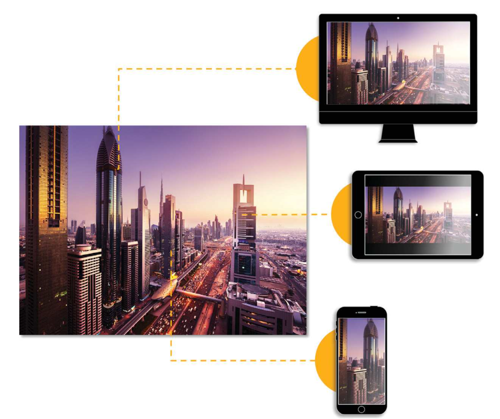

# スマートイメージング {#smart-imaging}

Webサイト、モバイルサイトまたはアプリで顧客体験の最も重要な側面の1つは、ページ読み込み時間です。 ページの読み込みに時間がかかりすぎると、多くの場合、顧客はサイトやアプリを放棄します。 画像は、ページ読み込み時間の大部分を構成します。 Dynamic Media Classicのスマートイメージングは、クライアントのブラウザー機能に基づいて画像形式と画質を自動的に最適化することで、画像配信のパフォーマンスを強化します。 これをおこなうには、Adobe Sensei AI機能を活用し、既存の画像プリセットを操作します。 スマートイメージングは、画像のサイズを30%以上縮小します。これは、ページ読み込みの高速化と顧客体験の向上につながります。

スマートイメージングは、Adobeのクラス最高のプレミアムサービスと完全に統合することで、パフォーマンスを大幅に向上させることもできます。 このサービスが、サーバー、ネットワークおよびピアリングポイント間を結ぶ、最適なインターネットルートを見つけます。最適なインターネットルートとは、待ち時間が最小限であったり、インターネット上のデフォルトルートよりもパケット損失率が低かったりするルートです。

[スマートイメージング](https://docs.adobe.com/content/help/ja/experience-manager-64/assets/dynamic/imaging-faq.html)の詳細をご覧ください。

## スマートイメージングの利点

画像はページの読み込み時間の大部分を占めるので、スマートイメージングによるパフォーマンスの向上は、ビジネスKPI（コンバージョン率の向上、サイトでの滞在時間の増加、サイトの直帰率の低下など）に大きな影響を与えます。

## スマートイメージングの仕組み

前述したように、スマートイメージングはAdobe Sensei AIの機能を活用し、既存の画像プリセットと連携して、画像を視覚的な忠実性を維持しながら、WebPなどの最適な次世代画像形式に自動変換します。

[スマートイメージングの仕組み](https://docs.adobe.com/content/help/en/experience-manager-64/assets/dynamic/imaging-faq.html#how-does-smart-imaging-work)について詳しくは、サポートされる画像形式（およびこれらの形式を使用しない場合は何が起こるか）、および使用中の既存の画像プリセットへの影響を参照してください。

## スマートイメージングの影響

スマートイメージングを利用するには、サイト上のURL、画像プリセットおよびコードを変更する必要が生じる可能性があります。 スマートイメージングを使用するための前提条件を満たし、サポートされるJPEGおよびPNG画像形式の画像のみを使用する場合は、変更を加える必要はありません。

スマートイメージングは、HTTP、HTTPSおよびHTTP/2で配信された画像に対して機能します。

>[!NOTE]
>
>スマートイメージングに移行すると、CDNのキャッシュがクリアされます。 通常、CDNのキャッシュは1 ～ 2日以内に再構築されます。

スマートイメージングは、Dynamic Media Classicの既存のライセンスに含まれています。 この機能に追加費用はかかりません。 この機能を活用するには、次の2つの要件を満たす必要があります。AdobeバンドルCDNと専用ドメインを持っている。 次に、自動的に有効化されないので、アカウントに対して有効にする必要があります。

スマートイメージングを有効にするには、まず、次の方法でテクニカルサポートにリクエストを送信します。 |サポートケースの作成| [https://helpx.adobe.com/enterprise/admin-guide.html/enterprise/using/support-for-experience-cloud.ug.html](https://helpx.adobe.com/jp/enterprise/admin-guide.html/enterprise/using/support-for-experience-cloud.ug.html)。 スマートイメージングに関連付けるカスタムドメインを設定する際に、サポートがお客様と連携します。 キャッシュに関連する1つのパラメーター（有効期間、TTL）を変更すると、キャッシュがクリアされます。 実稼動環境にプッシュする前に、必要に応じてオプションのステージング手順を実行することもできます。 スマートイメージングをオンにすると、より小さいサイズの画像を、要求された画質と同じ画質で顧客に配信します。 つまり、ページ読み込み時間が短縮されます。Adobe Senseiが最も効率的なサイズを選択するのに役立つので、これらすべてが自動的におこなわれます。

スマートイメージングを有効にしたら、期待どおりに動作していることを確認できます。

スマートイメージングに関して、その他の質問がある場合があります。 よくある質問(FAQ)のリストと回答をまとめました。 [FAQ](https://docs.adobe.com/content/help/en/experience-manager-64/assets/dynamic/imaging-faq.html)をお読みください。

## その他のリソース

スマートイメージングの詳細については、[Dynamic Media Classic Optimizing Page Performance Skill Builder](https://seminars.adobeconnect.com/pzc1gw0cihpv)のオンデマンドWebセミナーをご覧ください。
