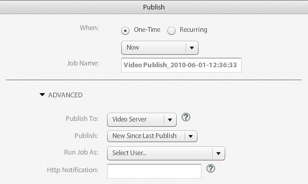

# ビデオの概要{#video-overview}

Dynamic Mediaクラシックには、アップロード時のビデオの自動変換、デスクトップおよび携帯端末へのビデオストリーミング、およびデバイスと帯域幅に基づいて再生用に最適化されたアダプティブビデオセットが付属しています。 ビデオの最も重要な点の1つはワークフローが単純ですビデオの技術に詳しくなくても誰でも使えるように設計されていることです

チュートリアルのこの節を終えるまでに、次の方法を習得できます。

- 様々なサイズと形式でのビデオのアップロードとエンコード（トランスコード）
- アップロードに使用できるビデオプリセットの中から選択
- ビデオ追加エンコーディングプリセットの編集
- ビデオビューアでのプレビュービデオ
- Webサイトやモバイルサイトへのビデオの配信
- ビデオの追加キャプションとチャプターマーカー
- デスクトップおよびモバイルユーザー向けのビデオビューアのカスタマイズと公開

>[!NOTE]
>
>この章のURLはすべて、例示的な目的でのみ使用します。これらのリンクはライブリンクではありません。

## Dynamic Mediaクラシックビデオの概要

まず、Dynamic Mediaクラシックを使ったビデオの可能性について理解してみましょう。

### 機能

Dynamic Mediaクラシックビデオプラットフォームは、ビデオソリューションのすべての部分（ビデオのアップロード、変換、管理）をオファーします。ビデオにキャプションとチャプターマーカーを追加する機能再生しやすいようにプリセットを使用する機能もあります。

デスクトップ、iOS、Android、Blackberry、Windows携帯端末など、複数の画面にストリーミング用の高品質なアダプティブビデオを簡単に公開できます。 アダプティブビデオセットでは、同じビデオを、400 kbps、800 kbps、1000 kbps などの様々なビットレートと形式でエンコードしたバージョンにグループ分けします。デスクトップコンピューターまたはモバイルデバイスによって、利用可能な帯域幅が検出されます。

さらに、デスクトップまたは携帯端末でネットワークの状態が変化した場合は、ビデオ画質が自動的に動的に切り替わります。また、ユーザーがデスクトップでフルスクリーンモードに切り替えると、アダプティブビデオセットは高い解像度を使用するので、ユーザーの視聴環境が向上します。 アダプティブビデオセットを使用すると、複数の画面やデバイスでDynamic Mediaクラシックビデオを最高の状態で再生できます。

### ビデオ管理

ビデオの操作は、静止画を操作する場合よりも複雑になる場合があります。 ビデオでは、様々な形式や標準に対応し、オーディエンスがクリップを再生できるかどうかの不確実性を扱います。 Dynamic Mediaクラシックはビデオの操作が簡単で、多くの強力なツールを「フードの下」に提供しますが、複雑な作業を省きます。

Dynamic Mediaクラシックでは、様々なソース形式を認識し、使用できます。 ただし、ビデオを読むのは作業の一部に過ぎません。また、ビデオをWeb対応の形式に変換する必要があります。 Dynamic Mediaクラシックでは、ビデオをH.264ビデオに変換できるので、この問題に対処します。

ビデオの変換は、利用可能な多くのプロフェッショナルツールや熱心なツールを使用して、非常に複雑になります。 Dynamic Mediaクラシックでは、様々な画質設定用に最適化された簡単なプリセットを提供することで、この機能をシンプルに保ちます。 ただし、より多くのカスタム設定が必要な場合は、独自のプリセットを作成することもできます。

ビデオの数が多い場合は、すべてのアセットを、画像や他のメディアと共に、Dynamic Mediaクラシックで管理できることをお勧めします。 堅牢なXMPメタデータをサポートし、ビデオアセットを含むアセットを整理、カタログ化、および検索できます。

### ビデオ再生

ビデオを変換してWeb対応のアクセシビリティを実現する問題と同様に、ビデオを実装してサイトに配信する問題があります。 プレイヤーを購入するか、独自に作成するかを選択し、様々なデバイスや画面に対応して、プレイヤーの保守をフルタイムで行うことができます。

また、Dynamic Mediaクラシックのアプローチでは、ニーズに合ったプリセットとビューアを選択できます。 様々なビューアの選択肢と多数のプリセットのライブラリが用意されています。

ビデオはWebや携帯端末に簡単に配信できます。Dynamic MediaクラシックはHTML5ビデオをサポートしています。つまり、AndroidやiOSプラットフォームのユーザーだけでなく、様々なブラウザーを実行しているターゲットユーザーにも配信できます。 ストリーミングビデオでは、長いまたは高解像度のコンテンツをスムーズに再生できますが、プログレッシブHTML5ビデオでは、小さい画面向けに最適化されたプリセットを使用しています。

ビデオのビューアプリセットは、ビューアのタイプに応じて部分的に設定できます。

すべてのビューアと同様、統合は、ビューアまたはビデオごとに1つのDynamic MediaクラシックURLを使用します。

>[!NOTE]
>
>ベストプラクティスとして、Dynamic MediaクラシックHTML5ビデオビューアを使用します。 HTML5ビデオビューアで使用されるプリセットは堅牢なビデオプレーヤーです。 HTML5とCSSを使用した再生コンポーネントの設計、再生の埋め込み、ブラウザーの機能に応じたアダプティブストリーミングとプログレッシブストリーミングの使用が可能な機能を1つのプレーヤーに統合することで、リッチメディアコンテンツのデスクトップ、タブレット、モバイルユーザーへの提供を拡張できます。

一部のお客様に当てはまる可能性のあるDynamic Mediaクラシックビデオに関する最後の注意事項：一部の会社のアカウントで、自動変換、ストリーミングまたはビデオプリセットが有効になっていない場合があります。 何らかの理由でストリーミングビデオのURLにアクセスできない場合は、これが原因の可能性があります。 プログレッシブにダウンロードしたビデオをアップロードして公開したり、すべてのビデオビューアにアクセスしたりすることは可能です。 ただし、Dynamic Mediaクラシックの全機能を活用するには、担当のアカウントマネージャーまたはセールスマネージャーに連絡して、これらの機能を有効にしてもらう必要があります。

[Dynamic Mediaクラシック](https://docs.adobe.com/content/help/en/dynamic-media-classic/using/video/quick-start-video.html)のビデオの詳細。

## ビデオ 101

### 基本的なビデオの概念と用語

始める前に、ビデオを扱う際に使い慣れておく必要がある用語について説明します。 これらの概念は、Dynamic Mediaクラシックに固有のものではありません。プロ向けWebサイトのビデオ管理を行う場合は、このテーマに関するさらなる教育を受けたいと思います。 この節の最後に、いくつかのリソースをお勧めします。

- **エンコード/トランスコード。** エンコードとは、未圧縮の生のビデオデータを操作しやすい形式に変換するビデオ圧縮を適用するプロセスです。トランスコードとは、同様に、あるエンコーディング方法から別のエンコーディング方法への変換を指します。

   - ビデオ編集ソフトウェアで作成されたマスタービデオファイルは、大きすぎて、オンラインの宛先に配信するために適切な形式ではない場合が多くあります。 通常、デスクトップでの高速再生と編集のためにエンコードされますが、Web上での配信のためにはエンコードされません。
   - デジタルビデオを別の画面での再生に適した形式と仕様に変換するために、ビデオファイルは、Webや携帯端末への配信に最適な小さい効率的なファイルサイズにトランスコードされます。

- **ビデオ圧縮。** デジタルビデオ画像を表すために使用されるデータ量を減らす。空間画像圧縮と時間動き補償の組み合わせです。

   - ほとんどの圧縮技術は非可逆圧縮方式で、より小さいサイズを実現するためにデータをスローアウトします。
   - 例えば、DVビデオは比較的圧縮率が低く、ソースフッテージを簡単に編集できますが、Webで使用したりDVDに書き込んだりするには大きすぎます。

- **ファイル形式。** 形式はZIPファイルに似たコンテナで、ビデオファイル内のファイルの編成方法を決定しますが、通常はエンコード方法を決定しません。

   - ソースビデオの一般的なファイル形式には、Windows Media(WMV)、QuickTime(MOV)、Microsoft AVI、MPEGなどがあります。 Dynamic Mediaクラシックで公開される形式はMP4です。
   - 通常、ビデオファイルには、相互に関連し、同期された複数のトラック(1つのビデオトラック（オーディオなし）と1つ以上のオーディオトラック（ビデオなし）)が含まれます。
   - ビデオファイル形式は、これらの様々なデータトラックとメタデータの編成方法を決定します。

- **コーデック.** ビデオコーデックは、圧縮を使用してビデオをエンコードするアルゴリズムを記述します。オーディオはオーディオコーデックを介してエンコードされます。

   - コーデックは、ビデオの再生に必要な情報量を最小限に抑えます。 個々のフレームに関する情報ではなく、あるフレームと次のフレームの違いに関する情報のみが保存されます。
   - ほとんどのビデオでは、あるフレームから次のフレームへの変化が小さいので、コーデックを使用すると高い圧縮率が可能になり、ファイルサイズが小さくなります。
   - ビデオプレーヤーは、コーデックに従ってビデオをデコードし、一連の画像（フレーム）を画面に表示します。
   - 一般的なビデオコーデックには、H.264、On2 VP6、H.263があります。

- **解決方法.** ビデオの高さと幅（ピクセル単位）

   - ソースビデオのサイズは、カメラと編集ソフトウェアからの出力によって決まります。 通常、HDカメラは1920 x 1080の高解像度ビデオを作成しますが、Web上でスムーズに再生するには、1280 x 720、640 x 480など、より小さい解像度にダウンサンプル（サイズ変更）します。
   - 解像度は、ファイルサイズと、そのビデオの再生に必要な帯域幅に直接影響します。

- **縦横比を表示** ビデオの幅とビデオの高さの比率。ビデオの縦横比がプレーヤーの縦横比と一致しない場合、「黒い棒グラフ」が表示されるか、空白が表示されます。 ビデオの表示に使用される一般的な縦横比は次の2つです。

   - 4:3(1.33:1) 標準品位のほぼすべてのテレビ放送コンテンツに使用されます。
   - 16:9 (1.78:1) ほとんどすべてのワイドスクリーン高解像度テレビコンテンツ(HDTV)や映画に使用されます。

- **ビットレート/データレート。** ビデオ再生時の1秒間にエンコードされるデータの量（キロビット/秒）。

   - 通常、ビットレートが低いほど、Webで望ましいビットレートになります。これは、ダウンロードが速くなるからです。 ただし、圧縮損失が原因で品質が低いことを意味する場合もあります。
   - 適切なコーデックを使用する場合は、低ビットレートと高品質のバランスを取る必要があります。

- **フレームレート(フレーム/秒(FPS))** ビデオの1秒あたりのフレーム数（静止画）。通常、北米のTV(NTSC)は29.97 FPSで放送されます。ヨーロッパおよびアジアのTV(PAL)は25 FPSで放送されます。およびフィルム（アナログおよびデジタル）は、通常24(23.976)FPSです。

   - 混乱を避けるために、プログレッシブフレームとインターレースフレームもあります。 各プログレッシブフレームには画像フレーム全体が含まれ、インターレースフレームには画像フレーム内の1行おきのピクセルが含まれます。 フレームは非常に速く再生され、混ざって見えます。 フィルムはプログレッシブスキャン方式を使用しますが、デジタルビデオは通常インターレースされます。
   - 一般的に、ソースフッテージがインターレースされているかどうかは関係ありません。Dynamic Mediaクラシックでは、変換されたビデオのスキャン方法が保持されます。
   - ストリーミング/プログレッシブ配信 ビデオストリーミングとは、メディアを連続的に再生できるストリームで送信することです。一方、プログレッシブにダウンロードされるビデオは、サーバーから他のファイルと同様にダウンロードされ、ブラウザーにローカルにキャッシュされます。

この入門書が、Dynamic Mediaクラシックビデオの使用に関する様々な選択肢を理解するのに役立つと思います。

## ビデオワークフロー

Dynamic Mediaクラシックでビデオを操作する場合は、画像の操作に似た基本的なワークフローに従います。

1. ビデオファイルをDynamic Mediaクラシックにアップロードして開始します。 これを行うには、Dynamic Mediaクラシック拡張機能パネルの下部にある&#x200B;**ツールメニュー**&#x200B;を開き、**Dynamic Mediaクラシックにアップロード/ファイルをフォルダ名**&#x200B;にアップロード、**Dynamic Mediaクラシックにアップロード/フォルダ名**&#x200B;を選択します。 「Folder name」は、現在参照している任意のフォルダーで、拡張子が付きます。 ビデオファイルは大きくなる場合があるので、サイズの大きいファイルのアップロードにはFTPを使用することをお勧めします。 アップロードの一部として、ビデオのエンコーディング用の1つ以上のビデオプリセットを選択します。 アップロード時にビデオをMP4ビデオにトランスコードできます。 エンコーディングプリセットの使用と作成について詳しくは、後述のビデオプリセットトピックを参照してください。 [ビデオのアップロードとエンコード](https://docs.adobe.com/content/help/en/dynamic-media-classic/using/video/uploading-encoding-videos.html)について説明します。
2. ビデオビューアプリセットを選択または変更し、ビデオのプレビューを行います。 プリビルトビューアプリセットを選択するか、独自のビューアプリセットをカスタマイズします。 モバイルユーザーをターゲットにしている場合は、モバイルプラットフォームではビューアやプリセットが不要なので、何もする必要はありません。 [ビデオビューアでのビデオのプレビュー](https://docs.adobe.com/content/help/en/dynamic-media-classic/using/video/previewing-videos-video-viewer.html)および[ビデオビューアプリセットの追加または編集](https://docs.adobe.com/content/help/en/dynamic-media-classic/using/video/previewing-videos-video-viewer.html#adding-or-editing-a-video-viewer-preset)について詳しく説明します。
3. ビデオ公開の実行、URLの取得および統合を行います。 ビデオワークフローと画像ワークフローの主な違いは、ビデオワークフローでのこの手順と画像ワークフローでの主な違いは、標準の画像サービング公開の代わりに（おそらくは同時に）特別なビデオ公開を実行することです。 デスクトップでのビデオビューアの統合は、画像ビューアの統合とまったく同じように機能しますが、モバイルデバイスでは、ビデオ自体のURLが必要なだけで、さらに簡単です。

### トランスコードについて

トランスコードは、あるエンコーディング方法から別のエンコーディング方法への変換処理として、以前に定義されていました。 Dynamic Mediaクラシックの場合は、ソースビデオを現在の形式からMP4に変換するプロセスです。 これは、ビデオをデスクトップブラウザーまたは携帯端末に表示する前に必要です。

Dynamic Mediaクラシックは、すべてのトランスコードを扱うことができるので、大きな利点があります。 自分でビデオをトランスコードし、既にMP4に変換済みのファイルをアップロードすることはできますが、これは高度なソフトウェアが必要な複雑なプロセスである可能性があります。 自分が何をしているか分からない限り、最初の試みでは良い結果が得られないことが多い。

Dynamic Mediaクラシックでは、ファイルの変換が自動的に行われるだけでなく、使いやすいプリセットを提供することで、簡単に変換できます。 このプロセスの技術的な側面についてあまり知る必要はありません。知っておく必要があるのは、システムから取り出したい最終的なサイズとエンドユーザの帯域幅の概念です。

プリビルトプリセットは便利で、ほとんどのニーズに対応できますが、場合によっては、もっとカスタムのものをお勧めします。 その場合は、独自のエンコーディングプリセットを作成できます。 Dynamic Mediaクラシックでは、エンコーディングプリセットはビデオプリセットと呼ばれます。 本章で後述する。

### ストリーミングについて

Dynamic Mediaクラシックビデオプラットフォームの標準機能であるビデオストリーミングも、注目に値するもう1つの主な機能です。 ストリーミングメディアは、配信中に常にエンドユーザに受信され、エンドユーザに提示されます。 これは、多くの理由で重要で望ましいことです。

通常、ストリーミングに必要な帯域幅は、プログレッシブダウンロードよりも少なくなります。これは、ビデオの一部だけが実際に配信されるからです。 Dynamic Mediaクラシックビデオストリーミングサーバおよび視聴者は、自動帯域幅検出を使用して、ユーザのインターネット接続に最適なストリームを配信します。

ストリーミングの場合、ビデオ開始は他の方法よりも早く再生されます。 また、視聴されたビデオの一部のみがクライアントに送信されるので、ネットワークリソースをより効率的に使用できます。

もう1つの配信方法は、プログレッシブダウンロードです。 ストリーミングビデオと比較すると、プログレッシブダウンロードのメリットは1つだけです。ビデオを配信するのにストリーミングサーバは必要ありません。 Dynamic Mediaクラシックが登場するのも当然ですDynamic Mediaクラシックはプラットフォームにストリーミングサーバを組み込んでいるのでこの専用のハードウェアを維持するのに手間をかけたり費用をかけたりする必要はありません

プログレッシブダウンロードビデオは、通常のWebサーバーから提供できます。 これは便利でコスト効率に優れている可能性がありますが、プログレッシブダウンロードのシーク機能とナビゲーション機能は限られており、ユーザーはコンテンツにアクセスして再利用できることに注意してください。 非常に厳密なネットワークファイアウォールの背後での再生など、状況によっては、ストリーミング配信がブロックされる場合があります。この場合、プログレッシブ配信にロールバックすることが望ましい場合があります。

プログレッシブダウンロードは、トラフィック要件が低いホビイストやWebサイトに適しています。コンテンツがユーザーのコンピューター上にキャッシュされているかどうかを気にしない場合、短い長さのビデオのみを配信する必要がある場合（10分未満）。または、訪問者が何らかの理由でストリーミングビデオを受信できない場合に使用します。

高度な機能やビデオの配信の制御、大きなオーディエンス（数百人の同時視聴者など）でのビデオの表示、使用状況の追跡とレポート、統計の表示、最高のインタラクティブ再生操作のオファーを行う場合は、ビデオのストリーミングが必要です。

最後に、知的財産や権利管理の問題に対してメディアを保護することを懸念する場合は、ストリーミングを行うと、ビデオのより安全な配信が提供されます。これは、メディアがストリーミング時にクライアントのキャッシュに保存されないからです。

## ビデオプリセット

ビデオをアップロードする場合は、マスタービデオをエンコーディングを使用したWebフレンドリな形式に変換するための設定を含む1つ以上のプリセットから選択します。 ビデオプリセットには、アダプティブビデオプリセットとシングルエンコーディングプリセットの2種類があります。

詳しくは、[使用可能なビデオプリセット](https://docs.adobe.com/content/help/en/dynamic-media-classic/using/setup/application-setup.html#video-presets-for-encoding-video-files)を参照してください。

アダプティブビデオプリセットは初期設定でアクティブ化されており、エンコーディングに使用できます。 シングルエンコーディングプリセットを使用する場合は、ビデオプリセットのリストに表示されるように、管理者がアクティブ化する必要があります。

[ビデオプリセットをアクティブ化または非アクティブ化する方法](https://docs.adobe.com/content/help/en/dynamic-media-classic/using/video/uploading-encoding-videos.html#activating-or-deactivating-video-encoding-presets)について説明します。

Dynamic Mediaクラシックに付属の多数のプリビルドプリセットのいずれかを選択するか、独自のプリセットを作成することができます。ただし、初期設定では、アップロード対象としてプリセットが選択されていません。 つまり、**アップロード時にビデオプリセットを選択しない場合、ビデオは変換されず、公開できない可能性があります**。 ただし、ビデオを自分でオフラインに変換して、アップロードして公開することはできます。 ビデオプリセットは、Dynamic Mediaクラシックで変換を行う場合にのみ必要です。

アップロード時に、オプションパネルで「**ビデオオプション**」を選択して、ビデオプリセットを選択します。 次に、「コンピュータ」、「モバイル」、「タブレット」のいずれにエンコードするかを選択します。

- コンピューターはデスクトップで使用します。 通常、より多くの帯域幅を消費する大きなプリセット（HDなど）があります。
- モバイルとタブレットは、iPhoneやAndroidスマートフォンなどのデバイス向けにMP4ビデオを作成します。 モバイルとタブレットの唯一の違いは、タブレットプリセットはWiFiの使用に基づいているので、通常は高い帯域幅を持つことです。 モバイルプリセットは、使用速度が遅い3Gに最適化されています。

### プリセットを選択する前に自分に確認する質問

プリセットを選択する場合は、オーディエンスとソースフッテージを把握しておく必要があります。 お客様について何を知っていますか。 コンピューターのモニターや携帯端末などで、ビデオをどのように見ているか。

ビデオの解像度は？ 元のプリセットよりも大きいプリセットを選択すると、ビデオがぼやけたりピクセル化されたりする場合があります。 ビデオのサイズがプリセットより大きい場合は問題ありませんが、ソースビデオのサイズより大きいプリセットは選択しないでください。

縦横比はどのくらいか 変換されたビデオの周りに黒いバーが表示される場合は、誤った縦横比を選択しています。 Dynamic Mediaクラシックでは、これらの設定を自動検出できません。これは、アップロード前にファイルを調べる必要があるためです。

### ビデオオプションの分類

ビデオプリセットは、これらの設定を指定して、ビデオをエンコードする方法を決定します。 これらの用語に慣れていない場合は、上記の「基本的なビデオの概念と用語」のトピックを参照してください。

- **縦横比.** 通常、標準の4:3またはワイドスクリーン16:9です。
- **サイズ.** これは、ディスプレイの解像度と同じで、ピクセル単位で測定されます。これは、縦横比に関連します。 16:9の比率では、ビデオは432 x 240ピクセル、4:3は320 x 240ピクセルになります。
- **FPS.** 標準のフレームレートは、ビデオ標準（NTSC、PALまたはフィルム）に応じて、30、25または24フレーム/秒(fps)です。この設定は問題ではありません。Dynamic Mediaクラシックは常にソースビデオと同じフレームレートを使用するからです。
- **形式.** これはMP4になります。
- **帯域幅.** これは、ターゲットユーザーに望ましい接続速度です。高速なインターネット接続と低速なインターネット接続のどちらを使用しているか。 通常、デスクトップコンピューターまたはモバイルデバイスを使用していますか。 これは、ビデオの解像度（サイズ）にも関係します。ビデオの帯域幅が広いほど必要な帯域幅が多くなるからです。

### ビデオのデータレートまたは「ビットレート」の決定

ビデオのビットレートの計算は、Webにビデオを配信する上で最も理解し難い要因の1つですが、ユーザーエクスペリエンスに直接影響するので、最も重要な要因となる可能性があります。 ビットレートを高く設定すると、ビデオ画質は高くなりますが、パフォーマンスは低くなります。 低速のインターネット接続を持つユーザーは、ビデオが再生中に絶えず一時停止されるので、強制的に待機します。 しかし、低く設定しすぎると、品質が低下します。 ビデオプリセット内で、Dynamic Mediaクラシックは、ターゲットの帯域幅に応じたデータの範囲を提示します。 それは開始にとって良い場所です。

ただし、自分で計算したい場合は、ビットレート計算ツールが必要です。 これは、ビデオの専門家やファンが、DVDなどの特定のストリームまたはメディアにどれだけのデータが入り込むかを予測する際に一般的に使用するツールです。

## カスタムビデオプリセットの作成

組み込みのエンコーディングビデオプリセットの設定と一致しない特殊なビデオプリセットが必要な場合があります。 これは、3Dアニメーションソフトウェアで作成したビデオや、元のサイズから切り抜かれたビデオなど、特定のサイズのカスタムビデオがある場合に発生する可能性があります。 様々な帯域幅設定を試して、高画質または低画質のビデオを提供したい場合があります。 どのような場合でも、カスタムのシングルエンコーディングビデオプリセットを作成する必要があります。

### ビデオプリセットのワークフロー

1. ビデオプリセットは、**設定/アプリケーション設定/ビデオプリセット**&#x200B;にあります。 会社で使用できるすべてのエンコーディングプリセットのリストを示します。

   - すべてのストリーミングビデオアカウントには、あらかじめ用意されている多数のプリセットがあり、独自のカスタムプリセットを作成する場合は、ここにも表示されます。
   - ドロップダウンメニューを使用して、タイプでフィルタリングできます。 プリセットは、「コンピュータ」、「モバイル」、「タブレット」に分かれています。
      

2. 「アクティブ」列では、アップロード時にすべてのプリセットを表示するか、選択したプリセットのみを表示するかを選択できます。 米国にいる場合は、ヨーロッパPALプリセットのチェックを外し、英国/ヨーロッパ（ヨーロッパ）/ヨーロッパ（ヨーロッパ）の場合は、NTSCプリセットのチェックを外します。
3. 「**追加**」ボタンをクリックして、カスタムプリセットを作成します。 ビデオプリセットパネル追加が開きます。 ここでの処理は、画像プリセットの作成と似ています。
4. まず、プリセットのリストに表示する&#x200B;**プリセット名**&#x200B;を指定します。 上の例では、このプリセットは画面キャプチャのチュートリアルビデオ用です。
5. **説明**&#x200B;はオプションですが、このプリセットの目的を説明するツールチップがユーザーに提供されます。
6. **エンコードファイルのサフィックス**&#x200B;は、ここで作成するビデオの名前の末尾に追加されます。 マスタービデオと、このエンコードされたビデオがあります。これはマスターの派生物で、Dynamic Mediaクラシックの2つのアセットが同じアセットIDを持つことはできません。
7. **再生** デバイスでは、目的のビデオファイル形式（コンピュータ、モバイル、タブレット）を選択します。モバイルとタブレットは同じMP4形式を生成することに注意してください。 Dynamic Mediaクラシックは、プリセットを配置するカテゴリを知る必要があります。ただし、理論上の違いは、すべてがWiFiをサポートしているので、タブレットプリセットは通常、より高速なインターネット接続を実現できるという点です。
8. **ターゲットデータ** レートは、自分で判断する必要のあるものですが、以下の画像で推奨範囲を確認できます。スライダをドラッグして、ターゲットの帯域幅を概算することもできます。 より正確な数値を求めるには、ビットレート計算ツールを使用します。 試行錯誤が少し関わっている。

   

9. ソースファイルの&#x200B;**縦横比**&#x200B;を設定します。 この設定は、下のサイズと直接関連付けられています。 「_カスタム_」を選択した場合は、幅と高さの両方を手動で入力する必要があります。
10. 縦横比を選択した場合は、**解像度サイズ**&#x200B;に1つの値を設定すると、Dynamic Mediaクラシックによってもう1つの値が自動的に埋め込まれます。 ただし、カスタム縦横比の場合は、両方の値を入力します。 サイズは、データレートに合わせて指定する必要があります。 非常に低いデータレートと大きなサイズを設定した場合は、画質が劣ることが予測されます。
11. 「**保存**」をクリックしてプリセットを保存します。 他のすべてのプリセットとは異なり、この時点では、プリセットはファイルのアップロード専用なので公開する必要はありません。 後で、エンコードされたビデオを公開する必要がありますが、プリセットは内部のDynamic MediaClassicでの使用のみを目的としています。
12. ビデオプリセットがアップロードリスト上にあることを確認するには、「**アップロード**」に移動します。「**ジョブオプション**」を選択し、「**ビデオオプション**」を展開します。 プリセットが、選択した再生デバイス（「コンピュータ」、「モバイル」または「タブレット」）のカテゴリに表示されます。

[ビデオプリセットの追加または編集](https://docs.adobe.com/content/help/en/dynamic-media-classic/using/video/uploading-encoding-videos.html#adding-or-editing-a-video-encoding-preset)についての詳細。

## ビデオ追加のキャプション

場合によっては、ビデオにキャプションを追加すると便利です。例えば、複数の言語のビデオを視聴者に提供する必要があるが、別の言語でオーディオをダビングしたり、別の言語で再度ビデオを録画したりしたくない場合などです。 また、キャプションを追加すると、難聴者やクローズドキャプションを使用するユーザーにとって、より高いアクセシビリティを提供できます。 Dynamic Mediaクラシックでは、ビデオにキャプションを簡単に追加できます。

[ビデオ追加のキャプション](https://docs.adobe.com/content/help/en/dynamic-media-classic/using/video/adding-captions-video.html)の方法を説明します。

## ビデオ追加のチャプターマーカー

長い形式のビデオの場合、チャプターマーカーを使用してビデオを操作することで提供される機能と利便性を、視聴者は認識していると思われます。 Dynamic Mediaクラシックでは、ビデオにチャプターマーカーを簡単に追加できます。

[チャプターマーカーをビデオ](https://docs.adobe.com/content/help/en/dynamic-media-classic/using/video/adding-chapter-markers-video.html)追加にする方法を説明します。

## ビデオ導入トピック

### URLの公開とコピー

Dynamic Mediaクラシックワークフローの最後の手順は、ビデオコンテンツを公開することです。 ただし、ビデオにはビデオサーバー公開と呼ばれる独自の公開ジョブがあり、詳細設定の下にあります。

[ビデオを公開](https://docs.adobe.com/content/help/en/dynamic-media-classic/using/video/deploying-video-websites-mobile-sites.html#publishing-video)する方法を説明します。

ビデオの公開を実行すると、Webブラウザで、ビデオおよび既製のDynamic MediaクラシックビューアプリセットにアクセスするURLを取得できます。 ただし、独自のビデオビューアプリセットをカスタマイズまたは作成した場合は、別個のImage Server公開を実行する必要があります。

- [モバイルサイトまたはWebサイトにURLをリンクする方法](https://docs.adobe.com/content/help/en/dynamic-media-classic/using/video/deploying-video-websites-mobile-sites.html#linking-a-video-url-to-a-mobile-site-or-a-website)を説明します。
- [ビデオビューアをWebページに埋め込む方法](https://docs.adobe.com/content/help/en/dynamic-media-classic/using/video/deploying-video-websites-mobile-sites.html#embedding-the-video-viewer-on-a-web-page)を説明します。

サードパーティ製またはカスタムに構築されたビデオプレーヤーを使用してビデオを配信することもできます。

[サードパーティのビデオプレーヤーを使用したビデオの展開](https://docs.adobe.com/content/help/en/dynamic-media-classic/using/video/deploying-video-websites-mobile-sites.html#deploying-video-using-a-third-party-video-player)の方法を説明します。

さらに、ビデオのサムネール（ビデオから抽出された画像）も使用する場合は、Image Server公開も実行する必要があります。 これは、ビデオのサムネール画像がImage Serverに存在するのに対し、ビデオ自体がビデオサーバに存在するからです。 ビデオサムネールは、ビデオ検索結果、ビデオ再生リストに使用でき、ビデオ再生前にビデオビューアに表示される初期「ポスターフレーム」として使用できます。

[ビデオサムネールの操作](https://docs.adobe.com/content/help/en/dynamic-media-classic/using/video/deploying-video-websites-mobile-sites.html#working-with-video-thumbnails)についての詳細。

### ビューアプリセットの選択とカスタマイズ

ビューアプリセットを選択してカスタマイズする手順は、画像の場合とまったく同じです。 新しいプリセットを作成するか、既存のプリセットを変更して新しい名前で保存し、編集して、画像サービング公開を実行します。 すべてのビューアプリセットは、画像のプリセットだけでなくImage Serverに公開されるので、新しいプリセットや変更されたプリセットを表示するには、画像公開を実行する必要があります。

>[!TIP]
>
>ビデオサーバーの公開後に画像サービング公開を実行し、ビデオに関連付けられたサムネール画像を公開します。

## ビデオ検索エンジンの最適化

検索エンジン最適化(SEO)は、検索エンジンでのWebサイトやWebページの表示を改善するプロセスです。 検索エンジンは、テキストベースのコンテンツに関する情報の収集に優れていますが、ビデオに関する情報は、検索エンジンに提供されない限り十分に取得できません。 Dynamic MediaクラシックビデオSEOを使用すると、メタデータを使用して、ビデオの説明を検索エンジンに提供できます。 ビデオSEO機能を使用すると、ビデオサイトマップとメディアRSS(mRSS)フィードを作成できます。

- **ビデオサイトマップ**。ビデオコンテンツがサイト上のどこにいて、何が存在するかをGoogleに正確に通知します。 その結果、Googleでビデオを完全に検索できます。 例えば、ビデオサイトマップでビデオの実行時間とカテゴリを指定できます。
- **mRSSフィード**。コンテンツ発行者がメディアファイルをYahoo! ビデオ検索 Googleは、情報を検索エンジンに送信するためのビデオサイトマップおよびメディアRSS(mRSS)フィードプロトコルの両方をサポートしています。

ビデオサイトマップとmRSSフィードを作成する場合、ビデオファイルから取り込むメタデータフィールドを指定します。 この方法でビデオの説明を検索エンジンに提供できるので、検索エンジンはトラフィックをより正確にWebサイトのビデオに導くことができます。

サイトマップまたはフィードが作成されたら、Sitemapまたはフィードを自動的に公開するか、手動で公開するか、後で編集できるファイルを生成することができます。 また、Dynamic Mediaクラシックでは毎日自動的にこのファイルを生成して公開できます。

プロセスの最後に、ファイルまたはURLを検索エンジンに送信します。 このタスクはDynamic Mediaクラシック以外で行われ、しかし、以下で簡単に説明します。

### Sitemap/mRSSファイルの要件

Googleや他の検索エンジンがファイルを拒否しないようにするには、正しい形式で、特定の情報を含める必要があります。 Dynamic Mediaクラシックは、適切にフォーマットされたファイルを生成します。ただし、一部のビデオの情報が利用できない場合、その情報はファイルに含まれません。

必須フィールドは、「ランディングページ」（ビデオを提供するページのURLで、ビデオ自体のURLではありません）、「タイトル」および「説明」です。 各ビデオには、これらの項目のエントリが必要です。エントリがないと、生成されたファイルに含まれません。 オプションのフィールドは、タグとカテゴリです。

他にも2つの必須フィールドがあります。コンテンツURL、ビデオアセット自体のURL、ビデオのサムネール画像のURLであるサムネールですが、Dynamic Mediaクラシックではこれらの値が自動的に入力されます。

XMPメタデータを使用したアップロードの前に、このデータをビデオに埋め込むことをお勧めします。Dynamic Mediaクラシックは、アップロード時にこのデータを抽出します。 すべてのAdobe Creative Cloudアプリに含まれるAdobe Bridgeなどのアプリを使用して、標準メタデータフィールドにデータを入力します。

この方法に従うと、Dynamic Mediaクラシックを使用して手動でこのデータを入力する必要がありません。 ただし、同じデータを毎回入力する簡単な方法として、Dynamic Mediaクラシックのメタデータプリセットを使用することもできます。

このトピックについて詳しくは、[メタデータの表示、追加、書き出し](https://docs.adobe.com/content/help/en/dynamic-media-classic/using/managing-assets/viewing-adding-exporting-metadata.html)を参照してください。

メタデータが入力されると、そのビデオアセットの詳細表示にメタデータが表示されます。 キーワードも表示される場合がありますが、キーワードは「キーワード」タブにあります。

- [キーワード](https://docs.adobe.com/content/help/en/dynamic-media-classic/using/managing-assets/viewing-adding-exporting-metadata.html#add-or-edit-keywords)の追加の詳細を表示します。
- [ビデオSEO](https://docs.adobe.com/content/help/en/dynamic-media-classic/using/setup/video-seo-search-engine-optimization.html)の詳細を見る。
- [ビデオSEO](https://docs.adobe.com/content/help/en/dynamic-media-classic/using/setup/video-seo-search-engine-optimization.html#choosing-video-seo-settings)の設定について説明します。

#### ビデオSEOの設定

ビデオSEO開始の設定時に、ファイルに含める形式の種類、生成方法およびメタデータフィールドを選択します。

1. **設定/アプリケーション設定/ビデオSEO/設定**&#x200B;に移動します。
2. **生成モード**&#x200B;メニューで、ファイル形式を選択します。 デフォルト値はオフです。これを有効にするには、「ビデオサイトマップ」、「mRSS」、「両方」のいずれかを選択します。
3. 自動生成するか、手動で生成するかを選択します。 簡単にするために、**自動モード**&#x200B;に設定することをお勧めします。 「自動」を選択した場合は、「**公開用にマーク**」オプションも設定します。そうしないと、ファイルは実行されません。 サイトマップファイルとRSSファイルはXMLドキュメントの種類で、他のアセットと同様に公開する必要があります。 すべての情報を今すぐ準備できていない場合、または1回限りの生成を行いたい場合は、手動モードの1つを使用します。
4. ファイルで使用するメタデータタグを設定します。 この手順はオプションではありません。 最低でも、アスタリスク(\*)が付いた3つのフィールドを含める必要があります。**ランディングページ**、**タイトル**、**説明**。 これらのタスクにメタデータを使用するには、右側のメタデータパネルからフォームの対応するフィールドにフィールドをドラッグ&amp;ドロップします。 Dynamic Mediaクラシックでは、各ビデオの実際のデータがプレースホルダフィールドに自動的に埋め込まれます。 メタデータフィールドを使用する必要はありません。 代わりに、ここにスタティックテキストを入力することもできますが、各ビデオに同じテキストが表示されます。
5. 3つの必須フィールドに情報を入力すると、「**保存**」ボタンと「**保存して生成**」ボタンが有効になります。 いずれかをクリックして設定を保存します。 自動モードで、後でDynamic Mediaクラシックにファイルを生成させる場合は、**保存**&#x200B;を使用します。 「**保存して生成**」を使用すると、ファイルを直ちに作成できます。

### ビデオサイトマップ、mRSSフィードまたはその両方のファイルのテストと公開

生成されたファイルは、アカウントのルート（ベース）ディレクトリに表示されます。

ビデオ検索エンジン最適化ツールでは、これらのファイルを単独で実行することはできないので、公開する必要があります。 公開用にマークされている限り、次回の公開の実行時に公開サーバに送信されます。

公開後、このURL形式を使用してファイルを利用できるようになります。

例：

### 検索エンジンへの送信

プロセスの最後の手順は、ファイルやURLを検索エンジンに送信することです。 Dynamic Media・クラシックは君のためにこの手順を行うことはできない。ただし、XMLファイル自体ではなくURLを送信したと仮定すると、次回ファイルが生成され、公開が発生したときに、フィードが更新されます。

検索エンジンに送信する方法は異なりますが、Googleの場合はGoogle Webmaster Toolsを使用します。 そこに移動したら、**サイトの設定/サイトマップ**&#x200B;に移動し、**サイトマップを送信**&#x200B;ボタンをクリックします。 ここに、SEOファイルのDynamic MediaクラシックURLを配置できます。

### ビデオ検索エンジン最適化レポート

Dynamic Mediaクラシックは、ファイルに正常に含まれたビデオの数と、エラーによって含まれなかったビデオの数を示すレポートを提供します。 レポートにアクセスするには、**設定/アプリケーション設定/ビデオSEO/レポート**&#x200B;に移動します。

## MP4ビデオのモバイル実装

Dynamic Mediaクラシックでは、モバイル向けのビューアプリセットは含まれません。ビューアは、サポートされている携帯端末でビデオを再生する必要がないからです。 H.264 MP4形式にエンコードする限り（アップロード時に変換するか、デスクトップでプリエンコードするかのいずれか）、サポートされているタブレットとスマートフォンは、ビューアを必要とせずにビデオを再生できます。 これは、AndroidおよびiOS（iPhoneおよびiPad）デバイスでサポートされます。

ビューアが不要なのは、両方のプラットフォームがネイティブH.264をサポートしているためです。 ビデオをHTML5 Webページに埋め込むか、アプリケーション自体にビデオを埋め込むことができます。AndroidおよびiOSオペレーティングシステムは、ビデオを再生するためのコントローラーを提供します。

このため、Dynamic Mediaクラシックでは携帯端末用のビューアのURLが提供されず、ビデオに直接URLが提供されます。 MP4ビデオのプレビューウィンドウに、デスクトップとモバイルのリンクが表示されます。 モバイルURLは、公開されたビデオを指します。

公開されたビデオについて注意すべき重要な点の1つは、URLリストがアセットIDだけでなく、ビデオのフルパスであることです。 画像を処理する場合、フォルダー構造に関係なく、画像をアセットIDで呼び出します。 ただし、ビデオの場合は、フォルダー構造も指定する必要があります。 上記のURLでは、ビデオは次のパスに保存されています。

これは、ビデオの会社名、フォルダパス、名前として表すこともできます。

### メソッド#1:ブラウザーの再生 — HTML5コード

MP4ビデオをWebページに埋め込むには、HTML5ビデオタグを使用します。

この方法はデスクトップWebでも動作しますが、ブラウザーのサポートで問題が発生する場合があります。一部のデスクトップWebブラウザーでは、Firefoxを含むH.264ビデオがネイティブサポートされていません。

### メソッド#2:iOSでのアプリ再生 — Media Player Framework

また、モバイルアプリケーションコードにDynamic MediaクラシックMP4ビデオを埋め込むこともできます。 以下に、Media Playerフレームワークを使用するiOSの一般的な例を示します。このフレームワークは、例示目的でのみ提供されます。

## その他のリソース

[Dynamic Mediaスキルビルダーを見る：Dynamic Mediaクラシック](https://seminars.adobeconnect.com/p2ueiaswkuze)オンデマンドウェビナーのビデオで、Dynamic Mediaクラシックのビデオ機能の使用方法を学習します。
