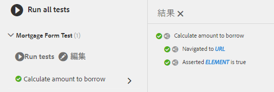

# AEM Adaptive Formsでの自動テストの使用{#using-automated-tests-with-aem-adaptive-forms}

Calvin SDKを使用したアダプティブFormsの自動テスト

Calvin SDK は、アダプティブフォームをテストするためのアダプティブフォーム開発者用のユーティリティ API です。Calvin SDKは、[Hobbes.jsテストフレームワーク](https://docs.adobe.com/docs/en/aem/6-3/develop/ref/test-api/index.html)上に構築されています。 Calvin SDKは、AEM Forms 6.3以降で使用できます。

このチュートリアルでは、次の内容を作成します。

* テストスイート
* テストスイートには、1つ以上のテストケースが含まれます
* テストケースには、1つ以上のアクションが含まれます

## 概要 {#getting-started}

[パッケージマネージャーを使用したアセットのダウンロードとインストー](assets/testingadaptiveformsusingcalvinsdk1.zip)ルこのパッケージには、サンプルスクリプトといくつかのアダプティブFormsが含まれています。これらのアダプティブFormsは、AEM Forms 6.3バージョンを使用して構築されています。AEM Forms 6.4以降でテストする場合は、お使いのバージョンのAEM Formsに固有の新しいフォームを作成することをお勧めします。 サンプルスクリプトは、Adaptive Formsのテストに使用できる様々なCalvin SDK APIを示します。 AEM Adaptive Formsをテストする一般的な手順は次のとおりです。

* テストする必要があるフォームに移動します
* フィールドの値の設定
* アダプティブフォームの送信
* エラーメッセージの確認

パッケージ内のサンプルスクリプトは、上記のすべてのアクションを示しています。
`mortgageForm.js`のコードを調べましょう。

```javascript
var mortgageFormTS = new hobs.TestSuite("Mortgage Form Test", {
        path: '/etc/clientlibs/testingAFUsingCalvinSDK/mortgageForm.js',
        register: true
})
```

上記のコードは、新しいテストスイートを作成します。

* この場合のTestSuiteの名前は「 `Mortgage Form Test` 」です。
* テストスイートを含むjsファイルへのAEMの絶対パスを指定します。
* 「 `true` 」に設定した場合、registerパラメーターは、テストスイートをテストUIで使用できるようにします。

```javascript
.addTestCase(new hobs.TestCase("Calculate amount to borrow")
        // navigate to the mortgage form  which is to be tested
        .navigateTo("/content/forms/af/cal/mortgageform.html?wcmmode=disabled")
  .asserts.isTrue(function () {
            return calvin.isFormLoaded()
        })
```

>[!NOTE]
>
>この機能をAEM Forms 6.4以降でテストしている場合は、新しいアダプティブフォームを作成し、それを使用してテストをおこなってください。パッケージに付属するアダプティブフォームの使用はお勧めしません。

テストケースをテストスイートに追加して、アダプティブフォームに対して実行することができます。

* テストスイートにテストケースを追加するには、TestSuiteオブジェクトの`addTestCase`メソッドを使用します。
* `addTestCase`メソッドは、TestCaseオブジェクトをパラメーターとして取ります。
* TestCaseを作成するには、`hobs.TestCase(..)`メソッドを使用します。
* 注意：最初のパラメーターは、UIに表示されるテストケースの名前です。
* テストケースを作成したら、テストケースにアクションを追加できます。
* `navigateTo`、`asserts.isTrue`などのアクションをアクションとしてテストケースに追加できます。

## 自動化されたテストの実行{#running-the-automated-tests}

[](http://localhost:4502/libs/granite/testing/hobbes.html)testsuiteを開き、テストスイートを展開してテストを実行します。すべてが正常に実行された場合は、次の出力が表示されます。



## サンプルテストスイート{#try-out-the-sample-test-suites}を試してみます。

サンプルパッケージの一部として、追加のテストスイートが3つあります。 次に示すように、クライアントライブラリのjs.txtファイルに適切なファイルを含めることで、ファイルを試すことができます。

```javascript
#base=.

scriptingTest.js
validationTest.js
prefillTest.js
mortgageForm.js
```
