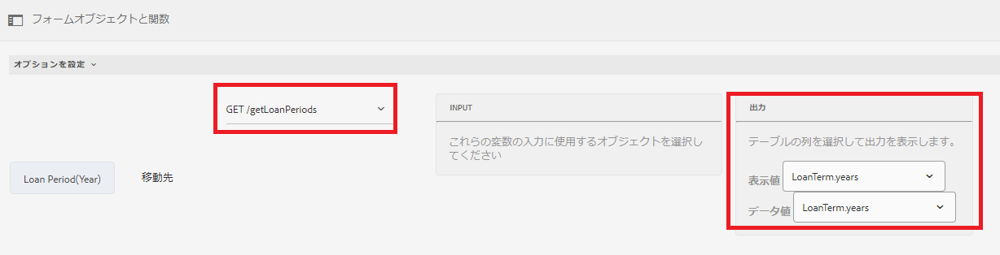

# 選択グループコンポーネントへの項目の動的な追加

AEM Forms6.5では、チェックボックス、ラジオボタン、画像リストなどのアダプティブForms選択グループコンポーネントに、項目を動的に追加する機能が導入されました。

[この機能は、Samples Server](https://forms.enablementadobe.com/content/samples/samples.html?query=0).動的チェックボックス項目カードを検索し、「試す」をクリックします。


使用事例に応じて、ビジュアルエディターやコードエディターを使用して項目を追加できます。

**ビジュアルエディターの使用：関数呼び出** しまたはサービス呼び出しの結果から、選択グループの項目を設定できます。例えば、REST API呼び出しの応答を使用して、選択グループの項目を設定できます。

下のスクリーンショットでは、「Loan Periods(years)」のオプションを、getLoanPeriodsというサービス呼び出しの結果に設定しています。



**コードエディターを使用します**。選択グループの項目を、フォームに入力された値に基づいて動的に設定する場合。例えば、次のコードスニペットでは、チェックボックスの項目を、アダプティブフォームの申請者名と配偶者のフィールドに入力された値に設定しています。

コードスニペットでは、チェックボックスコンポーネントであるWorkingMembersの項目を設定します。 アイテムの配列は、アダプティブフォームのapplicantNameフィールドとspouse textフィールドの値を取得することで、動的に作成されます

```javascript
 
 if(MaritalStatus.value=="Married")
  {
WorkingMembers.items =["spouse="+spouse.value,"applicant="+applicantName.value];
  }
else
  {
    WorkingMembers.items =["applicant="+applicantName.value];
  }
```

送信されるデータは次のとおりです。

```xml
<afUnboundData>

<data>

<applicantName>John Jacobs</applicantName>

<MaritalStatus>Married</MaritalStatus>

<spouse>Gloria Rios</spouse>

<WorkingMembers>spouse,applicant</WorkingMembers>

</data>

</afUnboundData>
```

**ルールエディターを使用した項目の追加**

>[!VIDEO](https://video.tv.adobe.com/v/26847?quality=12&learn=on)

**コードエディターを使用した項目の追加**

>[!VIDEO](https://video.tv.adobe.com/v/26848?quality=12&learn=on)

ご使用のシステムで試すには：

**コードエディターを使用した項目の追加**

* [アセットのダウンロード](assets/usingthecodeeditor.zip)
* [Formsとドキュメントを開く](http://localhost:4502/aem/forms.html/content/dam/formsanddocuments)
* 「 「|ファイルのアップロード」と入力し、前の手順でダウンロードしたファイルをアップロードします。
* [フォームのプレビュー](http://localhost:4502/content/dam/formsanddocuments/simpleform/jcr:content?wcmmode=disabled)
* 応募者名を入力し、「Marital Status（婚姻状況）」で「Married（既婚）」を選択します。
* 配偶者の名前を入力します
* 「次へ」をクリック
* 婚姻状況が既婚の場合は、申込者名と配偶者名のチェックボックスが表示されます

**ビジュアルエディターを使用した項目の追加**

* [アセットのダウンロード](assets/usingthevisualeditor.zip)
* Tomcatをまだインストールしていない場合は、インストールします。 [Tomcatのインストール手順は、こちらを参照してください](https://docs.adobe.com/content/help/en/experience-manager-learn/forms/ic-print-channel-tutorial/introduction.html)
* [TomcatにSampleRest.warファイルをデプロイする](https://forms.enablementadobe.com/content/DemoServerBundles/SampleRest.war)
* [Formsとドキュメントを開く](http://localhost:4502/aem/forms.html/content/dam/formsanddocuments)
* 「 「|ファイルのアップロード」と入力し、前の手順でダウンロードしたファイルをアップロードします。
* [フォームのプレビュー](http://localhost:4502/content/dam/formsanddocuments/amortizationschedule/jcr:content?wcmmode=disabled)
* 「融資額」を入力し、フィールドの外にタブを移動します。 これにより、融資期間フィールドを表示するルールがトリガーされます。
* 適切なローン期間を選択します（残りの呼び出しでローン期間の項目が入力されます）
* 金利を選択し、「償却スケジュールの取得」をクリックします。
* 償却表に値が入力されます。 償却スケジュールは、REST呼び出しを使用して取得されます。

>[!NOTE]
> tomcatはポート8080で実行され、AEMはポート4502で実行されていると想定します。
