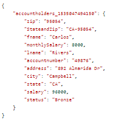

# AEM Forms{#creating-computed-form-data-model-elements-in-aem-forms}での計算済みフォームデータモデル要素の作成

計算済みフォームデータモデル要素を使用すると、操作結果を1つ以上のフォームデータモデル要素に保存できます。 例えば、月給フィールドに対して数学演算を実行して、月給を計算して保存する場合があります。 これをおこなうには、給与を12で割り、結果をmonthlySalaryという計算済みフォームデータモデル要素に保存します。

計算済みフォームデータモデルを作成するもう1つの例は、複数のフォームデータモデル要素を連結することです。 例えば、状態とzipフォームデータモデル要素を、2つの要素の間にハイフンと連結できます。

次のスクリーンショットは、計算済み要素StateandZipとmonthlySalaryを示しています

## 月給計算要素の作成

>[!VIDEO](https://video.tv.adobe.com/v/23855?quality=9&learn=on)

### StateandZip計算要素の作成

>[!VIDEO](https://video.tv.adobe.com/v/23856/?quality=9&learn=on)

