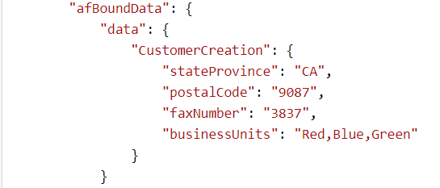

# コンマ区切りの文字列を文字列の配列に変換する {#setting-value-of-json-data-element-in-aem-forms-workflow}

入力パラメーターとして文字列の配列が含まれているフォームデータモデルを基にフォームを作成する場合は、送信済みのアダプティブフォームデータを操作して、文字列の配列を挿入する必要があります。例えば、チェックボックスフィールドを文字列配列タイプのフォームデータモデル要素に連結した場合、チェックボックスフィールドのデータはコンマ区切りの文字列形式になります。以下に示すサンプルコードは、コンマ区切りの文字列を文字列の配列に置き換える方法を示しています。

## プロセスステップの作成

ワークフローで特定のロジックを実行する場合に、AEM ワークフローで使用されるプロセスステップです。プロセスステップは、ECMA スクリプトまたは OSGi サービスに関連付けることができます。カスタムプロセスステップで OSGi サービスを実行します。

次の形式でデータが送信されます。businessUnits 要素の値はコンマ区切りの文字列で、文字列の配列に変換する必要があります。



フォームデータモデルに関連付けられている REST エンドポイントの入力データには、次のスクリーンショットに示すような文字列の配列が必要です。プロセスステップのカスタムコードは、送信されたデータを正しい形式に変換します。


JSON オブジェクトのパスと要素名をプロセスステップに渡します。プロセスステップのコードで、要素のコンマ区切り値を文字列の配列に置き換えます。


>[!NOTE]
>
>アダプティブフォームの送信オプションのデータファイルパスが「Data.xml」に設定されていることを確認します。これは、プロセスステップのコードが、ペイロードフォルダーの下で Data.xml というファイルを探すからです。

## プロセスステップコード

```java
import java.io.BufferedReader;
import java.io.ByteArrayInputStream;
import java.io.InputStream;
import java.io.InputStreamReader;

import javax.jcr.Binary;
import javax.jcr.Node;
import javax.jcr.Session;

import org.osgi.framework.Constants;
import org.osgi.service.component.annotations.Component;
import org.slf4j.Logger;
import org.slf4j.LoggerFactory;

import com.adobe.granite.workflow.WorkflowException;
import com.adobe.granite.workflow.WorkflowSession;
import com.adobe.granite.workflow.exec.WorkItem;
import com.adobe.granite.workflow.exec.WorkflowProcess;
import com.adobe.granite.workflow.metadata.MetaDataMap;
import com.google.gson.JsonArray;
import com.google.gson.JsonObject;
import com.google.gson.JsonParser;

@Component(property = {
    Constants.SERVICE_DESCRIPTION + "=Create String Array",
    Constants.SERVICE_VENDOR + "=Adobe Systems",
    "process.label" + "=Replace comma seperated string with string array"
})

public class CreateStringArray implements WorkflowProcess {
    private static final Logger log = LoggerFactory.getLogger(CreateStringArray.class);
    @Override
    public void execute(WorkItem workItem, WorkflowSession workflowSession, MetaDataMap arg2) throws WorkflowException {
        log.debug("The string I got was ..." + arg2.get("PROCESS_ARGS", "string").toString());
        String[] arguments = arg2.get("PROCESS_ARGS", "string").toString().split(",");
        String objectName = arguments[0];
        String propertyName = arguments[1];

        String objects[] = objectName.split("\\.");
        System.out.println("The params is " + propertyName);
        log.debug("The params string is " + objectName);
        String payloadPath = workItem.getWorkflowData().getPayload().toString();
        log.debug("The payload  in set Elmement Value in Json is  " + workItem.getWorkflowData().getPayload().toString());
        String dataFilePath = payloadPath + "/Data.xml/jcr:content";
        Session session = workflowSession.adaptTo(Session.class);
        Node submittedDataNode = null;
        try {
            submittedDataNode = session.getNode(dataFilePath);

            InputStream submittedDataStream = submittedDataNode.getProperty("jcr:data").getBinary().getStream();
            BufferedReader streamReader = new BufferedReader(new InputStreamReader(submittedDataStream, "UTF-8"));
            StringBuilder stringBuilder = new StringBuilder();

            String inputStr;
            while ((inputStr = streamReader.readLine()) != null)
                stringBuilder.append(inputStr);
            JsonParser jsonParser = new JsonParser();
            JsonObject jsonObject = jsonParser.parse(stringBuilder.toString()).getAsJsonObject();
            System.out.println("The json object that I got was " + jsonObject);
            JsonObject targetObject = null;

            for (int i = 0; i < objects.length - 1; i++) {
                System.out.println("The object name is " + objects[i]);
                if (i == 0) {
                    targetObject = jsonObject.get(objects[i]).getAsJsonObject();
                } else {
                    targetObject = targetObject.get(objects[i]).getAsJsonObject();

                }

            }

            System.out.println("The final object is " + targetObject.toString());
            String businessUnits = targetObject.get(propertyName).getAsString();
            System.out.println("The values of " + propertyName + " are " + businessUnits);

            JsonArray jsonArray = new JsonArray();

            String[] businessUnitsArray = businessUnits.split(",");
            for (String name: businessUnitsArray) {
                jsonArray.add(name);
            }

            targetObject.add(propertyName, jsonArray);
            System.out.println(" After updating the property " + targetObject.toString());
            InputStream is = new ByteArrayInputStream(jsonObject.toString().getBytes());
            System.out.println("The changed json data  is " + jsonObject.toString());
            Binary binary = session.getValueFactory().createBinary(is);
            submittedDataNode.setProperty("jcr:data", binary);
            session.save();

        } catch (Exception e) {
            System.out.println(e.getMessage());
        }

    }
}
```

サンプルバンドルは、[こちらからダウンロード](assets/CreateStringArray.CreateStringArray.core-1.0-SNAPSHOT.jar)できます
