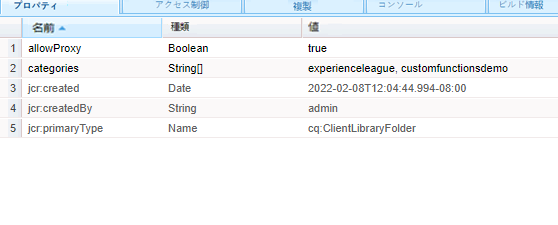

# カスタム関数

AEM Forms 6.5 では、ルールエディターを使用した複雑なビジネスルールの定義に使用できる JavaScript 関数を定義する機能が導入されました。
AEM Formsでは、すぐに使用できる多数のカスタム関数が用意されていますが、独自のカスタム関数を定義して複数のフォームで使用する必要があります。

最初のカスタム関数を定義するには、次の手順に従ってください。
* [crx にログインします。](http://localhost:4502/crx/de/index.jsp#/apps/experience-league/clientlibs)
* アプリの下に experience-league という名前の新しいフォルダーを作成します（このフォルダー名は任意の名前を指定できます）。
* 変更を保存します。
* experience-league フォルダーの下に、cq:ClientLibraryFolder タイプの新しいノードを clientlibs という名前で作成します。
* 新しく clientlibs フォルダーを作成し、スクリーンショットに示すように、allowProxy プロパティと categories プロパティを追加して、変更を保存します。


* **clientlibs** フォルダーの下に **js** というフォルダーを作成します。
* **functions.js** の下に **js** フォルダーという名前のファイルを作成します。
* **js.txt** の下に **clientlibs** フォルダーという名前のファイルを作成します。変更を保存します。
* フォルダー構造は、次のスクリーンショットのようになります。


* functions.js をダブルクリックして、エディターを開きます。
次のコードを functions.js にコピーし、変更を保存します。

```javascript
/**
* Get List of County names
* @name getCountyNamesList Get list of county names
* @returns {string[]} An array of county names
 */
function getCountyNamesList()
{
    return ["Santa Clara", "Alameda", "Buxor", "Contra Costa", "Merced"];

}
/**
* Covert UTC to Local Time
* @name convertUTC Convert UTC Time to Local Time
* @param {string} strUTCString in Stringformat
* @return {string}
*/
function convertUTC(strUTCString)
{
    var dt = new Date(strUTCString);
    console.log(dt.toLocaleString());
    return dt.toLocaleString();
}
```

JavaScript 関数の注釈について詳しくは、[jsdoc を参照](https://jsdoc.app/index.html)してください。
上記のコードには次の 2 つの関数があります。
**getCountyNamesList** - 文字列の配列を戻す
**convertUTC** - UTC タイムスタンプをローカルタイムゾーンに変換する

js.txt を開き、次のコードを貼り付けて、変更を保存します。

```javascript
#base=js
functions.js
```

&#x200B;#base=js の行は、JavaScript ファイルを配置するディレクトリを指定します。
次の行は、JavaScript ファイルの基本位置を基準にした相対位置を示します。

カスタム関数の作成に問題がある場合は、[このパッケージをダウンロードして AEM インスタンスにインストール](assets/custom-functions.zip)してください。

## カスタム関数の使用

次のビデオでは、アダプティブフォームのルールエディターでカスタム関数を使用する手順について説明します。
>[!VIDEO](https://video.tv.adobe.com/v/340305?quality=12&learn=on)
