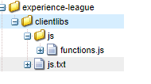

# カスタム関数

AEM Forms 6.5 では、ルールエディターを使用した複雑なビジネスルールの定義に使用できる JavaScript 関数を定義する機能が導入されました。
AEM Formsでは、すぐに使用できる多数のカスタム関数が用意されていますが、独自のカスタム関数を定義して複数のフォームで使用する必要があります。

最初のカスタム関数を定義するには、次の手順に従ってください。
* [crx にログインします。](http://localhost:4502/crx/de/index.jsp#/apps/experience-league/clientlibs)
* アプリの下に experience-league という名前の新しいフォルダーを作成します（このフォルダー名は任意の名前を指定できます）。
* 変更を保存します。
* experience-league フォルダーの下に、cq:ClientLibraryFolder タイプの新しいノードを clientlibs という名前で作成します。
* 新しく clientlibs フォルダーを作成し、スクリーンショットに示すように、 allowProxy プロパティと categories プロパティを追加して、変更を保存します。


* という名前のフォルダーを作成します。 **js** の下に **clientlibs** フォルダー
* という名前のファイルを作成します。 **functions.js** の下に **js** フォルダー
* という名前のファイルを作成します。 **js.txt** の下に **clientlibs** フォルダー。 変更を保存します。
* フォルダー構造は、以下のスクリーンショットのようになります。



* functions.js をダブルクリックして、エディターを開きます。
次のコードを functions.js にコピーし、変更を保存します。

```javascript
/**
* Get List of County names
* @name getCountyNamesList Get list of county names
* @return {OPTIONS} drop down options 
 */
function getCountyNamesList()
{
    var countyNames= [];
    countyNames[0] = "Santa Clara";
    countyNames[1] = "Alameda";
    countyNames[2] = "Buxor";
    countyNames[3] = "Contra Costa";
    countyNames[4] = "Merced";

    return countyNames;

}
/**
* Covert UTC to Local Time
* @name convertUTC Convert UTC Time to Local Time
* @param {string} strUTCString in Stringformat
* @return {string}
*/
function convertUTC(strUTCString)
{
    var dt = new Date(strUTCString);
    console.log(dt.toLocaleString());
    return dt.toLocaleString();
}
```

お願いします [jsdoc を参照 ](https://jsdoc.app/index.html)javascript 関数への注釈の追加について詳しくは、を参照してください。
上記のコードには次の 2 つの関数があります。
**getCountyNamesList**  — 文字列の配列を戻します
**convertUTC** - UTC タイムスタンプをローカルタイムゾーンに変換します

js.txt を開き、次のコードを貼り付けて、変更を保存します。

```javascript
#base=js
functions.js
```

#base=js の行は、JavaScript ファイルを配置するディレクトリを指定します。
以下の行は、JavaScript ファイルの基本位置を基準にした相対位置を示します。

カスタム関数の作成に問題がある場合は、 [このパッケージをダウンロードしてインストールする](assets/custom-functions.zip) をAEMインスタンス内で使用します。

## カスタム関数の使用

次のビデオでは、アダプティブフォームのルールエディターでカスタム関数を使用する手順について説明します
>[!VIDEO](https://video.tv.adobe.com/v/340305?quality=12&learn=on)
