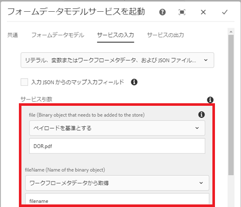

# フォームデータモデルを使用したバイナリデータのポスト{#using-form-data-model-to-post-binary-data}

AEM Forms6.4以降では、AEMワークフローのステップとしてForm Data Model Serviceを呼び出す機能が追加されました。 この記事では、Form Data Model Serviceを使用してレコードのドキュメントを投稿する場合の使用例の例を説明します。

使用例は次のとおりです。

1. ユーザーがアダプティブフォームに入力し、送信します。
1. アダプティブフォームは、レコードのドキュメントを生成するように設定されます。
1. このアダプティブフォームの送信時に、AEMワークフローがトリガーされ、 Workflowがトリガーされます。このワークフローは、「フォームデータモデルの呼び出し」サービスを使用して、レコードのドキュメントをAEM DAMにPOSTします。

「Form Data Model」タブ — プロパティ

「Service Input」タブで、次のマッピングを行います

* ペイロードに対するDOR.pdfプロパティを持つファイル（格納する必要があるバイナリオブジェクト）。 つまり、アダプティブフォームが送信されると、生成されたレコードのドキュメントが、ワークフローのペイロードに対するDOR.pdfというファイルに保存されます。**このDOR.pdfが、アダプティブフォームの送信プロパティを設定する際に指定したものと同じであることを確認してください。**

* fileName — バイナリオブジェクトをDAMに格納する際の名前です。 このプロパティを動的に生成し、各fileNameが送信ごとに一意になるようにします。 この目的で、ワークフローのプロセス手順を使用して、filenameというメタデータプロパティを作成し、その値をフォーム送信者のMember NameとAccount Numberの組み合わせに設定しました。 例えば、ユーザーのメンバー名がJohn Jacobsで、アカウント番号が9846の場合、ファイル名はJohn Jacobs_9846.pdfです。

Service Input

>[!NOTE]
>
>トラブルシューティングのヒント — 何らかの理由でDOR.pdfがDAMに作成されていない場合は、 [ここをクリックしてデータソース認証設定をリセットします](http://localhost:4502/mnt/overlay/fd/fdm/gui/components/admin/fdmcloudservice/properties.html?item=%2Fconf%2Fglobal%2Fsettings%2Fcloudconfigs%2Ffdm%2Fpostdortodam)。 これらはAEM認証の設定で、デフォルトはadmin/adminです。

ご使用のサーバーでこの機能をテストするには、次の手順に従ってください。

1. Developingwithserviceuserバンドルの[デプロイ](/help/forms/assets/common-osgi-bundles/DevelopingWithServiceUser.jar)

1. [setvalueバンドルをダウンロードしてデプロイします](/help/forms/assets/common-osgi-bundles/SetValueApp.core-1.0-SNAPSHOT.jar)。このカスタムOSGIバンドルは、メタデータプロパティを作成し、送信されたフォームデータから値を設定するために使用されます。

1. [パッケージマネージャーを使用して、この記事に関連付けられたアセット](assets/postdortodam.zip) 、AEMに読み込みます。次の情報が表示されます

   1. ワークフローモデル
   1. AEMワークフローに送信するように設定されたアダプティブフォーム
   1. PostToDam.JSONファイルを使用するように設定されたデータソース
   1. データソースを使用するフォームデータモデル

1. ブラウ [ザーを指してアダプティブフォームを開きます](http://localhost:4502/content/dam/formsanddocuments/helpx/timeoffrequestform/jcr:content?wcmmode=disabled)
1. フォームに入力し、送信します。
1. レコードのドキュメントが作成され、保存されている場合は、Assetsアプリケーションを確認します。

[データソースの作成に使用するSwaggerファイル](http://localhost:4502/conf/global/settings/cloudconfigs/fdm/postdortodam/jcr:content/swaggerFile) （英語のみ）を参照できます
