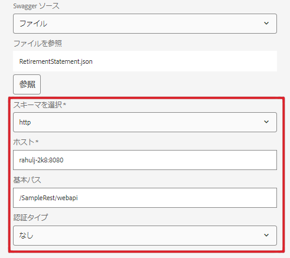

# データソース設定を変更する機能{#ability-to-modify-data-source-configuration-settings}

AEM Forms 6.4 リリースまでは、データソースをいったん設定すると、RESTful サービスのスキーム、ホスト、ベースパスを変更することができませんでした。 様々な環境に対してデータソースをテストする場合は、これが問題となりました。

AEM Forms 6.5 のリリースに伴い、上記のプロパティを簡単に変更できるようになりました。 この新しい機能を使用すると、開発環境と照らし合わせてフォームデータモデルを作成することができ、結果に満足したら、別の環境を指すようにプロパティを変更することができます。

以下のスクリーンショットは、AEM Forms 6.4 および 6.5 におけるデータソース設定を示しています。

**AEM 6.4 でのデータソース設定**

**AEM 6.5 以上で編集可能なデータソース設定**

