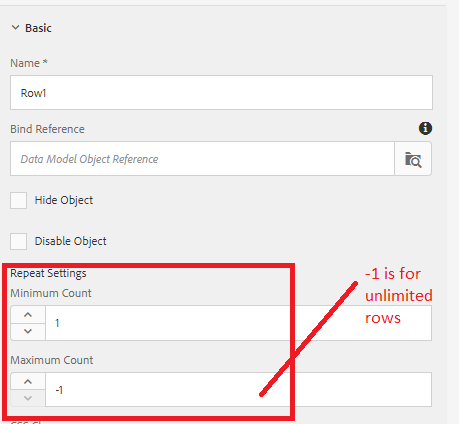

# フォームデータモデルサービスの呼び出しの結果をアダプティブフォームの表に入力する

[ライブフォームはここでホ](https://forms.enablementadobe.com/content/dam/formsanddocuments/amortization/jcr:content?wcmmode=disabled)
ストされています。この記事では、フォームデータモデルサービスの呼び出しからデータを取得してアダプティブフォームのテーブルに入力する方法について説明します。定期的な住宅ローンの支払いを時間の経過と共に記載した表に、償却スケジュールを作成します。 償却の結果は、フォームデータモデルから返されます。 フォームデータモデルのサービスは、スクリーンショットに示すように、「 click 」イベント「 calculate 」ボタンをクリックすると呼び出されます。 サービス呼び出しの入力パラメーターと出力パラメーターは、スクリーンショットに示すように適切にマッピングされます。 出力は、Row1の列にマッピングされます

Row1は、サービス呼び出しで返されるデータに応じて拡大するように設定されます。 ここで指定する繰り返し設定に注意してください。 値を —1に設定すると、テーブルの行数は無制限になります

## サーバーにデプロイします

[ここで指定したTomcatをイ](/help/forms/ic-print-channel-tutorial/set-up-tomcat.md)
[ンストールするSampleRest.warファイルをデプロイするAEMパッケージマネージャーを使用してアセットをインストールするフォームを開く適切な値を入力](https://forms.enablementadobe.com/content/DemoServerBundles/SampleRest.war)
 

し、「計算計画」をクリックしてフォームに入力します

