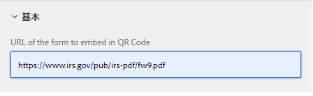

# サンプルの QR コードコンポーネント

アダプティブフォームに QR コードを埋め込むと、ユーザーがフォームに関連する追加情報にアクセスする際の利便性と効率を大幅に向上させることができます。

サンプルコンポーネントは [QRCode.js](https://davidshimjs.github.io/qrcodejs/) を利用します。

QRCode.js は QRCode を作成するための JavaScript ライブラリで、HTML5 Canvas と DOM の table タグによるクロスブラウザーをサポートします。

このコンポーネントは、コンポーネントの設定プロパティで指定された値に基づいて QR コードを生成します。


次のコードは、qr-code-generator コンポーネントの body.jsp で使用されていました。

「URL」は、QR コードに埋め込む必要がある URL です。この URL は、QR コードコンポーネントの設定プロパティで指定されます。

```java
<%@include file="/libs/foundation/global.jsp"%>
<body>
    <h2>Scan the QR Code for more information related to this form</h2>
    <div data-url="<%=properties.get("url")%>">
    </div>
    <div id="qrcode">
    </div>
</body>
```


次のコードは、qr-code-generator コンポーネントのクライアントライブラリで、QRCode.js ライブラリの makeCode メソッドを利用します。生成された QR コードは、id **&quot;qrcode&quot;** で識別される div に追加されます。

```javascript
$(document).ready(function()
  {
      var qrcode = new QRCode("qrcode");
      qrcode.makeCode(document.querySelector("[data-url]").getAttribute("data-url"));
      
 });
```

## ローカルサーバーへのアセットのデプロイ

* [パッケージマネージャーを使用して QR コードコンポーネントをダウンロードしてインストールします。](assets/qrcode.zip)
* [パッケージマネージャーを使用して、サンプルアダプティブフォームをダウンロードおよびインストールします。](assets/form-with-qr-code.zip)
* [フォームをプレビューします](http://localhost:4502/content/dam/formsanddocuments/qrcode/w9form/jcr:content?wcmmode=disabled)。フォームのヘルプセクションに QR コードがあります。
