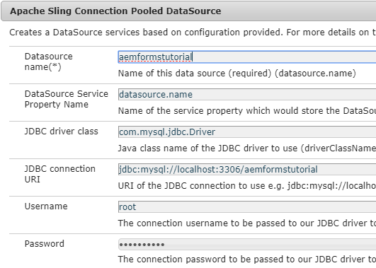

# アダプティブフォームデータの保存と取得

この記事では、アダプティブフォームデータを保存し、データベースから取得する手順について説明します。 MySQLデータベースは、アダプティブフォームのデータを保存するために使用されていました。 大まかに言えば、次の手順でこの使用例を実現します。

* [データソースの設定](#Configure-Data-Source)
* [データをデータベースに書き込むサーブレットの作成](#create-servlet)
* [OSGIサービスを作成して、保存されたデータを取得する](#create-osgi-service)
* [クライアントライブラリの作成](#create-client-library)
* [アダプティブフォームのテンプレートとページコンポーネントの作成](#form-template-and-page-component)
* [機能のデモ](#capability-demo)
* [サーバーにデプロイする](#deploy-on-your-server)

## データソース{#Configure-Data-Source}の設定

Apache Sling接続プールに入れられたデータソースは、アダプティブフォームデータの保存に使用されるデータベースを指すように設定されています。 次のスクリーンショットは、インスタンスの設定を示しています。 次のプロパティをコピーして貼り付けることができます

* Datasource Name:aemformstutorial — これは、私のコードで使用されている名前です。

* JDBCドライバークラス：com.mysql.jdbc.Driver

* JDBC接続URL:jdbc:mysql://localhost:3306/aemformstutorial



### サーブレット{#create-servlet}を作成

以下は、アダプティブフォームデータをデータベースに挿入/更新するサーブレットのコードです。 Apache Sling接続プールに入れられたデータソースはAEM ConfigMgrを使用して設定され、同じデータソースが26行目で参照されます。 残りのコードは、かなり簡単です。 コードは、データベースに新しい行を挿入するか、既存の行を更新します。 保存されたアダプティブフォームデータは、GUIDに関連付けられます。 次に、同じGUIDを使用してフォームデータが更新されます。

```java
package com.techmarketing.core.servlets;
import java.io.IOException;
import java.sql.Connection;
import java.sql.PreparedStatement;
import java.sql.SQLException;
import java.util.UUID;
import javax.servlet.Servlet;
import javax.sql.DataSource;
import org.apache.sling.api.SlingHttpServletRequest;
import org.apache.sling.api.SlingHttpServletResponse;
import org.apache.sling.api.servlets.SlingAllMethodsServlet;
import org.json.JSONException;
import org.json.JSONObject;
import org.osgi.service.component.annotations.Component;
import org.osgi.service.component.annotations.Reference;
import org.slf4j.Logger;
import org.slf4j.LoggerFactory;
 
@Component(service = { Servlet.class}, property = {"sling.servlet.methods=post","sling.servlet.paths=/bin/storeafdata"})
public class StoreDataInDB extends SlingAllMethodsServlet {
     private static final Logger log = LoggerFactory.getLogger(StoreDataInDB.class);
        private static final long serialVersionUID = 1L;
     @Reference(target = "(&(objectclass=javax.sql.DataSource)(datasource.name=aemformstutorial))")
        private DataSource dataSource;
    public String updateData(String afdata,String guid)
    {
         String updateTableSQL = "update aemformstutorial.formdata set afdata= ? where guid = ?";
         Connection c = getConnection();
            PreparedStatement pstmt = null;
            try {
      
                pstmt = null;
                pstmt = c.prepareStatement(updateTableSQL);
                pstmt.setString(1,afdata);
                pstmt.setString(2,guid);
                log.debug("Executing the insert statment  " + pstmt.executeUpdate());
                c.commit();
                 
      
            } catch (SQLException e) {
      
                log.error("Getting errors", e);
            } finally {
                if (pstmt != null) {
                    try {
                        pstmt.close();
                    } catch (SQLException e) {
                        // TODO Auto-generated catch block
                        e.printStackTrace();
                    }
                }
                if (c != null) {
                    try {
                        c.close();
                    } catch (SQLException e) {
                        // TODO Auto-generated catch block
                        e.printStackTrace();
                    }
                }
            }
            return guid;
     
         
    }
     public String insertData(String afdata) {
            log.debug("### Insert Data #### The json object I got to insert was " + afdata);
            String insertTableSQL = "INSERT INTO aemformstutorial.formdata(guid,afdata) VALUES(?,?)";
            UUID uuid = UUID.randomUUID();
            String randomUUIDString = uuid.toString();
            log.debug("The query is " + insertTableSQL);
            Connection c = getConnection();
            PreparedStatement pstmt = null;
            try {
      
                pstmt = null;
                pstmt = c.prepareStatement(insertTableSQL);
                pstmt.setString(1,randomUUIDString);
                pstmt.setString(2,afdata);
                log.debug("Executing the insert statment  " + pstmt.executeUpdate());
                c.commit();
                 
      
            } catch (SQLException e) {
      
                log.error("Getting errors", e);
            } finally {
                if (pstmt != null) {
                    try {
                        pstmt.close();
                    } catch (SQLException e) {
                        // TODO Auto-generated catch block
                        e.printStackTrace();
                    }
                }
                if (c != null) {
                    try {
                        c.close();
                    } catch (SQLException e) {
                        // TODO Auto-generated catch block
                        e.printStackTrace();
                    }
                }
            }
            return randomUUIDString;
        }
      
     public Connection getConnection() {
            log.debug("Getting Connection ");
            Connection con = null;
            try {
                con = dataSource.getConnection();
                log.debug("got connection");
                return con;
            } catch (Exception e) {
                log.error("not able to get connection ", e);
            }
            return null;
        }
    protected void doPost(SlingHttpServletRequest request,SlingHttpServletResponse response)
    {
        log.debug("Inside my save af data servlet");
        if(request.getParameter("operation").equalsIgnoreCase("update"))
        {
            log.debug("The operation is update");
            log.debug("The data I got was "+request.getParameter("formdata"));
            String guid = updateData(request.getParameter("formdata"),request.getParameter("guid"));
            log.debug("The guid I got was  "+guid);
            JSONObject jsonResponse = new JSONObject();
            try {
                jsonResponse.put("guid",guid);
                response.setContentType("application/json");
                response.setCharacterEncoding("UTF-8");
                response.getWriter().write(jsonResponse.toString());
            } catch (JSONException e) {
                // TODO Auto-generated catch block
                e.printStackTrace();
            } catch (IOException e) {
                // TODO Auto-generated catch block
                e.printStackTrace();
            }
        }
        if(request.getParameter("operation").equalsIgnoreCase("insert"))
        {
            log.debug("The data I got was +request.getParameter("formdata");
            String guid = insertData(request.getParameter("formdata"));
            log.debug("The guid on inserting data  "+guid);
            JSONObject jsonResponse = new JSONObject();
            try {
                jsonResponse.put("guid",guid);
                response.setContentType("application/json");
                response.setCharacterEncoding("UTF-8");
                response.getWriter().write(jsonResponse.toString());

} catch (JSONException e) {
                // TODO Auto-generated catch block
                e.printStackTrace();
            } catch (IOException e) {
                // TODO Auto-generated catch block
                e.printStackTrace();
            }
        }
 
}
```

## データを取得するOSGIサービスを作成する{#create-osgi-service}

次のコードは、保存されたアダプティブフォームデータを取得するために書き込まれています。 簡単なクエリを使用して、特定のGUIDに関連付けられたアダプティブフォームデータを取得します。 取得したデータは、呼び出し元のアプリケーションに返されます。 このコードで参照される最初の手順で作成されたのと同じデータソース。

```java
package com.techmarketing.core.impl;
import java.sql.Connection;
import java.sql.ResultSet;
import java.sql.SQLException;
import java.sql.Statement;
 
import javax.sql.DataSource;
 
import org.osgi.service.component.annotations.Component;
import org.osgi.service.component.annotations.Reference;
import org.slf4j.Logger;
import org.slf4j.LoggerFactory;
 
import com.techmarketing.core.AemFormsAndDB;
 
 
@Component(service=AemFormsAndDB.class,immediate = true)
public class AemformWithDB implements AemFormsAndDB {
    private final Logger log = LoggerFactory.getLogger(getClass());
     @Reference(target = "(&(objectclass=javax.sql.DataSource)(datasource.name=aemformstutorial))")
        private DataSource dataSource;
 
    @Override
    public String getData(String guid) {
        System.out.println("### inside my getData of AemformWithDB");
        Connection con = getConnection();
        try {
            Statement st = con.createStatement();
            String query = "SELECT afdata FROM aemformstutorial.formdata where guid = '"+guid+"'"+"";
            log.debug(" Got Result Set"+query);
            ResultSet rs = st.executeQuery(query);
            while(rs.next())
            {
                return rs.getString("afdata");
            }
        } catch (SQLException e) {
            // TODO Auto-generated catch block
            e.printStackTrace();
        }
 
        return null;
    }
     public Connection getConnection() {
            log.debug("Getting Connection ");
            Connection con = null;
            try {
                con = dataSource.getConnection();
                log.debug("got connection");
                return con;
            } catch (Exception e) {
                log.debug("not able to get connection ");
                e.printStackTrace();
            }
            return null;
        }
 
 
}
```

## クライアントライブラリの作成{#create-client-library}

AEMクライアントライブラリは、すべてのクライアント側JavaScriptコードを管理します。 この記事では、Guide Bridge APIを使用してアダプティブフォームのデータを取得する簡単なJavaScriptを作成しました。 アダプティブフォームのデータが取得されると、POSTの呼び出しがサーブレットに対しておこなわれ、アダプティブフォームのデータがデータベースに挿入または更新されます。 getALLUrlParams関数は、URL内のパラメーターを返します。 これは、データを更新する場合に使用します。 残りの機能は、 .savebuttonクラスのclickイベントに関連付けられたコードで処理されます。 URLにguidパラメーターが存在する場合、挿入操作でない場合は、更新操作を実行する必要があります。

```javascript
function getAllUrlParams(url) {
 
  // get query string from url (optional) or window
  var queryString = url ? url.split('?')[1] : window.location.search.slice(1);
 
  // we'll store the parameters here
  var obj = {};
 
  // if query string exists
  if (queryString) {
 
    // stuff after # is not part of query string, so get rid of it
    queryString = queryString.split('#')[0];
 
    // split our query string into its component parts
    var arr = queryString.split('&');
 
    for (var i = 0; i < arr.length; i++) {
      // separate the keys and the values
      var a = arr[i].split('=');
 
      // set parameter name and value (use 'true' if empty)
      var paramName = a[0];
      var paramValue = typeof (a[1]) === 'undefined' ? true : a[1];
 
      // (optional) keep case consistent
      paramName = paramName.toLowerCase();
      if (typeof paramValue === 'string') paramValue = paramValue.toLowerCase();
 
      // if the paramName ends with square brackets, e.g. colors[] or colors[2]
      if (paramName.match(/\[(\d+)?\]$/)) {
 
        // create key if it doesn't exist
        var key = paramName.replace(/\[(\d+)?\]/, '');
        if (!obj[key]) obj[key] = [];
 
        // if it's an indexed array e.g. colors[2]
        if (paramName.match(/\[\d+\]$/)) {
          // get the index value and add the entry at the appropriate position
          var index = /\[(\d+)\]/.exec(paramName)[1];
          obj[key][index] = paramValue;
        } else {
          // otherwise add the value to the end of the array
          obj[key].push(paramValue);
        }
      } else {
        // we're dealing with a string
        if (!obj[paramName]) {
          // if it doesn't exist, create property
          obj[paramName] = paramValue;
        } else if (obj[paramName] && typeof obj[paramName] === 'string'){
          // if property does exist and it's a string, convert it to an array
          obj[paramName] = [obj[paramName]];
          obj[paramName].push(paramValue);
        } else {
          // otherwise add the property
          obj[paramName].push(paramValue);
        }
      }
    }
  }
 
  return obj;
}
 
$(document).ready(function()
   {
        var linktext = guideBridge.resolveNode("guide[0].guide1[0].guideRootPanel[0].info[0].linktxt[0]");
        var linktext1 = guideBridge.resolveNode("guide[0].guide1[0].guideRootPanel[0].info[0].linktext1[0]");
       linktext.visible = false;
       linktext1.visible = false;
        $(".savebutton").click(function(){
           var params = getAllUrlParams(window.location.href);
           console.log(getAllUrlParams(window.location.href));
            window.guideBridge.getDataXML({
                 success:function(guideResultObject) 
                 {
                     console.log("The data is "+guideResultObject.data);
                     let xhr = new XMLHttpRequest();
                      xhr.open('POST','/bin/storeafdata');
                     let formData = new FormData();
                     if(typeof(params.guid)!="undefined")
                     {
                         formData.append("operation","update");
                         formData.append("guid",params.guid);
 
                     }
                     if(typeof(params.guid)=="undefined")
                     {
                         formData.append("operation","insert");
 
 
                     }
 
 
                formData.append("formdata",guideResultObject.data);
                xhr.send(formData);
                     xhr.onload = function(e)
                {
                    console.log("The data is ready");
                    if (this.status == 200)
                        {
                            var jsonResponse = JSON.parse(this.response);
                            console.log(jsonResponse.guid);
                            var linktext = guideBridge.resolveNode("guide[0].guide1[0].guideRootPanel[0].info[0].linktxt[0]");
                            var linktext1 = guideBridge.resolveNode("guide[0].guide1[0].guideRootPanel[0].info[0].linktext1[0]");
                            linktext1.visible = true;
                            linktext.value = "http://localhost:4502/content/dam/formsanddocuments/saveformdata/jcr:content?wcmmode=disabled&guid="+jsonResponse.guid;
                            linktext.visible = true;
                            guideBridge.setFocus("guide[0].guide1[0].guideRootPanel[0].info[0].linktxt[0]");
                        }
 
                }
                  }
             });
 
 
       });
 
 
});
```

## アダプティブフォームのテンプレートとページコンポーネントの作成{#form-template-and-page-component}


>[!VIDEO](https://video.tv.adobe.com/v/27828?quality=9&learn=on)

### 機能のデモ{#capability-demo}

>[!VIDEO](https://video.tv.adobe.com/v/27829?quality=9&learn=on)

#### サーバー{#deploy-on-your-server}にデプロイします。

AEM Formsインスタンスでこの機能をテストするには、次の手順に従います

* [DemoAssets.zipをローカルシステムにダウンロードして解凍します。](assets/demoassets.zip)
* Felix Webコンソールを使用して、techmarketingdemos.jarおよびmysqldriver.jarバンドルをデプロイして起動します。
*** MYSQL Workbenchを使用してaemformstutorial.sqlを読み込みます。 これにより、必要なスキーマとテーブルがデータベースに作成されます
* AEMパッケージマネージャーを使用してStoreAndRetrieve.zipを読み込みます。 このパッケージには、アダプティブフォームテンプレート、ページコンポーネントクライアントライブラリ、サンプルのアダプティブフォームおよびデータソース設定が含まれています。
* configMgrにログインします。 「Apache Sling Connection Pooled DataSource」を検索します。 aemformstutorialに関連付けられたデータソースエントリを開き、データベースインスタンスに固有のユーザー名とパスワードを入力します。
* アダプティブフォームを開く
* 詳細を入力し、「保存して後で続行」ボタンをクリックします。
* GUIDが含まれるURLを返す必要があります。
* URLをコピーして、新しいブラウザータブに貼り付けます。
* アダプティブフォームには、前の手順で作成したデータが入力されます**
