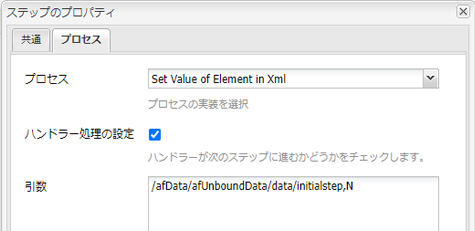

# AEM Formsワークフローでのsetvalueの使用

AEM Forms OSGIワークフローで、アダプティブFormsのXML要素の値を送信したデータ。

LiveCycleには、XML要素の値を設定できる設定値コンポーネントがあります。

この値に基づいて、フォームにXMLが入力された場合に、フォームの特定のフィールドやパネルを非表示/無効にできます。

AEM Forms OSGi - XMLで値を設定するためにカスタムOSGiバンドルを作成する必要があります。 バンドルは、このチュートリアルの一部として提供されます。
AEMワークフローでプロセスステップを使用します。 このプロセスステップに、「Set Value of Element in XML」OSGiバンドルを関連付けます。
設定値バンドルに2つの引数を渡す必要があります。 最初の引数は、値を設定する必要があるXML要素のXPathです。 2番目の引数は、設定する必要がある値です。
例えば、上のスクリーンショットでは、intialstep要素の値を「N」に設定しています。
この値に基づいて、アダプティブFormsの特定のパネルが非表示または表示されます。
この例では、単純なオフリクエストフォームを使用します。 このフォームの開始者は、自分の名前と休日を入力します。 このフォームは送信時に「管理者」に送信され、レビューが求められます。 管理者がフォームを開くと、最初のパネルのフィールドは無効になります。 これは、XMLの最初のstep要素の値を「N」に設定したからです。

最初のステップフィールドの値に基づいて、「管理者」がリクエストを承認または却下できる2番目のパネルを表示します

ルールエディターを使用して、「Time Off Requested by」フィールドに対して設定されたルールを確認してください。

ローカルシステムにアセットをデプロイするには、次の手順に従います。

* [Developingwithserviceuserバンドルをデプロイします。](/help/forms/assets/common-osgi-bundles/DevelopingWithServiceUser.jar)

* [サンプルバンドルをデプロイします](/help/forms/assets/common-osgi-bundles/SetValueApp.core-1.0-SNAPSHOT.jar)。これは、送信されたxmlデータ内の要素の値を設定できるカスタムOSGIバンドルです

* [zipファイルの内容をダウンロードして抽出します。](assets/setvalueassets.zip)
* ブラウザーで[パッケージマネージャー](http://localhost:4502/crx/packmgr/index.jsp)を参照します。
* setValueWorkflow.zipを読み込んでインストールします。 これは、サンプルのワークフローモデルを持ちます。
* ブラウザーで[Formsとドキュメント](http://localhost:4502/aem/forms.html/content/dam/formsanddocuments)を参照します。
* 「作成」をクリックします。 |ファイルのアップロード
* TimeOfRequestForm.zipをアップロードします。
* [TimeOffRequestform](http://localhost:4502/content/dam/formsanddocuments/timeoffapplication/jcr:content?wcmmode=disabled)を開きます。
* 3つの必須フィールドに入力し、
* AEMに「管理者」としてログインします（まだログインしていない場合）。
* [&quot;AEM Inbox&quot;](http://localhost:4502/aem/inbox)に移動します。
* 「レビュータイムオフリクエスト」フォームを開きます。
* 最初のパネルのフィールドは無効になっています。 これは、レビュー担当者がフォームを開いているためです。 また、要求の承認または却下のパネルが表示されます

>[!NOTE]
>
>ロガーを有効にして、デバッグのログを有効にすることができます。
>com.aemforms.setvalue.core.SetValueinXml
>ブラウザーでhttp://localhost:4502/system/console/slinglogを参照して、

>[!NOTE]
>
>アダプティブフォームの送信オプションのデータファイルのパスが「Data.xml」に設定されていることを確認します。 これは、処理手順がペイロードフォルダーの下でData.xmlというファイルを探すためです
