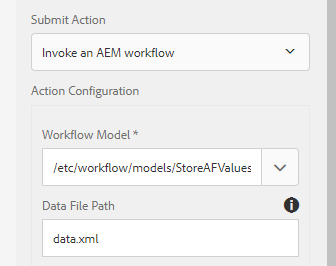

# アダプティブフォーム送信のデータベースへの保存

送信されたフォームデータを任意のデータベースに格納する方法はいくつかあります。 JDBCデータソースを使用して、データを直接データベースに格納できます。 カスタムOSGIバンドルを書き込んで、データをデータベースに格納できます。 この記事では、AEMワークフローのカスタムプロセスステップを使用してデータを保存します。
使用例は、アダプティブフォームの送信時にAEMワークフローをトリガーし、ワークフローの手順で送信されたデータをデータベースに保存する場合です。

**ご使用のシステムで動作させるには、次の手順に従ってください**

* [Zipファイルをダウンロードし、その内容をハードドライブに展開します](assets/storeafdataindb.zip)

   * パッケージマネージャーを使用して、StoreAFInDBWorkflow.zipをAEMに読み込みます。 パッケージには、AFデータをDBに格納するサンプルワークフローが含まれています。 ワークフローモデルを開きます。 ワークフローには1つのステップしかありません。 この手順では、バンドルに書き込まれたコードを呼び出し、AFデータをデータベースに格納します。 私はそのプロセスに1つの引数を渡す。 データを保存するアダプティブフォームの名前です。
   * Felix Webコンソールを使用して、insertdata.core-0.0.1-SNAPSHOT.jarをデプロイします。 このバンドルには、送信されたフォームデータをデータベースに書き込むためのコードが含まれています

* [ConfigMgr](http://localhost:4502/system/console/configMgr)に移動

   * 「JDBC Connection Pool」を検索します。 新しいDay Commons JDBC Connection Poolを作成します。 データベースに固有の設定を指定します。

   * 
   * 「**Insert Form Data Into DB**」を検索します。
   * データベースに固有のプロパティを指定します。
      * DataSourceName：前に設定したデータソースの名前。
      * TableName - AFデータを格納するテーブルの名前
      * FormName — フォーム名を保持する列名
      * ColumnName - AFデータを保持する列名

   

* アダプティブフォームの作成を参照してください。

* 以下のスクリーンショットに示すように、アダプティブフォームをAEM Workflow(StoreAFValusinDB)に関連付けます。

* 以下のスクリーンショットに示すように、データファイルのパスに「data.xml」を必ず指定してください。

   

* フォームのプレビューと送信

* すべてうまくいけば、指定したテーブルと列にフォームデータが保存されていることを確認できます

