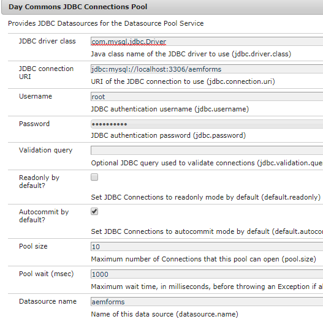

# アダプティブフォーム送信のデータベースへの格納

送信されたフォームデータを、選択したデータベースに格納する方法は多数あります。 JDBCデータソースを使用して、データをデータベースに直接格納できます。 カスタムOSGIバンドルを書き込んで、データをデータベースに保存できます。 この記事では、AEMワークフローのカスタムプロセスステップを使用して、データを保存します。
使用例では、アダプティブフォームの送信時にAEMワークフローをトリガーし、ワークフローの手順で送信されたデータをデータベースに保存します。

**以下の手順に従って、システムで動作させてください**

* [Zipファイルをダウンロードし、その内容をハードドライブに抽出します。](assets/storeafdataindb.zip)

   * パッケージマネージャーを使用して、 StoreAFInDBWorkflow.zipをAEMに読み込みます。 パッケージには、AFデータをDBに格納するサンプルワークフローが含まれています。 ワークフローモデルを開きます。 ワークフローには1つの手順しかありません。 この手順は、バンドルに記述されたコードを呼び出し、AFデータをデータベースに保存します。 私はその過程に一つの議論を引き継いでいる。 これは、データが保存されるアダプティブフォームの名前です。
   * Felix Webコンソールを使用して、insertdata.core-0.0.1-SNAPSHOT.jarをデプロイします。 このバンドルには、送信されたフォームデータをデータベースに書き込むためのコードが含まれます

* [ConfigMgr](http://localhost:4502/system/console/configMgr)に移動します。

   * 「JDBC Connection Pool」を検索します。 新しいDay Commons JDBC接続プールを作成します。 データベースに固有の設定を指定します。

   * 
   * 「**Insert Form Data Into DB**」を検索します。
   * データベースに固有のプロパティを指定します。
      * DataSourceName:Nameは、以前設定したデータソースの名前です。
      * TableName - AFデータを格納するテーブルの名前
      * FormName — フォームの名前を格納する列の名前
      * ColumnName - AFデータを保持する列名

   

* アダプティブフォームの作成.

* 以下のスクリーンショットに示すように、アダプティブフォームをAEM Workflow(StoreAFValuesinDB)に関連付けます。

* 次のスクリーンショットに示すように、データファイルパスに「data.xml」を必ず指定してください

   

* フォームをプレビューして送信する

* すべて正常に動作している場合は、フォームデータが、指定したテーブルと列に格納されているのが確認できます

