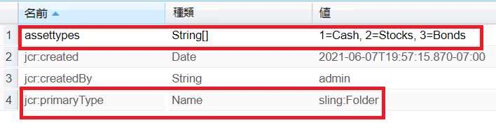

# AEM Forms の項目読み込みプロパティ

項目読み込みパスのプロパティを使用して、ドロップダウンリストの設定と入力を行います。
「項目読み込みパス」フィールドを使用すると、作成者はドロップダウンリストで使用可能なオプションを読み込む URL を指定できます。
crx でこのようなノードを作成するには、次の手順に従います。
* crx にログインします
* 「アセット」というノードを作成し（要件に応じてこのノードに名前を付けることができます）、「コンテンツ」に sling:folder と入力します。
* 保存
* 新しく作成したアセットノードをクリックし、次に示すようにプロパティを設定します。
* assettypes という文字列型のプロパティを作成します（必要に応じて名前を付けることができます）。プロパティが複数値であることを確認します。必要な値を指定して保存します。
  

これらの値をドロップダウンリストに読み込むには、項目読み込みパスのプロパティに **/content/assets/assettypes** というパスを指定します。

サンプルパッケージは、[こちらからダウンロード](assets/item-load-path-package.zip)できます。
