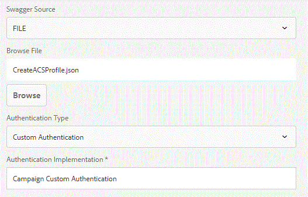

# フォームデータモデルを使用したキャンペーンプロファイルの作成{#create-campaign-profile-using-form-data-model}

AEM Formsフォームデータモデルを使用したAdobe Campaign Standardプロファイルの作成手順

## カスタム認証の作成{#create-custom-authentication}

Swaggerファイルを使用してデータソースを作成する場合、AEM Formsでは次の種類の認証をサポートしています

* なし
* OAuth 2.0
* 基本認証
* API キー
* カスタム認証



Adobe Campaign StandardにREST呼び出しを行うには、カスタム認証を使用する必要があります。

カスタム認証を使用するには、IAuthenticationインターフェイスを実装するOSGiコンポーネントを開発する必要があります

メソッドgetAuthDetailsを実装する必要があります。 このメソッドは、AuthenticationDetailsオブジェクトを返します。 このAuthenticationDetailsオブジェクトには、REST API呼び出しをAdobe Campaignに行うために必要なHTTPヘッダーが必要になります。

次に、カスタム認証の作成に使用したコードを示します。 getAuthDetailsメソッドは、すべての処理を実行します。 AuthenticationDetailsオブジェクトを作成します。 次に、このオブジェクトに適切なHttpHeadersを追加し、このオブジェクトを返します。

```java
package aemfd.campaign.core;

import java.io.IOException;
import java.security.NoSuchAlgorithmException;
import java.security.spec.InvalidKeySpecException;

import org.osgi.service.component.annotations.Component;
import org.osgi.service.component.annotations.Reference;
import org.slf4j.Logger;
import org.slf4j.LoggerFactory;

import com.adobe.aemfd.dermis.authentication.api.IAuthentication;
import com.adobe.aemfd.dermis.authentication.exception.AuthenticationException;
import com.adobe.aemfd.dermis.authentication.model.AuthenticationDetails;
import com.adobe.aemfd.dermis.authentication.model.Configuration;

import aemforms.campaign.core.CampaignService;
import formsandcampaign.demo.CampaignConfigurationService;
@Component(service=IAuthentication.class,immediate=true)

public class CampaignAuthentication implements IAuthentication {
 @Reference
 CampaignService campaignService;
  @Reference
     CampaignConfigurationService config;
private Logger log = LoggerFactory.getLogger(CampaignAuthentication.class);
 @Override
 public AuthenticationDetails getAuthDetails(Configuration arg0) throws AuthenticationException {
 try {
   AuthenticationDetails auth = new AuthenticationDetails();
   auth.addHttpHeader("Cache-Control", "no-cache");
   auth.addHttpHeader("Content-Type", "application/json");
   auth.addHttpHeader("X-Api-Key",config.getApiKey() );
         auth.addHttpHeader("Authorization", "Bearer "+campaignService.getAccessToken());
         log.debug("Returning auth");
         return auth;
   
  } catch (NoSuchAlgorithmException e) {
   // TODO Auto-generated catch block
   e.printStackTrace();
  } catch (InvalidKeySpecException e) {
   // TODO Auto-generated catch block
   e.printStackTrace();
  } catch (IOException e) {
   // TODO Auto-generated catch block
   e.printStackTrace();
  }
  return null;
  
 }

 @Override
 public String getAuthenticationType() {
  // TODO Auto-generated method stub
  return "Campaign Custom Authentication";
 }

}
```

## データソースの作成{#create-data-source}

最初の手順は、Swaggerファイルを作成することです。 Swaggerファイルは、Adobe Campaign Standardでのプロファイルの作成に使用されるREST APIを定義します。 Swaggerファイルは、REST APIの入力パラメーターと出力パラメーターを定義します。

Swaggerファイルを使用してデータソースが作成されます。 データソースを作成する場合は、認証の種類を指定できます。 この場合、Adobe Campaignに対する認証にカスタム認証を使用します。上記のコードは、Adobe Campaignに対する認証に使用されました。

この記事に関連するアセットの一部として、サンプルのSwaggerファイルが提供されます。**Swaggerファイル内のhostとbasePathを、ACSインスタンスと一致するように変更してください**

## ソリューション{#test-the-solution}をテストします。

ソリューションをテストするには、次の手順に従います。
* [ここで説明する手順に従っていることを確認します](aem-forms-with-campaign-standard-getting-started-tutorial.md)
* [このファイルをダウンロードして解凍し、Swaggerファイルを取得します](assets/create-acs-profile-swagger-file.zip)
* Swaggerファイルを使用したデータソースの作成
フォームデータモデルを作成し、前の手順で作成したデータソースを基にします。
* 前の手順で作成したフォームデータモデルに基づいてアダプティブフォームを作成します。
* 次の要素をデータソースタブからアダプティブフォームにドラッグ&amp;ドロップします

   * 電子メール
   * firstName
   * 姓
   * 携帯電話

* 送信アクションが「Submit using Form Data Model」に設定されるようにします。
* 適切に送信するようにデータモデルを設定します。
* フォームをプレビューする. フィールドに入力し、送信します。
* プロファイルがAdobe Campaign Standardに作成されていることを確認します。
