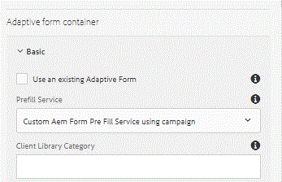

# ACSプロファイル{#prefilling-adaptive-form-using-acs-profile}を使用したアダプティブフォームの事前入力

ここでは、ACSから取得したプロファイル情報を使用して、アダプティブフォームに事前入力します。 AEM Formsには、アダプティブフォームの事前入力に使用できる強力な機能があります。

アダプティブフォームの事前入力の詳細については、この[チュートリアル](https://helpx.adobe.com/experience-manager/kt/forms/using/prefill-service-adaptive-forms-article-use.html)を参照してください。

ACSからデータを取得してアダプティブフォームを事前入力するには、ACSにログインしたAEMユーザーと同じ電子メールを持つプロファイルがあると仮定します。 例えば、AEMにログインしたユーザーの電子メールIDがcsimms@adobe.comの場合、ACSで電子メールがcsimms@adobe.comのプロファイルを検索することを想定します。

REST APIを使用してACSからプロファイル情報を取得するには、次の手順が必要です

* JWTを生成
* アクセストークン用のExchange JWT
* ACSに対するREST呼び出しと電子メールによるプロファイル取得
* プロファイル情報を使用してXMLドキュメントを作成する
* AEM Formsが使用するXMLドキュメントのInputStreamを返す



事前入力サービスとアダプティブフォームの関連付け

以下は、ACSからプロファイル情報を取得して返すコードです。

68行目で、AEMユーザーのEメールIDを取得します。 Adobe Campaign Standardに対してREST呼び出しをおこなうことで、プロファイルの詳細が取得されます。 取得されたプロファイルの詳細から、XMLドキュメントはAEM Formsが理解できる方法で構築されます。 このドキュメントの入力ストリームは、AEM Formsでの使用のために返されます。

```java
package aemforms.campaign.core;

import java.io.ByteArrayInputStream;
import java.io.ByteArrayOutputStream;
import java.io.IOException;
import java.io.InputStream;

import javax.jcr.Session;
import javax.xml.parsers.DocumentBuilder;
import javax.xml.parsers.DocumentBuilderFactory;
import javax.xml.parsers.ParserConfigurationException;
import javax.xml.transform.TransformerConfigurationException;
import javax.xml.transform.TransformerException;
import javax.xml.transform.TransformerFactory;
import javax.xml.transform.TransformerFactoryConfigurationError;
import javax.xml.transform.dom.DOMSource;
import javax.xml.transform.stream.StreamResult;

import org.apache.http.HttpHost;
import org.apache.http.HttpResponse;
import org.apache.http.client.ClientProtocolException;
import org.apache.http.client.HttpClient;
import org.apache.http.client.methods.HttpGet;
import org.apache.http.impl.client.HttpClientBuilder;
import org.apache.http.util.EntityUtils;
import org.apache.jackrabbit.api.JackrabbitSession;
import org.apache.jackrabbit.api.security.user.Authorizable;
import org.apache.jackrabbit.api.security.user.UserManager;
import org.apache.sling.api.resource.Resource;
import org.apache.sling.api.resource.ResourceResolver;
import org.osgi.service.component.annotations.Component;
import org.osgi.service.component.annotations.Reference;
import org.slf4j.Logger;
import org.slf4j.LoggerFactory;
import org.w3c.dom.Document;
import org.w3c.dom.Element;

import com.adobe.forms.common.service.DataXMLOptions;
import com.adobe.forms.common.service.DataXMLProvider;
import com.adobe.forms.common.service.FormsException;
import com.google.gson.JsonObject;
import com.google.gson.JsonParser;

import formsandcampaign.demo.CampaignConfigurationService;

@Component
public class PrefillAdaptiveFormWithCampaignProfile implements DataXMLProvider {
private static final Logger log = LoggerFactory.getLogger(PrefillAdaptiveFormWithCampaignProfile.class);
private static final String SERVER_FQDN = "mc.adobe.io";
private static final String ENDPOINT = "/campaign/profileAndServices/profile/byEmail?email=";
@Reference
CampaignService jwtService;
@Reference
CampaignConfigurationService campaignConfig;

Session session = null;

public JsonObject getProfileDetails()
 {
    String jwtToken = null;
    String email = null;
    log.debug("$$$$ in getProfile Details");
    try
       {
          jwtToken = jwtService.getAccessToken();
          UserManager um = ((JackrabbitSession) session).getUserManager();
          Authorizable loggedinUser = um.getAuthorizable(session.getUserID());
          email = loggedinUser.getProperty("profile/email")[0].getString();
          log.debug("####Got email..." + email);
        }
        catch (Exception e)
        {
          log.error("Unable to generate JWT!\n", e);
        }
    String tenant = campaignConfig.getTenant();
    String apikey = campaignConfig.getApiKey();
    String path = "/" + tenant + ENDPOINT + email;
    HttpHost server = new HttpHost(SERVER_FQDN, 443, "https");
    HttpGet getReq = new HttpGet(path);
    getReq.addHeader("Cache-Control", "no-cache");
    getReq.addHeader("Content-Type", "application/json");
    getReq.addHeader("X-Api-Key", apikey);
    getReq.addHeader("Authorization", "Bearer " + jwtToken);
    HttpClient httpClient = HttpClientBuilder.create().build();
    try
       {
          HttpResponse result = httpClient.execute(server, getReq);
          String responseJson = EntityUtils.toString(result.getEntity());
          log.debug("The response Json" + responseJson);
          JsonObject responseJsonProfiles = new JsonParser().parse(responseJson).getAsJsonObject();
          log.debug("The json array is " + responseJsonProfiles.toString());
          return responseJsonProfiles.get("content").getAsJsonArray().get(0).getAsJsonObject();
        }
        catch (ClientProtocolException e)
       {
            e.printStackTrace();
        } catch (IOException e) {

      e.printStackTrace();
}
    return null;

}

public InputStream getDataXMLForDataRef(DataXMLOptions dataXmlOptions) throws FormsException {
// TODO Auto-generated method stub
    log.debug("Geting xml");
    InputStream xmlDataStream = null;
    Resource aemFormContainer = dataXmlOptions.getFormResource();
    ResourceResolver resolver = aemFormContainer.getResourceResolver();
    session = resolver.adaptTo(Session.class);
    JsonObject profile = getProfileDetails();
    log.debug("####profile last name ####" + profile.get("lastName").getAsString());
    try {
          DocumentBuilderFactory docFactory = DocumentBuilderFactory.newInstance();
          DocumentBuilder docBuilder = docFactory.newDocumentBuilder();
          Document doc = docBuilder.newDocument();
          Element rootElement = doc.createElement("data");
          doc.appendChild(rootElement);
          Element firstNameElement = doc.createElement("fname");
          firstNameElement.setTextContent(profile.get("firstName").getAsString());
          log.debug("created firstNameElement  " + profile.get("firstName").getAsString());
          Element lastNameElement = doc.createElement("lname");
          Element jobTitleElement = doc.createElement("jobTitle");
          jobTitleElement.setTextContent(profile.get("salutation").getAsString());
          Element cityElement = doc.createElement("city");
          cityElement.setTextContent(profile.get("location").getAsJsonObject().get("city").getAsString());
          log.debug("created cityElement  " + profile.get("location").getAsJsonObject().get("city").getAsString());
          Element countryElement = doc.createElement("country");
          countryElement.setTextContent(profile.get("location").getAsJsonObject().get("countryCode").getAsString());
          Element streetElement = doc.createElement("street");
          streetElement.setTextContent(profile.get("location").getAsJsonObject().get("address1").getAsString());
          Element postalCodeElement = doc.createElement("postalCode");
          postalCodeElement.setTextContent(profile.get("location").getAsJsonObject().get("zipCode").getAsString());
          Element genderElement = doc.createElement("gender");
          genderElement.setTextContent(profile.get("gender").getAsString());
          lastNameElement.setTextContent(profile.get("lastName").getAsString());
          Element emailElement = doc.createElement("email");
          emailElement.setTextContent(profile.get("email").getAsString());
          rootElement.appendChild(firstNameElement);
          rootElement.appendChild(lastNameElement);
          rootElement.appendChild(emailElement);
          rootElement.appendChild(streetElement);
          rootElement.appendChild(countryElement);
          rootElement.appendChild(cityElement);
          rootElement.appendChild(jobTitleElement);
          rootElement.appendChild(postalCodeElement);
          rootElement.appendChild(genderElement);
          ByteArrayOutputStream outputStream = new ByteArrayOutputStream();
          DOMSource source = new DOMSource(doc);
          StreamResult outputTarget = new StreamResult(outputStream);
          TransformerFactory.newInstance().newTransformer().transform(source, outputTarget);
          xmlDataStream = new ByteArrayInputStream(outputStream.toByteArray());
          return xmlDataStream;

}
    catch (ParserConfigurationException e)
    {
          e.printStackTrace();
    }catch (TransformerConfigurationException e)
    {
        e.printStackTrace();
    } 
    catch (TransformerException e)
   {
        e.printStackTrace();
  } catch (TransformerFactoryConfigurationError e) {
// TODO Auto-generated catch block
e.printStackTrace();
}

return null;
}

@Override
public String getServiceDescription() {

return "Custom Aem Form Pre Fill Service using campaign";
}

@Override
public String getServiceName() {
// TODO Auto-generated method stub
return "Pre Fill Forms Using Campaign Profile";
}

}
```

これをシステムで動作させるには、次の手順に従ってください。

* [ここで説明する手順に従っていることを確認します。](aem-forms-with-campaign-standard-getting-started-tutorial.md)
* [パッケージマネージャーを使用したサンプルのアダプティブフォームのAEMへの読み込み](assets/pre-fill-af-from-campaign.zip)
* 電子メールIDがAdobe Campaignのプロファイルによって共有されているユーザーを使用してAEMにログインしてください。 例えば、AEMユーザーの電子メールIDがjohndoe@adobe.comの場合、ACSに電子メールがjohndoe@adobe.comのプロファイルが必要です。
* [フォームをプレビューする](http://localhost:4502/content/dam/formsanddocuments/prefillfromcampaign/jcr:content?wcmmode=disabled).

