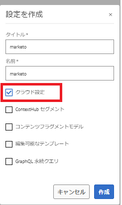
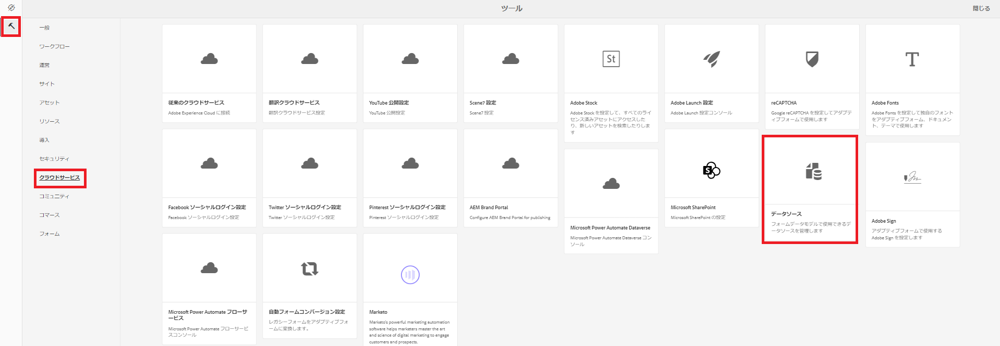
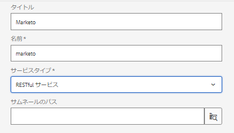

# データソースの作成

Marketo の REST API は 2-Legged OAuth 2.0 で認証されます。前の手順でダウンロードした Swagger ファイルを使用して、データソースを簡単に作成できます。

## 設定コンテナを作成

* AEM へログインします。
* 次に示すように、ツールメニューをクリックし、**設定ブラウザー**&#x200B;をクリックします。

* 

* 「**作成**」をクリックし、次に示すように、意味のある名前をつけます。以下に示すように、必ず「クラウド設定」オプションを選択してください。

* 

## クラウドサービスの作成

* ツールメニューに移動し、クラウドサービス／データソースをクリックします。

* 

* 前の手順で作成した設定コンテナを選択し、「**作成**」をクリックして新しいデータソースを作成します。意味のある名前を入力し、サービスタイプドロップダウンリストから RESTful サービスを選択して、「**次へ**」をクリックします。
* 

* Swagger ファイルをアップロードし、以下のスクリーンショットに示すように、Marketo インスタンスに固有の付与タイプ、クライアント ID、クライアント秘密鍵、アクセストークン URL を指定します。

* 接続をテストし、接続が成功した場合は、青色の「**作成**」ボタンをクリックして、データソースの作成プロセスを完了します。

* 

## 次の手順

[フォームデータモデルの作成](./part3.md)
