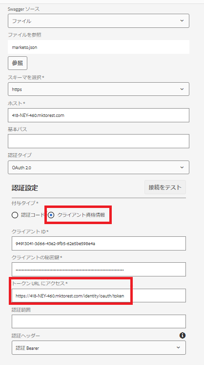

# データソースの作成

Marketoの REST API は、2-legged OAuth 2.0 で認証されます。前の手順でダウンロードした Swagger ファイルを使用して、データソースを簡単に作成できます

## 設定コンテナの作成

* AEMにログインします。
* 次に示すように、「ツール」メニューをクリックし、**設定ブラウザー** をクリックします

* 

* 「**作成**」をクリックし、次に示すように、意味のある名前を指定します。 必ず「クラウド設定」オプションを選択してください（下図を参照）

* 

## クラウドサービスの作成

* ツール メニューに移動し、クラウドサービス / データソースをクリックします。

* 

* 前の手順で作成した設定コンテナを選択し、「**作成**」をクリックして新しいデータソースを作成します。意味のある名前を指定し、「サービスタイプ」ドロップダウンリストから「RESTful サービス」を選択して、「次へ **をクリックし** す。
* 

* Swagger ファイルをアップロードし、以下のスクリーンショットに示すように、Marketo インスタンスに固有の付与タイプ、クライアント ID、クライアントシークレット、アクセストークン URL を指定します。

* 接続をテストし、接続が成功したら、青い **作成** ボタンをクリックして、データソースの作成プロセスを完了します。

* 

## 次の手順

[フォームデータモデルの作成](./part3.md)
