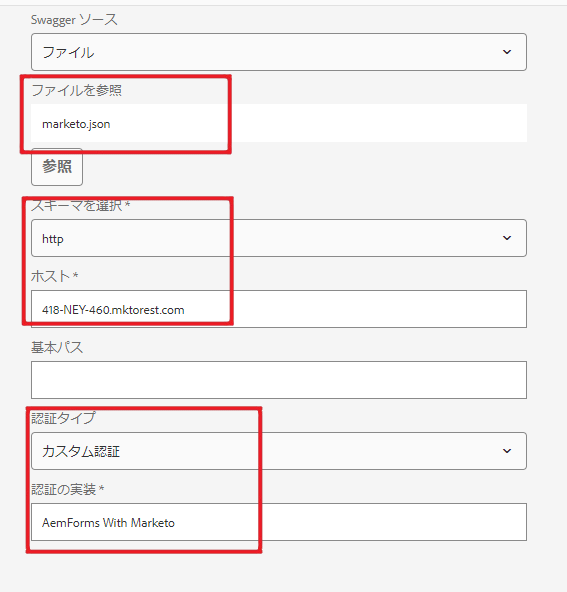

# データソースの設定

AEM Forms のデータ統合機能により、複数の異なるデータソースを設定して接続することができます。以下のタイプがサポートされています。これらのタイプは、すぐに使用できます。ただし、少しカスタマイズするだけで、他のデータソースと統合することもできます。

1. リレーショナルデータベース - MySQL、Microsoft SQL Server、IBM DB2、Oracle RDBMS
1. AEM ユーザープロファイル
1. RESTful Web サービス
1. SOAP ベースの web サービス
1. OData サービス

AEM Forms と Marketo の統合には、RESTful web サービスを使用しています。 統合の最初のステップは、[ データソース](https://helpx.adobe.com/jp/experience-manager/6-4/forms/using/configure-data-sources.html#ConfigureRESTfulwebservices)の設定です。このチュートリアルの一部として提供されている Swagger ファイルを使用してください。 次のスクリーンショットは、データソースの設定時に指定する必要がある重要なプロパティを示しています。

「marketo.json」は Swagger ファイルです（このチュートリアルのアセットの一部として提供されます）。
Host プロパティは Marketo インスタンスに固有です。
認証タイプはカスタムで、認証実装は「AemForms とMarketo」を一致させる必要があります。 （コード内でこれを変更していない場合）。

## フォームデータモデルの作成

データソースを設定した後、次の手順では、前の手順で設定したデータソースに基づくフォームデータモデルを作成します。 フォームデータモデルを作成するには、次の手順に従ってください。

ブラウザーで[データ統合ページ](http://localhost:4502/aem/forms.html/content/dam/formsanddocuments-fdm)を参照します。これには、AEM インスタンスで作成されたすべてのデータ統合が表示されます。

1. 作成 ／フォーム データモデルをクリックします。
1. FormsAndMarketo などの意味のあるタイトルを入力し、「次へ」をクリックします。
1. 前の手順で設定したデータソースを選択し、作成／編集をクリックして、フォームデータモデルを編集モードで開いて編集します。
1. 「FormsAndMarketo」ノードを展開します。 「Services」ノードを展開します。
1. 最初の「Get」操作を選択します。
1. 「選択項目を追加」をクリックします。
1. 関連モデルオブジェクトを追加ダイアログボックスで「すべて選択」をクリックし、「追加」をクリックします。
1. 「保存」ボタンをクリックしてフォームデータモデルを保存します。
1. 「サービス」タブに移動します。
1. 表示される唯一のサービスを選択し、「テストサービス」をクリックします。
1. 有効な leadId を入力し、「テスト」をクリックします。 すべてがうまくいけば、下のスクリーンショットに示すように、リードの詳細が返されます。
   

## 次の手順

[テストのまとめ](./part4.md)
