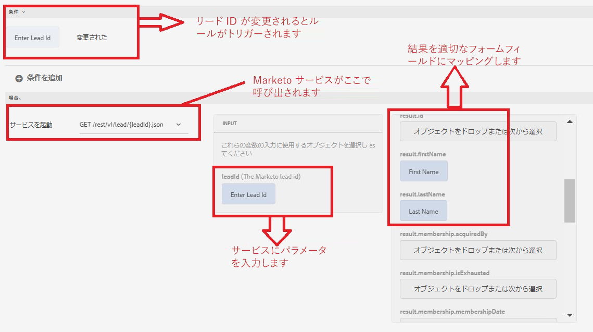

# フォームデータモデルを使用したアダプティブフォームの作成

次に、以前の手順で作成したフォームデータモデルに基づいて、アダプティブフォームを作成します。
ユーザーがリード ID を入力しタブアウトすると、ID でリードを取得する Marketo サービスが呼び出されます。このサービス操作の結果は、アダプティブフォームの適切なフィールドにマッピングされます。

1. 「空のフォームテンプレート」に基づいてアダプティブフォームを作成して、以前の手順で作成したフォームデータモデルに関連付けます。
1. フォームを編集モードで開きます。
1. テキストフィールドコンポーネントとパネルコンポーネントをアダプティブフォームにドラッグ＆ドロップします。テキストフィールドコンポーネントのタイトルを「リード ID を入力」に設定し、その名前を「LeadId」に設定します
1. 2 つのテキストフィールドコンポーネントをパネルコンポーネントにドラッグ＆ドロップします。
1. 2 つのテキストフィールドコンポーネントの名前とタイトルを「First Name」と「Last Name」として設定します。
1. 最小値を 1 に、最大値を -1 に設定して、パネルコンポーネントを繰り返し可能なコンポーネントとして設定します。これが必要なのは、Marketo サービスがリードオブジェクトの配列を返すので、結果を表示するために繰り返し可能なコンポーネントが必要になるからです。ただし、この場合、ID でリードオブジェクトを検索しているので、返されるリードオブジェクトは 1 つだけです。
1. 以下の画像に示すように、「LeadId」フィールドに関するルールを作成します。
1. フォームをプレビューし、有効なリード ID を「LeadId」フィールドに入力してタブアウトします。「First Name」フィールドと「Last Name」フィールドに、サービス呼び出しの結果が入力されます。

次のスクリーンショットでは、ルールエディターの設定を説明しています。

## デバッグ

この記事で提供されるバンドルを使用している場合は、次のクラスの[デバッグログ](http://localhost:4502/system/console/slinglog)を有効にすることをお勧めします。

+ `com.marketoandforms.core.impl.MarketoServiceImpl`
+ `com.marketoandforms.core.MarketoConfigurationService`

## これで完了です

AEM Forms フォームデータモデルを使用して、AEM Forms を Marketo と正常に統合しました。