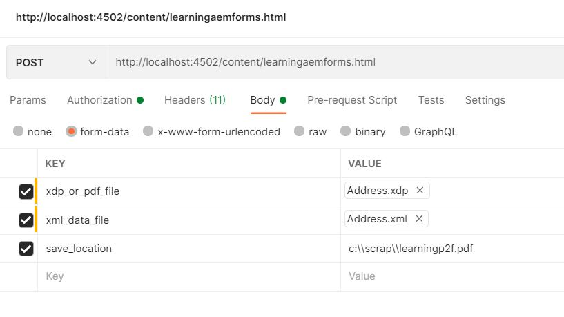

# OSGi サービス

OSGi サービスは、Java クラスまたはサービスインターフェイスと、多数のサービスプロパティ（名前と値のペア）で構成されます。サービスプロパティは、同じサービスインターフェイスを持つサービスを提供する様々なサービスプロバイダーを区別します。

OSGi サービスは、そのサービスインターフェイスによって意味的に定義され、サービスオブジェクトとして実装されます。 サービスの機能は、サービスが実装するインターフェイスによって定義されています。 したがって、異なるアプリケーションが同じサービスを実装することができます。 サービスインターフェイスを使用すると、バンドルは実装ではなくインターフェイスをバインドしてやり取りすることができます。 サービスインターフェイスは、できるだけ少ない実装詳細で指定する必要があります。

## インターフェイスの定義

データと <span class="x x-first x-last">XDP</span> テンプレートを結合するための 1 つのメソッドを備えたシンプルなインターフェイス。

```java
package com.mysite.samples;

import com.adobe.aemfd.docmanager.Document;

public interface MyfirstInterface
{
    public Document mergeDataWithXDPTemplate(Document xdpTemplate, Document xmlDocument);
}
 
```

## インターフェイスの実装

`com.mysite.samples.impl` という名前の新しいパッケージを作成して、インターフェースの実装を保持します。

```java
package com.mysite.samples.impl;
import org.osgi.service.component.annotations.Component;
import org.osgi.service.component.annotations.Reference;
import org.slf4j.Logger;
import org.slf4j.LoggerFactory;
import com.adobe.aemfd.docmanager.Document;
import com.adobe.fd.output.api.OutputService;
import com.adobe.fd.output.api.OutputServiceException;
import com.mysite.samples.MyfirstInterface;
@Component(service = MyfirstInterface.class)
public class MyfirstInterfaceImpl implements MyfirstInterface {
  @Reference
  OutputService outputService;

  private static final Logger log = LoggerFactory.getLogger(MyfirstInterfaceImpl.class);

  @Override
  public Document mergeDataWithXDPTemplate(Document xdpTemplate, Document xmlDocument) {
    com.adobe.fd.output.api.PDFOutputOptions pdfOptions = new com.adobe.fd.output.api.PDFOutputOptions();
    pdfOptions.setAcrobatVersion(com.adobe.fd.output.api.AcrobatVersion.Acrobat_11);
    try {
      return outputService.generatePDFOutput(xdpTemplate, xmlDocument, pdfOptions);

    } catch (OutputServiceException e) {

      log.error("Failed to merge data with XDP Template", e);

    }

    return null;
  }

}
```

10 行目の注釈 `@Component(...)` は、この Java クラスを OSGi コンポーネントとしてマークすると共に、OSGi サービスとして登録します。

この `@Reference` 注釈は、OSGi 宣言型サービスの一部であり、[Outputservice](https://helpx.adobe.com/jp/experience-manager/6-5/forms/javadocs/index.html?com/adobe/fd/output/api/OutputService.html) の参照を変数 `outputService` に挿入するために使用されます。


## バンドルのビルドとデプロイ

* **コマンドプロンプトウィンドウ**&#x200B;を開きます。
* `c:\aemformsbundles\mysite\core` に移動します。
* コマンド `mvn clean install -PautoInstallBundle` を実行します。
* 上記のコマンドは、自動的にバンドルをビルドして、localhost:4502 で動作している AEM インスタンスにデプロイします。

バンドルは、`C:\AEMFormsBundles\mysite\core\target` でも入手できます 。このバンドルは、[Felix web コンソール](http://localhost:4502/system/console/bundles)を使用して AEM にデプロイすることもできます。

## サービスの使用

これで、JSP ページでサービスを使用することができます。 次のコードスニペットは、サービスにアクセスし、サービスによって実装されたメソッドを使用する方法を示しています。

```java
MyFirstAEMFormsService myFirstAEMFormsService = sling.getService(com.mysite.samples.MyFirstAEMFormsService.class);
com.adobe.aemfd.docmanager.Document generatedDocument = myFirstAEMFormsService.mergeDataWithXDPTemplate(xdp_or_pdf_template,xmlDocument);
```

JSP ページを含んだサンプルパッケージは、[こちらからダウンロード](assets/learning_aem_forms.zip)できます。

[バンドル全体をダウンロードすることができます。](assets/mysite.core-1.0.0-SNAPSHOT.jar)

## パッケージのテスト

[パッケージマネージャー](http://localhost:4502/crx/packmgr/index.jsp) を使用して、パッケージを AEM に読み込み、インストールします。 

Postman を使用してPOST 呼び出しを行い、入力パラメーターを指定します（以下のスクリーンショットを参照）。


## 次の手順

[Sling サーブレットの作成](./create-servlet.md)

