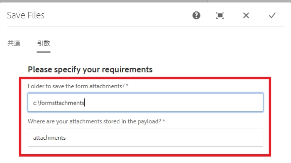

# カスタムプロセスステップ

このチュートリアルは、カスタムワークフローコンポーネントの実装が必要な AEM Forms のお客様を対象としています。ワークフローコンポーネントを作成する最初のステップは、ワークフローコンポーネントに関連付けられる Java コードを記述することです。このチュートリアルでは、アダプティブフォームの添付ファイルをファイルシステムに保存する簡単な Java クラスを記述します。この Java コードは、ワークフローコンポーネントで指定された引数を読み取ります。

Java クラスを記述し、クラスを OSGi バンドルとしてデプロイするには、次の手順が必要です

## Maven プロジェクトの作成

最初に行うことは、適切な Adobe Maven アーキタイプを使用して Maven プロジェクトを作成することです。 詳細な手順は、この[記事](https://experienceleague.adobe.com/docs/experience-manager-learn/forms/creating-your-first-osgi-bundle/create-your-first-osgi-bundle.html?lang=ja)に記載されています。Maven プロジェクトを Eclipse に読み込んだら、プロセスステップで使用できる最初の OSGi コンポーネントの記述を開始する準備が整います。


### WorkflowProcess を実装するクラスの作成

Eclipse IDE で Maven プロジェクトを開きます。 **[projectname]**／**core** フォルダーを展開します。src/main/java フォルダーを展開します。 「core」で終わるパッケージが表示されます。 このパッケージに、WorkflowProcess を実装する Java クラスを作成します。 execute メソッドをオーバーライドする必要があります。 execute メソッドの署名は、次のとおりです。
public void execute(WorkItem workItem, WorkflowSession workflowSession, MetaDataMap processArguments)throws WorkflowException

このチュートリアルでは、アダプティブフォームに追加された添付ファイルを AEM ワークフローの一環としてファイルシステムに書き込みます。

このユースケースを実現するために、次の Java クラスを記述しました。

このコードを見てみましょう。

```java
package com.mysite.core;
import java.io.File;
import java.io.InputStream;
import java.util.HashMap;
import java.util.Map;
import javax.jcr.Node;
import javax.jcr.Session;
import org.osgi.framework.Constants;
import org.osgi.service.component.annotations.Component;
import org.osgi.service.component.annotations.Reference;
import org.slf4j.Logger;
import org.slf4j.LoggerFactory;
import com.adobe.aemfd.docmanager.Document;
import com.adobe.granite.workflow.WorkflowException;
import com.adobe.granite.workflow.WorkflowSession;
import com.adobe.granite.workflow.exec.WorkItem;
import com.adobe.granite.workflow.exec.WorkflowProcess;
import com.adobe.granite.workflow.metadata.MetaDataMap;
import com.day.cq.search.PredicateGroup;
import com.day.cq.search.Query;
import com.day.cq.search.QueryBuilder;
import com.day.cq.search.result.Hit;
import com.day.cq.search.result.SearchResult;
@Component(property = {
  Constants.SERVICE_DESCRIPTION + "=Custom component to wrtie form attachments to file system",
  Constants.SERVICE_VENDOR + "=Adobe Systems",
  "process.label" + "=Custom component to wrtie form attachments to file system"
})
public class WriteFormAttachmentsToFileSystem implements WorkflowProcess {

  private static final Logger log = LoggerFactory.getLogger(WriteFormAttachmentsToFileSystem.class);
  @Reference
  QueryBuilder queryBuilder;

  @Override
  public void execute(WorkItem workItem, WorkflowSession workflowSession, MetaDataMap metaDataMap)
  throws WorkflowException {

    String attachmentsPath = metaDataMap.get("attachmentsPath", String.class);

    log.debug("Got attachments path: " + attachmentsPath);
    String saveToLocation = metaDataMap.get("SaveToLocation", String.class);
    log.debug("Got save location: " + saveToLocation);

    log.debug("The seperator is" + File.separator);
    String payloadPath = workItem.getWorkflowData().getPayload().toString();
    Map < String, String > map = new HashMap < String, String > ();
    map.put("path", payloadPath + "/" + attachmentsPath);
    File saveLocationFolder = new File(saveToLocation);
    if (!saveLocationFolder.exists()) {
      saveLocationFolder.mkdirs();
    }

    map.put("type", "nt:file");
    Query query = queryBuilder.createQuery(PredicateGroup.create(map), workflowSession.adaptTo(Session.class));
    query.setStart(0);
    query.setHitsPerPage(20);

    SearchResult result = query.getResult();
    log.debug("Got  " + result.getHits().size() + " attachments ");
    Node attachmentNode = null;
    for (Hit hit: result.getHits()) {
      try {
        String path = hit.getPath();
        log.debug("The attachment title is  " + hit.getTitle() + " and the attachment path is  " + path);
        attachmentNode = workflowSession.adaptTo(Session.class).getNode(path + "/jcr:content");
        InputStream documentStream = attachmentNode.getProperty("jcr:data").getBinary().getStream();
        Document attachmentDoc = new Document(documentStream);
        attachmentDoc.copyToFile(new File(saveLocationFolder + File.separator + hit.getTitle()));
        attachmentDoc.close();
      } catch (Exception e) {
        log.error("Error saving file " + e.getMessage());
      }
    }
  }
}
```


* attachmentsPath - AEM Workflow を呼び出すようにアダプティブフォームの送信アクションを設定したときに、アダプティブフォームで指定したのと同じ場所です。これは、添付ファイルを保存する AEM 内のフォルダーの名前（ワークフローのペイロードを基準とする相対パス）です。

* saveToLocation - AEM サーバーのファイルシステム上で添付ファイルを保存する場所です。

これら 2 つの値は、ワークフローコンポーネントのダイアログを使用してプロセス引数として渡されます。



QueryBuilder サービスは、attachmentsPath フォルダー下の nt:file タイプのノードに対してクエリを実行するために使用します。 残りのコードでは、検索結果を反復処理して Document オブジェクトを作成し、それをファイルシステムに保存します。


>[!NOTE]
>
>AEM Forms に固有の Document オブジェクトを使用しているので、aemfd-client-sdk の依存関係を Maven プロジェクトに含める必要があります。

```xml
<dependency>
    <groupId>com.adobe.aemfd</groupId>
    <artifactId>aemfd-client-sdk</artifactId>
    <version>6.0.772</version>
</dependency>
```

#### ビルドとデプロイ

[ここで説明しているとおりに、バンドルをビルドします。](https://experienceleague.adobe.com/docs/experience-manager-learn/forms/creating-your-first-osgi-bundle/create-your-first-osgi-bundle.html?lang=ja)
[バンドルがデプロイされ、アクティブな状態になっていることを確認します。](http://localhost:4502/system/console/bundles)

## 次の手順

[カスタムワークフローコンポーネント](./custom-workflow-component.md)の作成

