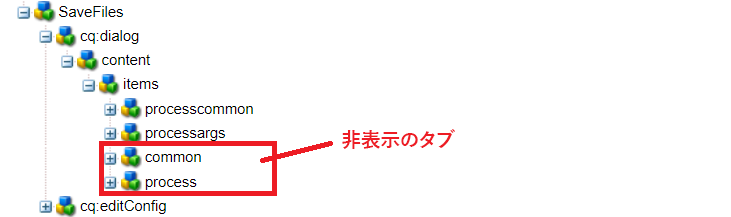
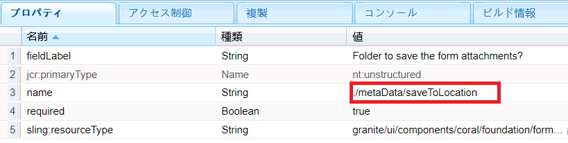
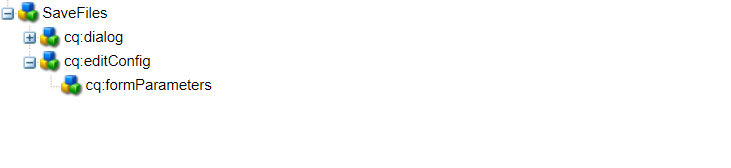

# カスタムワークフローコンポーネント

このチュートリアルは、カスタムワークフローコンポーネントの作成が必要な AEM Forms のお客様を対象としています。このワークフローコンポーネントは、前のステップで記述したコードを実行するように設定されます。 ワークフローコンポーネントには、コードに対してプロセス引数を指定する機能があります。 この記事では、コードに関連付けられたワークフローコンポーネントについて説明します。

[カスタムワークフローコンポーネントをダウンロードします。](assets/saveFiles.zip)
[パッケージマネージャーを使用して](http://localhost:4502/crx/packmgr/index.jsp)ワークフローコンポーネントを読み込みます。

カスタムワークフローコンポーネントは、/apps/AEMFormsDemoListings/workflowcomponent/SaveFiles にあります。

SaveFiles ノードを選択し、そのプロパティを調べます。

**componentGroup** - このプロパティの値によって、ワークフローコンポーネントのカテゴリが決まります。

**jcr:Title** - ワークフローコンポーネントのタイトルです。

**sling:resourceSuperType** - このプロパティの値によって、このコンポーネントの継承が決まります。 ここでは、プロセスコンポーネントから継承します。

## cq:dialog

作成者は、ダイアログを使用してコンポーネントとやり取りできます。cq:dialog は SaveFiles ノードの下にあります。

items ノードの下にあるノードは、作成者がコンポーネントとのやり取りに使用するコンポーネントのタブを表します。 common タブと process タブは非表示です。 processcommon タブと processargs タブは表示されます。

プロセスのプロセス引数は processargs ノードの下にあります。

以下のスクリーンショットに示すように、作成者が引数を指定します。

値は、metaData ノードのプロパティとして保存されます。 例えば、値 **c:\formsattachments** は、metaData ノードの saveToLocation プロパティに保存されます。

## cq:editConfig

cq:EditConfig は、プライマリタイプが cq:EditConfig で名前が cq:editConfig の、コンポーネントルート下のノードです。
コンポーネントの編集動作は、cq:EditConfig タイプの cq:editConfig ノードをコンポーネントノード（cq:Component タイプ）の下に追加することで設定されます。

cq:formParameters（ノードタイプ nt:unstructured）：ダイアログフォームに追加されるその他のパラメーターを定義します。

cq:formParameters ノードのプロパティに注意してください。

プロパティ PROCESS の値は、ワークフローコンポーネントに関連付けられる Java コードを示します。
