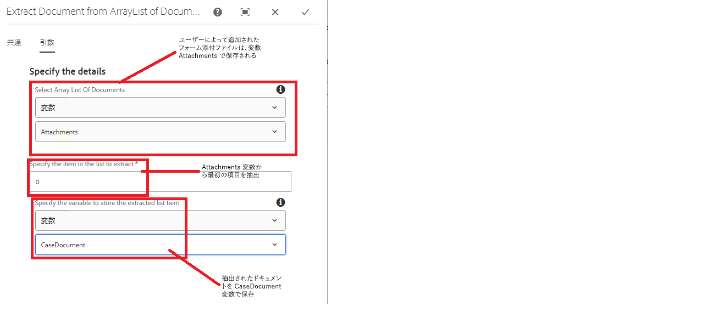
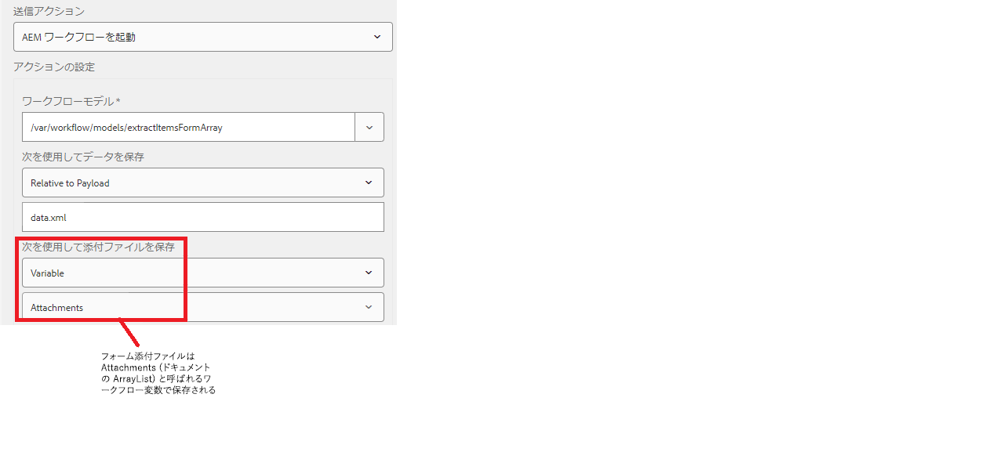

# ドキュメントのリストからドキュメントを抽出

一般的なユースケースとして、AEM ワークフローのフォームデータモデルの呼び出しステップに従って、フォームデータとフォーム添付ファイルを外部システムに送信します。例えば、ServiceNow でケースを作成する場合は、サポートドキュメントと共にケースの詳細を送信する必要があります。アダプティブフォームに追加した添付ファイルは、ドキュメントの ArrayList タイプの変数に保存されます。この ArrayList から特定のドキュメントを抽出するには、カスタムコードを記述する必要があります。

この記事では、カスタムワークフローコンポーネントを使用してドキュメントを抽出し、ドキュメント変数に保存する手順について説明します。

## ワークフローの作成

フォームの送信を処理するには、ワークフローを作成する必要があります。ワークフローには、次の変数を定義する必要があります

* ドキュメントの ArrayList タイプの変数（この変数には、ユーザーが追加したフォーム添付ファイルが保持されます）
* ドキュメントタイプの変数（この変数には、ArrayList から抽出されたドキュメントが保持されます）

* カスタムコンポーネントをワークフローに追加し、そのプロパティを設定します
  

## アダプティブフォームを設定

* アダプティブフォームの送信アクションを設定して AEM ワークフローをトリガーします
  

## ソリューションをテスト

[OSGi web コンソールを使用するカスタムバンドルのデプロイ](assets/ExtractItemsFromArray.core-1.0.0-SNAPSHOT.jar)

[パッケージマネージャーを使用するワークフローコンポーネントの読み込み](assets/Extract-item-from-documents-list.zip)

[サンプルワークフローの読み込み](assets/extract-item-sample-workflow.zip)

[アダプティブフォームの読み込み](assets/test-attachment-extractions-adaptive-form.zip)

[フォームをプレビュー](http://localhost:4502/content/dam/formsanddocuments/testattachmentsextractions/jcr:content?wcmmode=disabled)

添付ファイルをフォームに追加して送信します。

>[!NOTE]
>
>抽出したドキュメントは、メールの送信や FDM の呼び出しステップなどの他のワークフローステップで使用できます
