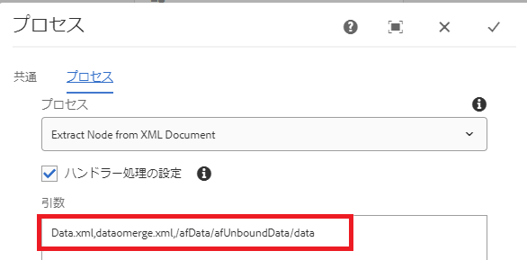

# 送信されたデータ xml からのノードの抽出

このカスタムプロセスステップでは、別の xml ドキュメントからノードを抽出して新しい xml ドキュメントを作成します。 送信したデータを xdp テンプレートと結合して PDF を生成する場合は、この機能を使用する必要があります。 例えば、アダプティブフォームを送信する際、xdp テンプレートと統合する必要があるデータは、データ要素内にあります。 この場合、適切なデータ要素を抽出して、別の xml ドキュメントを作成する必要があります。

カスタムプロセスステップに渡す必要のある引数を次のスクリーンショットに示します。

以下にパラメーターを示します。
* Data.xml - ノードを抽出する xml ファイル
* datatomerge.xml - 抽出したノードで作成された新しい xml
* /afData/afUnboundData/data - 抽出するノード

次のスクリーンショットは、ペイロードフォルダー下に作成される datamerge.xml を示しています。

[カスタムバンドルは、ここからダウンロードできます。](/help/forms/assets/common-osgi-bundles/SetValueApp.core-1.0-SNAPSHOT.jar)
