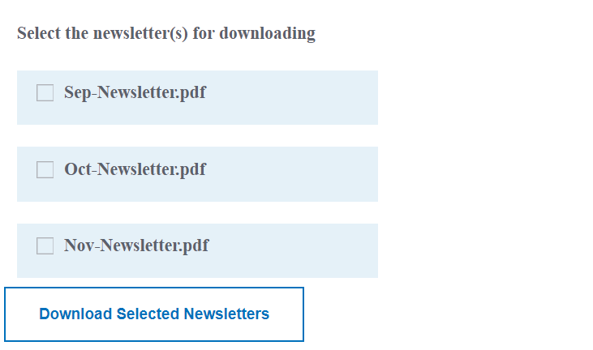

# はじめに

一般的な使用例としては、チェックボックスコンポーネントを使用して DAM フォルダーのコンテンツ（pdf ファイル、Word ドキュメントなど）をリストし、ユーザーがダウンロードするファイルを選択できるようにします。 選択したファイルは、ユーザーがダウンロードできる 1 つのファイルに組み立てられます。

## 前提条件

以下が必要です。

* フォームアドオンパッケージがインストールされたAEMの作業用インスタンス

* [このドキュメントに従って設定された開発環境](https://experienceleague.adobe.com/docs/experience-manager-learn/forms/creating-your-first-osgi-bundle/create-your-first-osgi-bundle.html)

