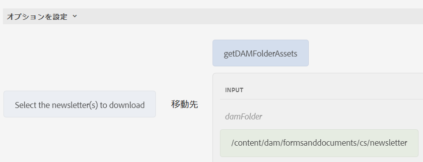

# 項目を選択グループコンポーネントに動的に追加する

AEM Forms 6.5 では、チェックボックス、ラジオボタン、画像リストなどのアダプティブForms選択グループコンポーネントに項目を動的に追加する機能が導入されました。 この記事では、選択グループコンポーネントに DAM フォルダーコンテンツを入力する場合の使用例について説明します。 スクリーンショットでは、3 つのファイルは newsletter というフォルダーにあります。新しいニュースレターがフォルダーに追加されるたびに、選択グループコンポーネントが更新され、コンテンツが自動的にリストされます。 ユーザーは、ダウンロードする 1 つ以上のニュースレターを選択できます。


## DAM フォルダーのコンテンツを返すサーブレットを作成

DAM フォルダーのコンテンツを JSON 形式で返すために、次のコードが記述されました。

```java
package com.newsletters.core.servlets;
import static com.day.cq.commons.jcr.JcrConstants.JCR_CONTENT;
import java.io.IOException;
import java.io.PrintWriter;
import java.util.ArrayList;
import java.util.List;
import javax.servlet.Servlet;
import org.apache.sling.api.SlingHttpServletRequest;
import org.apache.sling.api.SlingHttpServletResponse;
import org.apache.sling.api.resource.Resource;
import org.apache.sling.api.servlets.SlingSafeMethodsServlet;
import org.osgi.service.component.annotations.Component;
import org.slf4j.Logger;
import org.slf4j.LoggerFactory;
import com.google.gson.Gson;
import com.google.gson.JsonObject;

@Component(service = {
  Servlet.class
}, property = {
  "sling.servlet.methods=get",
  "sling.servlet.paths=/bin/listfoldercontents"
})
public class ListFolderContent extends SlingSafeMethodsServlet {
  private static final long serialVersionUID = 1 L;
  private static final Logger log = LoggerFactory.getLogger(ListFolderContent.class);
  protected void doGet(SlingHttpServletRequest request, SlingHttpServletResponse response) {
    Resource resource = request.getResourceResolver().getResource(request.getParameter("damFolder"));
    List < JsonObject > results = new ArrayList < > ();
    resource.getChildren().forEach(child -> {
      if (!JCR_CONTENT.equals(child.getName())) {
        JsonObject asset = new JsonObject();
        log.debug("##The child name is " + child.getName());
        asset.addProperty("assetname", child.getName());
        asset.addProperty("assetpath", child.getPath());
        results.add(asset);

      }
    });
    PrintWriter out = null;
    try {
      out = response.getWriter();
    } catch (IOException e) {

      log.debug(e.getMessage());
    }
    response.setContentType("application/json");
    response.setCharacterEncoding("UTF-8");
    Gson gson = new Gson();
    out.print(gson.toJson(results));
    out.flush();
  }

}
```

## JavaScript 関数を使用したクライアントライブラリの作成

サーブレットは、JavaScript 関数から呼び出されます。 この関数は、選択グループコンポーネントの入力に使用される配列オブジェクトを返します

```javascript
/**
 * Populate drop down/choice group  with assets from specified folder
 * @return {string[]} 
 */
function getDAMFolderAssets(damFolder) {
   // strUrl is whatever URL you need to call
   var strUrl = '/bin/listfoldercontents?damFolder=' + damFolder;
   var documents = [];
   $.ajax({
      url: strUrl,
      success: function(jsonData) {
         for (i = 0; i < jsonData.length; i++) {
            documents.push(jsonData[i].assetpath + "=" + jsonData[i].assetname);
         }
      },
      async: false
   });
   return documents;
}
```

## アダプティブフォームを作成

アダプティブフォームを作成し、フォームをクライアントライブラリに関連付ける **listfolderassets**. フォームにチェックボックスコンポーネントを追加します。 ルールエディターを使用して、スクリーンショットに示すように、チェックボックスのオプションを設定します


と呼ばれる JavaScript 関数を呼び出しています。 **getDAMFolderAssets** フォームにリストする DAM フォルダーのアセットのパスを渡す