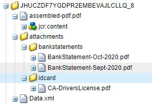

# フォーム添付ファイルのアセンブリ

この記事では、アダプティブフォームの添付ファイルを指定された順序でアセットにまとめます。 このサンプルコードが機能するには、フォームの添付ファイルがpdf形式になっている必要があります。 使用例を次に示します。
アダプティブフォームの入力時に、1つ以上のpdfドキュメントをフォームに添付します。
フォームの送信時に、フォームの添付ファイルをアセンブリして1つのpdfを生成します。 最終的なpdfを生成するために添付ファイルをアセンブリする順序を指定できます。

## WorkflowProcessインターフェイスを実装するOSGiコンポーネントの作成

[com.adobe.granite.workflow.exec.WorkflowProcessインターフェイス](https://helpx.adobe.com/experience-manager/6-5/sites/developing/using/reference-materials/javadoc/com/adobe/granite/workflow/exec/WorkflowProcess.html)を実装するOSGiコンポーネントを作成します。 このコンポーネント内のコードは、AEMワークフローのプロセスステップコンポーネントに関連付けることができます。 このコンポーネントには、インターフェイスcom.adobe.granite.workflow.exec.WorkflowProcessのexecuteメソッドが実装されています。

アダプティブフォームがAEMワークフローに送信されると、送信されたデータは、トリガーフォルダーの下の指定されたファイルに保存されます。 例えば、これは送信されたデータファイルです。 idcardタグとbankstatementsタグで指定された添付ファイルをアセンブリする必要があります。
.

### タグ名を取得する

添付ファイルの順序は、次のスクリーンショットに示すように、ワークフローのプロセスステップ引数として指定します。 ここでは、フィールドidカードに追加された添付ファイルを集め、その後bankstatementsを組み立てます。


次のコードスニペットは、プロセスの引数から添付ファイル名を抽出します

```java
String  []attachmentNames  = arg2.get("PROCESS_ARGS","string").toString().split(",");
```

### 添付ファイル名からのDDXの作成

次に、Assemblerサービスでドキュメントをアセンブルするために使用される[ドキュメント記述XML(DDX)](https://helpx.adobe.com/pdf/aem-forms/6-2/ddxRef.pdf)ドキュメントを作成する必要があります。 プロセス引数から作成されたDDXを次に示します。 NoForms要素を使用すると、XFAベースのドキュメントをアセンブリ前に統合できます。 PDFソース要素は、プロセスの引数で指定した順序に従って正しい順序になっています。


### ドキュメントのマップを作成

次に、添付ファイル名をキー、添付ファイルを値として持つドキュメントのマップを作成します。 クエリビルダーサービスは、ペイロードパスの下で添付ファイルのクエリを行い、ドキュメントのマップを作成するために使用されました。 DDXとドキュメントのこのマップは、Assemblerサービスで最終的なpdfをアセンブリするために必要です。

```java
public Map<String, Object> createMapOfDocuments(String payloadPath,WorkflowSession workflowSession )
{
  Map<String, String> queryMap = new HashMap<String, String>();
  Map<String,Object>mapOfDocuments = new HashMap<String,Object>();
  queryMap.put("type", "nt:file");
  queryMap.put("path",payloadPath);
  Query query = queryBuilder.createQuery(PredicateGroup.create(queryMap),workflowSession.adaptTo(Session.class));
  query.setStart(0);
  query.setHitsPerPage(30);
  SearchResult result = query.getResult();
  log.debug("Get result hits "+result.getHits().size());
  for (Hit hit : result.getHits()) {
    try {
          String path = hit.getPath();
          log.debug("The title "+hit.getTitle()+" path "+path);
          if(hit.getTitle().endsWith("pdf"))
           {
             com.adobe.aemfd.docmanager.Document attachmentDocument = new com.adobe.aemfd.docmanager.Document(path);
             mapOfDocuments.put(hit.getTitle(),attachmentDocument);
             log.debug("@@@@Added to map@@@@@ "+hit.getTitle());
           }
        }
    catch (Exception e)
       {
          log.debug(e.getMessage());
       }

}
return mapOfDocuments;
}
```

### AssemblerServiceを使用したドキュメントのアセンブリ

DDXとドキュメントマップを作成した後、次の手順は、AssemblerServiceを使用したドキュメントのアセンブリです。
次のコードは、アセンブリされたpdfをアセンブリして返します。

```java
private com.adobe.aemfd.docmanager.Document assembleDocuments(Map<String, Object> mapOfDocuments, com.adobe.aemfd.docmanager.Document ddxDocument)
{
    AssemblerOptionSpec aoSpec = new AssemblerOptionSpec();
    aoSpec.setFailOnError(true);
    AssemblerResult ar = null;
    try
    {
        ar = assemblerService.invoke(ddxDocument, mapOfDocuments, aoSpec);
        return (com.adobe.aemfd.docmanager.Document) ar.getDocuments().get("GeneratedDocument.pdf");
    }
    catch (OperationException e)
    {
        log.debug(e.getMessage());
    }
    return null;
    
}
```

### ペイロードフォルダーの下にアセンブリ済みのpdfを保存

最後の手順は、ペイロードフォルダーの下にアセンブリ済みのpdfを保存することです。 その後、ワークフローの後続の手順でこのpdfにアクセスして、さらに処理することができます。
ペイロードフォルダーの下にファイルを保存するには、次のコードスニペットを使用します

```java
Session session = workflowSession.adaptTo(Session.class);
javax.jcr.Node payloadNode =  workflowSession.adaptTo(Session.class).getNode(workItem.getWorkflowData().getPayload().toString());
log.debug("The payload Path is "+payloadNode.getPath());
javax.jcr.Node assembledPDFNode = payloadNode.addNode("assembled-pdf.pdf", "nt:file"); 
javax.jcr.Node jcrContentNode =  assembledPDFNode.addNode("jcr:content", "nt:resource");
Binary binary =  session.getValueFactory().createBinary(assembledDocument.getInputStream());
jcrContentNode.setProperty("jcr:data", binary);
log.debug("Saved !!!!!!"); 
session.save();
```

以下は、フォーム添付ファイルがアセンブルされ、保存された後のペイロードフォルダー構造です。



### この機能をAEMサーバーで動作させるには

* [Assemble Form Attachments Form](assets/assemble-form-attachments-af.zip)をローカルシステムにダウンロードします。
* [Formsとドキュメント](http://localhost:4502/aem/forms.html/content/dam/formsanddocuments)ページからフォームを読み込みます。
* [ワークフロー](assets/assemble-form-attachments.zip)をダウンロードし、パッケージマネージャーを使用してAEMに読み込みます。
* [カスタムバンドル](assets/assembletaskattachments.assembletaskattachments.core-1.0-SNAPSHOT.jar)をダウンロード
* [Webコンソール](http://localhost:4502/system/console/bundles)を使用してバンドルを展開し、開始します。
* ブラウザーに[AssembleAttachments Form](http://localhost:4502/content/dam/formsanddocuments/assembleattachments/jcr:content?wcmmode=disabled)を指定します。
* IDドキュメント追加の添付ファイルと、銀行取引明細書セクションへの2つのpdfドキュメント
* ワークフローをトリガーにフォームを送信する
* アセンブリされたpdfのcrx](http://localhost:4502/crx/de/index.jsp#/var/fd/dashboard/payload)内のワークフローの[ペイロードフォルダーを確認します

>[!NOTE]
> カスタムバンドルのロガーを有効にした場合、DDXとアセンブリ済みのファイルがAEMインストールのフォルダーに書き込まれます。

