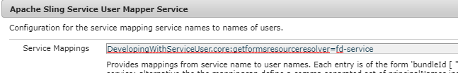

# AEM Formsでの認証ドキュメント

認定済みドキュメントは、PDFドキュメントとフォーム受信者に、信頼性と整合性の保証を追加します。

ドキュメントを認証するには、デスクトップでAcrobatDCを使用するか、サーバーでの自動化プロセスの一環としてAEM Formsドキュメントサービスを使用します。

この記事では、AEM Formsドキュメントサービスを使用してPDFドキュメントを認証するためのサンプルOSGIバンドルを提供します。サンプルで使用されているコードは[こちら](https://helpx.adobe.com/experience-manager/6-4/forms/using/aem-document-services-programmatically.html)で入手できます

AEM Formsを使用してドキュメントを認証するには、次の手順に従う必要があります

## 証明書をTrust Storeに追加{#adding-certificate-to-trust-store}

AEMのキーストアに証明書を追加するには、次の手順に従います

* [グローバルTrust Storeの初期化](http://localhost:4502/libs/granite/security/content/truststore.html)
* [fd-](http://localhost:4502/security/users.html) serviceuserを検索します
* **fd-serviceユーザーを見つけるには、結果ページをスクロールしてすべてのユーザーを読み込む必要があります**
* 重複がfd-serviceユーザーをクリックして、ユーザー設定ウィンドウを開きます
* 「キーストアファイルからの追加秘密鍵」をクリックします。証明書に固有のエイリアスとパスワードを指定します。
   
* 変更を保存する

## OSGIサービスの作成

独自のOSGiバンドルを書き込み、AEM FormsクライアントSDKを使用して、PDFドキュメントを認証するサービスを実装できます。 以下のリンクは、独自のOSGiバンドルを作成する場合に役立ちます。

* [最初のOSGiバンドルの作成](https://helpx.adobe.com/experience-manager/using/maven_arch13.html)
* [ドキュメントサービスAPIを使用する](https://helpx.adobe.com/experience-manager/6-4/forms/using/aem-document-services-programmatically.html)

または、このチュートリアルアセットの一部に含まれるサンプルバンドルを使用できます。

>[!NOTE]
>
>サンプルバンドルでは、ドキュメントの認証に「ares」というエイリアスを使用します。 このバンドルを使用する際は、エイリアスが「ares」と呼ばれていることを確認してください。

## ローカルシステムでのサンプルのテスト

* [カスタムドキュメントサービスバンドル](/help/forms/assets/common-osgi-bundles/AEMFormsDocumentServices.core-1.0-SNAPSHOT.jar)をダウンロードしてインストールします
* [サービスユーザーバンドルで開発中](/help/forms/assets/common-osgi-bundles/DevelopingWithServiceUser.jar)をダウンロードしてインストールします。
* [Apache Sling Service User Mapper Serviceに次のエントリが追加されていることを確認します](http://localhost:4502/system/console/configMgr)

   **DevelopingWithServiceUser.core:getformsresourceresolver=fd-** serviceasが下のスクリーンショットに表示されています
   
* [サンプルアダプティブフォームの読み込み](assets/certify-pdf-af.zip)
* [カスタム送信の読み込みとインストール](assets/custom-submit-certify.zip)
* [アダプティブフォームを開く](http://localhost:4502/content/dam/formsanddocuments/certifypdf/jcr:content?wcmmode=disabled)
* 認証が必要なPDFドキュメントをアップロードする
   **オプション** -ドキュメントの認証に使用する署名フィールドを指定します
* 「送信」をクリックします。
* 認証済みPDFが返送されます。

