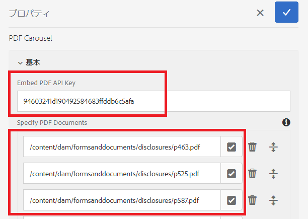

# カルーセルでの複数の PDF ドキュメントの表示

一般的な使用例としては、フォームを送信する前に確認するために、複数の PDF ドキュメントをフォームの入力者に表示します。

この使用例を実現するには、[Adobe PDF Embed API](https://www.adobe.io/apis/documentcloud/dcsdk/pdf-embed.html?lang=ja) を使用します。

[このサンプルのライブデモは、こちらで体験できます。](https://forms.enablementadobe.com/content/dam/formsanddocuments/wefinancecreditcard/jcr:content?wcmmode=disabled)

統合を完了するには、次の手順を実行します。

## 複数の PDF ドキュメントを表示するカスタムコンポーネントの作成

PDF ドキュメントのサイクルを切り替えるカスタムコンポーネント（pdf-carousel） が作成されました。

## クライアントライブラリ

Adobe PDF Embed API を使用してPDFを表示するクライアントライブラリが作成されました。 表示する PDFは、pdf-carousel コンポーネントで指定します。

## アダプティブフォームの作成

いくつかのタブ（このサンプルでは 3 つ）を使用してアダプティブフォームを作成します
最初の 2 つのタブにアダプティブフォームのコンポーネントを追加します
3 番目のタブに pdf カルーセルコンポーネントを追加します
pdf-carousel コンポーネントを設定します（下のスクリーンショットを参照）

**Embed PDF API キー** - PDF の埋め込みに使用できるキーです。このキーは、localhost でのみ機能します。[独自のキー](https://www.adobe.io/apis/documentcloud/dcsdk/pdf-embed.html?lang=ja)を作成して他のドメインに関連付けることができます。

**PDF ドキュメントを指定** - カルーセルに表示する PDF ドキュメントを指定します。

## サンプルのサーバーへのデプロイ

ローカルサーバーでこれをテストするには、次の手順に従います。

1. [パッケージマネージャーを使用](http://localhost:4502/crx/packmgr/index.jsp)して、[クライアントライブラリ](assets/pdf-carousel-client-lib.zip)をローカルの AEM インスタンスに読み込みます。
1. [パッケージマネージャーを使用](http://localhost:4502/crx/packmgr/index.jsp)して、[PDF カルーセルコンポーネント](assets/pdf-carousel-component.zip)をローカルの AEM インスタンスに読み込みます。
1. [パッケージマネージャーを使用](http://localhost:4502/crx/packmgr/index.jsp)して、ローカルの AEM インスタンスに[アダプティブフォームを読み込みます](assets/adaptive-form-pdf-carousel.zip)。
1. [アセットファイルのアップロードリンクを使用](http://localhost:4502/assets.html/content/dam)して、[表示するサンプルの PDF](assets/pdf-carousel-sample-documents.zip) をローカルの AEM インスタンスに読み込みます。
1. [アダプティブフォームをプレビューします](http://localhost:4502/content/dam/formsanddocuments/wefinancecreditcard/jcr:content?wcmmode=disabled)
1. 「レビュー」タブにドキュメントへのタブを付けます。 カルーセルコンポーネントに 3 つの PDF ドキュメントが表示されます。
