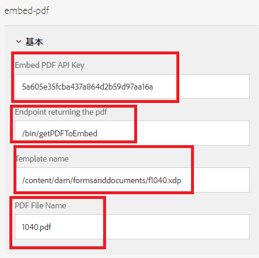

# DoR をインラインで表示

一般的な使用例は、フォームの入力者が入力したデータを含む PDF ドキュメントを表示する場合です。

この使用例を実現するには、[Adobe PDF Embed API](https://www.adobe.io/apis/documentcloud/dcsdk/pdf-embed.html?lang=ja) を使用します。

統合を完了するには、次の手順を実行します。

## PDF をインラインで表示するカスタムコンポーネントを作成

カスタムコンポーネント（embed-pdf）を作成して、POST 呼び出しで返された PDF を埋め込みます。

## クライアントライブラリ

`viewPDF` チェックボックスボタンをクリックすると、次のコードが実行されます。アダプティブフォームのデータ、テンプレート名をエンドポイントに渡して、PDF を生成します。生成された PDF は、埋め込み PDF JavaScript ライブラリを使用してフォームの入力者に表示されます。

```javascript
$(document).ready(function() {

    $(".viewPDF").click(function() {
        console.log("view pdfclicked");
        window.guideBridge.getDataXML({
            success: function(result) {
                var obj = new FormData();
                obj.append("data", result.data);
                obj.append("template", document.querySelector("[data-template]").getAttribute("data-template"));
                const fetchPromise = fetch(document.querySelector("[data-endpoint]").getAttribute("data-endpoint"), {
                        method: "POST",
                        body: obj,
                        contentType: false,
                        processData: false,

                    })
                    .then(response => {

                        var adobeDCView = new AdobeDC.View({
                            clientId: document.querySelector("[data-apikey]").getAttribute("data-apikey"),
                            divId: "adobe-dc-view"
                        });
                        console.log("In preview file");
                        adobeDCView.previewFile(

                            {
                                content: {
                                    promise: response.arrayBuffer()
                                },
                                metaData: {
                                    fileName: document.querySelector("[data-filename]").getAttribute("data-filename")
                                }
                            }
                        );


                        console.log("done")
                    })


            }
        });
    });


});
```

## XDP のサンプルデータを生成

* XDP を AEM Forms Designer で開きます。
* ファイル／フォームのプロパティ／プレビューを選択します。
* 「プレビューデータを生成」をクリックします
* 「生成」をクリックします
* 「form-data.xml」などの意味のあるファイル名を指定します

## xml データから XSD を生成

無料のオンラインツールを使用して、前の手順で生成された xml データから [XSD を生成](https://www.freeformatter.com/xsd-generator.html?lang=ja)できます。

## テンプレートをアップロード

「作成」ボタンを使用して、xdp テンプレートを [AEM Forms](http://localhost:4502/aem/forms.html/content/dam/formsanddocuments) にアップロードします


## アダプティブフォームの作成

前の手順の XSD に基づいてアダプティブフォームを作成します。
アダプティブフォームに新規タブを追加します。追加したタブに、チェックボックスコンポーネントと embed-pdf コンポーネントを追加します
チェックボックスには、「viewPDF」という名前を付けます。
以下のスクリーンショットに示すように、embed-pdf コンポーネントを設定します。


**埋め込み PDF API キー** - PDF の埋め込みに使用できるキーです。このキーは、localhost でのみ機能します。[独自のキー](https://www.adobe.io/apis/documentcloud/dcsdk/pdf-embed.html?lang=ja)を作成して、その他のドメインに関連付けることができます。

**PDF を返すエンドポイント** - データを xdp テンプレートと結合して PDF を返すカスタムサーブレットです。

**テンプレート名** - xdp へのパスです。通常は、formsanddocuments フォルダーに保存されます。

**PDF ファイル名** - 埋め込み PDF コンポーネントに表示される文字列です。

## カスタムサーブレットを作成

データを XDP テンプレートと結合し、PDF を返すカスタムサーブレットを作成しました。これを行うコードを以下に示します。カスタムサーブレットは、[embedpdf バンドル](assets/embedpdf.core-1.0-SNAPSHOT.jar)の一部です

```java
import java.io.ByteArrayInputStream;
import java.io.IOException;
import java.io.InputStream;
import java.io.OutputStream;
import java.io.StringReader;
import java.io.StringWriter;
import javax.servlet.Servlet;
import javax.xml.parsers.DocumentBuilder;
import javax.xml.parsers.DocumentBuilderFactory;
import javax.xml.transform.Transformer;
import javax.xml.transform.TransformerFactory;
import javax.xml.transform.dom.DOMSource;
import javax.xml.transform.stream.StreamResult;
import javax.xml.xpath.XPath;
import javax.xml.xpath.XPathConstants;
import javax.xml.xpath.XPathFactory;

import org.apache.sling.api.SlingHttpServletRequest;
import org.apache.sling.api.SlingHttpServletResponse;
import org.apache.sling.api.servlets.SlingAllMethodsServlet;
import org.osgi.service.component.annotations.Component;
import org.osgi.service.component.annotations.Reference;
import org.slf4j.Logger;
import org.slf4j.LoggerFactory;
import org.w3c.dom.Node;
import org.w3c.dom.NodeList;
import org.xml.sax.InputSource;
import com.adobe.aemfd.docmanager.Document;
import com.adobe.fd.output.api.OutputService;

package com.embedpdf.core.servlets;
@Component(service = {
   Servlet.class
}, property = {
   "sling.servlet.methods=post",
   "sling.servlet.paths=/bin/getPDFToEmbed"
})
public class StreamPDFToEmbed extends SlingAllMethodsServlet {
   @Reference
   OutputService outputService;
   private static final long serialVersionUID = 1 L;
   private static final Logger log = LoggerFactory.getLogger(StreamPDFToEmbed.class);

   protected void doPost(SlingHttpServletRequest request, SlingHttpServletResponse response) throws IOException {
      String xdpName = request.getParameter("template");
      String formData = request.getParameter("data");
      log.debug("in doPOST of Stream PDF Form Data is >>> " + formData + " template is >>> " + xdpName);

      try {

         XPathFactory xfact = XPathFactory.newInstance();
         XPath xpath = xfact.newXPath();
         DocumentBuilderFactory factory = DocumentBuilderFactory.newInstance();
         DocumentBuilder builder = factory.newDocumentBuilder();

         org.w3c.dom.Document xmlDataDoc = builder.parse(new InputSource(new StringReader(formData)));

         // get the data to merge with template

         Node afBoundData = (Node) xpath.evaluate("afData/afBoundData", xmlDataDoc, XPathConstants.NODE);
         NodeList afBoundDataChildren = afBoundData.getChildNodes();
         String afDataNodeName = afBoundDataChildren.item(0).getNodeName();
         Node nodeWithDataToMerge = (Node) xpath.evaluate("afData/afBoundData/" + afDataNodeName, xmlDataDoc, XPathConstants.NODE);
         StringWriter writer = new StringWriter();
         Transformer transformer = TransformerFactory.newInstance().newTransformer();
         transformer.transform(new DOMSource(nodeWithDataToMerge), new StreamResult(writer));
         String xml = writer.toString();
         InputStream targetStream = new ByteArrayInputStream(xml.getBytes());
         Document xmlDataDocument = new Document(targetStream);
         // get the template
         Document xdpTemplate = new Document(xdpName);
         log.debug("got the  xdp Template " + xdpTemplate.length());

         // use output service the merge data with template
         com.adobe.fd.output.api.PDFOutputOptions pdfOptions = new com.adobe.fd.output.api.PDFOutputOptions();
         pdfOptions.setAcrobatVersion(com.adobe.fd.output.api.AcrobatVersion.Acrobat_11);
         com.adobe.aemfd.docmanager.Document documentToReturn = outputService.generatePDFOutput(xdpTemplate, xmlDataDocument, pdfOptions);

         // stream pdf to the client

         InputStream fileInputStream = documentToReturn.getInputStream();
         response.setContentType("application/pdf");
         response.addHeader("Content-Disposition", "attachment; filename=AemFormsRocks.pdf");
         response.setContentLength((int) fileInputStream.available());
         OutputStream responseOutputStream = response.getOutputStream();
         int bytes;
         while ((bytes = fileInputStream.read()) != -1) {
            responseOutputStream.write(bytes);
         }
         responseOutputStream.flush();
         responseOutputStream.close();

      } catch (Exception e) {

         System.out.println("Error " + e.getMessage());
      }

   }

}
```


## サンプルのサーバーへのデプロイ

ローカルサーバーでこれをテストするには、次の手順に従います。

1. [embedpdf バンドルをダウンロードしてインストールします](assets/embedpdf.core-1.0-SNAPSHOT.jar)。
このバンドルには、データと XDP テンプレートを結合し、PDF をストリームバックするサーブレットがあります。
1. [AEM ConfigMgr](http://localhost:4502/system/console/configMgr) を使用して、Adobe Granite CSRF フィルターの除外パスセクションにパス「/bin/getPDFToEmbed」を追加します。実稼動環境では、[CSRF 保護フレームワーク](https://experienceleague.adobe.com/docs/experience-manager-65/developing/introduction/csrf-protection.html?lang=ja)の使用を推奨します
1. [クライアントライブラリとカスタムコンポーネントを読み込みます](assets/embed-pdf.zip)
1. [アダプティブフォームとテンプレートを読み込みます](assets/embed-pdf-form-and-xdp.zip)
1. [アダプティブフォームをプレビューします](http://localhost:4502/content/dam/formsanddocuments/from1040/jcr:content?wcmmode=disabled)。
1. いくつかのフォームフィールドに入力します。
1. 「PDF を表示」タブに移動します。「PDF を表示」チェックボックスをオンにします。アダプティブフォームのデータが入力された PDF がフォーム内に表示されます。
