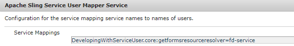

# 1 つの xml データファイルから PDF ドキュメントのセットを生成する

OutputService は、フォームデザインとフォームデザインを結合するデータを使用してドキュメントを作成する多くの方法を提供します。次の記事では、複数の個々のレコードを含む 1 つの大きな xml から複数の PDF を生成するユースケースを説明します。
次に、複数のレコードを含む xml ファイルのスクリーンショットを示します。


データ xml には 2 つのレコードがあります。 各レコードは、form1 要素で表されます。 この xml は OutputService の [generatePDFOutputBatch メソッド](https://helpx.adobe.com/jp/aem-forms/6/javadocs/com/adobe/fd/output/api/OutputService.html?lang=ja)に渡され、PDF ドキュメントのリストを取得します（レコードごとに 1 つ）
generatePDFOutputBatch メソッドの署名は次のパラメーターを取ります

* templates - キーで識別されるテンプレートを含むマップ
* data - キーで識別される xml データドキュメントを含むマップ
* pdfOutputOptions - pdf 生成を設定するオプション
* batchOptions - バッチを設定するオプション


## ユースケースの詳細{#use-case-details}

このユースケースでは、テンプレートおよび data(xml) ファイルをアップロードするためのシンプルな web インターフェイスを提供します。ファイルのアップロードが完了し、POST リクエストが AEM サーブレットに送信されます。 このサーブレットは、ドキュメントを抽出し、OutputService の generatePDFOutputBatch メソッドを呼び出します。 生成された PDF は zip ファイルに圧縮され、エンドユーザーが Web ブラウザーからダウンロードできるようになります。

## サーブレットコード{#servlet-code}

次に、サーブレットのコードスニペットを示します。 コードは、要求からテンプレート（xdp）とデータファイル（xml）を抽出します。 テンプレートファイルはファイルシステムに保存されます。 テンプレートと xml（データ）ファイルをそれぞれ含む templateMap と dataFileMap の 2 つのマップが作成されます。 次に、DocumentServices サービスの generateMultipleRecords メソッドを呼び出します。

```java
for (final java.util.Map.Entry < String, org.apache.sling.api.request.RequestParameter[] > pairs: params
.entrySet()) {
final String key = pairs.getKey();
final org.apache.sling.api.request.RequestParameter[] pArr = pairs.getValue();
final org.apache.sling.api.request.RequestParameter param = pArr[0];
try {
if (!param.isFormField()) {

if (param.getFileName().endsWith("xdp")) {
    final InputStream xdpStream = param.getInputStream();
    com.adobe.aemfd.docmanager.Document xdpDocument = new com.adobe.aemfd.docmanager.Document(xdpStream);

    xdpDocument.copyToFile(new File(saveLocation + File.separator + "fromui.xdp"));
    templateMap.put("key1", "file://///" + saveLocation + File.separator + "fromui.xdp");
    System.out.println("####  " + param.getFileName());

}
if (param.getFileName().endsWith("xml")) {
    final InputStream xmlStream = param.getInputStream();
    com.adobe.aemfd.docmanager.Document xmlDocument = new com.adobe.aemfd.docmanager.Document(xmlStream);
    dataFileMap.put("key1", xmlDocument);
}
}

Document zippedDocument = documentServices.generateMultiplePdfs(templateMap, dataFileMap,saveLocation);
.....
.....
....
```

### インターフェイス実装コード{#Interface-Implementation-Code}

次のコードは、OutputService の generatePDFOutputBatch を使用して複数の PDF を生成し、呼び出し側のサーブレットに PDF ファイルを含む zip ファイルを返します

```java
public Document generateMultiplePdfs(HashMap < String, String > templateMap, HashMap < String, Document > dataFileMap, String saveLocation) {
    log.debug("will save generated documents to " + saveLocation);
    com.adobe.fd.output.api.PDFOutputOptions pdfOptions = new com.adobe.fd.output.api.PDFOutputOptions();
    pdfOptions.setAcrobatVersion(com.adobe.fd.output.api.AcrobatVersion.Acrobat_11);
    com.adobe.fd.output.api.BatchOptions batchOptions = new com.adobe.fd.output.api.BatchOptions();
    batchOptions.setGenerateManyFiles(true);
    com.adobe.fd.output.api.BatchResult batchResult = null;
    try {
        batchResult = outputService.generatePDFOutputBatch(templateMap, dataFileMap, pdfOptions, batchOptions);
        FileOutputStream fos = new FileOutputStream(saveLocation + File.separator + "zippedfile.zip");
        ZipOutputStream zipOut = new ZipOutputStream(fos);
        FileInputStream fis = null;

        for (int i = 0; i < batchResult.getGeneratedDocs().size(); i++) {
              com.adobe.aemfd.docmanager.Document dataMergedDoc = batchResult.getGeneratedDocs().get(i);
            log.debug("Got document " + i);
            dataMergedDoc.copyToFile(new File(saveLocation + File.separator + i + ".pdf"));
            log.debug("saved file " + i);
            File fileToZip = new File(saveLocation + File.separator + i + ".pdf");
            fis = new FileInputStream(fileToZip);
            ZipEntry zipEntry = new ZipEntry(fileToZip.getName());
            zipOut.putNextEntry(zipEntry);
            byte[] bytes = new byte[1024];
            int length;
            while ((length = fis.read(bytes)) >= 0) {
                zipOut.write(bytes, 0, length);
            }
            fis.close();
        }
        zipOut.close();
        fos.close();
        Document zippedDocument = new Document(new File(saveLocation + File.separator + "zippedfile.zip"));
        log.debug("Got zipped file from file system");
        return zippedDocument;


    } catch (OutputServiceException | IOException e) {

        e.printStackTrace();
    }
    return null;


}
```

### サーバーへのデプロイ{#Deploy-on-your-server}

お使いのサーバーでこの機能をテストするには、次の手順に従ってください。

* [サンプルアセットをダウンロードします](assets/mult-records-template-and-xml-file.zip)。この zip ファイルには、テンプレートと xml データファイルが含まれています。
* [ブラウザーで Felix web コンソールを参照します。](http://localhost:4502/system/console/bundles)
* [DevelopingWithServiceUser バンドルをデプロイします](/help/forms/assets/common-osgi-bundles/DevelopingWithServiceUser.jar)。
* configMgr を使用して、Apache Sling Service User Mapper Service に次のエントリを追加します。

```java
DevelopingWithServiceUser.core:getformsresourceresolver=fd-service
```




* [カスタム AEM FormsDocumentServices バンドルをデプロイします](/help/forms/assets/common-osgi-bundles/AEMFormsDocumentServices.core-1.0-SNAPSHOT.jar)（OutputService API を使用して PDF を生成するカスタムバンドル）。
* [ブラウザーでパッケージマネージャーを指定します。](http://localhost:4502/crx/packmgr/index.jsp)
* [パッケージをダウンロードし、インストールします](assets/generate-multiple-pdf-from-xml.zip)。このパッケージには、テンプレートとデータファイルをドロップできる HTML ページが含まれています。
* [ブラウザーで MultiRecords.html を指定します](http://localhost:4502/content/DocumentServices/Multirecord.html?)。
* テンプレートと xml データファイルを一緒にドラッグ&amp;ドロップします
* 作成した zip ファイルをダウンロードします。 この zip ファイルには、Output サービスで生成された PDF ファイルが含まれています。

>[!NOTE]
>この機能をトリガーする方法は複数あります。 この例では、機能を見せるために、web インターフェイスを使用して、テンプレートとデータファイルをドロップしています。
